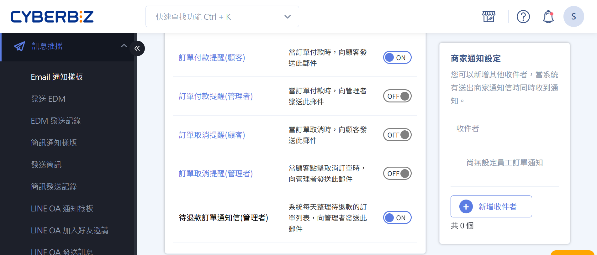

設定、管理系統發給商家的通知訊息。
{ .subtitle }

{ title="商家通知設定：訊息推播 > Email 通知樣板 > 商家通知設定" .hero-page }

## 使用須知

系統通知包含以下內容：

- 安全庫存水位提醒。
- 。

## 操作流程

### 新增收件者

1. 登入 CYBERBIZ 管理後台，前往 **訊息推播 > Email 通知樣板**。
2. 在 **商家通知設定** 區塊，點擊 **新增收件者**。
3. 選擇 **預設**、**自訂** 或 **後台使用者**：
	- 預設：代入預設商店信箱。
	- 自訂：自訂新的電子信箱。
	- 後台使用者：代入管理後台的使用者信箱。