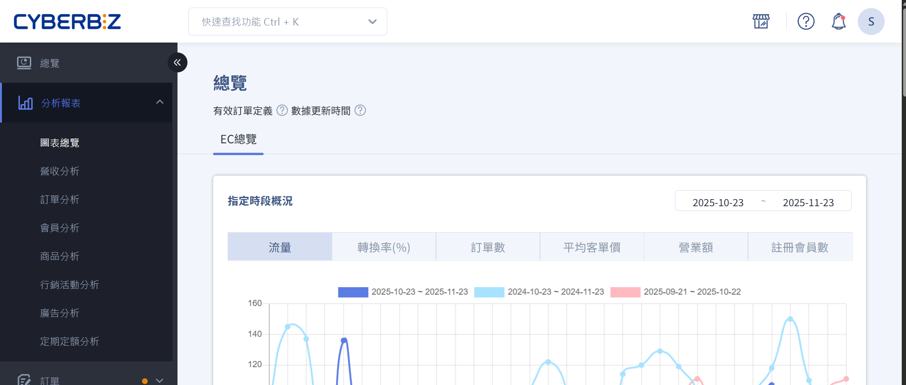

# 報表分析

 
<big>__開始使用__</big>  
快速了解報表分析功能與資料呈現方式，輕鬆掌握商店經營狀況。  
 
[認識報表分析介面 :lucide-circle-arrow-right:](get-started.md)

---

=== "銷售與訂單分析"

- :lucide-credit-card: __銷售概況__

    ---
    查看整體銷售額、訂單數與平均訂單價值，掌握營收狀況。  
    [日/月/年銷售報表](sales-overview.md)  
    [熱門商品分析](top-products.md)  

- :lucide-box: __訂單分析__

    ---
    分析訂單來源、支付方式與物流狀態，了解訂單處理效率。  
    [訂單數量與狀態報表](order-report.md)  
    [支付方式統計](payment-report.md)  
    [物流與配送報表](shipping-report.md)

=== "會員與行為分析"

- :lucide-users: __會員概況__

    ---
    分析會員成長、活躍度與忠誠度，優化會員經營策略。  
    [會員成長趨勢](member-growth.md)  
    [活躍會員分析](active-members.md)

- :lucide-user-check: __會員行為__

    ---
    掌握會員購買習慣與偏好，制定精準行銷策略。  
    [購買行為報表](member-purchase.md)  
    [瀏覽與互動分析](member-activity.md)

=== "行銷與分潤報表"

- :lucide-megaphone: __行銷活動分析__

    ---
    評估優惠活動、折扣與加價購效益，提升行銷 ROI。  
    [優惠活動報表](promotion-report.md)  
    [加價購與折扣分析](upsell-report.md)

- :lucide-pie-chart: __分潤分析__

    ---
    管理分潤比例、合作夥伴收益與自動結算狀況。  
    [分潤總覽](profit-sharing.md)  
    [合作夥伴明細](partner-revenue.md)

=== "即時監控與自訂報表"

- :lucide-monitor: __即時監控__

    ---
    查看即時營收、訂單與會員動態，快速掌握商店運作狀況。  
    [即時營收看板](realtime-dashboard.md)  
    [訂單即時追蹤](realtime-orders.md)

- :lucide-file-text: __自訂報表__

    ---
    依據需求自訂欄位、篩選條件與日期範圍，生成專屬報表。  
    [自訂報表設定](custom-report.md)  
    [報表匯出與分享](export-report.md)

