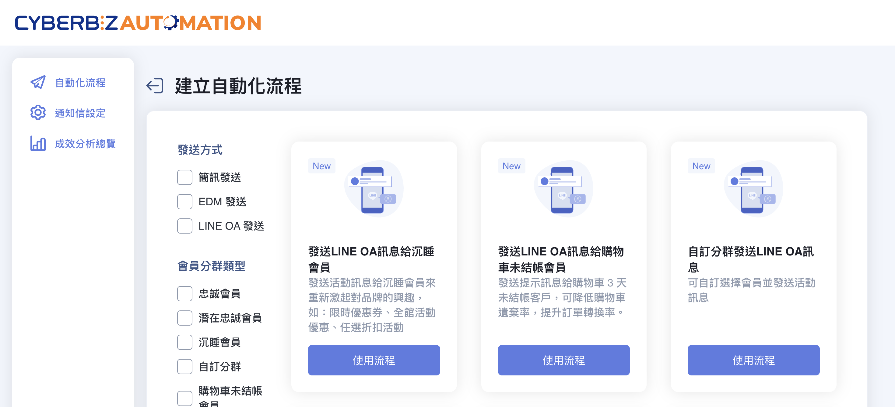
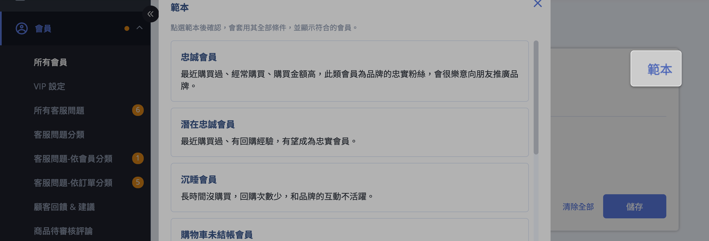
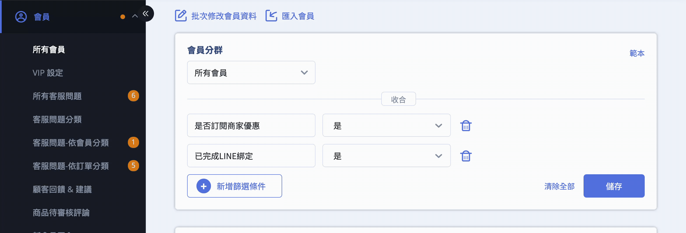
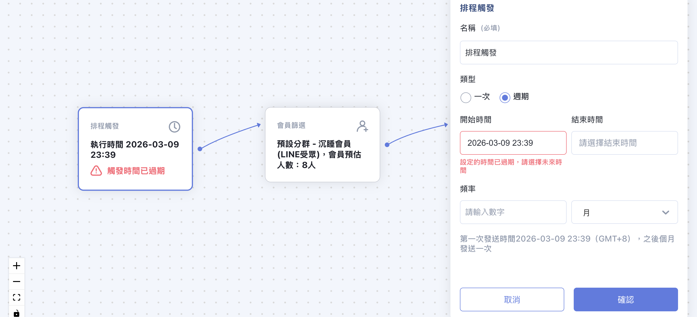
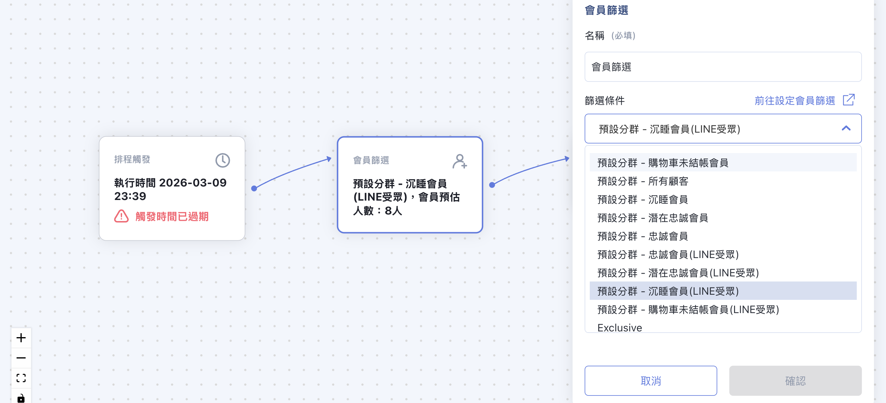
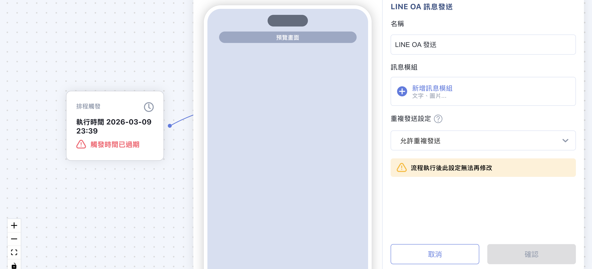
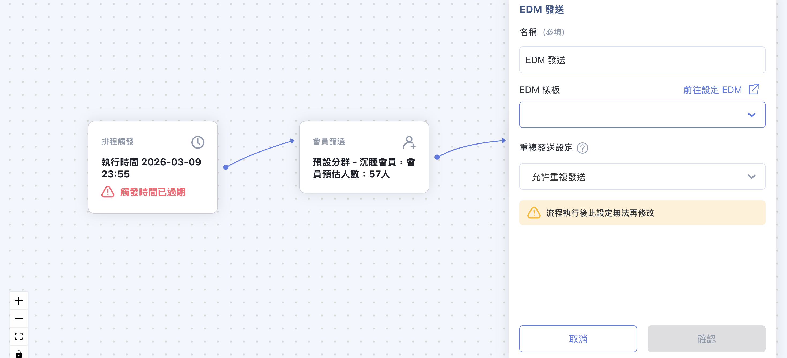
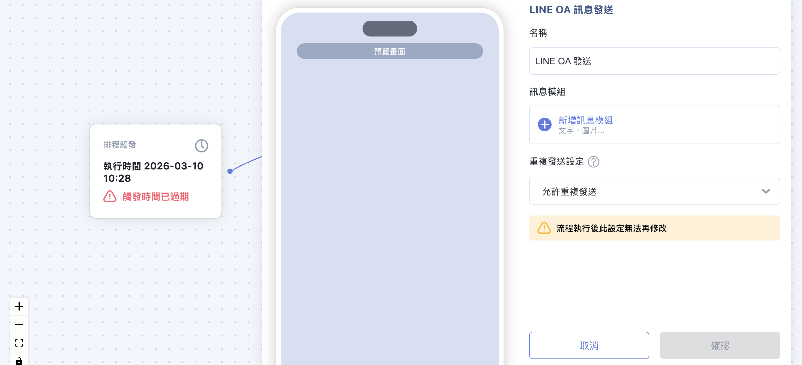
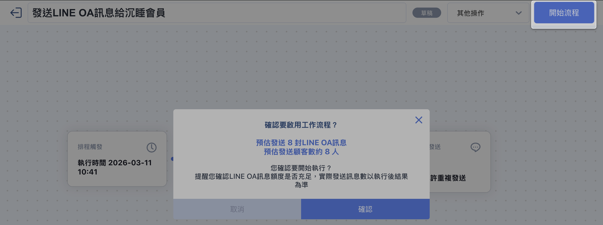
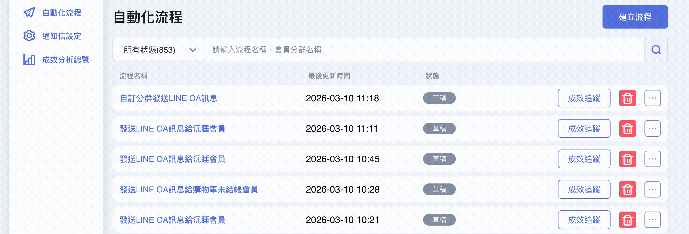

# 使用 AUTOMATION 建立自動化推播流程

在 CYBERBIZ AUTOMATION 中建立自動化流程，設定會員分群並發送簡訊、EDM 或 LINE OA 訊息。
{ .subtitle }

[:lucide-tag:{ title="適用方案" }](../../../resources/conventions#適用方案) | 專業 PLUS / 進階 PLUS / 高手 PLUS / 企業  
[:lucide-grid-2x2-plus:{ title="適用擴充" }](../../resources/conventions#適用擴充) | AUTOMATION
{ .doc-badge }

{ .hero-page }

## AUTOMATION 自動化推播說明

**CYBERBIZ AUTOMATION** 是專為商家設計的自動化流程工具，能簡化行銷與營運設定，提高經營效率。

以下為 AUTOMATION 發送簡訊、EDM 及 LINE OA 訊息的詳細教學：

## 前置作業：自訂會員篩選分群

!!! warning "提升訊息觸及精準度"
    自動化行銷（AUTOMATION）僅會推播訊息予「已勾選訂閱電子報」之會員。為使預覽人數更貼近實際發送狀況，建議商家在設定「會員分群」時，優先篩選出「願意接收優惠通知」(是否訂閱商家優惠) 的名單。需注意，最終觸及人數仍可能因消費者即時取消訂閱而有些微變動。

在建立自動化流程前，需先定義受眾對象。系統僅會推播給 **勾選訂閱電子報/商家優惠** 的會員。

1.  **後台路徑**：「會員」>「所有會員」。
2.  **設定條件**：點選「新增篩選條件」或使用「範本」（如：忠誠、沉睡或購物車未結帳會員）。

    

3.  **儲存分群**：確認名單後點擊「儲存」，設定分群名稱與描述。若篩選內容包含 LINE 登入或綁定，可勾選同步上傳受眾至 LINE 後台。

    

## AUTOMATION 操作流程 (簡訊/EDM/LINE OA)

進入設定介面的路徑為：登入 CYBERBIZ 管理後台，前往 **APP MARKET > 我的擴充服務 > CYBERBIZ AUTOMATION**」。

### 簡訊發送設定

*   **建立流程**：點擊「建立流程」，選擇預設分眾流程（如：發送簡訊給 VIP 或沉睡客戶）。
*   **內容編輯**：
    *   **排程觸發**：可設定為「一次」或「週期」（如：每週發送一次）。
        
        
        
    *   **會員篩選**：選擇預先設定好的會員分群。

        
    
    *   **簡訊內容**：輸入文字，連結務必使用 **CYBERBIZ 站內網址** 以利追蹤成效，並點擊「預覽簡訊」確認字數（上限 70 字）。
    
        
    
    *   **重複發送設定**：可選擇「允許」、「不允許」或「指定天數內不重複」發送給相同對象。

---

### EDM 發送設定

*   **必要前提**：必須先完成 [EDM 基礎設定](../../marketing/設定與發送 EDM 電子報.md){ data-preview }。
*   **操作步驟**：流程可參照[簡訊發送設定](#簡訊發送設定)。
    1.  選擇 EDM 預設模板（如：發送 EDM 給 VIP 或自訂分群）。
    2.  設定排程與會員篩選。
    3.  **EDM 發送元件**：挑選已編輯好的 EDM 樣板，並完成重複發送設定。

        

---

### LINE OA 訊息發送設定

*   **必要條件**：會員需完成 **LINE [登入](../../integrations/line/設定 LINE 快速登入.md){ data-preview } 或[綁定](../../integrations/line/綁定 LINE 官方帳號與官網會員.md){ data-preview }**，且必須是 **LINE OA 好友**，商家需確保 LINE OA 訊息額度充足。
*   **操作步驟**：流程可參照[簡訊發送設定](#簡訊發送設定)。
    1.  選擇 LINE OA 預設模板（如：未結帳購物車提醒）。
    2.  **訊息模組**：可選擇「圖片」或「文字」，一次最多可發送 **3 組**。
    3.  **網址追蹤**：同樣建議使用站內網址以進行成效分析。

        

## 流程啟用與追蹤

1.  **開始流程**：設定完成後點擊「開始流程」，系統會提示預計花費的 Cyber 幣或發送人數。

    

2.  **狀態監控**：
    *   **草稿 (Draft)**：可隨時編輯或刪除。
    *   **已排程/執行中**：若要修改，需點選「暫停流程」。
    *   **已完成/執行失敗**：發送後系統會將紀錄傳送至設定的「通知信箱」（上限 10 人）。

    ??? note "流程狀態說明"
        | 狀態 (Status) | 定義 (Definition) | 情境 (Scenario) |
        | :--- | :--- | :--- |
        | **草稿 (draft)** | 流程還在可以編輯的狀態 右側按鈕為「開始流程」 | 1. 尚未點擊「開始流程」 2. 點擊「暫停流程」 3. 點擊「重新編輯」 4. **只有草稿狀態才可以刪除流程** |
        | **已排程** | 流程已經進入排程 右側按鈕為「暫停流程」 | 點擊「開始流程」，當前時間早於開始時間 |
        | **執行中** | 流程已經開始執行 右側按鈕為「暫停流程」 | 點擊「開始流程」後，當前時間晚於 trigger 節點的開始時間 |
        | **執行失敗** | 流程執行失敗，此時不可編輯節點 右側按鈕為「重新編輯」 | 1. 打API失敗 (超時, 連不到EC, 拿到錯誤的 response, 分批發送失敗等) 2. Filter group not found 3. 以上原因導致發送失敗 4. 要把後面的排程取消 |
        | **已完成** | 流程執行完成，此時不可編輯節點 右側按鈕為 disabled 的「暫停流程」 | **固定排程：** 發送成功 and 當前時間晚於開始時間 **其他排程：** 發送成功 and 當前時間晚於結束時間 *如果是簡訊商發送時部分成功部分失敗，屬於已完成 |

3.  **成效追蹤**：可在流程介面點選「成效追蹤」，數據約於 **12 小時內更新**。

    

4. **查看流程紀錄**：可在流程介面點選「查看流程紀錄」，檢視流程執行紀錄。 

    

## 常見問題

??? quote "為什麼我的自動化流程顯示「執行完成」，但會員反應沒收到簡訊？"
    請檢查以下三點：

    1. **訂閱狀態**：系統僅會發送給「勾選訂閱電子報/商家優惠」的會員。
    2. **簡訊額度**：請確認後台的簡訊點數是否充足。
    3. **手機黑名單**：部分消費者可能向電信商申請了「拒收行銷簡訊」服務。

??? quote "LINE OA 訊息發送失敗的常見原因有哪些？"
    最常見的原因為 **LINE 官方帳號訊息額度不足** 或 **該會員尚未連動（綁定） LINE 帳號**。此外，若會員已封鎖您的官方帳號，系統亦無法成功推播。

??? quote "自動化流程設定後可以中途修改內容嗎？"
    可以。但您必須先點擊「**暫停流程**」，將狀態切換回「草稿」後才能編輯節點。編輯完成後，請務必再次點擊「**開始流程**」以恢復排程。
