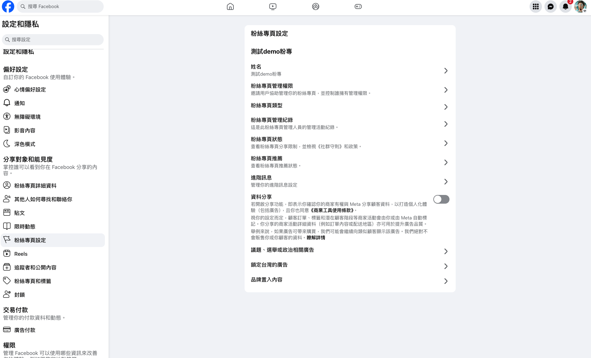
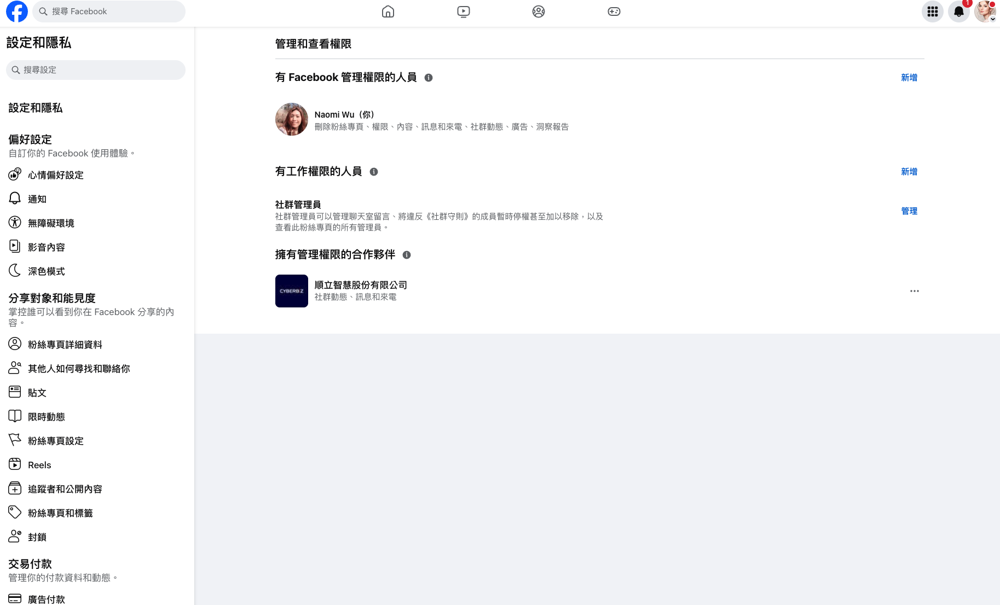

# Chat Box 串接 Facebook 粉絲專頁
透過 Meta 授權流程將 Facebook 粉絲專頁與 Chat Box 連結，實現即時訊息同步與會員資料比對。
{ .subtitle }

[:lucide-tag:{ title="適用方案" }](../../resources/conventions#適用方案) | 所有 PLUS / 企業
{ .doc-badge }

!!! tip "應用情境"
    - **整合社群客服**：在 CYBERBIZ 後台直接回覆 Facebook Messenger 訊息。
    - **識別潛在顧客**：系統自動比對 Facebook 帳號與官網會員，協助客服掌握顧客背景。
    - **提升回覆時效**：統一管理多個粉專訊息，確保不遺漏任何商機。

## 串接前帳號權限檢查

在開始串接流程前，請務必確認操作人員的 Facebook 帳號具備以下權限：

### 1. 粉絲專頁管理員權限

操作者的 Facebook 帳號必須擁有該粉絲專頁的 **管理員** 權限。

**檢查方式**：登入 [Meta Business Suite](https://business.facebook.com/)，前往 **設定 > 用戶 > 用戶**，查看權限名單。

{ .screenshot }

### 2. 資產管理平台粉專權限

操作者的 Facebook 帳號必須擁有該粉絲專頁的 **完整控制權**。

**檢查方式**：

1. 登入 [Meta Business Suite](https://business.facebook.com/)，前往 **設定 > 帳號 > 粉絲專頁**，點擊要綁定的粉專，人員名單中應有您的帳號。
    { .screenshot }
2. 於人員名單右側點擊 **管理**，確保您已擁有 **完整控制權**。
    { .screenshot }

### 3. Facebook 粉專管理權限

粉絲專頁管理權限名單中，須有操作者的 Facebook 帳號。

**檢查方式**：

1. 登入Facebook，前往「設定與隱私」>「設定」>「粉絲專頁設定」。
    { .screenshot }
2. 確認您的帳號在 **粉絲專頁管理權限** 中。
    { .screenshot }

### 4. Meta 應用程式設定

操作者的 Facebook 帳號必須開啟「應用程式、網站和遊戲」設定。若關閉此功能，將導致串接授權中斷。

**檢查方式**：登入Facebook，前往「設定與隱私」>「你的動態」>「應用程式和網站」，確認 **應用程式、網站和遊戲** 處於開啟狀態。

{ .screenshot }

## 串接步驟

### 第一步：開啟後台設定

1. 登入 CYBERBIZ 管理後台，前往 **APP MARKET > ChatBox**。
2. 點擊左側選單最下方的 **設定** 圖示。
3. 找到 Facebook 區塊，點擊右側的 **設定** 按鈕。

{ .screenshot }

### 第二步：進行 Meta 授權

1. 進入「Facebook 連結設定」頁面後，點擊 **使用 Facebook 繼續**。

    { .screenshot }

2. 系統將自動跳出 Meta（Facebook）的授權視窗，請依序完成：

    - **登入帳號**：確認登入具備粉專管理權限的帳號。
    - **選擇粉專**：勾選欲存取的粉絲專頁。
        { .small-image }

    - **確認權限要求**：確認包含「管理 Messenger 對話」等權限要求後，點擊 **儲存**。

        { .small-image }

### 第三步：綁定粉絲專頁

1. 授權完成後，頁面將自動跳回 ChatBox 後台。
2. 勾選您欲正式串接的粉專，點擊 **確認綁定**。

{ .screenshot }

### 第四步：確認連結狀態

綁定成功後，列表將顯示該粉專資訊。請確認 **狀態** 顯示為 **已連結**。

{ .screenshot }

## 常見問題

??? quote "串接前的歷史對話會同步嗎？"
    **不會。** 系統僅同步串接完成後新產生的對話紀錄。過往在 Facebook 粉絲專頁產生的歷史訊息目前不會匯入 Chat Box。

