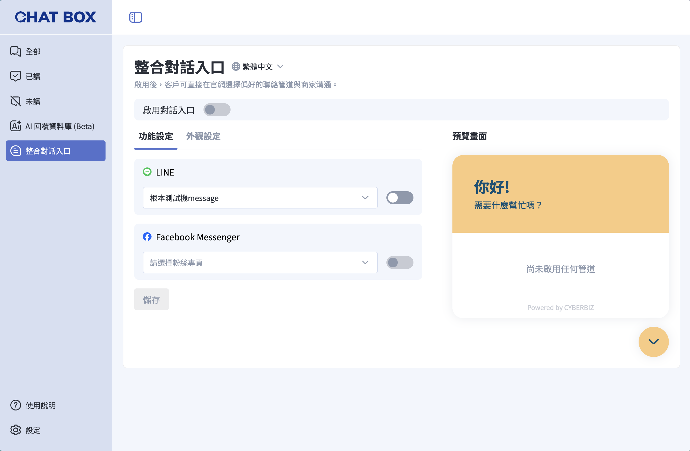
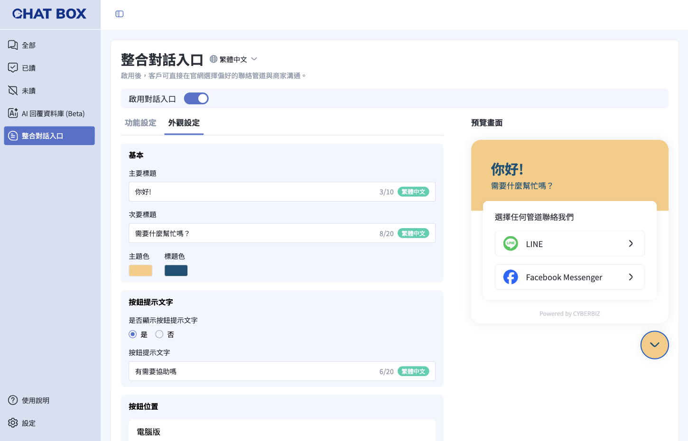
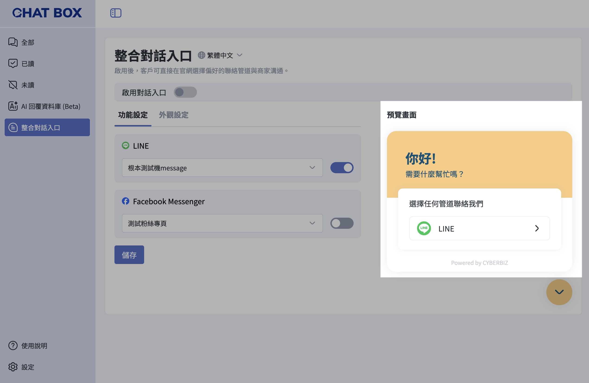
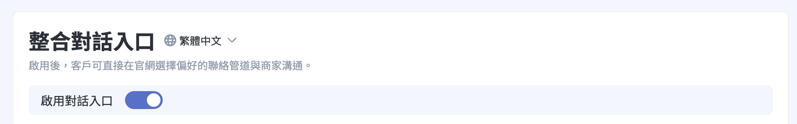
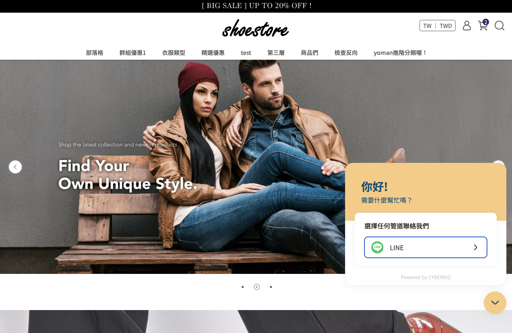

# 設定官網整合對話入口
了解如何在官網整合 LINE 與 Facebook Messenger 對話入口，透過 Chat Box 集中管理顧客訊息，提升溝通效率。
{ .subtitle }

[:lucide-tag:{ title="適用方案" }](../../resources/conventions#適用方案) | 所有 PLUS / 企業
{ .doc-badge }

!!! tip "應用情境"
	- **訊息集中管理**：顧客透過官網從 LINE 或 Messenger 聯繫，訊息皆統一匯入 Chat Box，避免遺漏。
	- **提升詢問轉換**：在官網顯眼位置提供即時聯繫管道，降低顧客詢問門檻。
	- **品牌一致性**：自訂對話按鈕的外觀與位置，確保小工具符合品牌視覺風格。

## 使用須知

- **前置串接**：使用此功能前，請確保已完成 [**LINE 官方帳號**](connect-chat-box-to-line-oa/) 或 [**Facebook 粉絲專頁**](connect-chat-box-to-facebook-page/) 的串接。
- **帳號狀態**：僅有連線正常的帳號會顯示在選單中。若帳號連結異常，請重新確認綁定狀態。
- **啟用限制**：必須至少啟用一個對話管道（LINE 或 Messenger），方可開啟官網對話入口總開關。

## 操作流程

### 步驟一：啟用對話管道

選擇要在官網顯示的聯繫工具。

1. 登入 CYBERBIZ 管理後台，前往 **APP MARKET > 我的擴充服務 > Chat Box**。
2. 進入 **官網整合對話入口**，點選 **功能設定** 分頁。
3. **LINE**：從下拉選單選擇目標帳號，並將開關切換為 `開啟 (ON)`。
4. **Facebook Messenger**：從下拉選單選擇目標粉絲專頁，並將開關切換為 `開啟 (ON)`。

{ .screenshot }

### 步驟二：自訂外觀樣式

調整對話小工具在官網呈現的視覺效果。

1. 切換至 **外觀設定** 分頁。
2. **標題文字**：
    - **主要標題**：輸入對話視窗最上方的標題（必填）。
    - **次要標題**：輸入標題下方的招呼語（必填）。
3. **顏色設定**：設定 **主題色** 與 **標題色**，建議參考品牌視覺色系。
4. **按鈕位置**：
    - 選擇顯示於網站的 **右下角** 或 **左下角**。
    - 分別設定 **電腦版** 與 **手機版** 與網頁邊緣的間距（必填）。

{ .screenshot }

### 步驟三：確認預覽與開啟

透過即時預覽確認設定效果，並正式發佈。

1. 參考後台右側的 **即時預覽** 畫面。
    - 儲存外觀設定後，預覽畫面將同步更新。
    - 若未開啟任何管道，預覽將顯示「尚未啟用任何管道」。

    { .screenshot }

2. 確認無誤後，開啟頁面最上方開關 **啟用對話入口**。

    { .screenshot }

3. 點擊 **儲存**，對話入口即會正式顯示於官網。

    { .screenshot }

## 多國語系設定

設定紅利商城的多國語系名稱，使前台可根據語系顯示正確文字。

!!! warning "注意事項"
	- 若要更改英文語系，需先 **切換至英文語系**，再進行修改。
	- 欄位有顯示 **語系標籤**，前台顯示才可隨語系切換文字。如：**群組名稱** 紅利商城 `繁體中文`。
	- 若其他語系欄位未填寫內容，前台顯示該語系時，將自動使用 **繁體中文** 內容作為預設顯示。

### 操作步驟

1. 在語系選單中，切換至欲編輯的語系（例如：繁體中文、英文）。  
2. 直接點擊標題名稱欄位進行修改，完成後按 ++enter++ 儲存變更。  

## 顧客端體驗

顧客點擊官網上的對話按鈕後，系統將依據裝置自動導向對應的通訊軟體：

| 管道 | 電腦版行為 | 手機版行為 |
| :--- | :--- | :--- |
| **Facebook Messenger** | 開啟新分頁並跳轉至 Messenger 網頁版 | 自動開啟 Messenger App 並進入聊天室 |
| **LINE** | 開啟新分頁並顯示 LINE 官方帳號 QR Code | 自動開啟 LINE App 並進入聊天室 |

