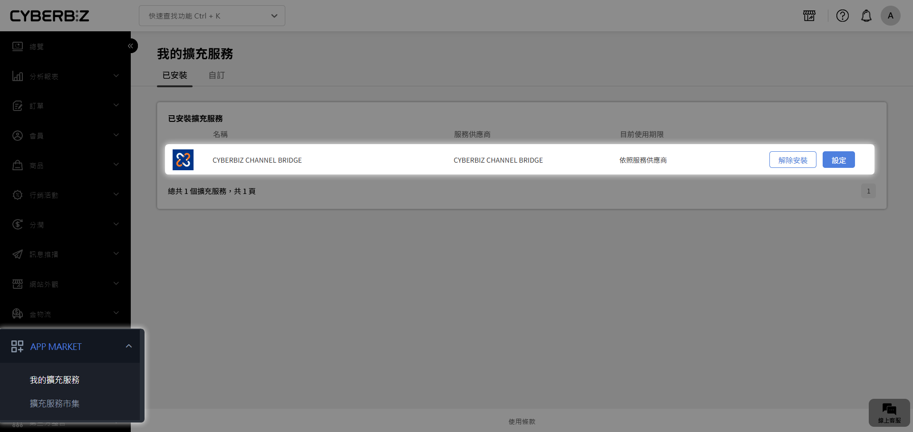
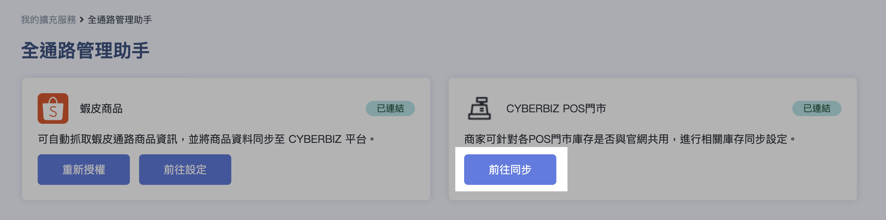
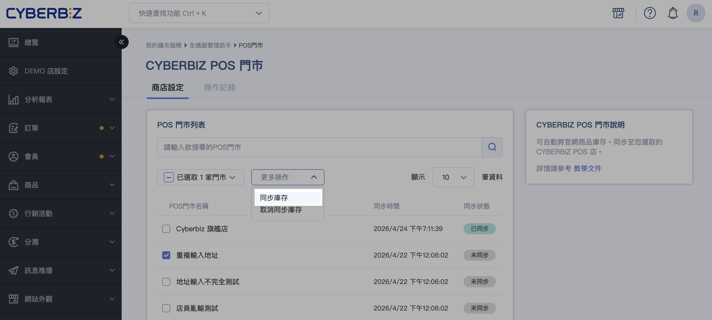
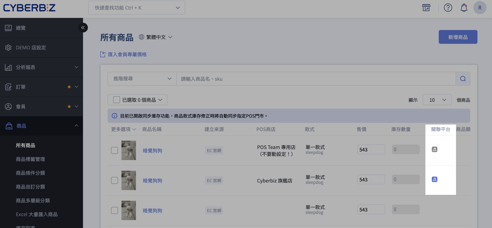
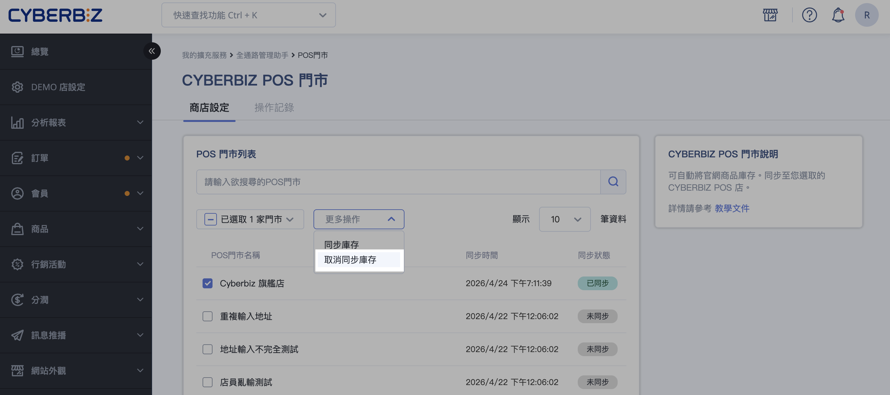
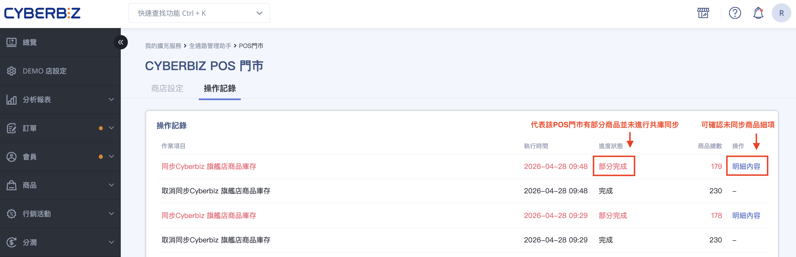
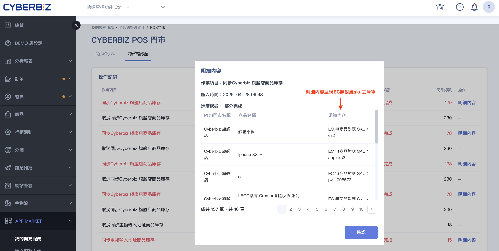

# 設定 POS 與官網商品共庫
讓指定 POS 門市與官網的相同 SKU 共享同一包庫存。啟用後兩邊庫存保持一致；取消後改回分開計算。
{ .subtitle }

[:lucide-layers:{ title="適用產品" }](../../resources/conventions.md#適用產品) | 品牌官網 / 智能 POS 
[:lucide-grid-2x2-plus:{ title="適用擴充" }](../../resources/conventions.md#適用擴充) | CYBERBIZ CHANNEL BRIDGE
{ .doc-badge }

!!! tip "應用情境"
    - **共享庫存**：官網與門市有相同 SKU。啟用共庫後，兩邊共享同一包庫存。
    - **取消共庫**：取消同步庫存後，兩邊以當下數量分開計算。

## 使用須知

* **支援系統**：本功能需同時使用 **官網（EC）** 與 **POS 系統**。
* **啟用方式**：如需使用此功能，請聯繫 **CYBERBIZ 客服** 申請開通。
* **事前準備**：開啟庫存同步前，請先將 **EC 庫存調整為啟用共庫後的目標數量**。
* **初始同步規則**：啟動同步後，POS 商品庫存將以 **EC 商品庫存數量為準** 進行覆蓋與同步。
* **適用範疇**：庫存同步僅適用於 **官網與該 POS 門市皆有建立且 SKU 一致的商品**。

## 操作流程

### 啟動共庫設定

1. 登入 CYBERBIZ 管理後台，前往 **APP MARKET > 我的擴充服務**。
2. 點擊 CYBERBIZ CHANNEL BRIDGE 旁的 **設定**。

    

3. 在 **CYBERBIZ POS門市** 區塊，點擊 **前往同步**。

    

4. 進入 **商店設定** 頁籤，勾選欲與官網共庫的 POS 門市。

5. 點擊 **更多操作**，選擇 **同步庫存**。系統完成該門市與官網商品的庫存同步。

    

### 確認共庫狀態

1. 前往 **商品 > 所有商品**。
2. 已與官網共庫的 POS 商品，**關聯平台** 欄位顯示藍色 POS icon。
3. 尚未共庫的 POS 商品，POS icon 顯示灰色。

### 取消共庫設定

1. 前往 **APP MARKET > 我的擴充服務**，前往 **CYBERBIZ CHANNEL BRIDGE > CYBERBIZ POS門市**。
2. 進入 **商店設定** 頁籤，勾選欲取消共庫的 POS 門市。
3. 點擊 **更多操作**，選擇 **取消同步庫存**。系統取消該門市與官網商品的共庫設定。

### 查看操作紀錄

開啟 **操作紀錄** 分頁，查看 **同步庫存** 與 **取消同步庫存** 紀錄。

  - **進度狀態**：顯示同步執行狀況。
  - **明細內容**：查看未完成同步的商品與原因。

      

## 共庫邏輯說明

設定與官網共庫的 POS 門市，共同 SKU 的商品會共享庫存。官網或該門市的庫存異動後，兩邊數量保持一致。取消同步庫存後，兩邊以當下庫存數為基礎，恢復分開計算。

### 情境一：啟用共庫

初始狀態：官網庫存 10 / POS 門市庫存 5

- **步驟 1｜** 啟動同步 ➔ 雙邊庫存統一覆蓋為 10

- **步驟 2｜** 官網銷售 1 件 ➔ 雙邊庫存同步扣減至 9

- **步驟 3｜** POS 手動加庫 +5 ➔ 雙邊庫存同步增加至 14

### 情境二：取消共庫

初始狀態：雙邊庫存皆為 10

- **步驟 1｜** 解除同步 ➔ 恢復各自獨立計算（此時皆維持 10）

- **步驟 2｜** 官網銷售 1 件 ➔ 官網庫存降至 9；POS 門市庫存維持 10（不再同步扣減）

## 後續步驟

- :lucide-warehouse:{ .lg }
  [__庫存管理__](../../../pos/inventory/index.md){ title="全通路庫存管理指南" }
  查看官網與門市分倉、進銷調撥與盤點。

- :lucide-copy:{ .lg }
  [__複製商品至 POS 商店__](../../products/bulk-operations/copy-products-to-pos-stores.md){ title="複製商品至 POS 商店" }
  門市需先有相同 SKU，才能納入共庫。

## 常見問題

??? quote "庫存同步會套用到哪些商品？"
    庫存同步僅套用官網與所選 POS 門市都有的 SKU。門市沒有的 SKU 不會同步。

??? quote "同步後以哪一邊的庫存為準？"
    同步庫存後，POS 商品庫存數以 EC 商品庫存數為主。啟用前先把官網庫存調成共庫後要呈現的數量。

??? quote "如何判斷 POS 商品是否已共庫？"
    前往商品列表，查看 **關聯平台** 欄位。藍色 POS icon 代表已與官網共庫；灰色代表尚未共庫。
