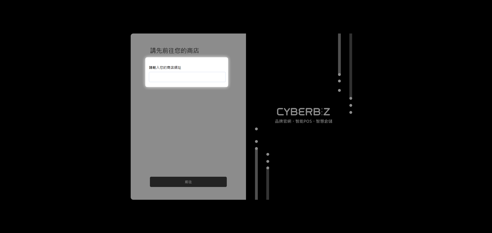
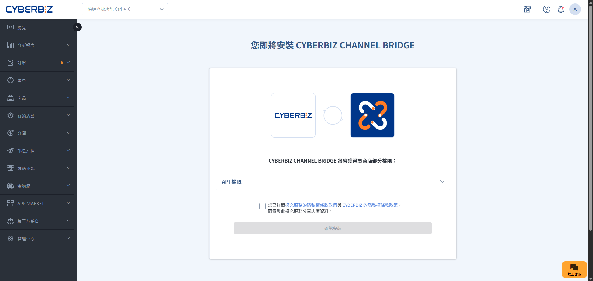
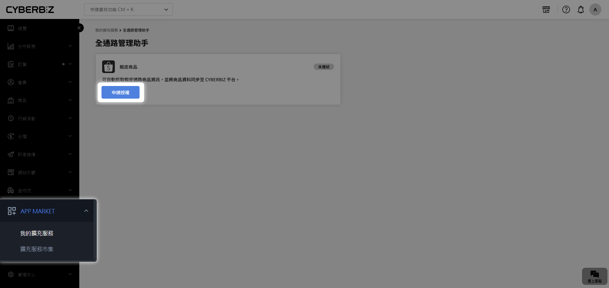
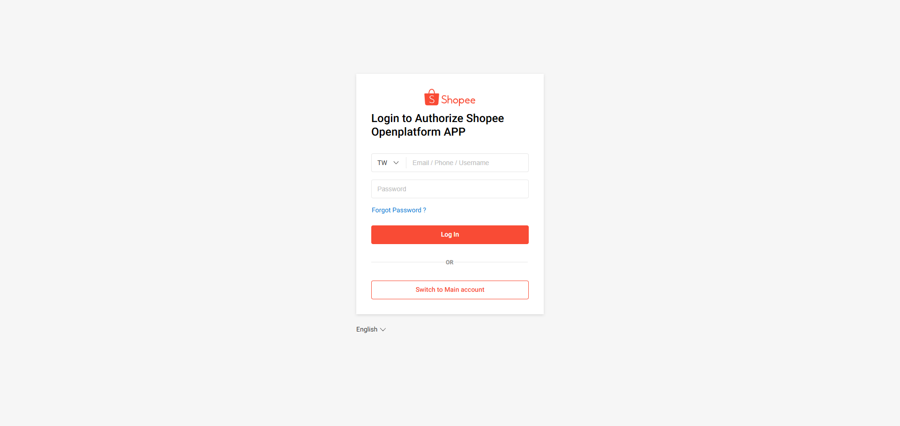
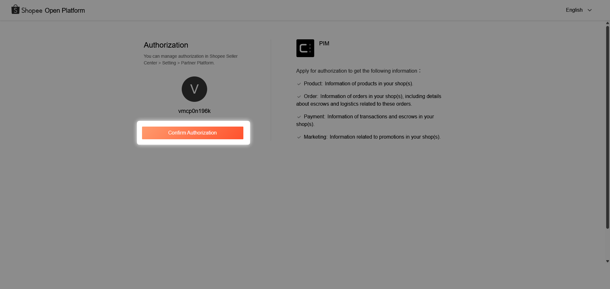
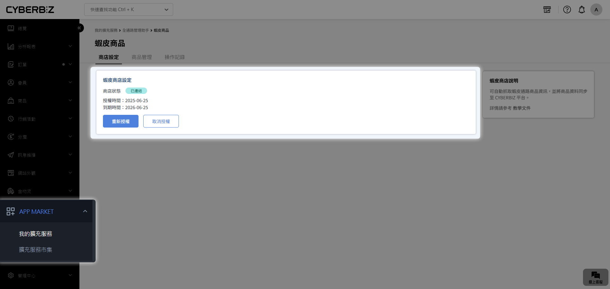
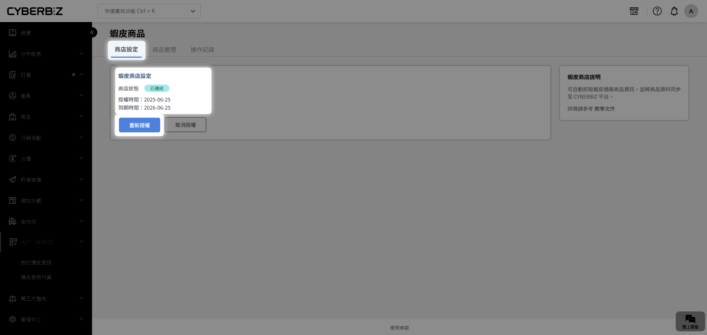
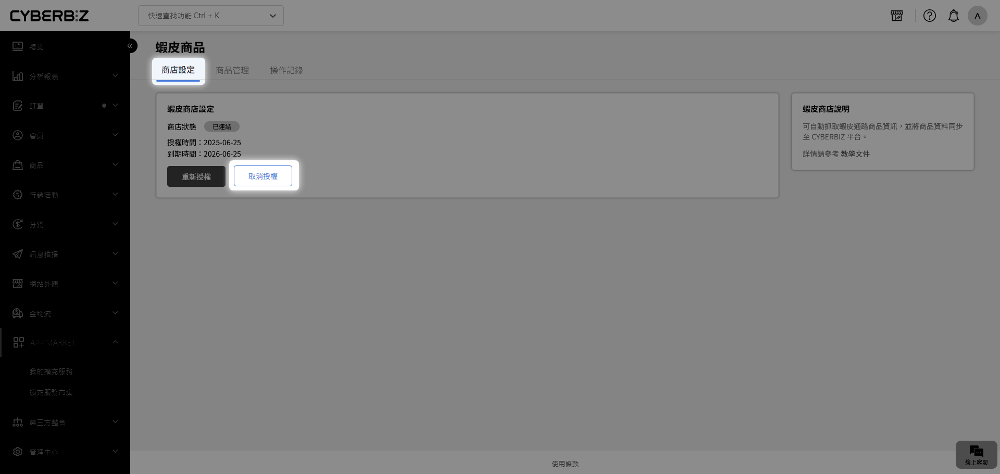

# Step 1 安裝與授權商店

透過「全通路管理助手」，您可以將蝦皮商店的商品快速同步至 CYBERBIZ 官網，省去手動建立商品的時間。
{ .subtitle }

[:lucide-lock:{ title="適用方案" }](../../resources/conventions#適用方案) | 所有 PLUS / 企業
{ .doc-badge }

{ .hero-page }

!!! tip "應用情境"
    - **新店開張**：剛從蝦皮轉戰官網，需將上百件商品快速搬移。
    - **同步經營**：官網與蝦皮同時營運，需將蝦皮新商品匯入官網。
    - **多店管理**：擁有多個蝦皮帳號，需分批將商品導入同一個官網後台。

## 使用須知

- **開通方式**：本功能非預設開啟，**請先洽詢您的 CYBERBIZ 客服**。
- **帳號限制**：目前僅支援 **蝦皮台灣站 (TW)** 帳號。
- **資料安全**：授權過程透過官方 API 進行，系統不會取得您的蝦皮帳號密碼。
- **多帳號操作**：單一官網後台一次僅能與一個蝦皮帳號連結。若有多店搬站需求，請完成一家搬移後，先 **取消授權** 再連結下一個帳號。

## 操作流程

### 步驟 1：安裝全通路管理助手

1. 點擊由 CYBERBIZ 專員提供的啟用連結，輸入您的 **官網前台網址**，點選 **前往**。
    
2. 進入安裝頁面，勾選授權選項並點選 **安裝**。
    
3. 登入 CYBERBIZ 管理後台，前往 **App Market > 我的擴充服務**。
4. 確認已出現 **CYBERBIZ CHANNEL BRIDGE**，點選 **設定** 進入管理介面。
    

### 步驟 2：授權蝦皮商店帳號

1. 在全通路管理助手介面中，點選 **申請授權**。
    
2. 於跳出的蝦皮授權頁面中，將區域選擇為 **TW**。
    
3. 輸入您的蝦皮賣家帳號與密碼進行登入。
4. 點選 **Confirm Authorization** 同意授權。
    
5. 在期限選擇建議勾選 **365 days**，以維持長期的同步穩定。
6. 授權成功後，系統會顯示商店狀態為 `已連結`。
    

### 步驟 3：管理與更新授權

- **檢查狀態**：在 **商店設定** 頁籤中可查看目前的 **商店狀態** 與 **到期日期**。
- **到期提醒**：系統將於授權到期日前 30、15、7、3、1 日寄送 Email 通知。
- **重新授權**：若授權過期，點選 **重新授權** 即可恢復功能。
    
- **更換帳號**：若需導入其他蝦皮店鋪商品，請先點選 **取消授權**，再重複階段二的步驟。
    

## 常見問題

??? quote "為什麼點擊授權後沒有反應？"
    請確認您的瀏覽器是否阻擋了彈出視窗。建議使用 Chrome 瀏覽器並關閉廣告阻擋外掛。

??? quote "授權到期後，已經搬移的商品會消失嗎？"
    不會。授權到期僅會影響「新商品的匯入」與「資料同步」，已搬移至官網的商品資料不會受到影響。

??? quote "我可以同時綁定兩個蝦皮帳號嗎？"
    不可以。系統一次僅能串接一個蝦皮帳號，請採 **先取消舊授權、再綁定新帳號** 的方式分批操作。

## 後續步驟

- :lucide-arrow-right-circle:{ .lg }   
  [__蝦皮商品搬站 Step 2：導入商品__](連結)     
  完成授權後，開始挑選並搬移商品至官網。

