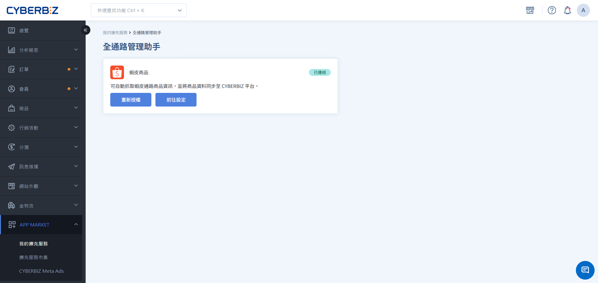
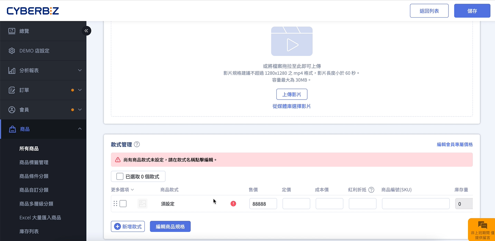
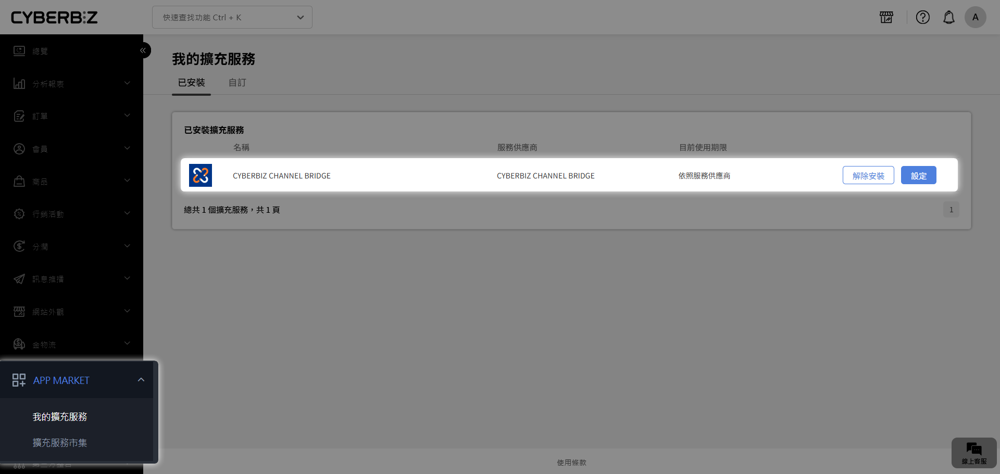
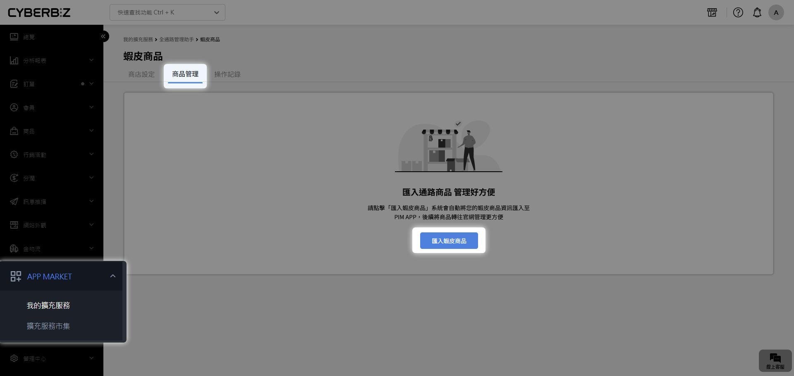
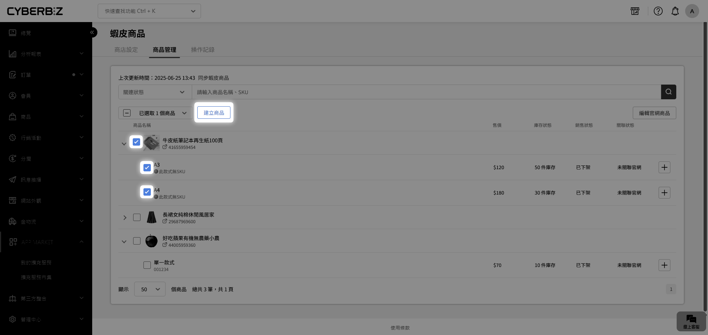
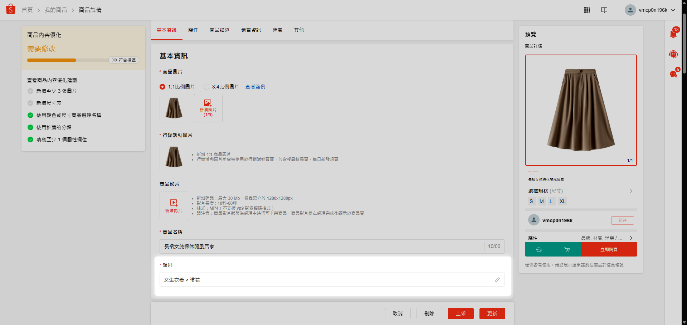
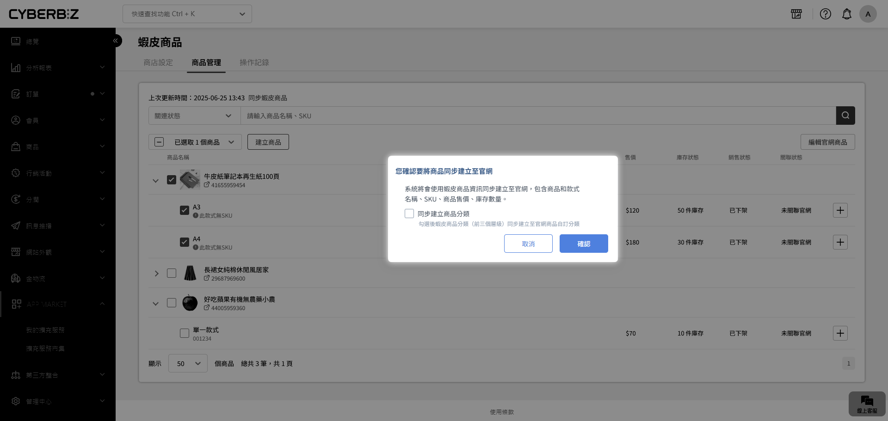
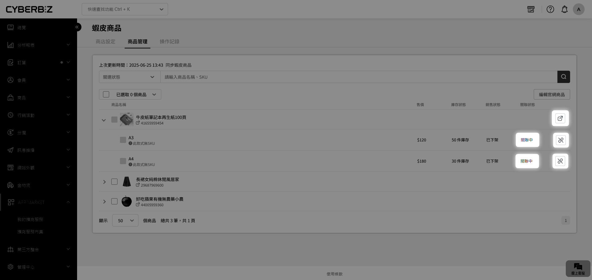
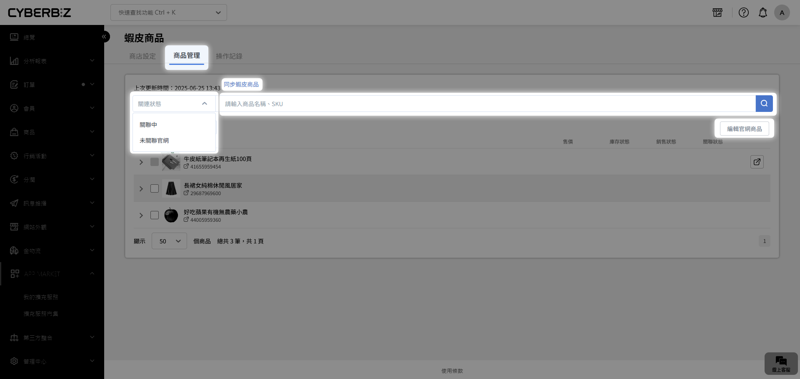

# Step 2 導入商品與建立關聯

完成商店授權後，您可以批次將蝦皮商品資訊匯入至官網，並透過系統自動對應功能，快速完成分類歸類與商品上架。
{ .subtitle }

[:lucide-lock:{ title="適用方案" }](../../resources/conventions#適用方案) | 所有 PLUS / 企業
{ .doc-badge }

{ .hero-page }

!!! tip "應用情境"
    - **快速上架**：將蝦皮熱銷商品一鍵導入官網，自動帶入所有規格與圖文。
    - **分類自動歸檔**：利用蝦皮既有的三層分類，自動在官網建立對應的自訂分類。
    - **庫存初步校正**：匯入時同步取得蝦皮當前的庫存與售價，作為官網開店的基準。

## 使用須知

- **SKU (商品選項貨號) 規範**：**SKU 為搬站的核心識別碼**。不可包含空格、換行或中文字元。若 SKU 重複或格式錯誤，系統將跳過該款式或無法建立商品。
- **內容同步限制**：
    - 系統僅擷取 **匯入當下** 的蝦皮資料，後續在蝦皮端的修改 **不會** 自動同步至官網。
    - 不支援搬移影片（僅支援 YouTube 嵌入連結）。
- **圖片限制**：僅支援 JPG、JPEG、PNG、GIF 格式。單筆商品圖片總容量上限為 100MB。
- **匯入範圍**：僅支援蝦皮後台之 **架上商品**、**審核中** 與 **未上架** 狀態的商品。若商品狀態為 **違規/刪除**、**尚未刊登**，則不會納入匯入範圍。
- **作業環境**：匯入時請勿關閉網頁，以避免作業中斷。
- **商品名稱格式**：不常見符號將自動轉為空白，建議預先修正。

## 系統整合(POS /倉儲) 

當官網(EC) 串連 POS 或倉儲系統時，SKU（庫存單位） 是確保系統對接成功的必要欄位。為了避免資料衝突並確保後續作業順暢，請參考以下引導進行設定：

1. **確保 SKU 的唯一性與完整性**

    若您的官網（EC）同時串接 POS 或倉儲系統，所有商品的 SKU 必須為唯一值且不得為空。 

    - **避免重複**：若匯入的蝦皮商品 SKU 與 EC 後台現有商品重複，系統將會攔截並顯示錯誤訊息。
    - **不可留空**：SKU 為系統識別基準，若商品尚未設定 SKU，請務必補齊。

2. **處理 SKU 重複的解決方案**

    若系統偵測到 SKU 重複，您可根據作業習慣選擇以下任一方式進行修正：

    - **方案 A：手動更新**：直接在 EC 的商品列表頁找到該重複商品，手動修改其 SKU 與款式資訊。
        
    - **方案 B：重新匯入**： 刪除 EC 上該筆重複商品後，回到蝦皮後台修改 **商品選項貨號**，確認無誤後再重新執行匯入程序。

3. **大量處理技巧**

    如果您在建立官網商品時尚未準備好所有 SKU 資訊，可以先完成商品建立，後續再執行[商品大量補填 SKU]()，一次性補齊。

## 操作流程

### 步驟 1：匯入蝦皮商品

1. 登入 CYBERBIZ 管理後台，前往 **APP MARKET > 我的擴充功能**。
2. 找到 **CYBERBIZ CHANNEL BRIDGE** 並點選 **設定**。
    
3. 在 **商品管理** 頁籤，點選 **匯入蝦皮商品**。
    
4. 待進度條完成後，列表將顯示所有匯入的蝦皮商品資訊，包含：
    - **售價/庫存**：呈現蝦皮平台當前的數值。
    - **關聯狀態**：顯示為 `未關聯` 代表尚未建立為官網商品。

### 步驟 2：建立官網商品與分類同步

1. 在 **商品管理** 頁籤，勾選想要建立至官網的商品。
2. 點選 **建立商品**。
    
3. 在彈出視窗中，可選擇是否勾選 **將蝦皮商品類別自動同步至官網自訂分類**。
    
    - **名稱一致**：自動歸入官網現有同名自訂分類。
    - **名稱不一致**：系統將自動建立新的官網自訂分類（支援蝦皮前三層分類）。
    
4. 確認後點選 **執行**，系統將自動完成對應並建立商品。
5. 建立成功後，商品關聯狀態將轉為 `已關聯`，並出現 **前往官網商品** :lucide-external-link:。
    

### 步驟 3：後續上架準備建議

商品建立後，其狀態預設為 **已上架、不公開**。請 **前往官網商品** :lucide-external-link: 完成以下核對：

- **運送方式與溫層**：系統無法自動判定官網專有的運送規則，需手動勾選。
- **紅利折抵**：依需求設定該商品的紅利折抵上限。
- **SKU 補填**：若匯入時 SKU 留空，請務必補齊（尤其有使用 POS 或倉儲系統者）。

## 蝦皮與官網欄位對應一覽

| 類別 | 蝦皮欄位 | CYBERBIZ 官網欄位 |
| :--- | :--- | :--- |
| **商品資訊** | 商品名稱 | 商品名稱 |
| | 商品圖片 | 商品圖片 |
| **款式管理** | 規格 | 商品規格 |
| | 行銷價 | 售價 |
| | 價格 | 定價 |
| | 商品選項貨號 | **商品編號 (SKU)** |
| | 商品數量 | 庫存量 |
| | 包裹尺寸大小 | 材積 |
| | 重量 | 重量 |
| | 款式圖片 | 款式圖片 |
| **商品描述** | 商品描述 | 商品介紹 |

## 常見問題

??? quote "蝦皮商品描述中的影片會被搬移嗎？"
    僅支援以 **YouTube 嵌入連結** 方式存在的影片。若為蝦皮原生上傳的影片短片，則無法進行搬移。

??? quote "如何同步蝦皮端新增的商品？"
    點選 **同步蝦皮商品** 按鈕。系統會抓取您蝦皮店鋪中 **尚未匯入過** 的新商品。已關聯的商品不會重複更新。
    

