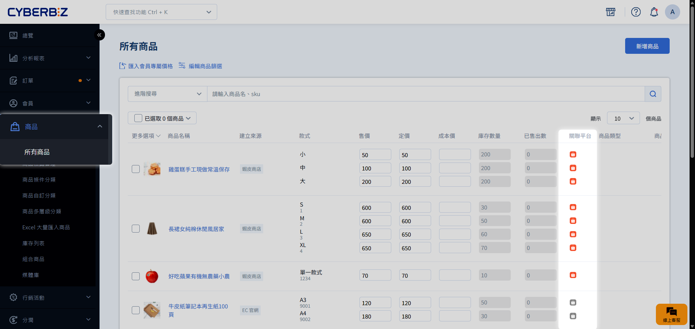
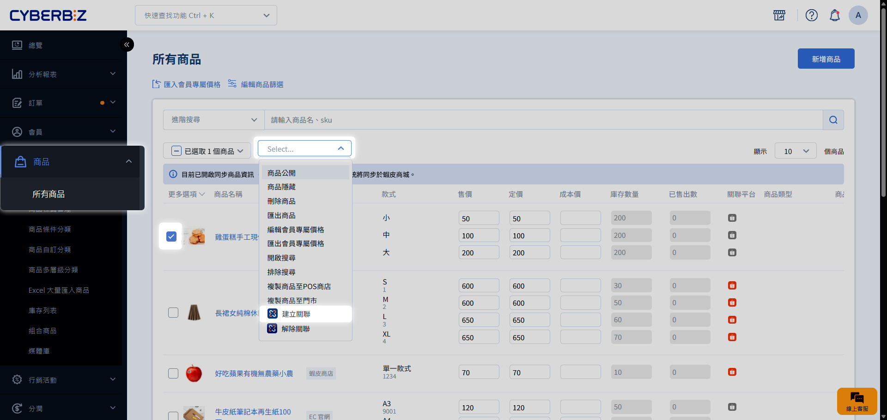
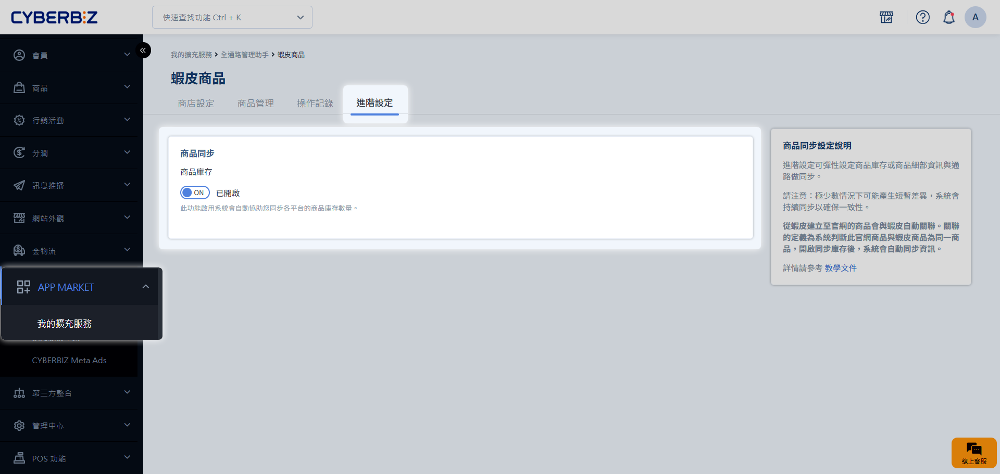
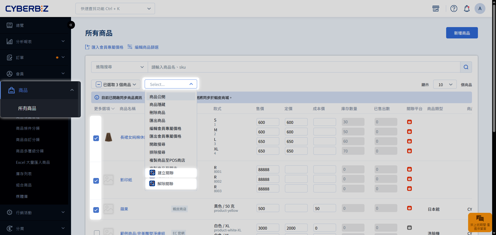
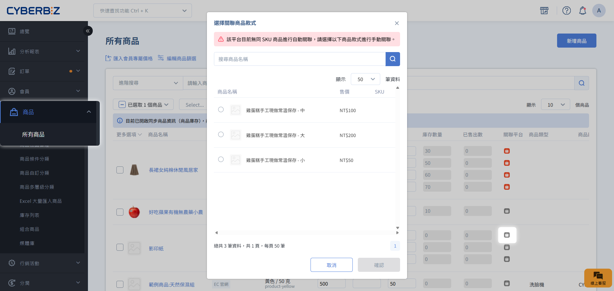
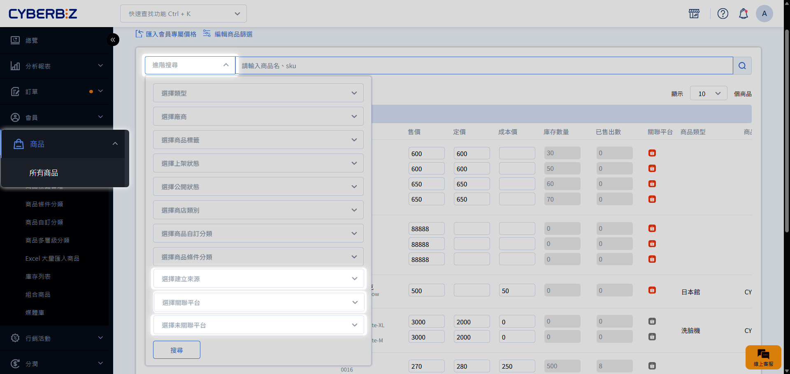

# Step 3 官網與蝦皮商店庫存同步

透過建立商品關聯與開啟同步功能，您可以讓官網與蝦皮商店的庫存維持連動。當任一端產生訂單或在官網修改庫存時，系統將自動更新兩端的剩餘數量。
{ .subtitle }

[:lucide-lock:{ title="適用方案" }](../../resources/conventions#適用方案) | 所有 PLUS / 企業
{ .doc-badge }

{ .hero-page }

!!! tip "應用情境"
    - **避免超賣**：當官網賣出一件商品，蝦皮庫存同步扣減，防止多通路重複下單。
    - **統一管理**：只需在官網後台更新庫存，即可同步更新至蝦皮，無需重複操作。
    - **靈活控制**：針對特定促銷商品，可暫時解除關聯以獨立管理各通路的配貨量。

## 使用須知

- **同步原則**：庫存同步以 **官網 (EC) 的數量為準** 同步至蝦皮。開啟同步前，請務必確認官網庫存正確。
- **無限庫存處理**：若官網商品設為無限庫存，蝦皮端將設定為該平台允許的最大數量，且不會隨訂單扣減。
- **負庫存警示**：若官網商品設為「允許負庫存販售」（如預購），導致 **庫存為負數時，建議不要開啟關聯**。由於蝦皮端不支援負庫存，同步後可能導致該商品在蝦皮端無法販售。

## 庫存同步運作機制

庫存同步必須同時滿足 **開啟功能開關** 與 **建立商品關聯** 兩個條件：

| 庫存同步開關 | 商品關聯狀態 | 最終結果 |
| :--- | :--- | :--- |
| 開啟 | 已關聯 | **正常同步** |
| 開啟 | 未關聯 | 僅該商品不執行同步 |
| 關閉 | (不限狀態) | 全站停止同步 |

- **停止全站同步**：關閉全站同步總開關，停止所有商品之資料對接。
- **停止單一商品同步**：解除特定商品的關聯設定，僅針對該項目停止同步。
- **啟動指定商品同步**：開啟全站同步總開關，並逐一配置欲同步之商品關聯。

### 庫存同步觸發時機

| 行為 | 官網 (EC) | 蝦皮 (Shopee) |
| :--- | :---: | :---: |
| **訂單成立** |  觸發同步 |  觸發同步 |
| **訂單取消** |  觸發同步 |  觸發同步 |
| **手動修改庫存** |  觸發同步 | **不會同步** |

- **手動修改限制**：開啟同步後，**若需手動調整庫存，請統一在官網後台修改**。在蝦皮端直接修改庫存不會反向同步至官網。

## 操作流程

### 步驟 1：建立商品關聯

=== "自動建立關聯(蝦皮後台匯入之商品)"

    當您使用全通路管理助手的 [建立官網商品](./蝦皮商品搬站_Step2.導入商品與建立關聯/#步驟-2建立官網商品與分類同步) 功能時，系統會自動完成連結。
    
    您可前往 **商品 > 所有商品**，確認該商品的 **關聯平台** 欄位中，蝦皮圖示已亮起。

    

=== "手動建立關聯 (官網現有商品)"

    若您的官網商品是自行手動建立，而非透過搬站工具匯入，請依照以下步驟連結：

    1. 前往 **商品 > 所有商品**。
    2. 確保官網商品與蝦皮商品的 **SKU (商品編號)** 完全一致。
    3. 勾選商品，點選 **建立關聯**。
    4. 若 SKU 不符或有多款式對應需求，可在彈窗中手動選擇對應的蝦皮商品或款式。

    

### 步驟 2：開啟全站庫存同步開關

1. 前往 **APP MARKET > 我的擴充服務 > CYBERBIZ CHANNEL BRIDGE**。
2. 進入 **蝦皮商品** 分頁，點選 **進階設定** 頁籤。
3. 將 **商品庫存** 開關切換為 `開啟 (ON)`。
4. 系統將開始以官網庫存為準，同步更新至所有已關聯的蝦皮商品。

### 步驟 3：管理指定商品的同步狀態

若想針對特定商品暫停同步，無需關閉全站開關：

- **批次處理**：在 **所有商品** 列表勾選商品，點選 **解除關聯**。
    
    - **限制**：若勾選的商品包含 **POS 商品**、**串倉商品**、**門市商品** 或 **快速到貨商品**，解除關聯按鈕將不會出現。請確認僅勾選一般官網商品。
- **單品/款式處理**：點擊款式旁邊的蝦皮圖示，手動關閉關聯。
    

## 管理與篩選技巧

在 **商品 > 所有商品** 頁面，您可以使用篩選器快速管理商品：

- **建立來源**：
    - 選擇 `EC 官網`：查看手動建立的商品。
    - 選擇 `蝦皮商店`：查看透過搬站工具匯入而建立的商品。
- **關聯平台**：選擇 `蝦皮商店` 可快速找到目前正與蝦皮同步庫存的商品。
- **未關聯平台**：選擇 `蝦皮商店` 可找出尚未與蝦皮連動的官網商品，方便進行手動關聯。

## 常見問題

??? quote "刪除商品會對關聯造成什麼影響？"
    - **在官網刪除商品**：該商品在官網及其相關的「匯入紀錄」會同步刪除，但**蝦皮賣場（賣家中心）內的商品不會受影響**。若需重新匯入，請前往全通路管理助手點擊 **同步蝦皮商品**。
    - **在蝦皮後台刪除商品**：官網相對應的商品將會自動 **解除關聯**，停止庫存同步。

??? quote "如果蝦皮授權過期了，庫存還會同步嗎？"
    不會。授權過期會導致 API 連線中斷，庫存同步將暫停。請務必在授權到期前完成重新授權。

