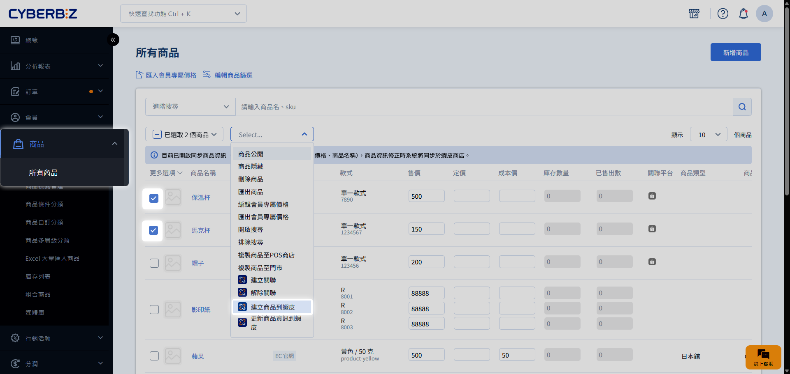
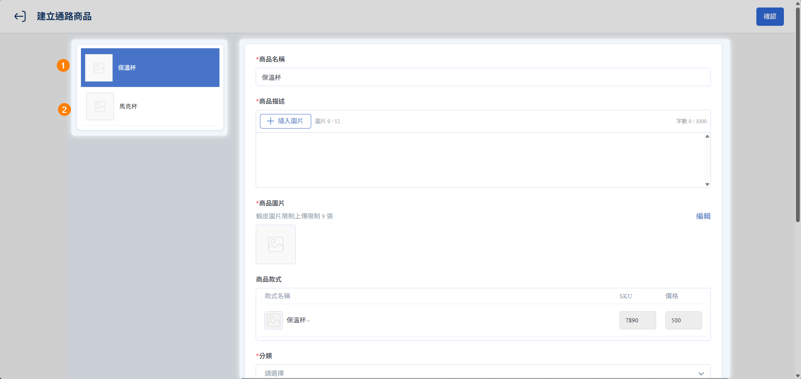

# Step 4 官網商品建立為蝦皮商品

您也可以將官網既有的商品快速發佈至蝦皮賣場。發佈成功後，系統將自動完成雙端關聯，方便您後續進行庫存與資訊的自動化同步。
{ .subtitle }

[:lucide-lock:{ title="適用方案" }](../../resources/conventions#適用方案) | 所有 PLUS / 企業
{ .doc-badge }

{ .hero-page }

!!! tip "應用情境"
    - **跨平台拓點**：已在官網經營一段時間，現欲將精選商品快速上架至蝦皮賣場。
    - **同步新品上架**：在官網建立新品後，一鍵同步至蝦皮，省去重複貼上圖文的過程。
    - **維持關聯一致**：確保兩端商品從發佈起就建立正確關聯，避免手動比對 SKU 的誤差。

## 建立前的準備

在開始發佈前，請確認欲操作的商品符合以下條件：

| 檢查項目 | 說明與限制 |
| :--- | :--- |
| **商品來源** | 必須是由官網手動建立、且 **尚未與蝦皮建立關聯** 的商品 |
| **類型限制** | **不支援** POS 商品、快速到貨商品 串倉商品可建立為蝦皮商品，但不可進行資訊同步 |
| **授權狀態** | 蝦皮商店授權需在有效期內 |

## 操作流程

### 步驟 1：選取商品並啟動發佈

1. 前往 **商品 > 所有商品**。
2. 使用篩選器加速查找：
    - **商店類別**：選擇 `EC`。
    - **建立來源**：選擇 `EC 官網`。
    - **未關聯平台**：選擇 `蝦皮商店`。
3. 勾選欲發佈的商品，點選 **更多操作 > 建立商品到蝦皮**。

### 步驟 2：編輯蝦皮特定欄位

系統會跳轉至蝦皮資訊編輯頁面，您可在此微調發佈至蝦皮的內容（**此處修改不影響官網原始資料**）。

!!! warning "蝦皮平台商品填寫規範"
    為確保商品順利轉換，請務必確認所有欄位均符合 [欄位填寫規則](./蝦皮商品搬站_Step4.官網商品建立為蝦皮商品/#欄位填寫規則)，以免匯入失敗。

### 步驟 3：核對發佈結果

1. 前往 **App MARKET > 我的擴充服務 > CYBERBIZ CHANNEL BRIDGE**。
2. 切換至 **操作紀錄** 頁籤。
3. 確認發佈狀態。若失敗，可點擊 **失敗原因** 查看並修正（常見原因：SKU 重複或字數超標）。
4. 發佈成功後，商品將自動轉為 `已關聯`。您可進一步開啟 [庫存同步](蝦皮商品搬站_Step3.同步蝦皮後台商品與官網商品.md) 或[商品資訊同步](蝦皮商品搬站_Step5.官網與蝦皮商品資訊同步.md)功能。

## 欄位填寫規則

為避免發佈失敗，請嚴格遵守蝦皮平台的規範：

| 欄位名稱 | 關鍵填寫規範 |
| :--- | :--- |
| **商品名稱** | **超過 10 個字** 頭尾不可有空格 | 
| **商品描述** | 圖片高度 > 32px 圖片寬度 > 700px 寬高比例介於0.5 ~ 3.2 之間 圖片大小不可超過 2MB | 
| **商品圖片** | 最多支援上傳 9 張圖片；若超過此限制，系統將自動取前 9 張作為預設 | 
| **商品款式** | **最多 2 個規格組合**（如尺寸 x 顏色） 原商品須有完整的商品款式組合，**不可缺漏款式（詳見下方範例1）** 規格名稱不可超過 14 個字元 選項名稱不可超過 20 個字元 開頭與結尾不可有空格 | 
| **款式圖片** | 請確保所有款式皆有圖；若無法，請保持所有款式皆無圖 **不支援部分款式有圖** 上限 1 張，超過會自動以第 1 張為預設 **雙規格時僅支援依第一層規格區分圖片（詳見下方範例2）**  | 自動帶入第一層對應圖 |
| **分類** | 套用蝦皮平台的類別層級 | 
| **物流設定** | 套用蝦皮商店的物流選項 | 
| **較長備貨（選填）** | 可自訂預計出貨天數 | 

!!! example "範例 1：款式組合完整選項"
    款式規格若為：尺寸（S/M/L）✕ 顏色（黑/白）

    - **正確選項**：（S/黑）（S/白）（M/黑）（M/白）（L/黑）（L/白）
    - **錯誤選項**：（S/黑）（S/白）（M/黑）（L/黑）

!!! example "範例 2：雙規格商品款式圖片套用方式"
    針對雙規格商品，系統僅支援依據 **第一層規格** 區分圖片。各款式將自動帶入該層級第一個選項之圖片作為共用圖，無法針對第二層規格個別設定。

    - 款式規格若為：尺寸（S/M/L）✕ 顏色（黑/白）。
    - 第一層規格則為：尺寸（S/M/L），款式選項有（S/M/L）3 種。

    | 選項 | 官網款式圖 | 套用方式 | 蝦皮款式圖 |
    | ------- | --------- | ------- | --------- |
    | 尺寸（S）| （S/黑/**圖A**） （S/白/圖B）| **圖A** 視為尺寸（S）的共用圖 | （S/黑/**圖A**） （S/白/**圖A**）|
    | 尺寸（M）| （M/黑/**圖C**） （M/白/圖D）| **圖C** 視為尺寸（M）的共用圖 | （M/黑/**圖C**） （M/白/**圖C**）|
    | 尺寸（L）| （L/黑/**圖E**） （L/白/圖F）| **圖E** 視為尺寸（L）的共用圖 | （L/黑/**圖E**） （L/白/**圖E**）|

下表說明系統如何將官網資料自動對應至各欄位，並標示匯入後的編輯權限：

| 欄位名稱 | 資訊填入邏輯 | 可否編輯 | 
| :--- | :--- | :--- |
| **商品名稱** | 自動帶入官網欄位 | ✓ |
| **商品描述** | 自動帶入 **商品介紹** 欄位內容，並僅保留純文字與圖片 路徑：**商品 > 所有商品 > 點擊商品 > 商品描述頁籤** | ✓ |
| **商品圖片** | 自動帶入官網欄位 | ✓ |
| **商品款式** | 自動帶入 **規格名稱、選項名稱、SKU、價格** | **✕** |
| **款式圖片** | 自動帶入官網欄位 | ✓ | 
| **分類** | 系統依品名自動判定 | ✓ | 
| **物流設定** | **留空** | ✓ | 
| **較長備貨(選填)** | **留空** | ✓ | 

