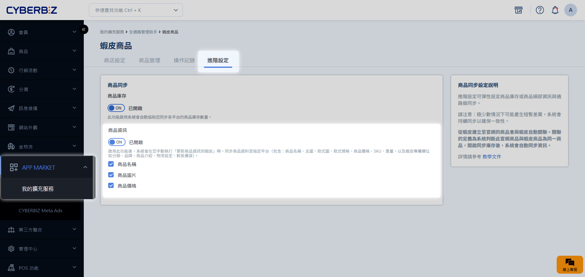
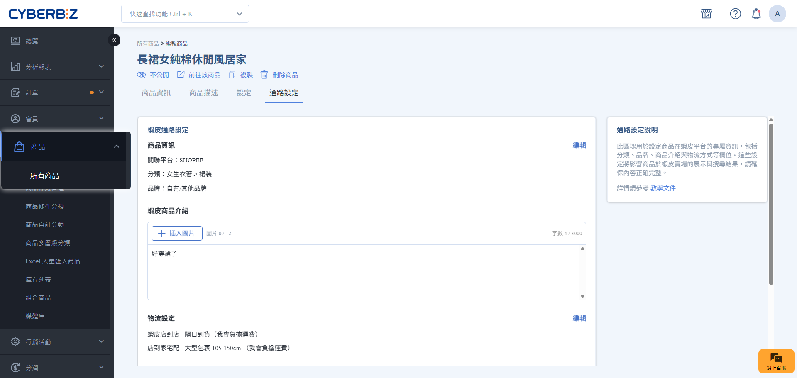
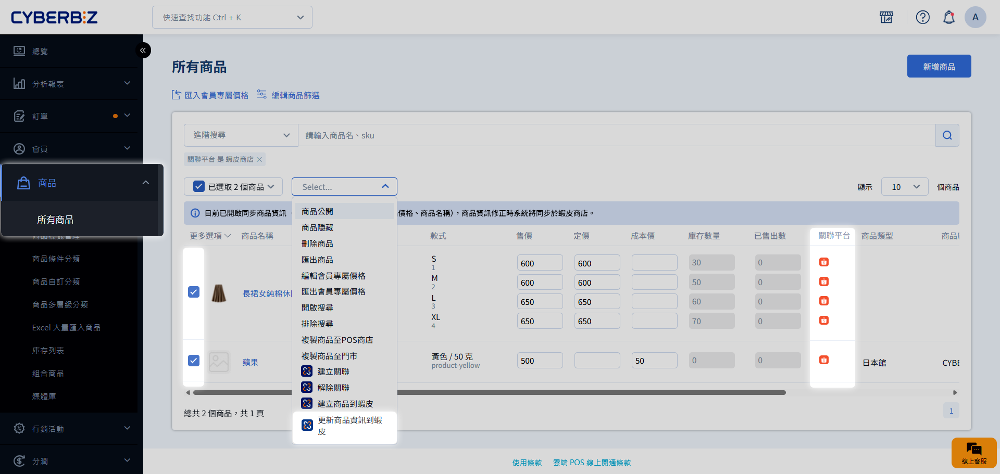

# Step 5 官網與蝦皮商品資訊同步

建立關聯後，您可以透過 商品資訊同步 機制，讓官網與蝦皮賣場的商品資料維持一致。當您在官網修改圖文或價格後，可一鍵同步至蝦皮，無需重複編輯。
{ .subtitle }

[:lucide-lock:{ title="適用方案" }](../../resources/conventions#適用方案) | 所有 PLUS / 企業
{ .doc-badge }

{ .hero-page }

!!! tip "應用情境"
    - **統一改價**：官網進行促銷調價時，同步更新蝦皮端的售價。
    - **視覺更新**：官網更換商品主圖或情境圖，一併同步至蝦皮賣場。
    - **規格校正**：修正官網商品規格或 SKU 後，確保蝦皮端資訊同步連動。

## 使用須知

- **同步原則**：僅限 **官網至蝦皮** 單向同步。在蝦皮端修改資訊不會回寫至官網。
- **類型限制**：**不支援** 同步 POS 商品、快速到貨商品、串倉商品。
- **綁定商品**：請先將官網商品與蝦皮商品[建立關聯](./蝦皮商品搬站_Step3.官網與蝦皮商品庫存同步/#步驟-1建立商品關聯)，再繼續設定。
- **同步單位**：以 **商品** 為單位更新。只要該商品有任一款式建立關聯，執行同步時將會更新 **全數款式** 的資訊。

## 操作流程

### 步驟 1：開啟欄位同步開關

您可以依營運需求，決定哪些欄位要參與同步：

1. 前往 **APP MARKET > 我的擴充服務 > CYBERBIZ CHANNEL BRIDGE**。
2. 進入 **蝦皮商品** 分頁，點選 **進階設定**。
3. 在 **商品資訊** 區塊，開啟欲同步的欄位開關：
    - **商品名稱**
    - **商品圖片**
    - **商品價格**
4. 點選 **儲存**。

### 步驟 2：編輯商品欄位資訊

在執行同步前，請確保以下兩類資訊已填寫完整：

1. **共用資訊**：前往 **商品 > 所有商品 > 點擊商品 > 商品資訊頁籤**。
    - 可於下方查看 [資訊同步欄位清單](./蝦皮商品搬站_Step5.官網與蝦皮商品資訊同步/#資訊同步欄位清單)。
2. **蝦皮專屬必填項**：切換至 **通路設定** 頁籤。
    - 可於下方查看 [蝦皮必填欄位](./蝦皮商品搬站_Step5.官網與蝦皮商品資訊同步/#蝦皮必填欄位清單)。
    

### 步驟 3：執行資訊更新

1. 前往 **商品 > 所有商品**。
2. 勾選欲更新的商品（需為已關聯狀態）。
3. 點選 **更多操作 > 更新商品資訊到蝦皮**。
4. 系統將開始排程同步，您可稍後於 **操作紀錄** 頁籤中核對結果。

!!! warning "欄位格式規範"
    同步前請務必確認內容符合 [蝦皮規範](./蝦皮商品搬站_Step4.官網商品建立為蝦皮商品/#欄位填寫規則)，以免同步失敗。

## 檢查清單

請確認以下設定皆已正確設置完成，資訊同步機制才能正常運作：

- [x] 官網商品與蝦皮商品已建立關聯
- [x] 商品資訊同步開關已開啟
- [x] 已於商品列表執行商品資訊更新
- [x] 官網商品欄位符合蝦皮規範

## 資訊同步欄位清單

| 類別 | 官網欄位名稱 | 蝦皮欄位名稱 | 可獨立設定同步 |
| :--- | :--- | :--- | :---: |
| **商品管理** | 商品名稱 | 商品名稱 | ✓ |
| | 商品圖片 | 商品圖片 | ✓ |
| **款式管理** | 規格 | 規格 | ✕ |
| | 款式圖片 | 款式圖片 | ✕ |
| | 售價 | 價格 | ✓ |
| | 商品編號 (SKU) | 商品選項貨號 | ✕ |
| | 重量 | 重量 | ✕ |

## 蝦皮必填欄位清單

- **分類** 
- **品牌** 
- **商品介紹** 
- **物流設定** 
- **較長備貨** 
