# CYBERBIZ EXPRESS 7-11 跨境超取

CYBERBIZ EXPRESS 提供的 7-11 跨境超取服務，讓海外商家不須自行與 7-11 簽約，即可提供台灣消費者「超商取貨不付款」的便捷配送選項。
{ .subtitle }

[:lucide-layers:{ title="適用產品" }](../../resources/conventions#適用產品) | 跨境電商 (日到台) 
[:lucide-grid-2x2-plus:{ title="適用擴充" }](../../resources/conventions#適用擴充) | CYBERBIZ EXPRESS
{ .doc-badge }

## 服務定位與優勢

海外商家無須具備 7-11 超商客代帳號，即可透過 CYBERBIZ EXPRESS 串接日到台的超取配送，享有以下優勢：

- **免簽約門檻**：不須自行向 7-11 申請客代及處理繁瑣的合約流程。
- **低成本物流**：相較於 EMS，提供更具競爭力的跨境運輸費率。
- **EZWAY 整合**：系統自動處理實名認證資訊串接，降低通關異常率。
- **一站式管理**：從前台地圖選店、後台印單到貨態追蹤與異常退件決策，均在 CYBERBIZ 後台完成。

## 使用須知

- **商品資訊設定**：參與跨境銷售的商品，**需補齊報關專用資訊**（如 JANCODE、成分、原產國等），詳細欄位請參閱 [日到台跨境商品資訊設定](product-info-setting.md)。
- **運費計費**：系統會以商品重量與材積，於建立託運單時自動計算並預扣 CYBER 幣；每月5號會依實際收取運費，多退少補 CYBER幣。

## 啟用功能

### 申請開通

1. 聯繫您的開店顧問申請開通。
2. 進入 **APP MARKET > 我的擴充服務 > CYBERBIZ EXPRESS**，選擇 **基本設定 > EXPRESS 超取**。

    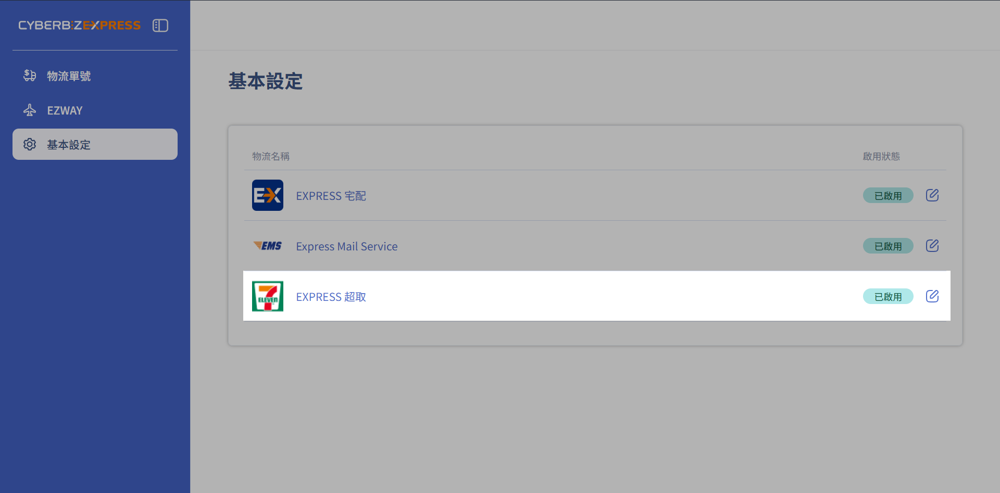{ .screenshot }

3. 勾選同意 **跨境運送服務契約** 並儲存設定。
4. 開啟 **7-11 超取** 的開關，選擇託運單列印方式。
5. 填寫 **日本出貨地址**。
    - **建議以中文填寫**，以利台灣海關審核。
    - 若未填寫此地址，系統將無法產出報關發票與提單清單。

    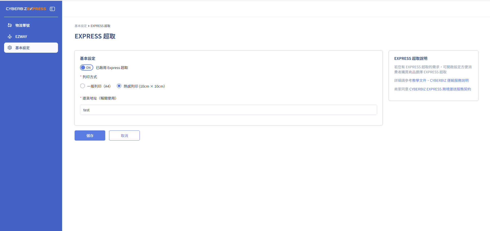{ .screenshot }

### 設定前台結帳選項

啟用物流開關後，需在結帳頁面開啟該配送方式：

1. 前往 **金物流 > 物流設定 > 超商物流**，點擊 **7-11 B2C 超商取貨** 的編輯按鈕。

    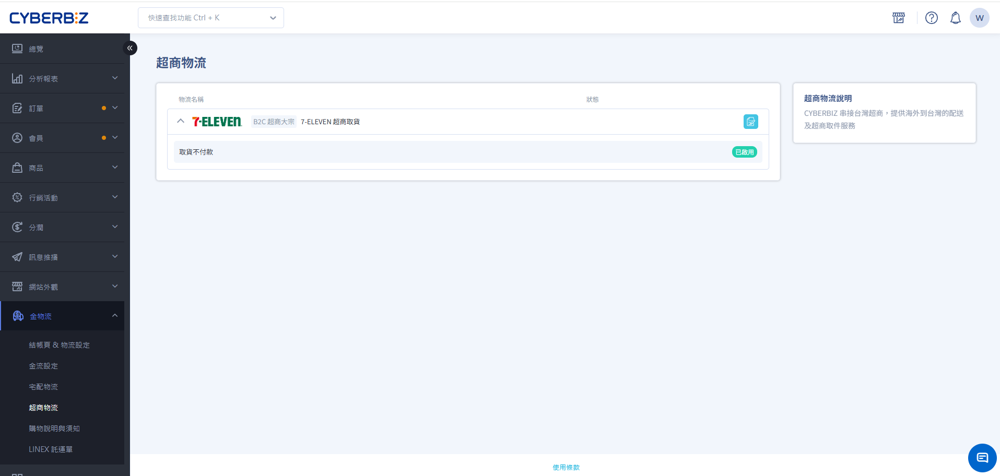{ .screenshot }

2. 開啟 **啟用取貨不付款** 開關，設定運費規則後儲存。

    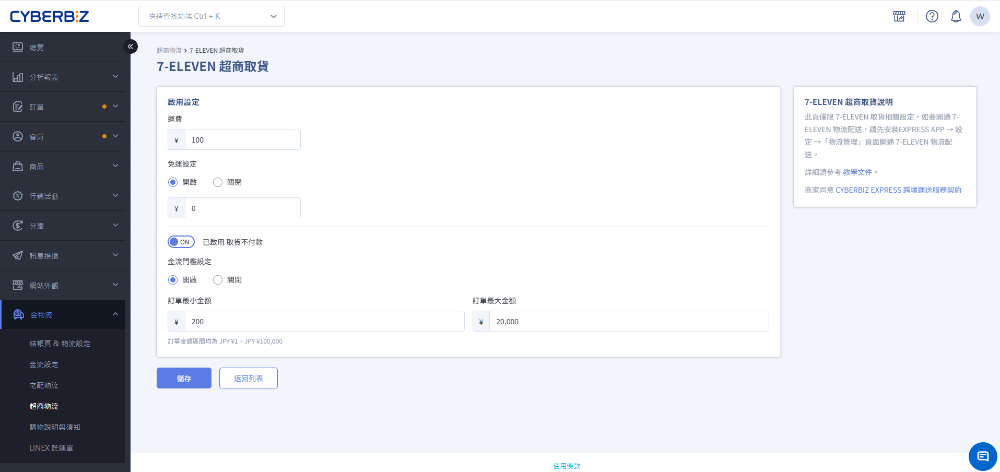{ .screenshot }

## 訂單出貨操作

當消費者下單並選擇 7-11 超取後，商家可依照以下步驟進行出貨。

### 建立託運單

建立託運單需同時滿足以下條件：

- 訂單狀態為 `已收到款項`。
- 配送狀態為 `未出貨` / `準備出貨` / `部分出貨`。
- 退貨狀態為 `不需退貨`。

**操作步驟：**

1. 前往 **訂單 > 所有訂單**。
2. 勾選欲出貨的訂單，點選 **更多操作 > 建立託運單**。

    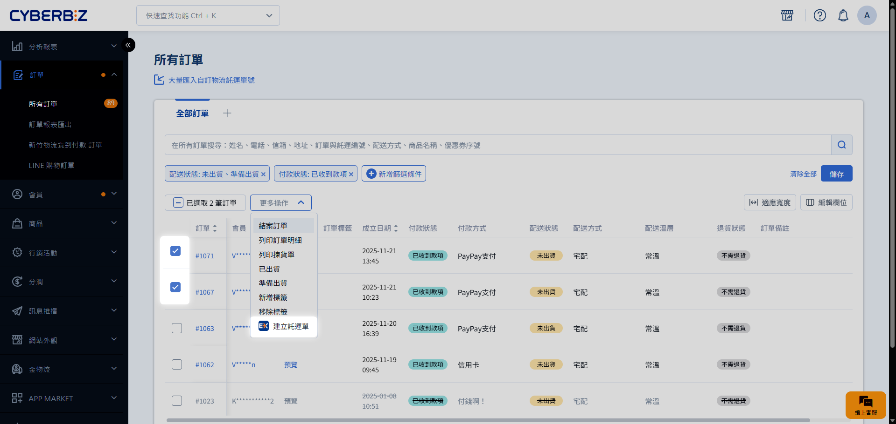{ .screenshot }

3. 系統將根據您的勾選項目（託運單、揀貨單、訂單/出貨明細），自動開啟列印預覽分頁，方便您直接點擊列印。

    > 可點擊 **同步下載所有文件**，將文件檔案以壓縮檔格式儲存至電腦。

    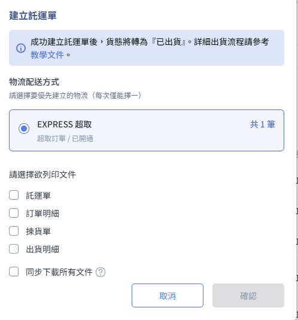{ .small-image }

!!! note "貨態轉換條件"
    成功產出 **託運單** 後，訂單狀態才會自動轉為 `已出貨`。

### 補印託運單

補印託運單需滿足以下條件：

- 配送狀態為 `已出貨`

**操作步驟：**

勾選指定訂單，點選 **更多操作 > 補印託運單**。

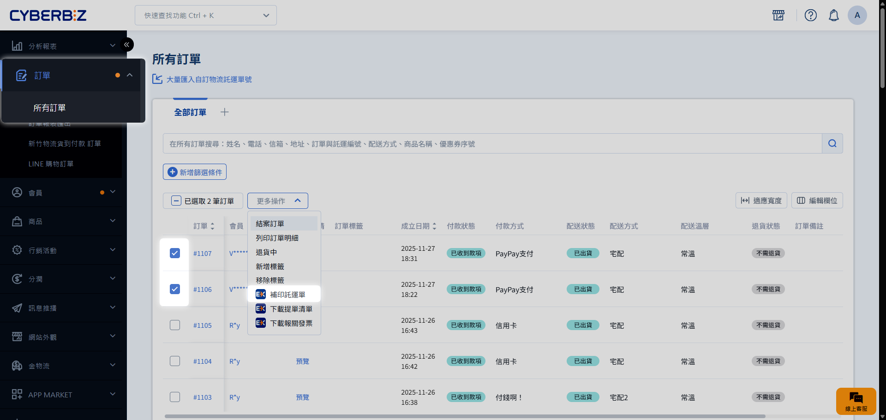{ .screenshot }

!!! info "自動偵測與防呆"
    若勾選多筆訂單時，包含非 EXPRESS 物流訂單，系統將提示並跳過，僅列印 EXPRESS 物流訂單。

    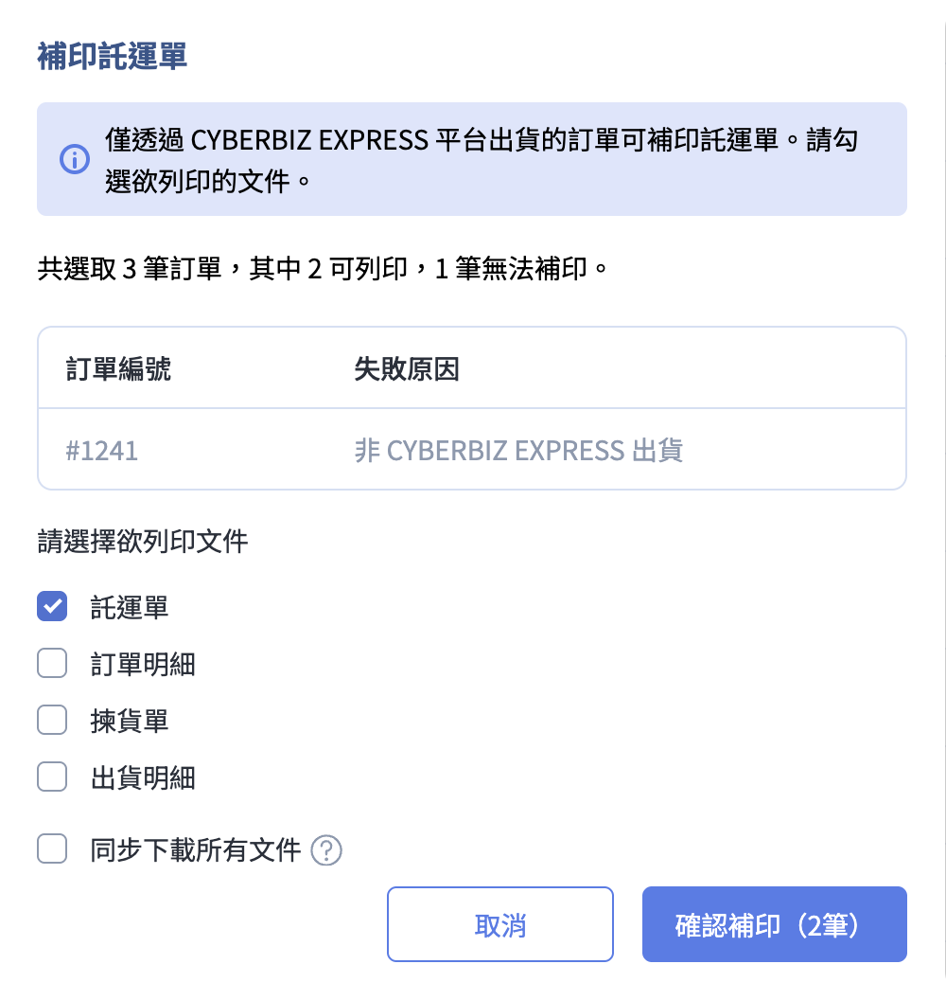{ .small-image }

## 寄送報關文件

通知物流商取件前，請務必完成以下動作：

1. 勾選已出貨的訂單，下載 **提單清單**。
2. 將上述檔案以 Email 寄送至 `manifest_express@cyberbiz.io`。
    - **郵件主旨**：【跨境通-商家名稱】YYYY/MM/DD 出貨資料。

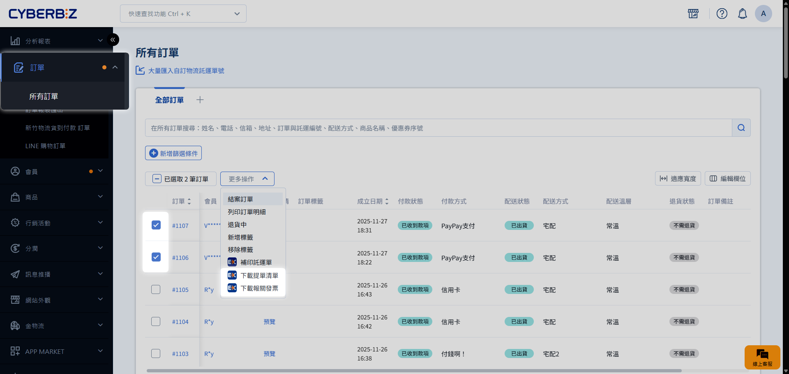{ .screenshot }

## 下載報關發票

若商家有向日本政府申請節稅之需求，可於完成出貨後勾選對應訂單，下載 **報關發票**。

下載報關發票時，訂單需滿足以下條件：

- 配送狀態為 `已出貨`

{ .screenshot }

## 運送異常處理

### 逾期未取

1. 當消費者超過 7 天未取貨，包裹將退回，並由峰潮倉庫代收。商家可於 **EXPRESS 物流單號列表** 查看貨態，配送狀態將顯示為 **逾期未取**。
2. 當峰潮收到包裹後，配送狀態顯示 **退回倉庫**，物流單號頁面將出現 **逾期處理** 按鈕。

    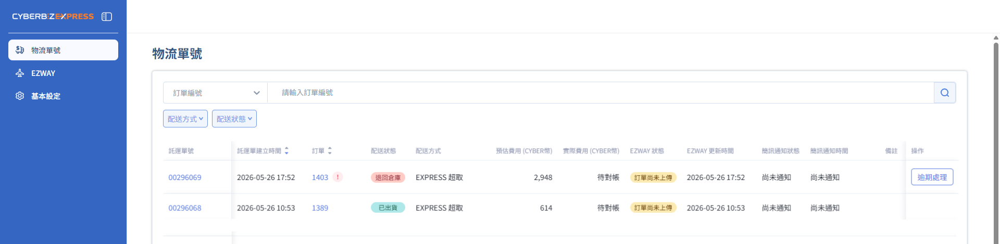{ .screenshot }

3. 商家可選擇包裹處理方式：

    === "再寄一次"

        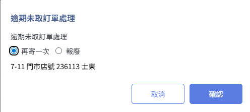{ .small-image }

        - **配送限制**：僅支援寄回原門市，不可修改收件地址。
        - **訂單變更**：原訂單配送狀態將標記為 **已失效**，系統會自動建立一筆新託運單。
        - **資訊連動**：
        
            - 新託運單編號會自動記錄於訂單 **備註**。

            - 訂單明細頁將同步顯示 **原託運單** 與 **新託運單** 資訊供查閱。

                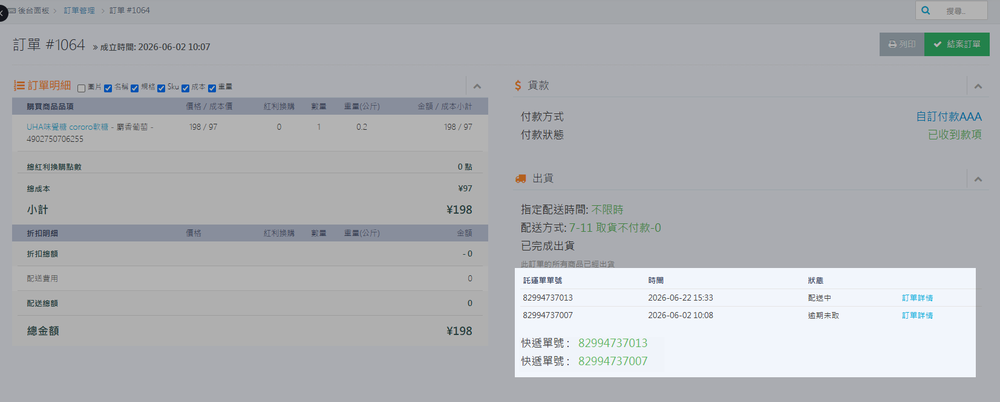{ .screenshot }

        - **貨態追蹤**：訂單將改依新託運單更新貨態，並在操作紀錄中留存訂單配送記錄。

            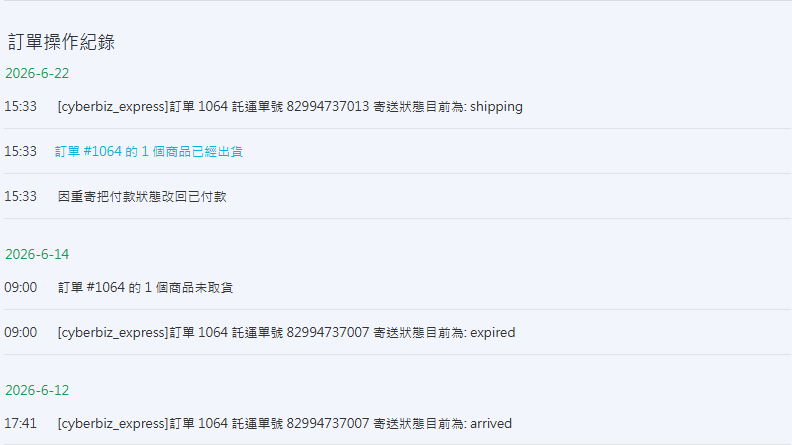{ .screenshot }

        

    === "報廢"

        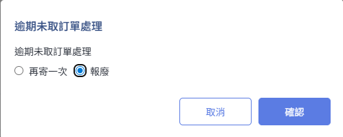{ .small-image }

        - **實體處置**：包裹將由倉庫進行銷毀處置。
        - **訂單變更**：原訂單配送狀態會標記為 **已報廢**，並於 **備註**  中註明 **商家選擇「報廢」**。

    
    !!! warning "包裹處理期限與費用"
        - **處理期限**：商家需在 **15 天內** 選擇處理方式，否則系統將自動執行報廢。
        - **帳務認列**：相關處理費用將會認列於每期對帳單中。
        
    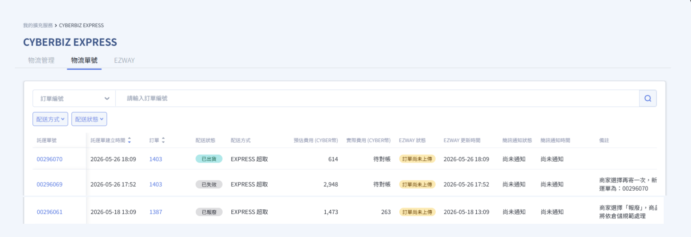{ .screenshot }
 

### 託運單過期

若託運單列印後超過 30 天才送達統倉，系統會將配送狀態標記為 **運送異常**，並採取以下處置：

- **自動再寄**：包裹由峰潮倉庫代收後，系統將自動建立新託運單並重新寄出。
- **狀態變更**：原託運單狀態將轉為 **已失效**，系統會自動註記新託運單編號。
- **商家追蹤**：此流程由系統自動完成，**商家無需介入處理**。您可以直接透過新託運單單號持續追蹤貨態。

### 門市關轉

若遇到門市關轉，系統會將配送狀態標記為 **運送異常**。

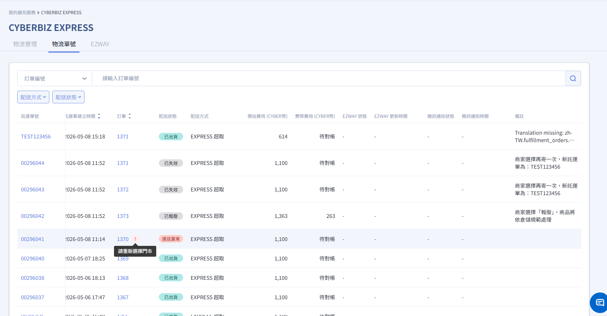{ .screenshot }

商家需在 **2 個工作日** 內於訂單詳細頁重新選擇 7-11 門市。

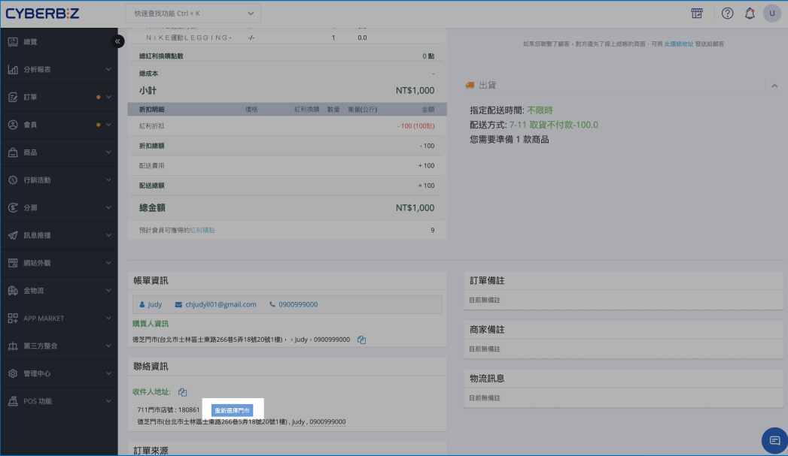{ .screenshot }

> 

## 物流相關通知

系統會自動發送通知給消費者與商家，確保掌握貨態：

| 場景 | 觸發條件 | 通知對象 | 通知方式 | 備註 |
| :--- | :--- | :--- | :--- | :--- |
| **出貨通知** | 建立託運單 | 消費者 | Email | 含 EZWAY 實名認證提醒 |
| **到貨通知** | 包裹送達門市 | 消費者 | SMS + Email | 第 1 天發送 |
| **取貨提醒** | 到貨後第 4 天未取 | 消費者 | SMS + Email | |
| **門市關轉** | 讀取到關轉狀態 | 商家 消費者 | Email | **商家需 2 日內更新門市** |
| **關轉逾期後退回** | 門市關轉後，商家並未重選門市，包裹執行退回 | 商家 消費者 | Email | 倉庫收貨後將另行通知商家 |
| **逾期未取後退回** | 逾期未取包裹執行退回 | 商家 消費者 | Email | 倉庫收貨後將另行通知商家 |
| **退回確認** | 倉庫收到退回包裹 | 商家 | Email | **商家需 15 日內選擇處理方式**，否則自動報廢 |
| **再寄一次** | 倉庫建立新託運單出貨 | 商家 消費者 | Email | |

