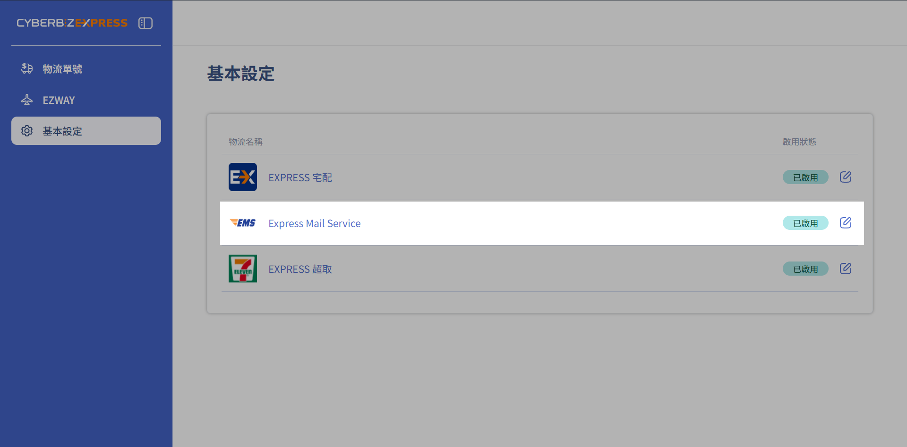
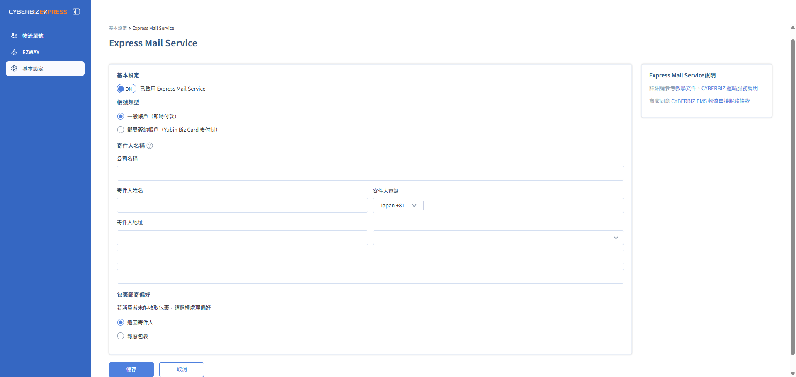
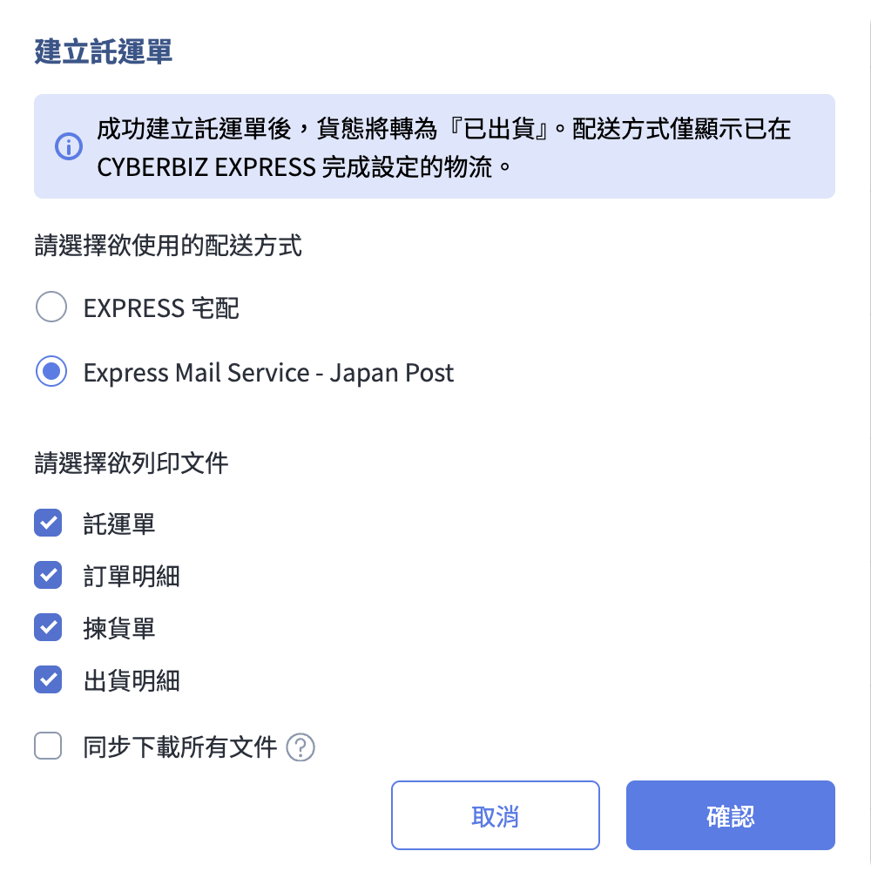

# CYBERBIZ EXPRESS 日本郵局(EMS) 
串接日本郵局 (Japan Post) EMS 服務，協助商家高效建立託運單、處理國際報關文件，並支援自備郵局簽約帳號以享有運費優惠。
{ .subtitle }

[:lucide-layers:{ title="適用產品" }](../../resources/conventions#適用產品) | 跨境電商 (日到台) 
[:lucide-grid-2x2-plus:{ title="適用擴充" }](../../resources/conventions#適用擴充) | CYBERBIZ EXPRESS
{ .doc-badge }

## 快捷郵件(EMS)
  
Express Mail Service 快捷郵件(EMS)為 CYBERBIZ 與日本郵局(Japan Post) 直串的物流選項。  
  
選擇 EMS 作為物流管道，商家可享有以下核心功能：

- **運費成本優化**：您可使用與 **日本郵局(Japan Post)** 直接簽訂的專屬優惠費率，降低跨境物流支出。
- **系統支援印單**：支援後台一鍵生成託運單，實現從下單到出貨的一站式訂單管理。
- **跨境通關優勢**：消費者 **免使用 EZWAY 實名認證**，大幅提升收貨便利性與轉單率。

### 使用須知

- **商品資訊設定**：參與跨境銷售的商品，**需補齊報關專用資訊**（如 JANCODE、成分、原產國等），詳細欄位請參閱 [日到台跨境商品資訊設定](product-info-setting.md)。
- **印單服務費**：系統會於建立託運單時自動預扣CYBER幣；每月最後一天會依該月配送件數進行帳務校準。
- **費用結算限制**：建立託運單後，若因訂單取消、託運單逾期失效等情境，而未實際使用，已產生之費印單服務費將不予退還。
- **聯繫收件**：請自行聯繫郵局前往收件，可前往 [日本郵局集荷預約](https://mgr.post.japanpost.jp/C20P02Action.do) 提前預約以確保出貨時效。
- **禁運品規範**：請確保商品符合郵局之運輸限制，若因違規導致退件，相關損失恕由商家承擔。詳細可參考 [日本郵局禁寄品說明](https://www.post.japanpost.jp/int/use/restriction/index_cn.html#airmail)。

### 比較 EXPRESS 宅配與 Express Mail Service

| **物流選項** | **CYBERBIZ EXPRESS 宅配** | **Express Mail Service** | 
| ----------- | ------------------------- | ----------------------- | 
| **物流商** | CYBERBIZ 官方物流服務 | 日本郵局(Japan Post) | 
| **運費** | 平台預扣(CYBER 幣) | 現場支付 / 月結 | 
| **稅金/報關手續** | 依 [EXPRESS 宅配物流運送流程](cyberbiz-express-japan-to-taiwan-delivery/#跨境物流運送流程) 操作即可 | 自行處理 |
| **物流爭議處理** | 由 CYBERBIZ 統一受理窗口 | 聯繫日本郵局 (Japan Post) |
| **適用對象** | 欲簡化跨境報關手續之商家 欲透過單一窗口整合配送管理之商家 | 已與日本郵局簽約優惠帳號的商家 習慣使用 EMS 出貨的商家 | 

## 申請開通物流

1.  請向 CYBERBIZ 開店顧問團隊申請開通，開通完成後您可於後台開始設定。  

2.  登入電商官網 **APP MARKET > 我的擴充服務 > CYBERBIZ EXPRESS**，點擊 **基本設定 > Express Mail Service**。
    
    { .screenshot }

3. 同意 CYBERBIZ EXPRESS 跨境運送服務契約。  

3.  完成基本設定。
    
    *   選擇帳號類型：

        === "一般帳戶(即時付款)"

            - **適用商家**：未與日本郵局簽約之商家
            - **運費資訊**：運費於郵局收件時結清

        === "郵局簽約帳戶(Yubin Biz Card)"

            - **適用商家**：已與日本郵局簽約之商家
            - **運費資訊**：運費月結，並享有優惠費率  
            - **備註**：勾選後需填寫「後納客戶欄位」，申請方式可參考 [JP POST 郵便局](https://www.post.japanpost.jp/send/fee/how_to_pay/deferred_pay/index.html)
        
        
    *   填寫寄件人身分資訊。
      
    *   填寫日本出貨地址。
        *   若未填寫日本出貨地址，將無法順利出貨，請務必確實填寫。
        *   **建議以中文填寫**，以利台灣海關審核。(英文亦可，但建議以中文為主)。
      
    *   選擇包裹郵寄偏好。

    { .screenshot }

## 訂單出貨操作  

1.  前往 **訂單 > 所有訂單**，勾選訂單，選擇「建立託運單」。
    
    *   請確保訂單狀態符合以下要求：
        *   付款狀態為「已收到款項」
        *   配送狀態為「未出貨」/「準備出貨」/「部分出貨」
        *   退貨狀態為「不需退貨」
      
    *   建立託運單後，訂單配送狀態將自動改為「已出貨」。
      
    *   您可一次勾選多筆訂單，批次建立託運單。
      
    *   批次勾選時，請確保每筆訂單皆適用日到台宅配出貨，若有訂單不符合配送方式或訂單狀態，將不會出現「建立託運單」選項。

    { .screenshot }
    

2.  **選擇配送方式**：於彈出視窗中指定所需的配送管道。
    
    *   **文件預覽與列印**：系統將根據您的勾選項目（如下列清單）開啟網頁預覽，確認無誤後即可列印。
        *   託運單
        *   訂單明細
        *   揀貨單
        *   出貨明細
    *   **批次下載支援**：系統支援同步下載上述所有文件。
    *   **自動排序邏輯**：執行批次建立時，系統會產出包含所有訂單明細的單一 PDF 檔案，並自動依「訂單編號」由小至大進行排序。
    *   **即時資料校驗**：系統會針對訂單中商品進行欄位檢查，若缺少重量、跨境商品必填欄位，請先補填後再操作出貨。

    { .small-image }
    

## 補印託運單

  
前往 **訂單 > 所有訂單**，勾選指定訂單，選擇「補印託運單」。  
  
請確保訂單狀態符合以下要求：

*   付款狀態為「已收到款項」
*   配送狀態為「已出貨」
*   退貨狀態為「不需退貨」

{ .screenshot }

