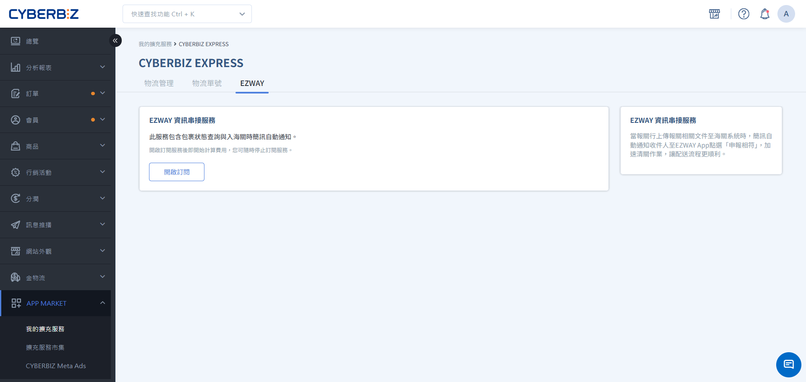
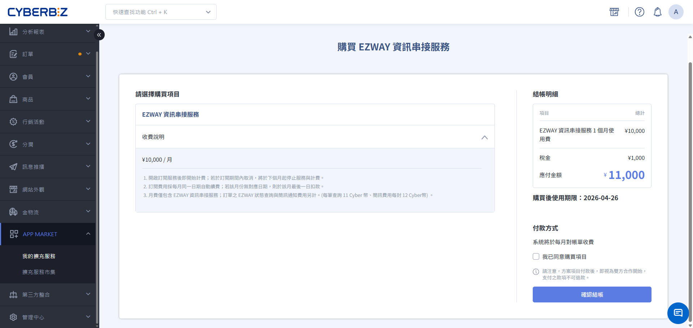
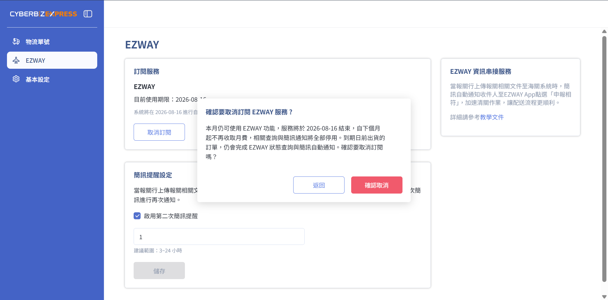
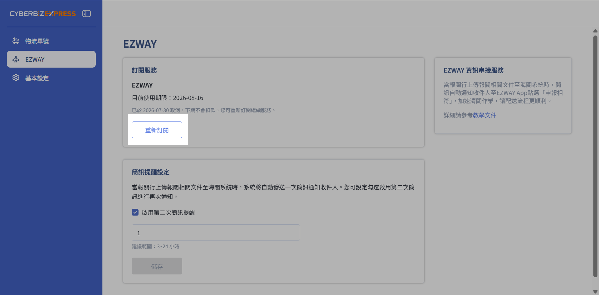
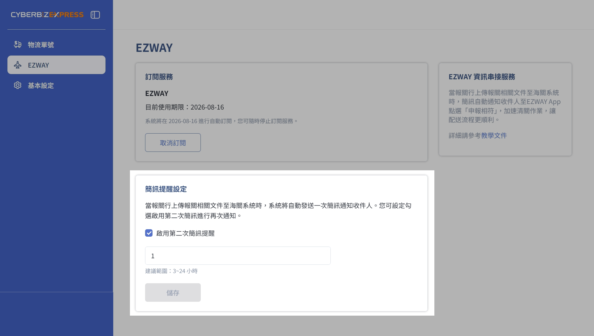
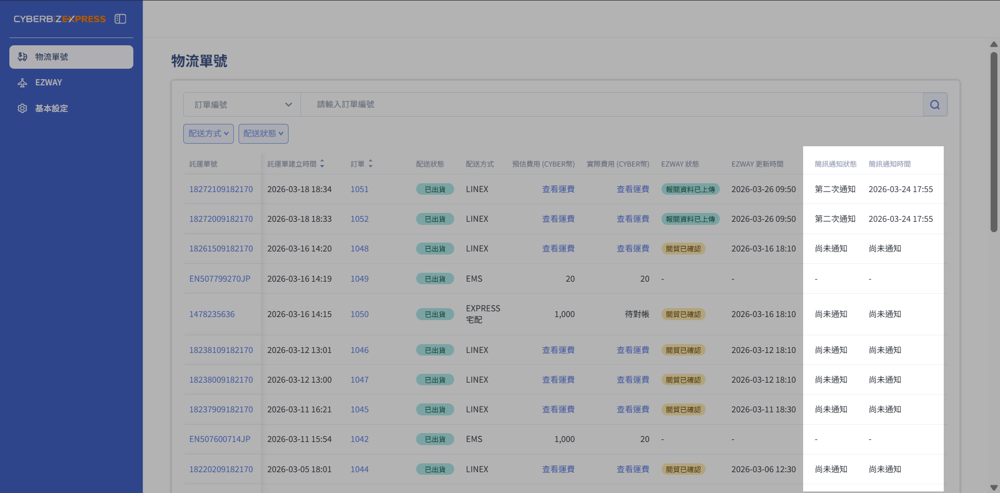
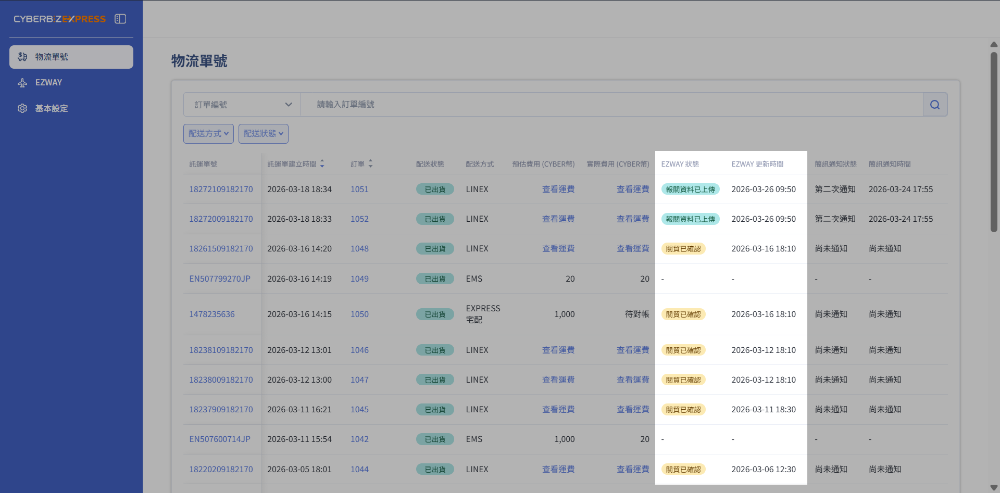

# EZWAY 訂閱服務
啟用 EZWAY 訂閱服務以掌握跨境訂單申報進度。設定自動化簡訊提醒引導消費者完成實名認證，並透過後台即時追蹤報關貨態與發送紀錄。
{ .subtitle }

[:lucide-layers:{ title="適用產品" }](../../resources/conventions#適用產品) | 跨境電商 (日到台) 
[:lucide-grid-2x2-plus:{ title="適用擴充" }](../../resources/conventions#適用擴充) | CYBERBIZ EXPRESS
{ .doc-badge }

## 使用須知 

- **適用配送方式**：[CYBERBIZ EXPRESS 宅配](cyberbiz-express-japan-to-taiwan-delivery.md)、CYBERBIZ LINEX、[CYBERBIZ EXPRESS 超取](cyberbiz-express-711)。
- **不適用配送方式**：EMS 日本郵局(無須進行申報相符流程)

  

## EZWAY 訂閱服務說明
  
針對 **日到台** 跨境電商繁瑣的報關流程，CYBERBIZ 提供 EZWAY 自動化管理工具。透過此功能，商家可一站式追蹤包裹的申報相符進度，並在關鍵時刻自動提醒消費者，大幅降低包裹卡關風險。  
  

- **自動追蹤申報進度**：系統自動與關貿、海關系統同步，將複雜的報關流程轉化為易懂的狀態標籤。
- **雙層提醒機制**：針對尚未完成 **申報相符** 的消費者，系統可自動發送提醒簡訊，引導消費者開啟 EZWAY App 確認，加速清關作業。
- **降低客服溝通成本**：透過後台即時顯示的更新時間與申報階段，客服人員能快速判斷包裹滯留原因，並精確回覆消費者諮詢。

## EZWAY 收費方式
  
本功能採「訂閱制」結合「隨用隨付」模式：  
  
| 項目 | 類型 | 扣款時機 | 計費模式 | 收費方式 |
| ---- | ---- | ------- | ------- | -------- |
| **月費** | 固定費用 | 初次訂閱/效期後重新訂閱：訂閱當下 自動續訂/效期內重新訂閱：到期日當天 | 依月計費 | 列入對帳單費用項目 |
| **訂單查詢費** | 浮動費用 | 關貿系統已成功接收訂單資料時 | 依訂單數計費 | CYBER 幣 |
| **簡訊通知費** | 浮動費用 | 發送簡訊時 | 依發送次數計費 | CYBER 幣 | 

> 欲瞭解詳細費用方案，請洽詢 CYBERBIZ 開店顧問了解更多。

## 開啟訂閱

  
1. 前往 **APP MARKET > 我的擴充功能 > CYBERBIZ EXPRESS**，選擇 **EZWAY** 頁籤。
  
2.  **開啟訂閱流程**：點擊 **開始訂閱** 按鈕。  
    
    { .screenshot }

3.  **確認費用並結帳**：核對訂閱資訊後，點擊 **確認結帳**。  
    
    { .screenshot }

4.  **訂閱成功與功能啟用**：  

    結帳完成後，系統將自動開啟以下功能：

    - **EZWAY 通知申報**：主動向消費者發送簡訊提醒。
    - **EZWAY 狀態查詢**：於物流單號分頁即時同步申報進度。
  
5.  **續訂與效期管理**：
    - **自動續訂機制**：若未主動取消，系統將於每期屆滿時自動續訂。
    - **取消訂閱規則**：取消後，服務將於 **下個計費週期** 停止；當期已支付功能仍可使用至效期結束。

## 取消訂閱

若您欲停止此功能，請點擊 **取消訂閱**：  
  

*   **停止續購**：自下個計費週期起，系統將停止自動扣款。
*   **服務不中斷**：於當期效期內成立之訂單，系統仍會持續執行簡訊通知並同步 EZWAY 申報狀態，直至本期服務結束為止。

{ .screenshot }

## 重新訂閱

若您欲恢復服務，可點擊 **重新訂閱**，系統將依據您的「服務狀態」決定扣款時機：  
  

*   **效期內恢復（服務尚未終止）**：系統將接續原有的訂閱週期，本次操作不重複扣款，並於下期自動續訂時恢復正常扣費。
*   **效期後重啟（服務已終止）**：系統將視為新一輪訂閱，立即啟用功能並扣除當期月費。

{ .screenshot }

## 發送申報相符提醒簡訊

### 二次簡訊發送機制

訂單成立後，若消費者並未完成「申報相符」回報，可透過系統發送兩次簡訊通知：  
  

| **項目** | **發送機制** | **發送時間** |
| -------- | ----------- | ----------- |
| **第一封** | 系統自動發送 | 報關行上傳文件至海關系統時(此時未申報相符包裹無法進行清關) |
| **第二封** | 商家彈性啟用 | 首封簡訊發送後，依自訂間隔發送 |

### 發送第二封簡訊

欲啟用第二次通知功能，請勾選「啟用第二次簡訊提醒」，並選擇兩封簡訊的發送間隔。

{ .screenshot }

### 簡訊發送注意事項

*   **發送時間差**：受系統排程影響，簡訊實際發出時間與您的設定間隔可能存在 **5–10 分鐘** 的作業誤差。
*   **深夜靜音模式**：為維護收件人生活品質，簡訊僅於台灣時間 08:00–22:00 發送。
    *   **延遲補發機制**：若發送指令觸發於非服務時段（22:01–07:59），系統將自動排程至隔日 08:00 後依序批次補發。
    *   **適用範圍**：此規則同時適用於第一封與第二封提醒簡訊。

## 查看簡訊通知紀錄 
  
前往 **物流單號** 頁籤，您可透過以下欄位追蹤簡訊發送紀錄：

*   **簡訊通知狀態**：掌握該筆訂單是否已發送通知，以及累計發送的簡訊次數。
*   **簡訊通知時間**：紀錄最近一次簡訊成功送出的時間點，便於追蹤提醒時效。

{ .screenshot }

### 簡訊通知狀態一欄覽表

| **欄位選項** | **說明** |
| ----------- | --------- |
| **尚未通知** | 系統尚未發送 EZWAY 申報提醒簡訊 |
| **第一次通知** | 系統已發送第一則 EZWAY 申報提醒簡訊給收件人 |
| **第二次通知** | 系統已發送第二則 EZWAY 申報提醒簡訊給收件人 |
| **(留空)** | 此配送方式不適用 EZWAY 實名申報流程 |

## 查看 EZWAY 申報進度
  
前往 **物流單號** 頁籤，您可透過以下欄位追蹤包裹申報進度：

*   **EZWAY 狀態**：即時掌握該筆訂單的申報階段，確保包裹通關順暢
*   **EZWAY 更新時間**：記錄系統最後一次同步海關資訊的時間點，便於辨識資訊的時效性

{ .screenshot }

## EZWAY 狀態一欄與報關流程覽表

| **欄位選項** | **報關流程** | **報關流程/說明** |
| ----------- | ------------ | ---------------- |
| **訂單尚未上傳** | 1 | 訂單已成立，稍待系統將訂單諮詢上傳至關貿系統 |
| **訂單已上傳** | 2 | 訂單資料已送出至關貿系統，正在等待關貿回覆 |
| **關貿已確認** | 3 | 關貿系統已成功接收訂單資料，待後續 EZWAY 申報狀態更新 | 
| **尚未確認申報** | 4 | 報關行已上傳預先委任資料，但收件人尚未在 EZWAY App 點選「申報相符」，需完成後才能正式報關 |
| **已確認申報** | 5 | 收件人已完成點選 EZWAY「申報相符」，等待海關審核 |
| **海關已確認委任** | 6 | 海關已回覆預先委任核准，報關行可上傳正式報關資料 |
| **報關資料已上傳** | 7 | 報關行正式上傳報關資料，海關可開始進行清關 |
| **逾期未確認** | 特殊情境 | 收件人超過14天仍未完成 EZWAY 申報確認，可能影響報關作業和產生包裹滯留費用 | 
| **電話不符** | 特殊情境 | 報關行上傳之申報資料中的電話與訂單收件人電話不一致，請協助確認 EZWAY 資訊 |
| **查詢中** | 特殊情境 | 系統目前暫時無法取得 EZWAY 最新狀態，將自動再次查詢，請稍後查看 |
| **(留空)** | 其他 | 此配送方式不適用 EZWAY 實名申報流程 | 

