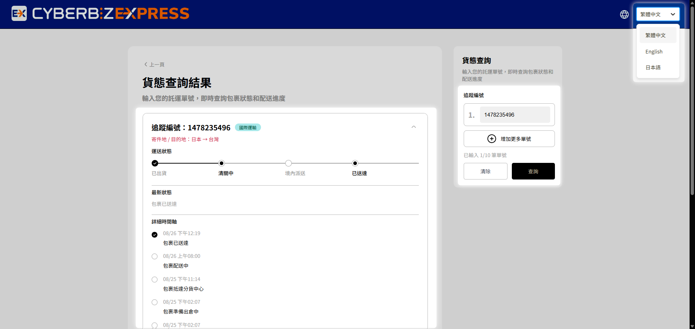
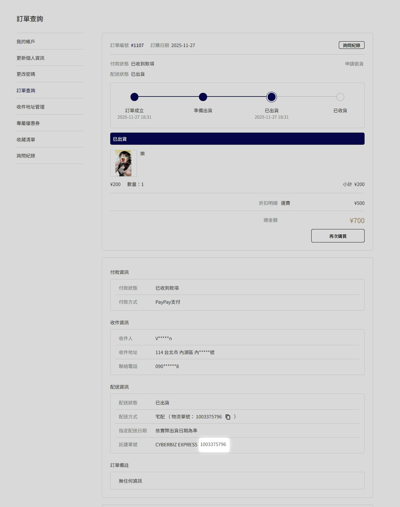
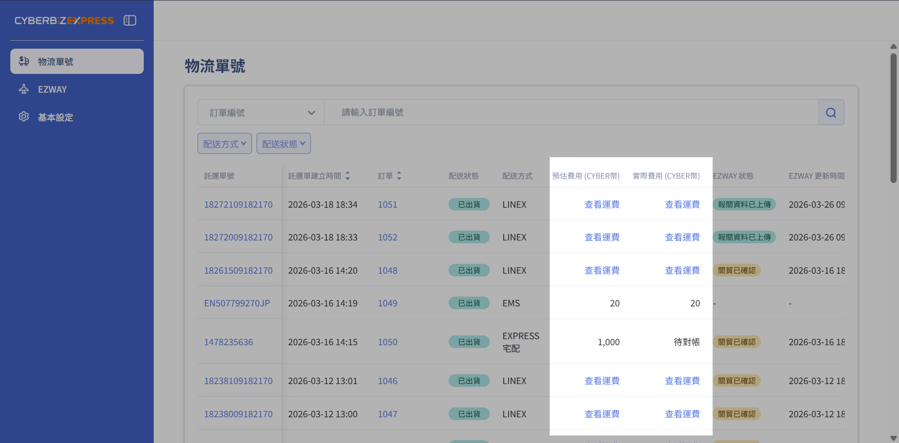

# CYBERBIZ EXPRESS 貨態追蹤與查詢
說明商家與消費者如何透過 CYBERBIZ EXPRESS 追蹤物流狀態，並查看託運單預估與實際運費。
{ .subtitle }

[:lucide-layers:{ title="適用產品" }](../../resources/conventions#適用產品) | 跨境電商 (日到台)
{ .doc-badge }
## 貨態追蹤

=== "商家端"

    1. 前往 **前往APP MARKET > 我的擴充服務 > CYBERBIZ EXPRESS**。
    2. 進入 **物流單號** 頁籤，點擊單號連結。
    3. 進入 [CYBERBIZ EXPRESS 貨態查詢頁面](https://www.cyberbiz.express/zh-TW) 查詢。
        - 單次可查詢至多10筆託運單。
        - 系統支援中/英/日語言。

        { .screenshot }

=== "消費者端"

    1. 登入 **會員中心**，在 **訂單明細** 頁點擊 **託運單號**。

        { .screenshot }

    2. 進入 [CYBERBIZ EXPRESS 貨態查詢頁面](https://www.cyberbiz.express/zh-TW)，輸入託運單號。
        - 單次可查詢至多10筆託運單。
        - 系統支援中/英/日語言。

        { .screenshot }

## 查看託運單運費

1. 登入電商後台，前往 **APP MARKET > 我的擴充服務 > CYBERBIZ EXPRESS**。
  
  
2. 您可於「物流單號」頁籤，查看每筆託運單預定收取運費與實際收取運費。  

    { .screenshot }

