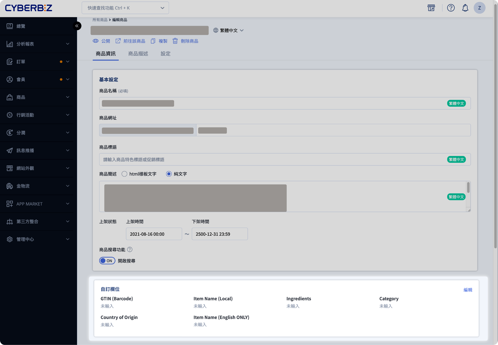
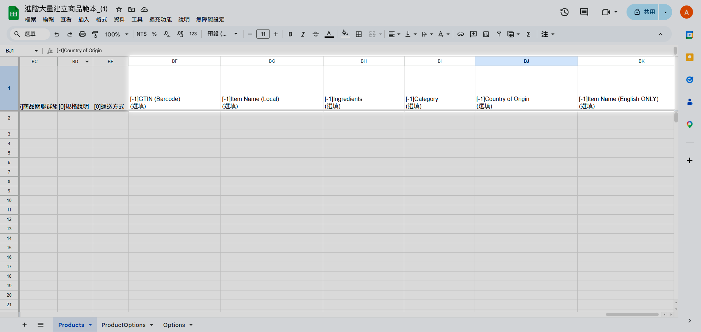

# 日到台跨境商品資訊設定
欲使用日到台站台物流服務，需補齊商品報關資訊。本指南詳解單筆與批次編輯 JANCODE、成分、原產國等欄位之操作。
{ .subtitle }

[:lucide-layers:{ title="適用產品" }](../../resources/conventions#適用產品) | 跨境電商 (日到台)
{ .doc-badge }

欲使用 **日到台** 站台物流服務，所有參與跨境銷售的商品必須補齊以下報關資訊：

| 欄位名稱 | 欄位資訊 | 填寫語言 | 填寫規則 |
| ------- | -------- | ------- | ------- |
| **GTIN(Barcode)** | JANCODE | 日文 | 必填 |
| **Item Name(Local)** | 商品名稱 | 日文 | 必填 |
| **Ingredients** | 成分 | 日文 | 必填 |
| **Category** | 品目說明 | 日文 | 必填 |
| **Country of Origin** | 原產國 | 日文 | 必填 |
| **Item Name(English ONLY)** | 商品名稱 | 英文(標點符號須為半形) | EXPRESS 宅配：無須填寫 EMS 物流：必填 | 

## 編輯方式

=== "單筆編輯"

    前往 **商品 > 所有商品** ，進入明細頁填寫。

    { .screenshot }

=== "批次編輯"

    1. [匯出商品 Excel](../../products/bulk-operations/excel-import-products/#下載-excel-範本或匯出商品)。
    2. 填寫報關用對應欄位，儲存檔案。
    3. [匯入商品 Excel](../../products/bulk-operations/excel-import-products/#匯入-excel-檔案)，完成批次編輯。

    { .screenshot }
