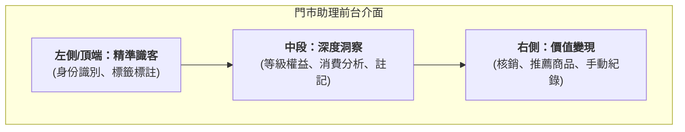

# 門市助理
專為線下門市設計的 OMO 銷售工具，整合官網會員數據與資產，協助店員實現精準識客、深度洞察與價值變現。
{ .subtitle }

[:lucide-tag:{ title="適用方案" }](../../resources/conventions#適用方案) | 所有 PLUS / 企業
{ .doc-badge }

門市助理是連接線下門市與線上官網的核心橋樑。透過平板或手機，門市人員可以即時調取會員在全通路的消費軌跡與優惠資產，將「過路客」轉化為「品牌鐵粉」，並透過導購連結確保每一筆努力都能獲得業績歸因。

---

## 介面切割導覽 (Interface Overview)

門市助理的前台介面設計遵循「由淺入深、由左至右」的銷售邏輯，分為三個核心操作區域：

1.  **精準識客 (左側/頂端)**：用於快速確認顧客是誰、有哪些特徵標籤。
2.  **深度洞察 (中段)**：提供數據支持，了解顧客的購買力、偏好以及目前擁有的權益。
3.  **價值變現 (右側)**：執行最終的成交動作，包含資產核銷、生成推薦連結或紀錄線下消費。

---

## 教學文件導覽

請根據您的操作需求，選擇對應的教學章節：

### 基礎建置與入會

- :lucide-user-plus:{ .lg }
  __註冊與綁定門市會員__
  引導顧客掃碼入會，並建立門市人員與顧客的推薦綁定關係。 
  [查看文件](搜尋與建立會員.md)

### 會員經營與數據應用

- :lucide-search:{ .lg }
  __01. 精準識客__
  身份識別與標籤應用。快速確認 VIP 等級，掌握顧客特徵。 
  [查看文件](會員身份識別.md)

- :lucide-bar-chart-3:{ .lg }
  __02. 數據洞察__
  消費概況與權益分析。分析歷史訂單與購物車，發掘潛在需求。 
  [查看文件](會員數據智庫.md)

- :lucide-shopping-cart:{ .lg }
  __03. 成交引導__
  資產核銷與商品推薦。執行點數/優惠券折抵，生成導購連結。 
  [查看文件](導購轉化.md)

### 績效追蹤與報表

- :lucide-file-text:{ .lg }
  __查看門市與個人業績報表__
  追蹤導購業績、線下消費紀錄與個人績效達成狀況。 
  [查看文件](查看業績.md)

---

!!! info "下一步建議"
    如果您是第一次使用，建議先閱讀 [搜尋與建立會員](搜尋與建立會員.md)，了解如何將顧客帶入您的 OMO 體系。
