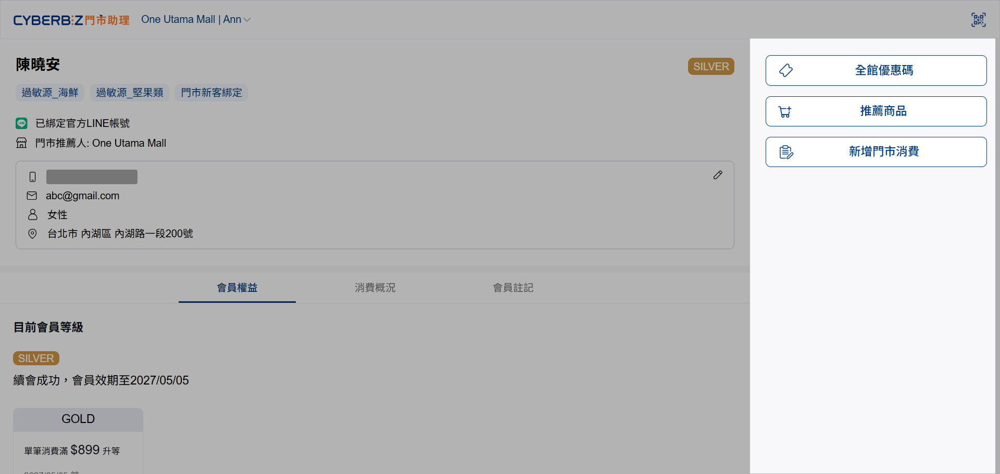
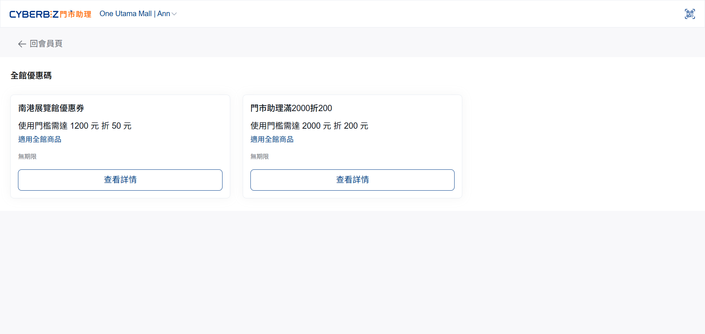
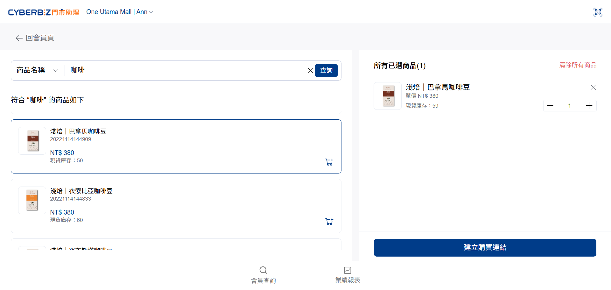
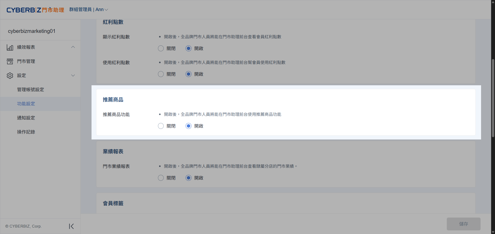
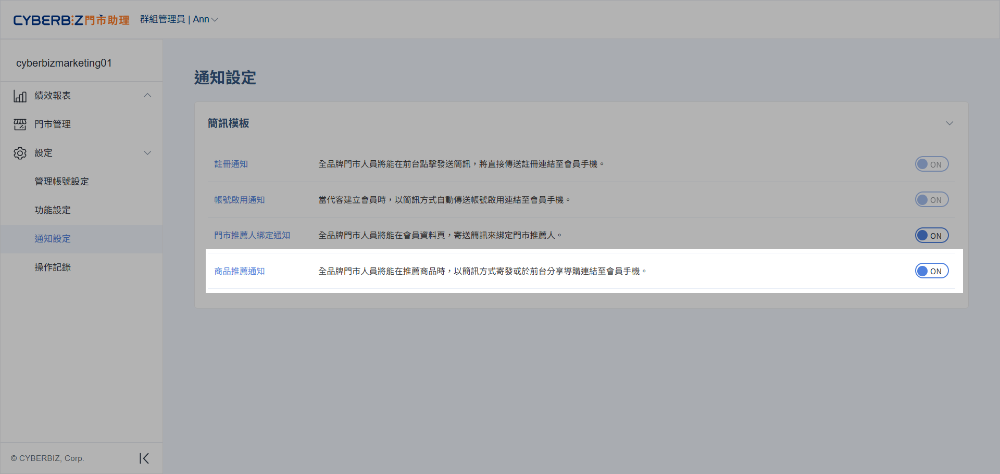
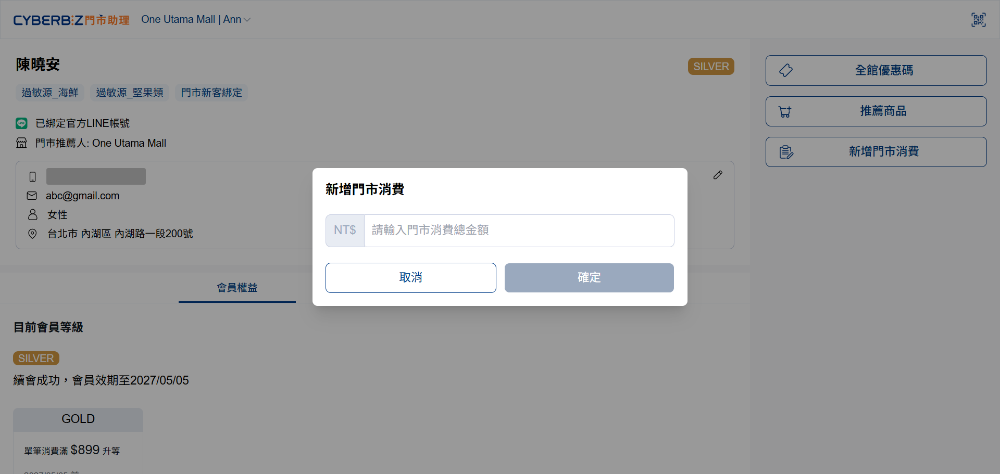
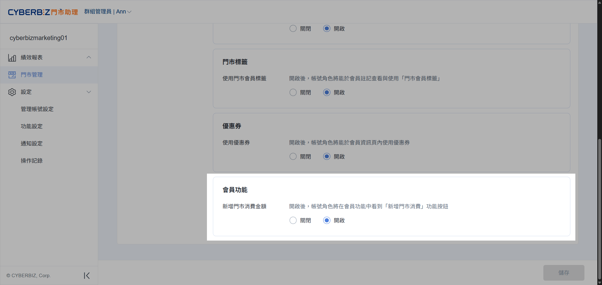
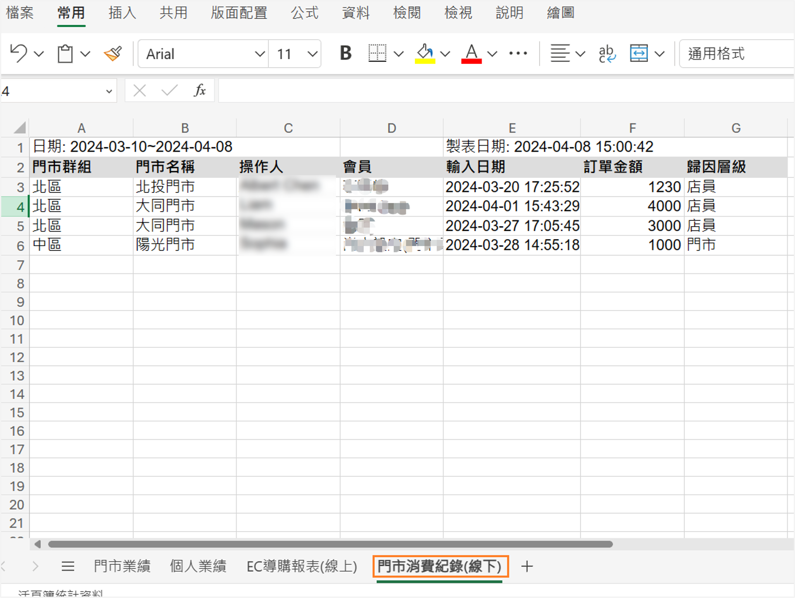

# 導購轉化
運用資產核銷、推薦商品連結與手動紀錄門市消費，直接促成現場成交並確保業績精準歸因。
{ .subtitle }

[:lucide-tag:{ title="適用方案" }](../../resources/conventions#適用方案) | 所有 PLUS / 企業
{ .doc-badge }

!!! tip "應用情境"
    - **現場資產即時變現**：引導顧客使用即將到期的紅利或優惠券，增加購買意願。
    - **離店導購業績歸因**：當顧客現場猶豫時，生成專屬推薦連結供其回家考慮，後續線上成交仍能自動認列為您的業績。
    - **無 POS 門市績效追蹤**：在未串接 POS 的快閃店或特賣會，手動紀錄消費金額，確保門市績效與會員權益同步。

## 操作流程

此模組位於介面右側，提供直接促成交易的操作工具。

{ .screenshot }

### 全館優惠碼

門市人員可協助會員核銷個人資產（紅利、優惠券），或提供全館通用的優惠碼供顧客參考。

=== "門市助理前台"

	1. 點擊前台首頁的 **全館優惠碼**，或在 **會員權益** 中點選 **更多優惠券**。

		> **使用限制**：全館優惠碼僅供門市人員參考，使用前須人工確認是否符合活動門檻。

	2. 點選優惠券下方的 **查看詳情**，查看詳細資訊後點擊 **確定**。系統將跳出二次確認，再次點選 **確定** 即完成核銷。

	{ .screenshot }

=== "門市助理後台"

	- **顯示開關**：前往 **設定 > 功能設定 > 前台功能設定**，可設定是否在介面上隱藏紅利點數、優惠券或全館優惠碼資訊。

		{ .screenshot }

	- **優惠券核銷權限**：前往 **門市管理**，選擇指定門市，點擊 **角色與權限** 頁籤，設定是否開放店員執行 **優惠券核銷**。

		{ .screenshot }
	

=== "官網 (EC) 連動"

	- **即時扣除**：前台核銷後，EC 後台的優惠券數量將 -1 且 **無法復原**。
	- **紀錄同步**：核銷紀錄將同步更新於 EC 後台的會員資料與訂單紀錄中。

	
### 推薦商品

此功能供門市人員快速生成官網商品的專屬推薦連結，分享給會員以引導至線上購買，並自動完成業績歸因。

=== "門市助理前台"

	1. 進入會員資訊頁，點擊 **推薦商品**。
	2. 搜尋商品：支援透過 **商品名稱**（模糊搜尋）或 **SKU**（精準搜尋）查找。
	3. 加入商品：選定後點擊商品。
	4. 建立連結：點擊 **建立購買連結**，系統將自動產生專屬連結。
	5. 分享方式：可選擇出示 **QR Code**、**發送簡訊** 或 **複製連結**。

	{ .screenshot }

=== "門市助理後台"

	- **推薦商品開關**：前往 **設定 > 功能設定 > 前台功能設定**，設定是否開放此功能。

		{ .screenshot }
	
	- **簡訊發送設定**：前往 **設定 > 通知設定**，可獨立開啟或關閉推薦商品的簡訊發送功能。

		{ .screenshot }

=== "官網 (EC) 連動"

	- **自動歸因**：透過此連結產生的官網訂單，系統將自動將業績歸因為該操作人員，並記錄於 **訂單 > 所有訂單**。
	- **訂單來源**：後台訂單明細中會顯示該筆訂單來自門市助理推薦。

### 新增門市消費

此功能供門市人員在未串接 POS 的情況下，手動紀錄會員在線下的消費金額，以累積會員等級權益並追蹤門市績效。

=== "門市助理前台"

	1. 點擊 **新增門市消費**。
	2. 輸入該筆交易的 **結帳金額**。
	3. 點擊 **確定** 並再次確認資訊無誤後，點擊 **確定新增**。

	{ .screenshot }

	!!! note "功能限制"
		目前僅支援紀錄 **消費總額**，無法紀錄具體的商品品項或明細。

=== "門市助理後台"

	- **編輯權限**：前往 **門市管理**，選擇指定門市，點擊 **角色與權限** 頁籤，設定是否開放店員執行 **新增門市消費**。

		{ .screenshot }

	- **業績報表**：管理者可於 **績效報表 > 業績報表**，匯出所有門市總表，於 **門市消費紀錄** 頁籤，查看所有手動輸入的門市消費紀錄。

		> 亦可前往 **門市管理**，選擇指定門市，點擊 **匯出報表**，匯出指定門市報表。
		
		{ .screenshot }
	

=== "官網 (EC) 連動"

	- **訂單紀錄**：手動輸入的消費將同步至 EC 後台的 **會員 > 所有會員 > 個別會員頁 > 其他通路訂單**。
	- **欄位對照**：後台將顯示成立時間、金額、資料來源、通路名稱與操作人員。
	- **會員權益**：此金額將計入會員的累積消費，進而觸發 [VIP 升等]() 或 [續會]() 邏輯。

	!!! tip "消費者權益維護"
		消費者可登入官網，在 **會員中心 > 訂單查詢 > 其他通路有效訂單** 中查看線下消費紀錄，確保權益已成功累積。

## 常見問題

??? quote "若門市助理與 POS 系統未串接，該如何處理優惠碼折抵的結帳作業？"
	當您使用門市助理進行線上優惠碼或優惠券折抵，且後續須配合 POS 系統結帳時，請遵循以下步驟：

	- **建立對應折扣項**：請預先於自家 POS 系統中建立專屬的 **折扣條碼**。
	- **確保資料一致**：結帳時掃描該折扣條碼，以利後續帳務資料的查核與比對。
