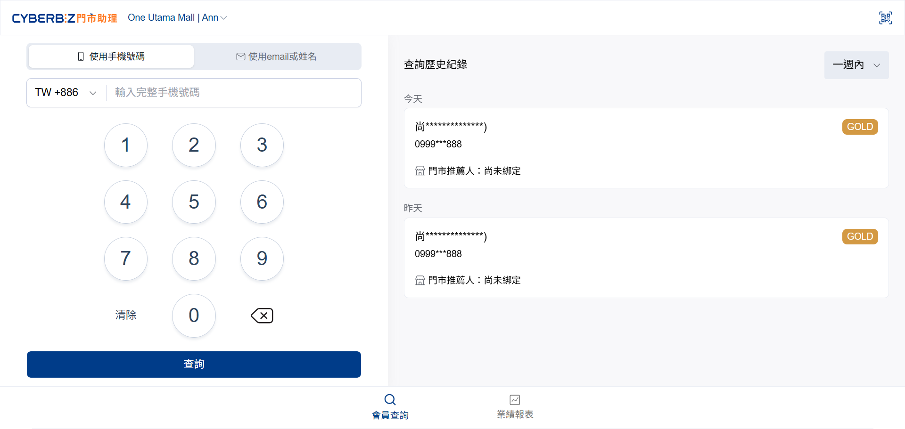
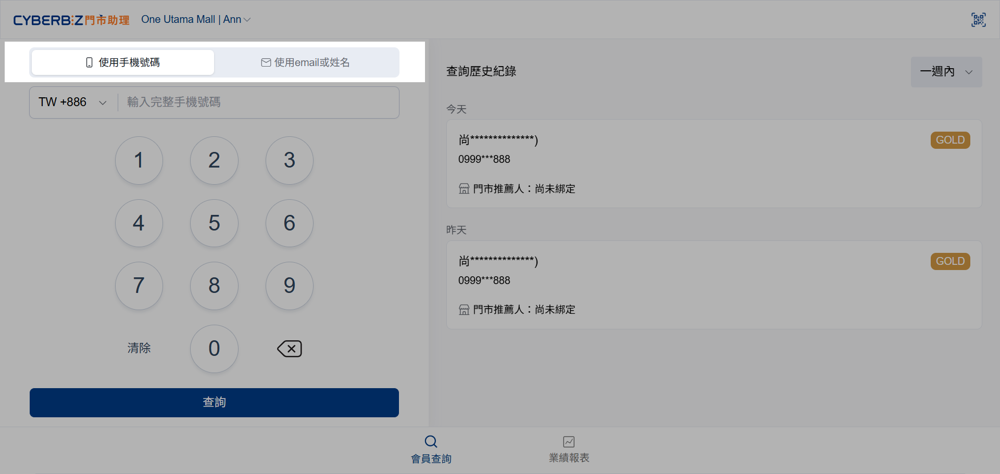
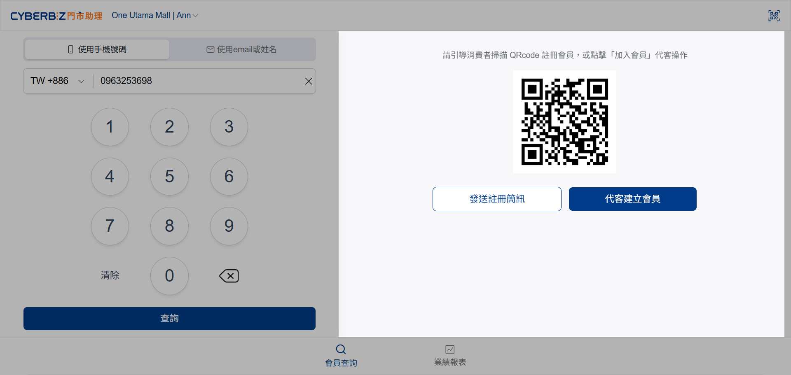
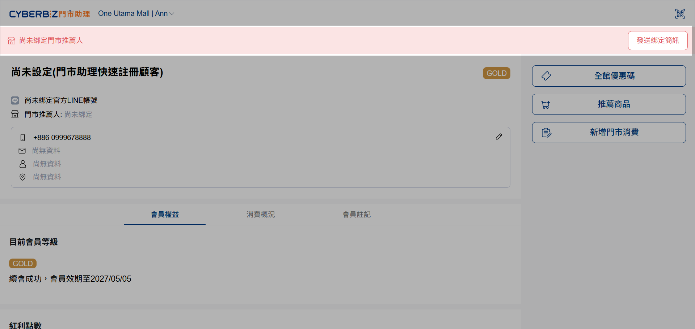
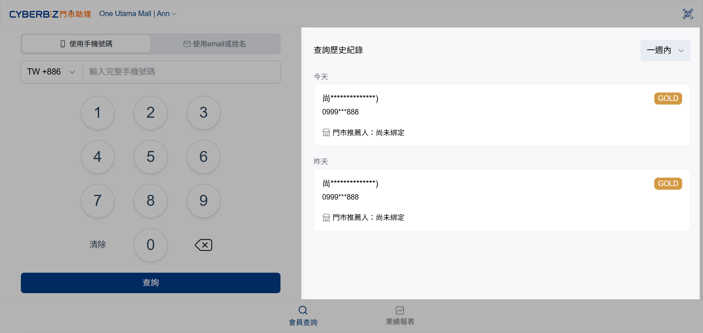

# 搜尋與建立會員
線下人員可透過門市助理查詢會員資訊、協助顧客註冊帳號，並建立門市推薦人綁定關係以進行後續導購分潤。
{ .subtitle }

[:lucide-tag:{ title="適用方案" }](../../resources/conventions#適用方案) | 所有 PLUS / 企業
{ .doc-badge }

{ .hero-page }

## 使用須知

- 建議具備 LINE Certified Provider 資格，以實現掃碼同時加入 LINE 好友與註冊。
- 操作前請確認已完成 [安裝與前期資料設置]()。

## 操作流程

### 查詢會員與快速註冊

1. 進入門市助理前台，選擇 **使用手機號碼** 或 **使用 Email 或姓名** 搜尋會員。

	{ .screenshot }

2. 根據查詢結果執行對應動作：

	=== "手機號碼查無資訊"

		加入會員，引導顧客完成註冊並完成綁定。

	=== "查無 Email 或姓名資訊"

		若查無 Email 或姓名資訊，請輸入手機號碼，加入會員。

		> 僅支援使用手機號碼加入會員，姓名與信箱僅供查詢用。

3. 系統提供以下 3 種彈性方式，將一般消費者加入品牌會員：

	=== "掃描 QRCode"

		門市人員可出示 QRCode，引導消費者掃描加入會員，並綁定門市推薦人。

		!!! tip "製作門市專屬 QRCode 立牌"
			**店長** 可至門市助理後台下載並列印 [門市人員專屬 QRCode]()。將其製作成識別立牌交予店員，以便顧客掃描並綁定人員，進行後續業績追蹤與績效認列。

	=== "發送註冊簡訊"

		點擊 **發送註冊簡訊**，直接傳送註冊連結至會員手機，請引導會員開啟簡訊並點擊連結，完成註冊。

		> 簡訊費用由商家負擔，簡訊模板目前為固定格式。

	=== "代客建立會員"

		若消費者不便現場操作，可點擊 **代客建立會員**。系統將立即建立會員帳號並自動跳轉至資訊頁，大幅縮短入會等待時間。

		!!! tip "後續導引"
			建議門市人員點選上方 **發送綁定簡訊**，引導顧客於手機完成完整註冊，以利後續業績追蹤與會員權益認列。

	{ .screenshot }
	
4. 進入會員資訊頁後，根據會員身分執行對應動作：

	=== "已是會員但未驗證手機"

		當會員僅有 Email 資訊時，店員需先引導會員至官方網站登入並進行手機驗證，才能進行門市推薦人綁定。

	=== "已是會員但未綁定門市推薦人"

		點擊 **發送綁定簡訊**，引導顧客完成門市推薦人綁定。

		{ .screenshot }

	=== "已是會員且已綁定"

		直接查看會員權益、消費紀錄、持有紅利與優惠券。

### 查詢歷史紀錄

1. 前往右側 **查詢歷史紀錄** 區塊。
2. 選擇 **時間區間**，查看過去曾跳轉至會員資訊頁的查詢名單。

{ .screenshot }

