# 會員數據智庫
深入分析會員的消費歷史、VIP 等級與現有資產，運用數據洞察輔助銷售決策與湊單引導。
{ .subtitle }

[:lucide-tag:{ title="適用方案" }](../../resources/conventions#適用方案) | 所有 PLUS / 企業
{ .doc-badge }

!!! tip "應用情境"
    - **精準湊單引導**：查看顧客距離下一級 VIP 的金額，主動提供湊單建議，提升客單價。
    - **購物車挽回銷售**：發現顧客線上購物車有未結商品時，可主動詢問是否需要現場試穿或體驗，縮短成交路徑。
    - **建立專屬服務紀錄**：透過會員註記功能，紀錄顧客的特殊偏好（如：不喜歡香味、對特定材質過敏），讓服務更貼心。

## 操作流程

此模組位於介面中段，提供多維度的數據分析以輔助銷售決策。

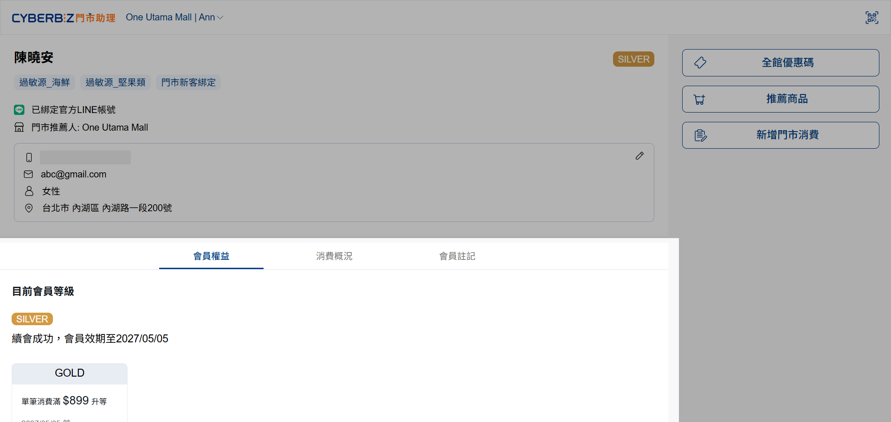{ .screenshot }

### 會員權益

此分頁整合會員在官網的等級狀態與資產，門市人員可根據此數據進行精準銷售或協助核銷。

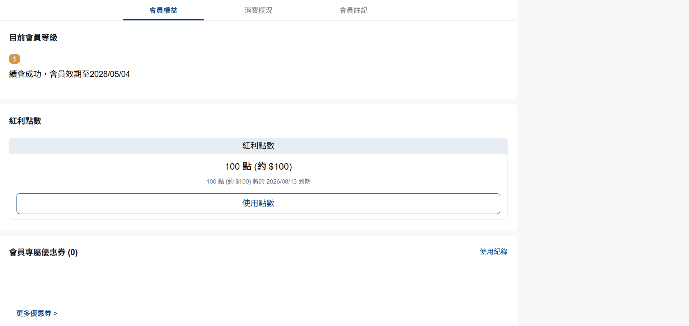{ .screenshot }

#### 查看會員等級與權益

=== "門市助理前台"

	##### 數據指標

	- **目前等級**：顯示會員目前的 VIP 等級、效期與紅利倍數。
	- **升等進度**：顯示距離下一等級的累積消費金額，可作為引導顧客 **湊單升等** 的談資。

	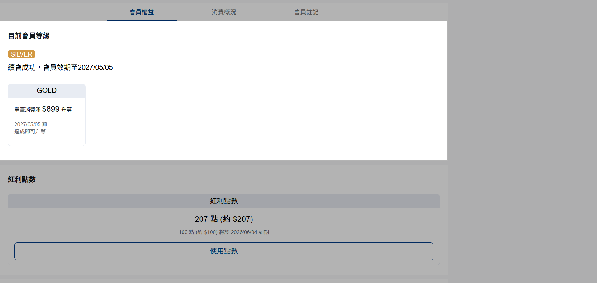{ .screenshot }

=== "官網 (EC) 連動"

	##### VIP 等級同步
	
	前台顯示的等級與升等條件，與 **會員 > VIP 設定** 的 VIP 制度同步。

	!!! warning "VIP 版本相容性須知"
		門市助理僅支援套用官網新版 VIP，舊版 VIP 不適用。

#### 現場折抵與核銷

=== "門市助理前台"

	##### 常見操作

	- **資產明細**：即時查看會員擁有的紅利點數、專屬優惠券。
	- **紅利折抵**：點擊 **使用點數**，輸入折抵金額並確認，系統將即時扣除點數。
	- **優惠券核銷**：點選優惠券旁的 **可使用**，點擊 **確定** 即可完成核銷（此動作不可逆）。
	- **核銷紀錄**：點擊 **使用紀錄**，可查看由門市助理端核銷的優惠券紀錄，包含名稱、折扣內容、使用通路與日期。

	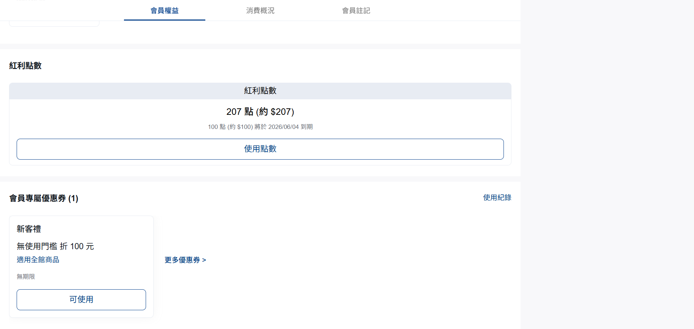{ .screenshot }

=== "門市助理後台"

	##### 顯示開關
	
	前往 **設定 > 功能設定 > 前台功能設定**，可選擇是否在介面上隱藏紅利點數或優惠券資訊。

	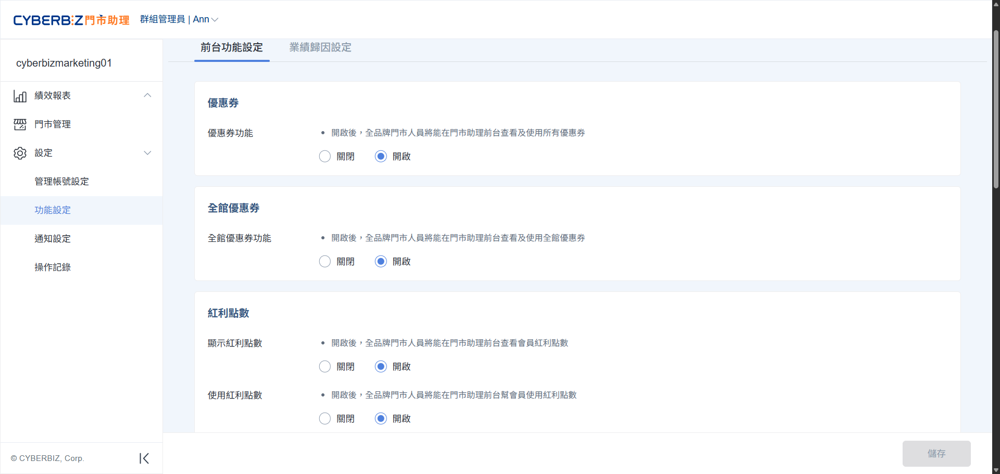{ .screenshot }

	##### 優惠券核銷權限
	
	前往 **門市管理**，選擇指定門市，點擊 **角色與權限** 頁籤，設定是否開放店員執行 **優惠券核銷**。

	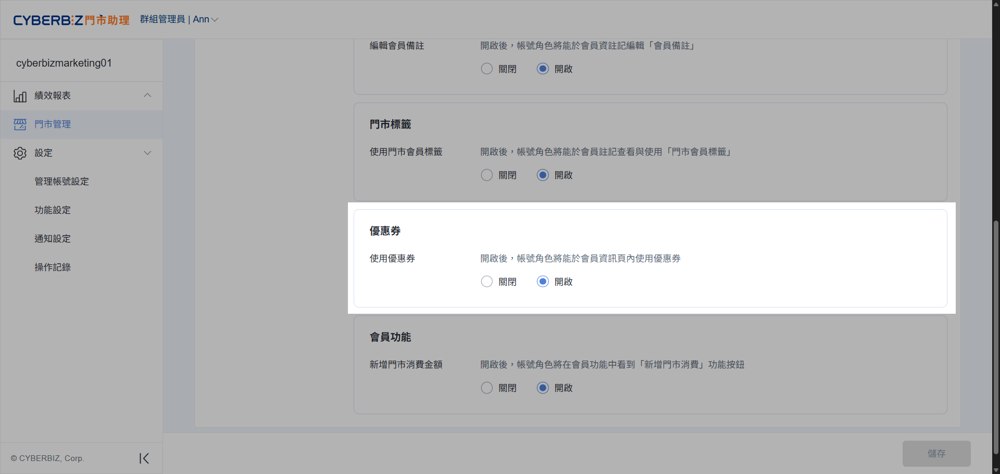{ .screenshot }

=== "官網 (EC) 連動"

	##### **行銷活動套用**
	
	如果您的商店有設定以下幾種優惠券，門市人員將可於此查看與使用。

	- 任務型優惠券

		- [新客禮]()
		- [首購禮]()
		- [生日禮]()
		- [分享註冊推薦人]()
		- [VIP 會員日、VIP 升等禮、VIP 生日禮]()

	- 消費獲得的優惠券

		- [指定商品送優惠券]()
		- [全館折扣]() 滿額送優惠券
		- [互動遊戲]() 送優惠券

	##### 資產異動紀錄
	
	前台核銷的紅利與優惠券，將同步更新於 EC 後台的 [會員資料]() 中。
		

### 消費概況

此分頁提供會員在官網的歷史消費行為分析，門市人員可藉此建立會員輪廓，進行精準的商品推薦。

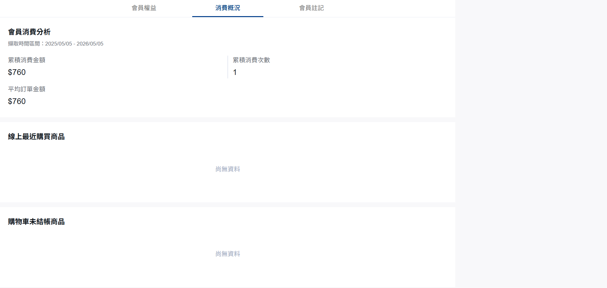{ .screenshot }

#### 會員消費分析

=== "門市助理前台"

	##### 數據指標

	系統自動回推 **查詢當日起算一年內** 的消費數據，幫助門市人員判斷會員的購買力與活躍度：

	- **累積消費金額**：該會員在官網的總實付金額。
	- **累積消費次數**：該會員在官網的成功訂單總數。
	- **平均訂單金額**：系統自動計算之客單價，反映會員的單次消費偏好。

=== "官網 (EC) 連動"

	##### 數據同步來源
	
	前台顯示的分析數據與 **訂單 > 所有訂單** 同步。

	> 僅計算 **有效訂單**，已取消或退貨之訂單不計入累積金額與次數。

#### 最近購買商品與購物車

=== "門市助理前台"

	##### 數據指標

	- **線上最近購買商品**：顯示回推一年內最近購買的 **10 筆** 商品（重複商品僅列計一次），並依日期由近到遠排序。
	- **購物車未結商品**：即時顯示會員已加入官網購物車但尚未結帳的商品圖片與名稱。

	!!! tip "銷售應用建議"
		若發現會員購物車內有未結商品，門市人員可主動詢問是否需要現場試用或直接在門市購買，縮短成交路徑。

=== "官網 (EC) 連動"

	##### 數據同步來源

	- **最近購買商品**：對應 EC 後台該會員的 **訂單紀錄**。
	- **購物車資訊**：對應 EC 前台 **購物車內容**。

	!!! warning "數據範圍限制"
		消費概況之資料來源 **僅限線上 EC 訂單**，不包含線下 POS 購買紀錄。

### 會員註記

此分頁供門市人員紀錄並查看會員在線下的消費特徵與偏好，實現線上線下資訊的無縫整合。

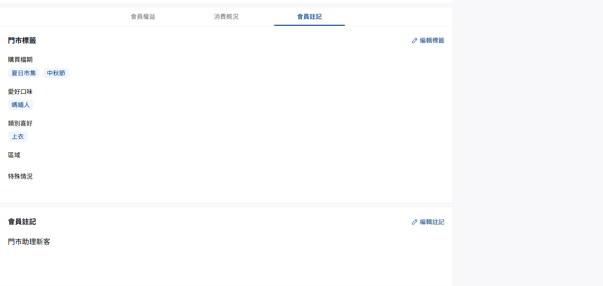{ .screenshot }

#### 門市標籤與文字註記

=== "門市助理前台"

	##### 紀錄類型

	- **門市標籤**：查看並更新總部預設的線下 **群組標籤**。
	- **會員註記**：查看並編輯與 EC 會員備註同步的 **文字資訊**。
	
	##### 操作步驟

	1. 點擊 **編輯標籤** 或 **編輯註記**。
	2. 根據現場觀察勾選標籤或輸入文字描述。

	    

		- 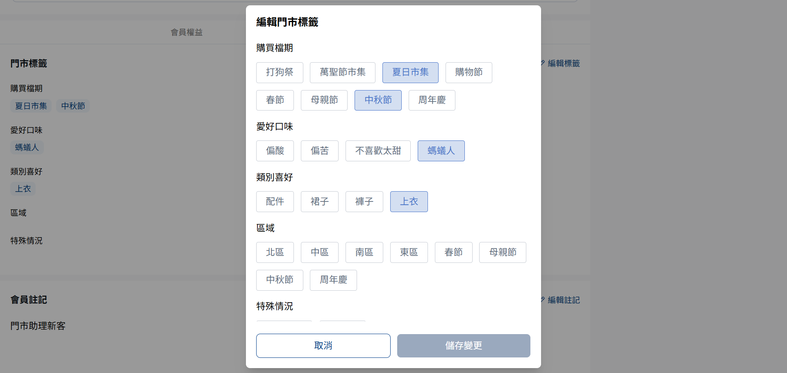{ title="門市標籤" }
		- 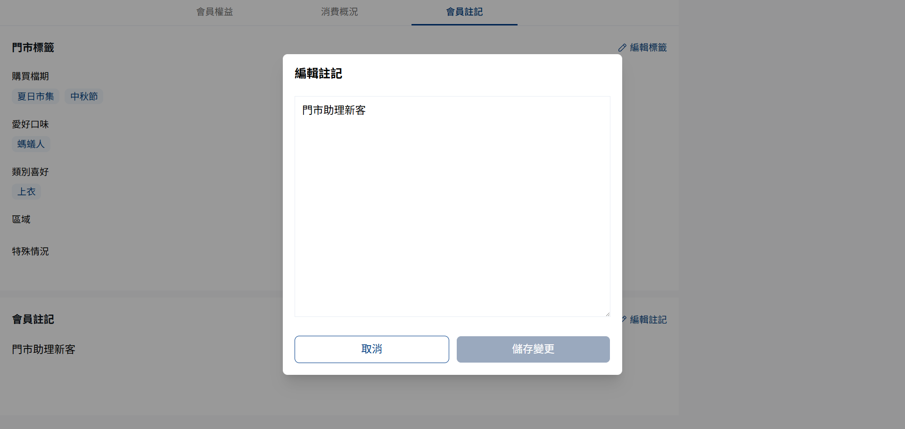{ title="會員註記" }

		

	3. 點擊 **儲存變更**，資訊將即時同步至全品牌門市與官網後台。

=== "門市助理後台"

	##### 標籤內容設定
	
	前往 **設定 > 功能設定 > 前台功能設定**，總部可預先定義標籤群組（至多 5 個群組，每組至多 10 個標籤）。

	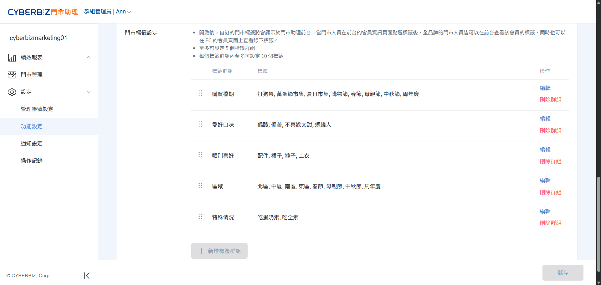{ .screenshot }

	##### 編輯權限控管
	
	前往 **門市管理**，選擇指定門市，點擊 **角色與權限** 頁籤，設定是否開放店員編輯標籤與註記。

	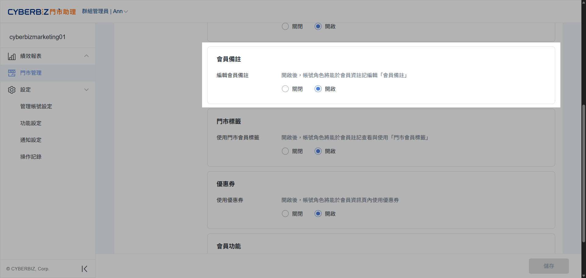{ .screenshot }

=== "官網 (EC) 連動"

	##### 雙向同步機制
	
	前台的 **會員註記** 與 EC 後台的 **會員 > 所有會員 > 個別會員頁 > 會員備註** 完全同步，任一端修改皆會覆蓋舊有內容。
	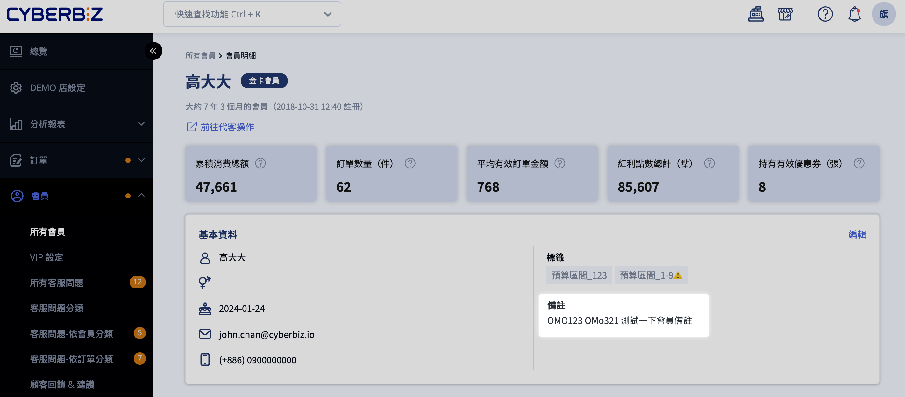{ .screenshot }
	
	##### 再行銷應用
	
	門市人員標註的標籤會回傳至 EC 系統，總部可依此進行精準的 EDM 或簡訊再行銷。

!!! note "使用須知"
	門市標籤權限預設為 **關閉**，若需使用此功能，請務必先於門市助理後台手動開啟。
