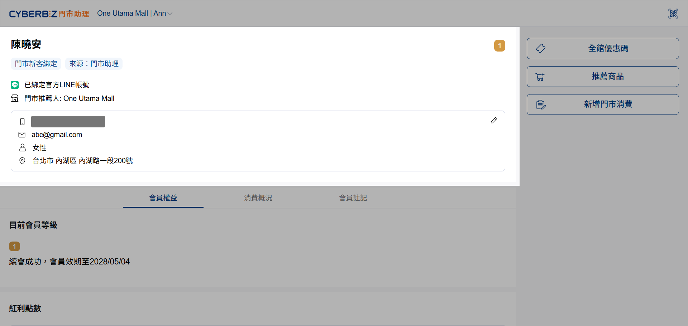
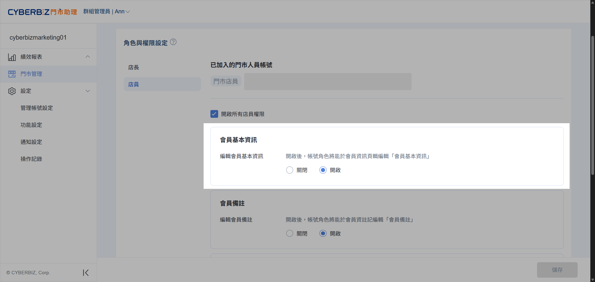
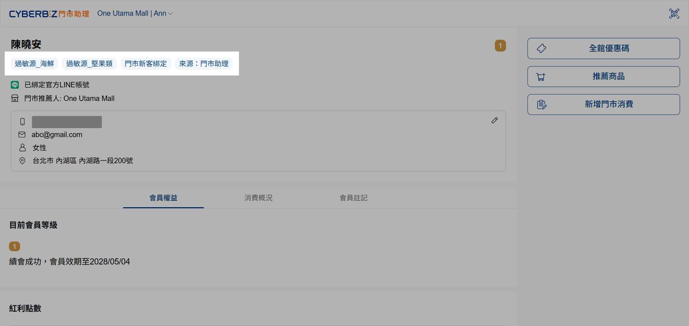
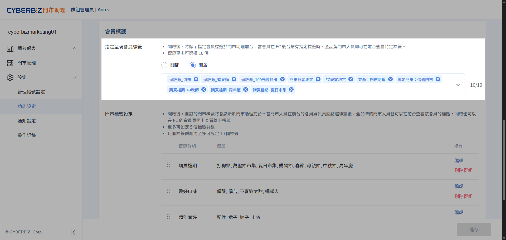

# 會員身份識別
透過門市助理快速識別會員身份，掌握標籤特徵，提供個人化的現場服務與招呼。
{ .subtitle }

[:lucide-tag:{ title="適用方案" }](../../resources/conventions#適用方案) | 所有 PLUS / 企業
{ .doc-badge }

!!! tip "應用情境"
    - **第一時間精準招呼**：顧客進店時，快速確認其 VIP 等級與標籤（如：常客、偏好特定品類），給予最親切的問候。
    - **即時完善會員資料**：在對談中發現資訊缺漏或錯誤時，可立即為顧客更新，確保行銷資料的準確性。

## 操作流程

此模組位於介面頂端，用於確認會員身份並同步線下收集的特徵。

{ .screenshot }

### 查看與編輯基本資料

=== "門市助理前台"

	1. 進入會員資訊頁，可查看姓名、手機、性別、生日等基礎資訊。
	2. 點擊右上角 **編輯** 圖示，可更新除手機號碼外的會員資料。

		> 手機號碼屬於經過驗證的資料，門市人員無法自行更改

	3. 點擊 **儲存變更**。

	{ .screenshot }

=== "門市助理後台"

	**權限設定**：前往 **門市管理**，選擇指定門市，點擊 **角色與權限** 頁籤，設定店員是否具備 **編輯會員基本資料** 權限。

	{ .screenshot }

=== "官網 (EC) 連動"

	**資料同步**：前台編輯的資料會即時更新於 **會員 > 所有會員**。

### 識別會員標籤

=== "門市助理前台"

	1. 會員名稱下方將自動帶出由總部篩選、授權顯示的 **會員標籤**。
	2. 門市人員可透過標籤快速判斷會員屬性，提供對應的服務內容。

	{ .screenshot }

=== "門市助理後台"

	**顯示類型篩選**：前往 **設定 > 功能設定**，下滑至 **會員標籤** 區域，選取要在前台顯示的標籤項目（至多 10 個）。

	{ .screenshot }

=== "官網 (EC) 連動"

	**標籤來源**：前台顯示的標籤源自 EC 後台的會員標籤系統，供總部進行再行銷篩選。

	{ .screenshot }