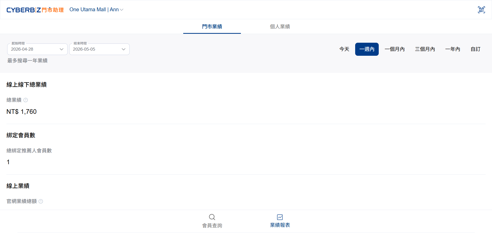
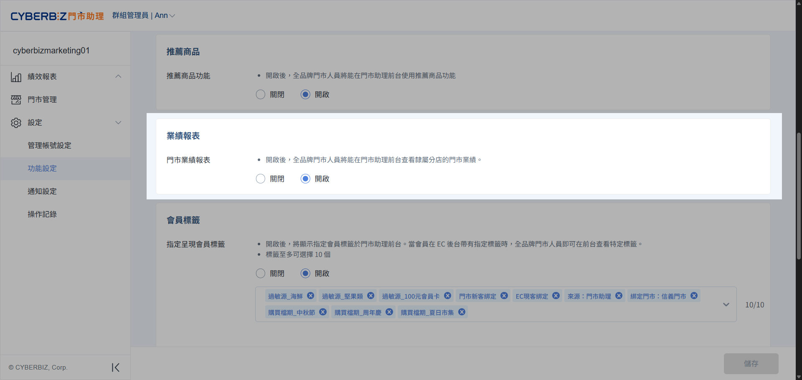

# 查看業績
門市店長與店員可透過業績報表，快速掌握特定時間區間內的綁定會員數、線上與線下業績歸因資料。
{ .subtitle }

[:lucide-tag:{ title="適用方案" }](../../resources/conventions#適用方案) | 所有 PLUS / 企業
{ .doc-badge }

{ .hero-page }

!!! tip "應用情境"
	- **績效追蹤**：門市人員即時查看個人今日或本月的導購業績。
	- **門市管理**：店長分析各店員的綁定會員數與業績貢獻度。
	- **決策優化**：根據線上與線下業績佔比，調整門市推廣策略。

## 使用須知

- **資料來源**：報表資料包含線上與線下總業績歸因，可依需求選擇時間區間。
- **權限差異**：
    - **店長**：可查看 **門市業績** 與 **個人業績**。
    - **店員**：預設僅能查看 **個人業績**，需經後台授權方可查看門市業績。

## 操作流程

=== "門市助理前台"

	### 查看業績報表
	
	1. 進入門市助理前台首頁，點擊下方的 **業績報表**。
	2. 切換分頁查看資訊：
	
		| 分頁名稱 | 顯示內容 | 適用對象 |
		|----------|----------|----------|
		| **門市業績** | 門市總綁定數、各店員業績排名、線上/線下業績歸因 | 店長 獲授權店員 |
		| **個人業績** | 個人總綁定數、個人線上/線下業績歸因 | 所有門市人員 |

	3. 點擊右上角 **時間區間** 篩選特定日期的資料。
	4. 點選欄位旁的 **問號 (?)** 圖示，系統將顯示該業績項目的詳細定義。

=== "門市助理後台"

	### 開放店員查看門市業績
	
	1. 登入門市助理後台，前往 **設定 > 功能設定 > 前台功能設定**。
	2. 找到 **業績報表** 區塊，將 **門市業績報表** 功能切換為 `開啟`。
	3. 點擊 **儲存**，完成權限更新。

	{ .screenshot }