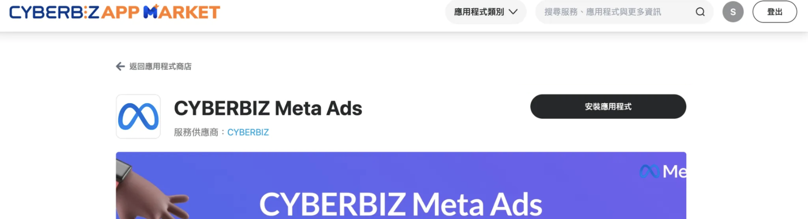
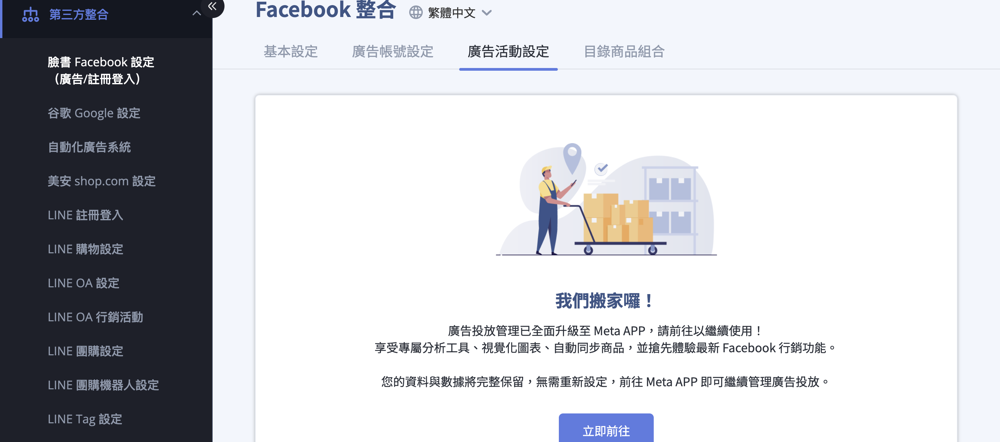

透過 CYBERBIZ 管理後台安裝 Meta Ads App。
{ .subtitle }

[:lucide-bolt:{ title="適用功能" }](../../resources/conventions#適用功能) | APP MARKET
{ .doc-badge }

{ .hero-page }

## Meta Ads App 說明

**Meta Ads App** 是位於 CYBERBIZ 「APP MARKET」中的擴充功能，讓商家能直接在官網後台為電商官網創建並投放廣告至 Meta 平台（Facebook、Instagram 等），並隨時追蹤廣告表現。

## 安裝前置必要條件

在安裝 Meta Ads App 之前，請務必依序完成以下操作，否則系統會自動跳轉至對應設定頁：

- [x] **串接 [Meta 商業擴充套件](../integrations/fb/mbe/設定 FBE 帳號授權與資產連結.md){ data-preview }**：確保 EC 後台已與 Facebook 相關資產（粉專、像素、目錄）連結成功。
- [x] **建立 [Meta 廣告帳號](../integrations/fb/meta-ads/建立 Meta 廣告帳號並儲值.md){ data-preview }**：需先於後台建立專屬廣告帳號。
- [x] **完成 [廣告金儲值](../integrations/fb/meta-ads/建立 Meta 廣告帳號並儲值.md#儲值廣告金){ data-preview }**：商家需預先儲值廣告預算至後台方可開始投放（最低門檻為 NT$15,000）。

## 安裝步驟教學

1.  **進入設定頁面**：登入 CYBERBIZ 管理後台，前往 **「第三方整合」** > **「Facebook 整合 (廣告/註冊登入)」** > **「廣告活動設定」**。
2.  **啟動串接**：點擊頁面中的 **「前往串接」** 按鈕。

    

3.  **安裝應用程式**：
    *   進入 Meta Ads 說明頁面後，點擊 **「安裝應用程式」**。
    *   *註：若尚未串接商業擴充套件或建立廣告帳號，系統此時會自動引導您至該設定頁面。*

    

4.  **確認授權**：系統會導向確認頁面，請閱讀並 **同意相關隱私條款**，最後點擊 **「確認安裝」**。
5.  **完成安裝**：安裝完成後，可透過上述後台路徑點擊 **立即前往** 進入 Meta Ads App 介面，開始 [創建廣告活動](../integrations/fb/meta-ads/設定 Meta 廣告活動.md#創建廣告活動步驟){ data-preview } 或 [目錄商品組合](../integrations/fb/meta-ads/設定 Meta 廣告活動.md#廣告創意與商品組合設定){ data-preview }。

    

## 後續操作

- :lucide-megaphone:{ .lg }  
  [__Meta 廣告活動__](../integrations/fb/meta-ads/設定 Meta 廣告活動.md){ data-preview }  
  透過 Meta Ads App 設定廣告活動，直接在 EC 後台管理廣告預算、目標與素材。

- :lucide-shopping-basket:{ .lg }   
  [__Meta 廣告商品目錄__](../integrations/fb/meta-ads/設定 Meta 廣告的目錄商品組合.md){ data-preview }       
  設定廣告投放的商品組合，可透過標籤、廠商或類型篩選特定商品進行投放。

## 常見問題

??? quote "切換至 Meta Ads App 後，原本設定的廣告資料會消失嗎？"

    不會。改至 Meta Ads App 投放廣告後，原先在 EC 平台中設定好的廣告資料與設定都會 **妥善保留**，僅操作位置變更，不影響廣告執行。

??? quote "安裝時出現錯誤訊息該怎麼辦？"

    視錯誤類型處理方式不同：

    - 若畫面顯示 `internal server error` 或其他系統異常訊息，請先嘗試 **重新安裝**。若問題持續，請聯繫 CYBERBIZ 客服人員協助排查。
    - 若顯示「您沒有權限修改」等權限相關錯誤，請聯繫 CYBERBIZ 客服人員協助處理。

??? quote "為什麼 App 安裝成功卻無法創建廣告？"

    若 App 安裝成功但在「創建廣告」時失敗，通常與 Meta 資產權限有關。可嘗試手動將權限分享給 CYBERBIZ 企業管理平台。

