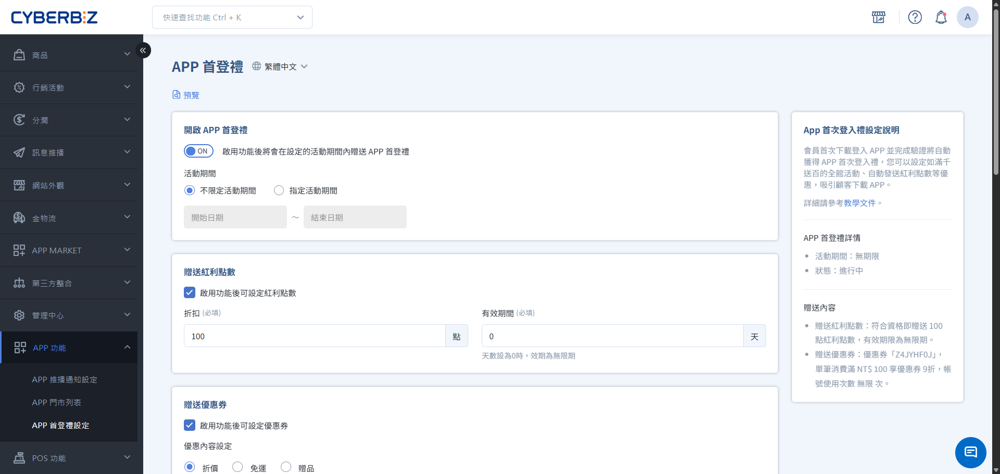
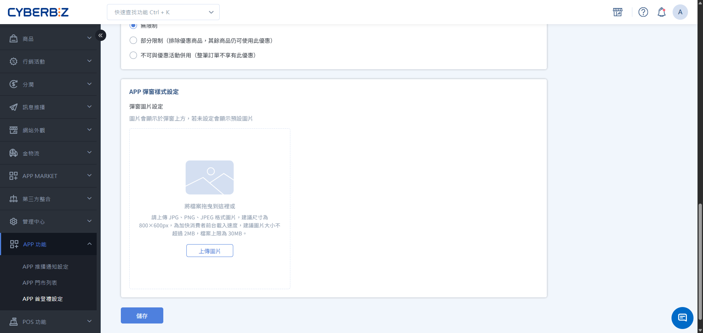
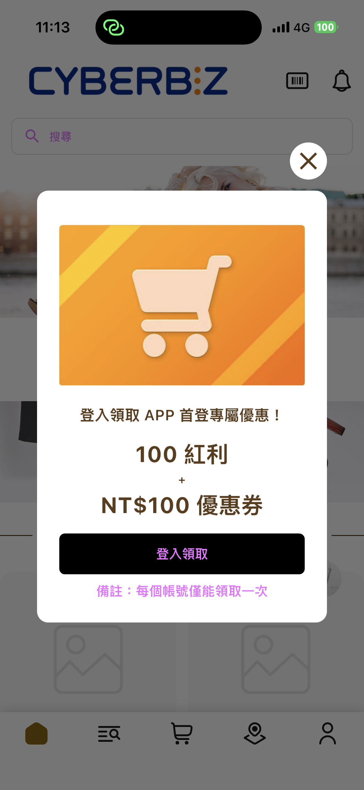
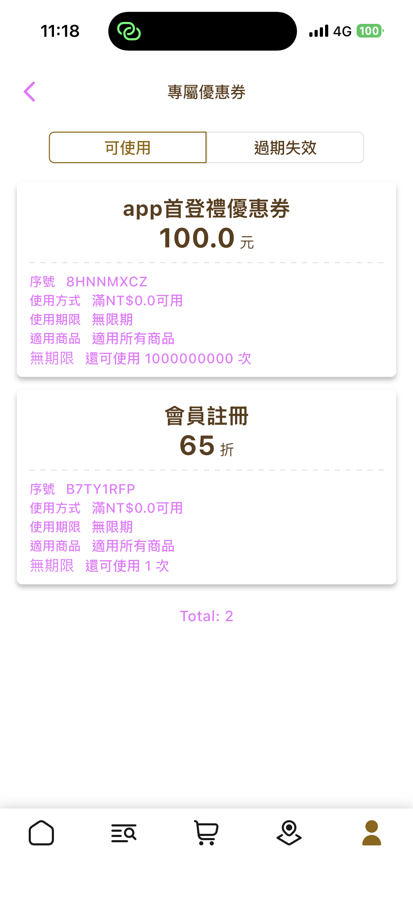
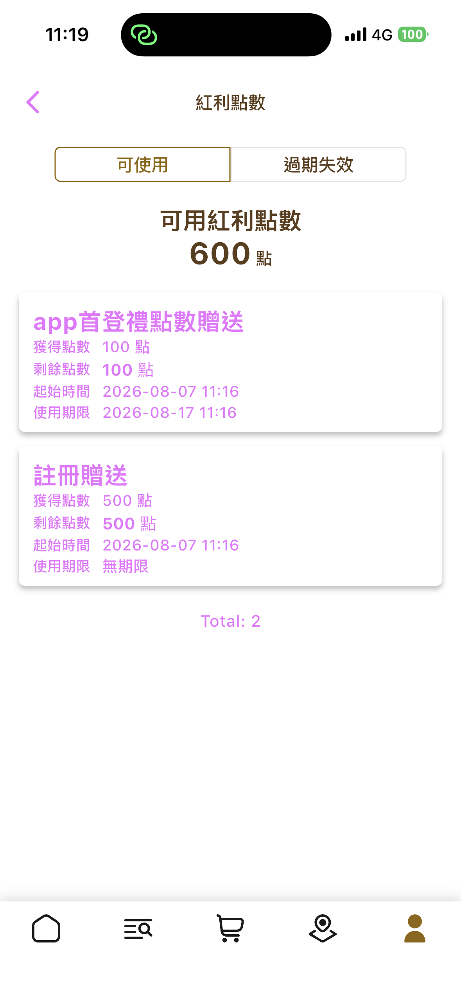
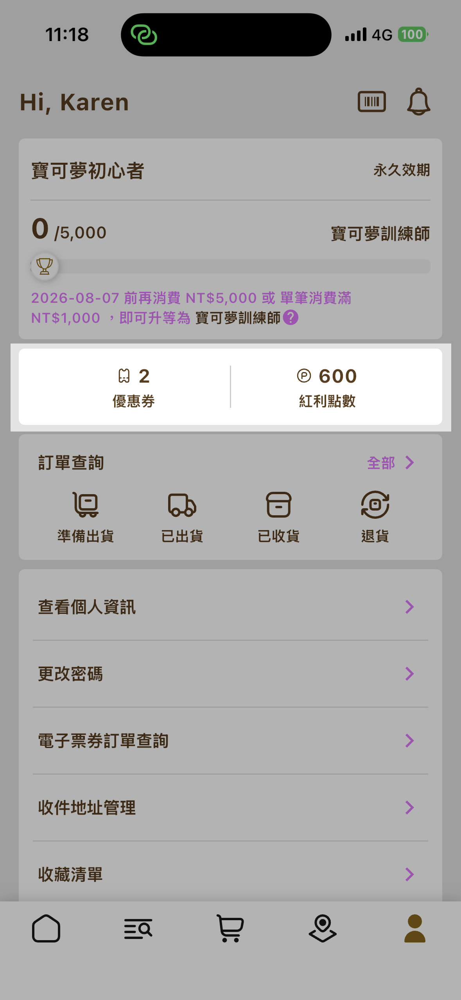

# 設定 APP 首登禮

設定會員首次於 CYBERBIZ APP 登入時自動發放的優惠券或紅利點數，提升 APP 下載與會員活躍。
{ .subtitle }

[:lucide-grid-2x2-plus:{ title="適用擴充" }](../../resources/conventions.md#適用擴充) | CYBERBIZ APP
{ .doc-badge }

!!! tip "應用情境"
    - **提升下載意願**：以實質優惠吸引會員下載並開啟品牌 APP。
    - **促進首次消費**：優惠券可設定使用門檻，引導完成購物。
    - **增加回訪誘因**：搭配紅利點數，鼓勵會員持續回購。

## 使用須知

- **與其他贈禮分開**：APP 首登禮依 **會員帳號首次於 APP 登入成功** 發放，與[期間限定首購禮](../marketing/bonus-and-gifts/limited-time-first-purchase-gift.md)、[註冊禮](../marketing/bonus-and-gifts/setup-registration-gift.md)為不同機制。
- **領取資格判定**：同時滿足以下條件時，系統於會員在 APP 登入成功後發放首登禮。

    1. 已開啟APP 首登禮總開關
    2. 該會員帳號為首次於 APP 登入
    3. 優惠券或紅利的分項開關至少一項已開啟

- **自動發放**：符合條件時系統自動發放，會員無需手動領取；登入失敗不觸發發放。
- **每人限領一次**：以會員帳號為單位，同一帳號僅可領取一次，與裝置數量無關。
- **贈送內容**：優惠券與紅利須至少擇一啟用，可擇一或同時發放。
- **使用通路**：發放後的優惠券與紅利不限裝置，亦可於官網（Web）結帳使用。
- **建議時機**：建議向顧客推廣下載 APP 前，先完成首登禮設定並啟用總開關，讓會員首次登入即可領到優惠，避免推廣期間尚無法發放。

## 操作流程

### 設定並啟用 APP 首登禮

1. 登入 CYBERBIZ 管理後台，前往 **APP 功能 > APP 首登禮**。
2. 將 **APP 首登禮總開關** 切換為開啟。
3. **設定活動期間**：可選擇無期限，或指定起迄時間（可設定未來時間）。
4. **設定贈送內容**：

    === "優惠券"
        開啟後設定使用門檻、有效期限、使用次數，以及與其他折扣的併用規則。

    === "紅利"
        開啟後設定贈送點數與有效期限。
    
    { .screenshot }

5. **上傳彈窗圖片**：作為會員開啟 APP 時的引導圖；未上傳時顯示系統預設圖。（選填）

    { .screenshot }

    !!! tip "彈窗說明"
        引導彈窗僅支援自訂圖片。功能啟用且會員尚未登入時，開啟 APP 會顯示此彈窗提示，引導會員登入領取首登禮。

        { .mini-image }

6. 點擊 **儲存**。

### 停用 APP 首登禮

1. 前往 **APP 功能 > APP 首登禮**。
2. 將 **APP 首登禮總開關** 切換為關閉。
3. 點擊 **儲存**。

!!! info "停用後的設定"
    關閉總開關後，活動停止發放；既有設定內容會保留，之後可再開啟並儲存即可恢復。

## 會員端領取流程

會員完成下列流程後，即可取得首登禮：

1. 下載並安裝品牌 CYBERBIZ APP。
2. **開啟 APP**：若商家已啟用首登禮功能，且商家尚未登入，系統將顯示引導彈窗。

    { .mini-image }

3. **完成登入**：系統判定該帳號首次於 APP 登入成功後，自動發放已啟用的優惠券／紅利。

4. **立即查看**：登入完成後，系統導向 **我的優惠券** / **我的紅利點數** 頁面，會員可於此確認已入帳的優惠券或紅利。

    === "優惠券"

        { .mini-image }

    === "紅利"

        { .mini-image }

    !!! tip "手動查詢"
        會員亦可自行進入 **會員中心 > 優惠券** 或 **會員中心 > 紅利點數**，查看已領取的首登禮。

        { .mini-image }

會員可於官網或 APP 結帳時，依一般規則使用優惠券或紅利折抵。

## 特殊情境說明

| 情境 | 系統行為 |
| --- | --- |
| 同一會員使用多個裝置 | 僅能領取一次 |
| 登出後再次登入 | 已領過則不再發放 |
| 更換手機但帳號相同 | 已於 APP 登入過則不再發放 |
| 新註冊會員 | 註冊完成即完成登入，視為首次登入並發放 |
| 登入失敗 | 不發放 |
| 功能上線前曾登入過 APP 的舊會員，功能啟用後再次登入 | 會觸發發放 |

## 常見問題

??? quote "APP 首登禮與首購禮、註冊禮有什麼不同？"
    APP 首登禮在會員「首次於 APP 登入成功」時發放，不要求完成首筆訂單。首購禮依首次付款訂單條件發放；註冊禮依官網／後台註冊完成發放。三者可並存，請依行銷目標分別設定。

??? quote "優惠券只能在 APP 使用嗎？"
    否。首登禮發放的優惠券與紅利不限定通路，符合條件時可於官網或 APP 結帳使用。

??? quote "關閉首登禮後，設定會消失嗎？"
    不會。關閉總開關僅停止發放，設定內容仍會保留，之後可再次開啟。

??? quote "合併會員後，首登禮如何判定？"
    合併後以**存活會員**的領取紀錄為準，判斷該帳號之後是否還能再領首登禮：

    - **存活會員已領過、被併入會員未領過**：視為已領取，合併後不再發放。
    - **存活會員未領過、被併入會員已領過**：視為尚未領取，合併後若符合首次登入等條件，仍會發放。

    > 合併會員功能需另行開通，非所有商家預設可用。若有相關需求，請洽 CYBERBIZ 客服確認。

??? quote "可以只送優惠券、不送紅利嗎？"
    可以。優惠券與紅利可擇一或同時啟用，但至少須啟用一項。

