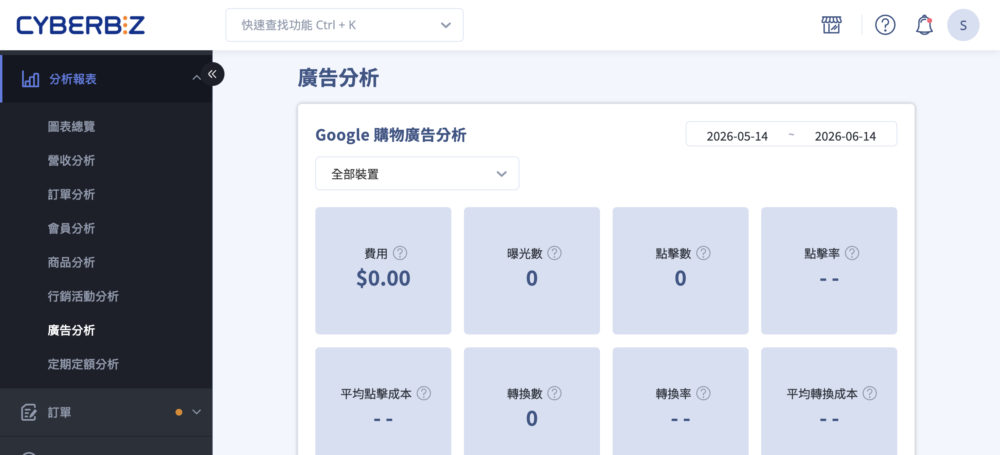
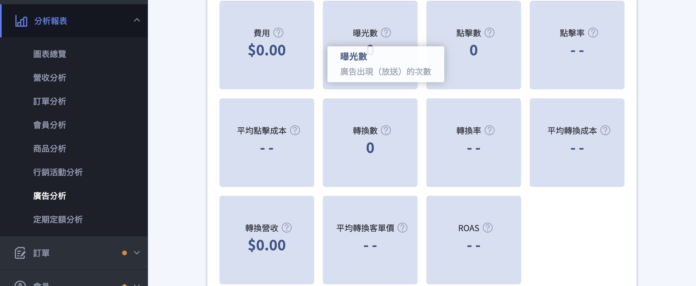
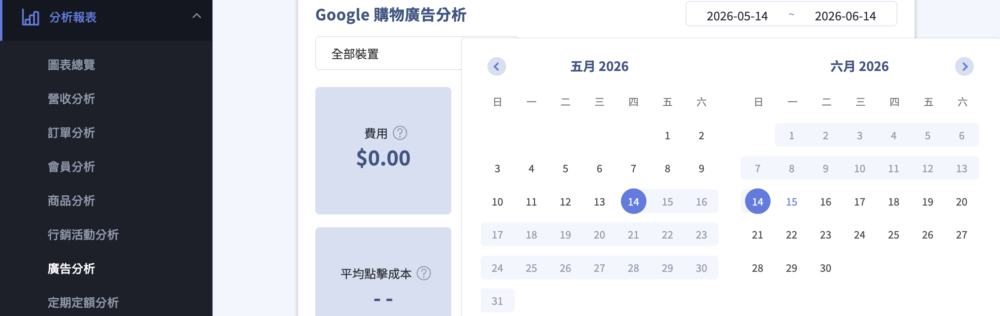
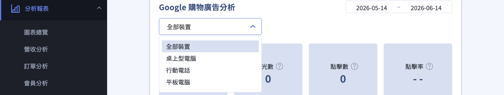
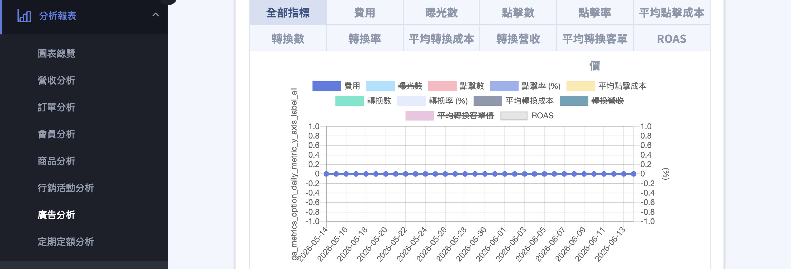

{ title="廣告分析頁面" .hero-page }

## 廣告分析說明 { #intro-advertising-analytics }

「廣告分析」會把您透過「自動化廣告系統」投放的 **Google 購物廣告** 成效，整理成數據卡片與每日趨勢圖。從廣告花了多少錢、帶來多少曝光與點擊，到最後換回多少訂單營收，都能在同一頁掌握，協助您判斷廣告投得值不值得、要不要調整。

!!! path "後台路徑：後台左側選單「分析報表」>「廣告分析」。"

!!! info "提示"
    此頁面前僅呈現 **Google 購物廣告** 的成效，不包含其他廣告管道的數據。

## 使用前提與限制 { #prerequisites-advertising-analytics }

- [x] **已開通[「自動化廣告系統」](../integrations/google/automated-ads-system.md#operate-automated-ads-apply){ title="申請開通與首次儲值" }**：完成 Google 購物廣告的開通後，「廣告分析」才會出現在左側選單。
- [x] **已建立 [Google Ads 自動化帳戶](../integrations/google/automated-ads-system.md#operate-automated-ads-gmc){ title="選擇 GMC 串接方式" }**：若尚未建立帳戶，頁面會出現「沒有建立 Google Ads 自動化帳戶」的提示，且暫時無法查詢數據。

!!! plan "開通條件"
    「廣告分析」需搭配「自動化廣告系統」使用。設定入口在後台「第三方整合」>「自動化廣告系統」。完成 Google 購物廣告的開通與帳戶設定後，選單才會出現此頁，頁面也才能載入數據。

## 頁面功能總覽 { #overview-advertising-analytics }

| 區塊 | 內容 | 用途 |
| :-- | :-- | :-- |
| 篩選列 | [日期區間](#operate-advertising-analytics-date-range)、[裝置類型](#operate-advertising-analytics-device) | 設定要查看的時間範圍與裝置 |
| [數據總覽](#operate-advertising-analytics-overview) | 11 張成效數據卡片 | 一眼看完區間內各項指標的加總與平均 |
| [每日趨勢圖](#operate-advertising-analytics-trend) | 折線圖搭配指標切換 | 觀察單一指標逐日的變化走勢 |

數據總覽與趨勢圖共用同一組 11 項指標，完整定義請見 [廣告分析指標對照表](references/advertising-analytics-metrics-reference.md#reference-advertising-analytics-metrics){ title="廣告分析指標對照表" data-preview }。

## 操作步驟 { #operate-advertising-analytics }

### 查看廣告成效總覽 { #operate-advertising-analytics-overview }

1. 進入後台「分析報表」>「廣告分析」。
2. 頁面上方「Google 購物廣告分析」區塊，會以數據卡片呈現所選區間內的 11 項指標(費用、曝光數、點擊數、ROAS 等)。
3. 將滑鼠移到任一張卡片的名稱旁，即可看到該指標的計算方式說明。各指標代表的意義可參考 [指標對照表](references/advertising-analytics-metrics-reference.md#reference-advertising-analytics-metrics){ title="廣告分析指標對照表" data-preview }。

{ title="查看廣告成效總覽" }

---

### 調整查詢的日期區間 { #operate-advertising-analytics-date-range }

1. 點選右上角的 **日期區間** 選擇器。
2. 選擇要查看的開始日期與結束日期[^date-limit]。
3. 系統會自動以新的區間，重新載入數據卡片與每日趨勢圖。

[^date-limit]: 單次查詢的日期區間最長為 180 天，超過時系統會跳出提示，請縮短範圍後再查詢。

{ title="調整查詢的日期區間" }

---

### 切換裝置類型 { #operate-advertising-analytics-device }

1. 點選數據總覽上方的 **裝置** 下拉選單。
2. 選擇「全部裝置」「桌上型電腦」「行動電話」或「平板電腦」。
3. 數據卡片與趨勢圖會即時依所選裝置重新計算，方便您比較不同裝置的廣告表現。

{ title="切換裝置類型" }

---

### 查看每日趨勢圖 { #operate-advertising-analytics-trend }

1. 捲動到頁面下方的 **每日趨勢圖**。
2. 點選圖表上方的指標頁籤，切換要觀察的指標；可選「全部指標」一次綜覽，或單一指標看細節。
3. 將滑鼠移到折線上的任一點，即可看到該日期的實際數值；點擊項目名稱，可隱藏或顯示該項目資料。

{ title="查看每日趨勢圖" }

## 重要規範與限制 { #specs-advertising-analytics }

- 單次查詢的日期區間上限為 180 天。
- 此頁數據僅涵蓋 **Google 購物廣告**，不包含其他廣告管道。
- 「轉換數」採顧客點擊後 30 天歸因，因此廣告投放初期或最近幾天的轉換數據可能尚未完整。
- 數據以 Google Ads 為來源、每日彙整，與 Google Ads 後台相比，可能因時區與資料同步時間而略有差異。

## 常見問題 { #faq-advertising-analytics }

??? quote "選單裡找不到「廣告分析」，或進入後無法載入數據"
    { #faq-advertising-analytics-not-available }
    「廣告分析」需搭配「自動化廣告系統」使用。請確認：

    - 已完成 Google 購物廣告的開通，選單才會出現此頁。
    - 已建立 Google Ads 自動化帳戶；若出現「沒有建立 Google Ads 自動化帳戶」提示，請先至「第三方整合」>「自動化廣告系統」完成設定。

??? quote "為什麼剛開始投放廣告，轉換數還是 0？"
    { #faq-advertising-analytics-no-conversion }
    「轉換數」是以顧客點擊廣告後 30 天內的下單來計算。廣告剛開始投放時，顧客可能還在考慮、尚未下單，因此需要等待一段時間，轉換數據才會陸續出現。

??? quote "日期區間選太長，無法查詢？"
    { #faq-advertising-analytics-date-range-limit }
    單次查詢的區間最長為 180 天。若需要看更長期間的趨勢，請分段查詢。

??? quote "數據和 Google Ads 後台對不起來？"
    { #faq-advertising-analytics-data-diff }
    本頁數據以 Google Ads 為來源、每日彙整。由於時區計算與資料同步會有時間差，短期內數字可能與 Google Ads 後台略有出入，待數據同步後即會一致。

## 參考資料 { #reference-advertising-analytics }

- [廣告分析指標對照表](references/advertising-analytics-metrics-reference.md)
