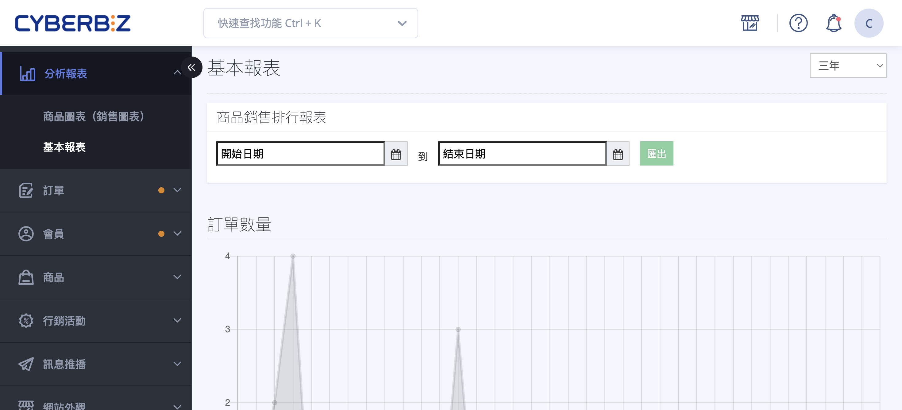
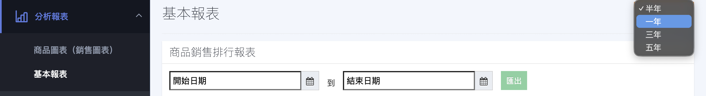
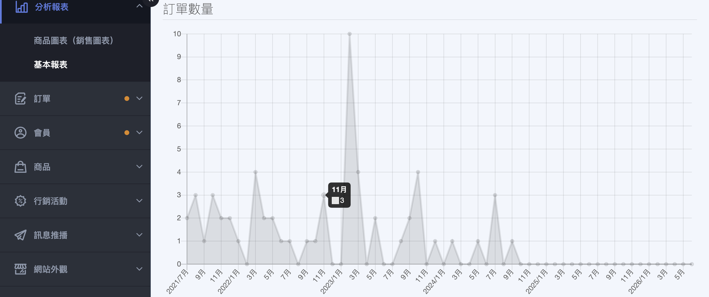
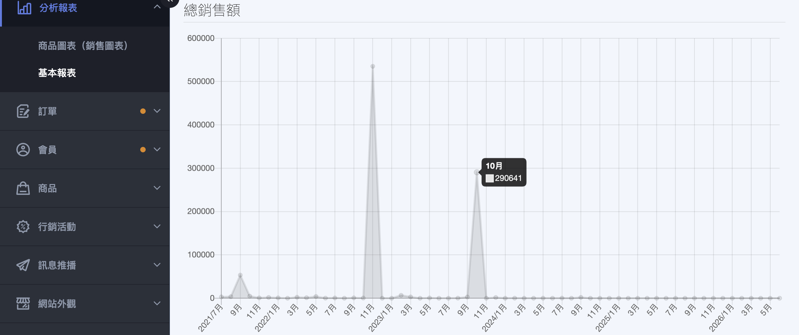
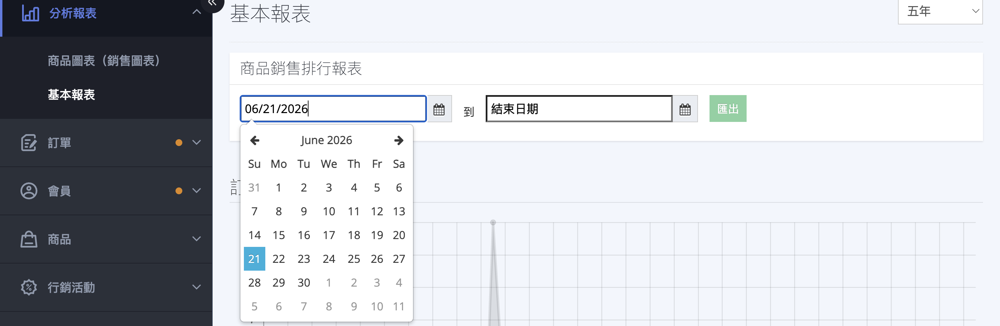

{ title="基本報表頁面" .hero-page }

## 基本報表說明 { #intro-basic-chart }

!!! path "進入路徑：後台左側選單「分析報表」>「基本報表」"

## 頁面功能總覽 { #overview-basic-chart }

「基本報表」由以下四個區塊組成，各自的用途與操作方式如下：

| 區塊 | 看什麼 | 操作方式 |
| :-- | :-- | :-- |
| 商品銷售排行報表 | 指定期間內銷售額前 10 名的商品 | 選定日期區間後匯出 Excel |
| 訂單數量 | 各月份的有效訂單筆數趨勢 | 頁面右上角切換時間區間 |
| 總銷售額 | 各月份的有效訂單金額趨勢 | 頁面右上角切換時間區間 |
| 近七日瀏覽人次 | 過去七天店家首頁每日的進站人次 | 將滑鼠移到節點查看數值 |

!!! note "註釋"
    「訂單數量」與「總銷售額」共用頁面右上角的同一個時間區間選單，切換時兩張圖表會一起更新；「近七日瀏覽人次」固定顯示最近七天，不受該選單影響。

## 操作步驟 { #operate-basic-chart }

### 查看訂單數量與總銷售額趨勢 { #operate-basic-chart-trend }

1. **進入報表頁面：** 前往後台「分析報表」>「基本報表」。
2. **選擇時間區間：** 在頁面右上角的下拉選單，選擇「半年」「一年」「三年」或「五年」(預設為半年)。

    { title="選擇時間區間" }

3. **檢視趨勢：** 「訂單數量」與「總銷售額」兩張圖表會依所選區間，以每月為單位重新繪製。

    === "訂單數量"

        { title="訂單數量趨勢圖" }

    === "總銷售額"

        { title="總銷售額趨勢圖" }

4. **查看單月數值：** 將滑鼠移到折線圖的任一節點，即可看到該月份的詳細數字。

!!! note "註釋"
    這兩張圖表只計入有效訂單，已取消與已退貨的訂單不列入計算。詳細認列方式請見 [各報表計算規則對照表](references/basic-chart-metrics-reference.md#reference-basic-chart-metrics){ title="基本報表計算規則對照表" data-preview }。

---

### 匯出商品銷售排行報表 { #operate-basic-chart-export-rank }

1. **設定開始日期：** 在「商品銷售排行報表」區塊，點選「開始日期」欄位，於日曆選擇起始日。
2. **設定結束日期：** 點選「結束日期」欄位選擇截止日(結束日不可早於開始日)。
3. **匯出 Excel：** 兩個日期都選好後，**「匯出」** 按鈕才會啟用，點擊即下載 Excel 檔案[^export-sheets]。
4. **檢視排行：** Excel 內列出該區間銷售額由高到低、前 10 名的商品。

[^export-sheets]: 若商店有開通 POS(門市銷售)功能，匯出的 Excel 會額外分成「全部」「線上」「實體門市」以及各門市的工作表；未開通則只有「全部」一張工作表。

{ title="商品銷售排行報表全區" }

---

## 重要規範與限制 { #specs-basic-chart }

- **有效訂單的定義：** 「訂單數量」與「總銷售額」只計入有效訂單，會自動排除「已取消」與「已退貨」的訂單。
- **商品銷售排行的金額基礎：** 排行依「實際成交金額」(售出數量 × 成交單價)由高到低排序，且同樣只計入未退貨的有效訂單，與圖表口徑一致。
- **近七日瀏覽人次的認列：** 此圖表只計算「店家首頁」的進站次數，訪客每進入一次首頁就算一次，不會去除重複(例如重新整理頁面也會再計一次)。
- **資料更新時間：** 「訂單數量」「總銷售額」與「商品銷售排行」皆為即時資料；「近七日瀏覽人次」則為每日彙整前一日數據，因此當天的首頁人次要到隔日才會出現在圖表上。

各報表的計算口徑整理於 [各報表計算規則對照表](references/basic-chart-metrics-reference.md#reference-basic-chart-metrics){ title="基本報表計算規則對照表" data-preview }。

---

## 後續操作 { #next-steps-basic-chart }

- :lucide-line-chart:{ .lg }  
  [__商品圖表__](product-chart.md){ title="商品圖表" }  
  深入分析單一商品的瀏覽、購買與成交率表現。

- :lucide-file-spreadsheet:{ .lg }  
  [__訂單報表匯出__](../orders/reports/export-order-report.md){ title="匯出訂單報表" }  
  匯出更完整的訂單明細，做進一步的對帳與分析。

- :lucide-bar-chart-3:{ .lg }  
  [__營運圖表分析__](business-intelligence-overview.md){ title="圖表總覽" }  
  查看含轉換率、客單價等指標的進階營運分析。

---

## 常見問題 { #faq-basic-chart }

??? quote "今天的訂單或瀏覽人次怎麼沒有出現？"
    { #faq-basic-chart-today-missing }
    要看是哪一項報表：

    - 「訂單數量」與「總銷售額」是即時資料，新訂單會立即反映(可能需重新整理頁面)。
    - 「近七日瀏覽人次」是每日彙整前一日數據，當天的首頁人次要到隔日才會顯示。

??? quote "「商品銷售排行」和「商品圖表」的數字對不起來？"
    { #faq-basic-chart-mismatch }
    兩者的統計基礎不同，本來就不會相等：

    - 「商品銷售排行報表」算的是「實際成交金額」，只計入未退貨的有效訂單。
    - 「[商品圖表](product-chart.md){ title="商品圖表" }」算的是每日彙整的「瀏覽次數」與「購買次數」，購買次數只記錄產單當下的數量，不再判斷後續的付款、取消或退貨。

??? quote "日期選好了，「匯出」按鈕還是灰色點不下去？"
    { #faq-basic-chart-export-disabled }
    請確認「開始日期」與「結束日期」兩個欄位都已選取，且結束日期不早於開始日期，按鈕才會啟用。

??? quote "報表會計入哪些訂單？取消和退貨的訂單算嗎？"
    { #faq-basic-chart-which-orders }
    「訂單數量」「總銷售額」與「商品銷售排行」都只計入有效訂單，會自動排除已取消與已退貨的訂單。

---

## 參考資料 { #reference-basic-chart }

- [各報表計算規則對照表](references/basic-chart-metrics-reference.md#reference-basic-chart-metrics)

