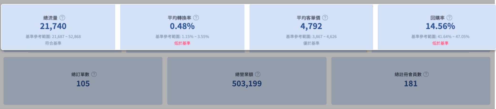
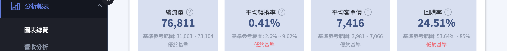

## 基準化分析說明 <small>Benchmarking</small> { #intro-benchmarking }

基準化分析是透過 **AI 機器學習技術**，分析商家的產品類別、營收表現等數據，從系統中選出適當的「對標群體」，並計算出業界的基準範圍值。商家可以藉此了解自家商店各項指標在同業中的優劣狀況，快速識別出需要優化的弱項。

## 適用對象與限制 { #applicability }

- [x] **適用版本：** 僅限 **企業版** 客戶使用。
- [x] **支援產品類別：** 目前為 Beta 測試階段，主要支援以下四大類別商家：
    - 食物、飲食和煙草
    - 保健與美容
    - 服飾與配件
    - 居家和庭園
- [x] **認列訂單定義：** 數據計算需同時符合「訂單狀態非取消」且「不需退貨或拒絕退貨」兩個條件。

## 四大重要基準指標 { #key-metrics }

系統針對電商經營核心的四大指標提供基準值範圍：

1. **流量 (Traffic)：** 網站的流量數（類似 Google Analytics 的工作階段）。
2. **轉換率 (Conversion Rate)：** 計算公式為「總訂單數 ÷ 總流量」。
3. **客單價 (AOV)：** 計算公式為「總營業額 ÷ 總訂單數」。
4. **回購率 (Repurchase Rate)：** 指定時間內，曾下過 2 次以上訂單的客戶佔總下單客戶的比例。

{ title="四大基準指標" }

## 利用基準數據提升業績 { #improve-performance }

可參考電商公式：**GMV (總營業額) = 流量 × 轉換率 × 客單價 × 回購率**。

- **找出優化優先順序：** 當某項指標 **低於市場基準範圍** 時，通常代表該指標具備較高的優化效益，應將其列為優化計畫的首要任務。
- **檔期分析：** 可自訂時間區間（如過年、週年慶檔期），查看當期數據與前一年同期或前一期的對比，衡量行銷活動的成效。

## 操作步驟 { #operate }

1. **進入頁面：** 登入後台，點選 **「分析報表」>「圖表總覽」**。
2. **查看趨勢圖：** 在圖表總覽中，除了能看到本期數據外，若符合上述產品類別，系統會自動在指標卡上顯示基準值範圍。
3. **學習資源：** CYBERBIZ 會針對各個指標（如提升流量的 SEO、提升客單價的加價購等）不定時開辦線上課程或錄製教學影片供品牌參考。

{ title="指標卡基準參考範圍" }

!!! tip "提升各指標的線上課程"
    可前往 [CYBERBIZ 商學院](https://tutorcyb.cyberbiz.co/) 尋找流量、轉換率、客單價、回購率相關的學習資源。

!!! info "數據更新時間"
    - 流量與轉換率數據於隔日下午 17:30 更新。
    - 其餘數據（訂單、營業額等）則於隔日凌晨 00:00 更新並排除取消或退貨訂單。
    - 若商家有串接 POS 系統，可切換至「POS 總覽」頁籤查看實體店面的相關分析。

## 後續操作 { #next-steps-benchmarking }

當您找出待優化的指標後，可參考以下資源加強對應能力：

!!! tip "最新課程"
    歡迎報名最新[線上課程](https://calendar.google.com/calendar/embed?src=c_dcbc263418b00a759f10a7e6e5af98bbbed5686e86ae96ac333b17739c3f08a2%40group.calendar.google.com&ctz=Asia%2FTaipei)！

- :lucide-mouse-pointer-click:{ .lg }  
  [__提升流量__](https://tutorcyb.cyberbiz.co/search?tab=programs&tag=流量篇)  
  學習 SEO、廣告與社群導流，把更多顧客帶進商店。

- :lucide-percent:{ .lg }  
  [__提升轉換率__](https://tutorcyb.cyberbiz.co/search?tab=programs&tag=轉換率)  
  優化商品頁與結帳流程，讓更多流量轉為訂單。

- :lucide-receipt:{ .lg }  
  [__提升客單價__](https://tutorcyb.cyberbiz.co/search?tab=programs&tag=AOV)  
  運用加價購、組合銷售等方式提高每筆訂單金額。

- :lucide-repeat:{ .lg }  
  [__提升回購率__](https://tutorcyb.cyberbiz.co/search?tab=programs&tag=回購率)  
  透過會員經營與再行銷，讓顧客回頭再次下單。

