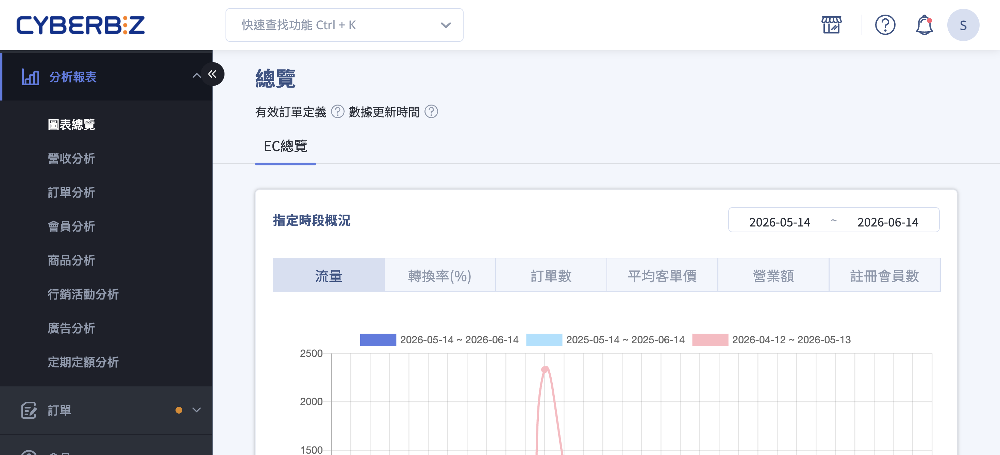
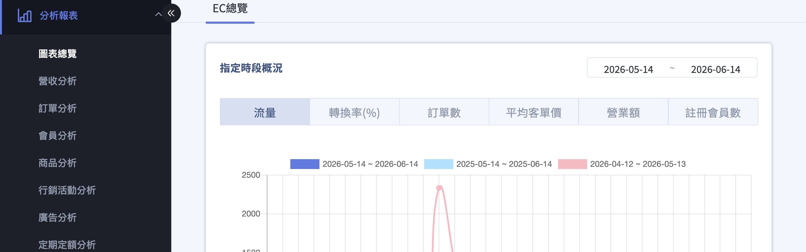
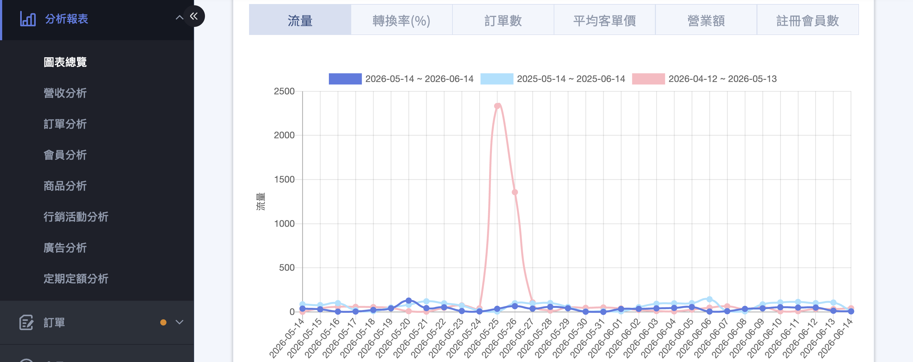
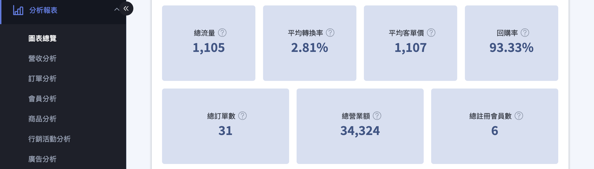
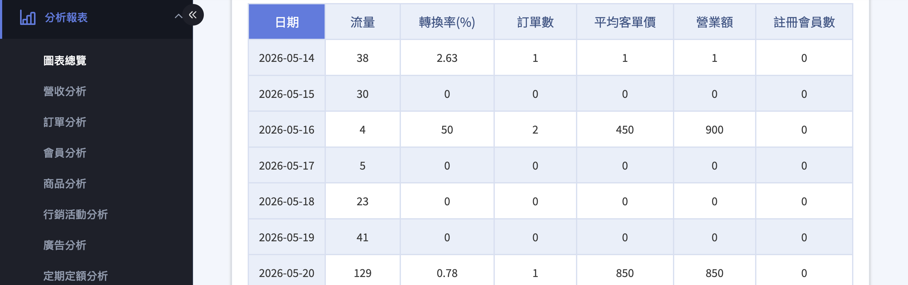
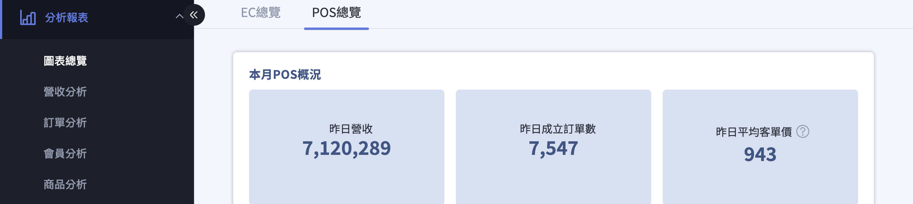
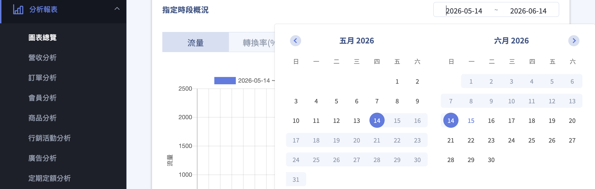
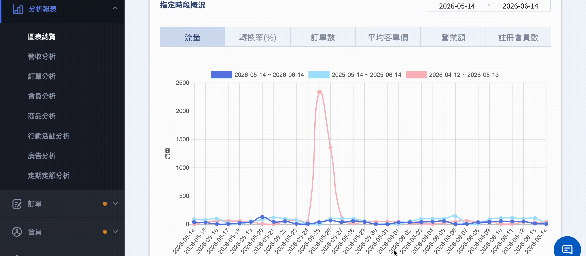

{ title="圖表總覽頁面" .hero-page }

## 圖表總覽說明 { #intro-chart-overview }

圖表總覽(後台路徑：「分析報表」>「圖表總覽」)把商店的流量、轉換率、客單價、回購率、營業額等核心指標整理成趨勢圖與指標卡。企業版商家還會看到 **「基準參考範圍」**，把自家指標與相似類別、同等表現的同業統計值對照，判斷哪些指標仍有成長空間。

!!! tip "用一條公式看懂優化重點"
    電商常見的營收拆解公式為：**營業額 ＝ 流量 × 轉換率 × 客單價 × 回購率**。當某一項指標低於基準參考範圍時，通常代表它的優化效益最高，建議優先處理。

## 頁面功能總覽 { #overview-chart-overview }

| 區塊 | 說明 |
| :-- | :-- |
| EC總覽 | 網路商店的流量、轉換率、訂單、營收等整體經營數據 |
| [POS總覽](#operate-chart-overview-pos) | 實體門市(POS)的營業額、訂單、消費人數等數據 |
| [指標趨勢圖](#operate-chart-overview-switch-chart) | 以折線圖呈現單一指標在所選時段的變化 |
| [指標卡](#operate-chart-overview-read-benchmark) | 各項關鍵指標的彙總數字；企業版另顯示基準參考範圍 |
| [每日數據表](#每日數據表) | 以每日為單位列出指標明細，可分頁瀏覽 |

頁面各項指標的定義與計算方式，請見 [圖表總覽指標說明](references/bi-overview-metrics-reference.md#reference-bi-overview-metrics){ data-preview }。

=== "EC總覽"
    網路商店的流量、轉換率、訂單、營收等整體經營數據

    { title="EC總覽" }

=== "指標趨勢圖"
    以折線圖呈現單一指標在所選時段的變化

    { title="指標趨勢圖" }

=== "指標卡"
    各項關鍵指標的彙總數字；企業版另顯示基準參考範圍

    { title="指標卡" }

=== "每日數據表"
    以每日為單位列出指標明細，可分頁瀏覽

    { title="每日數據表" }

    ??? note "與後台總覽頁的數據差異"
        「每日訂單數及營業額」與「後台登入頁→總覽的訂單數及營業額」計算方式不同，所以有所差異。

        - **後台登入頁→總覽：** 沒有被取消的訂單（包含退貨／拒絕退貨訂單），且會即時更新。
        - **分析圖表→圖表總覽：** 有效訂單，且固定時段更新。

<!--
=== "POS總覽"
    實體門市(POS)的營業額、訂單、消費人數等數據

    { title="POS總覽" }
-->

## 使用前提與限制 { #prerequisites-chart-overview }

圖表總覽屬於「分析報表」功能，部分進階內容需符合對應條件才會顯示：

- [x] **基準參考範圍**：僅 **企業版** 商家顯示，且商家所屬產業需屬於支援類別。
- [x] **POS 總覽分頁**：需已串接 CYBERBIZ POS 系統才會出現。
- [x] **產業類別判定**：基準參考範圍會依商家的商品屬性自動判定所屬產業，無法手動指定。

!!! plan "方案差異"
    基準參考範圍為企業版專屬功能。若您的方案未包含此功能，指標卡將不會顯示基準參考範圍與狀態標籤；如需了解升級方式，請洽您的開店顧問或客服。

## 操作步驟 { #operate-chart-overview }

### 進入圖表總覽 { #operate-chart-overview-enter }

1. **進入頁面：** 於後台左側選單點選「分析報表」>「圖表總覽」。
2. **切換分頁：** 頁面上方提供 **「EC總覽」** 與 **「POS總覽」** 兩個分頁[^pos]，預設顯示 EC總覽。

[^pos]: POS總覽分頁僅在商家已串接 CYBERBIZ POS 系統時才會顯示。

---

### 選擇查詢時段 { #operate-chart-overview-date-range }

1. **開啟日期選擇器：** 點選頁面右上角的日期區間選擇器。
2. **選擇起訖日：** 選擇要查詢的開始與結束日期，選定後系統會自動載入該區間數據，標題會從 **「近30日概況」** 變更為 **「指定時段概況」**。
3. **注意區間上限：** 查詢區間最長為 365 天，超過會出現「時間區間不得超過 365 天」提醒；若只選了開始日期而未選結束日期，會出現「請指定結束日期」提醒。

{ title="選擇查詢時段" }

---

### 切換指標趨勢圖 { #operate-chart-overview-switch-chart }

1. **選擇指標：** 在趨勢圖上方的指標切換列，點選要檢視的指標：流量、轉換率(%)、訂單數、平均客單價、營業額、註冊會員數。
2. **檢視趨勢：** 圖表會顯示該指標在所選時段內的變化趨勢，將滑鼠移至曲線上可查看每個資料點的詳細數值。
3. **檢視每日明細：** 圖表下方的數據表會以每日為單位列出明細，可用分頁瀏覽(每頁 100 筆)。

{ title="切換指標趨勢圖" }

??? info "曲線顏色對照"
    趨勢圖中的曲線顏色代表不同的比較基準：

    - **深藍曲線：** 顯示本期數據（您所設定的時間區間）。
    - **淺藍曲線：** 顯示前一年同期數據（對照上一年同一時段）。
    - **粉紅曲線：** 顯示同年度的上一期數據（本期之前，相同長度的時間區間）。

    ??? example "範例"
        若您設定時間區間為：2025-06-01 ~ 2025-07-31，共計 2 個月。

        - **深藍曲線：** 時間範圍為 2025-06-01 ~ 2025-07-31，為期 2 個月。
        - **淺藍曲線：** 時間範圍為 2024-06-01 ~ 2024-07-31，為期 2 個月。
        - **粉紅曲線：** 時間範圍為 2025-04-01 ~ 2025-05-31，為期 2 個月。

??? tip "使用情境"
    您可選擇特定行銷檔期作為時間區間，如：過年檔期、母親節檔期、暑假檔期。

    - **深藍曲線：** 幫助您了解今年此檔期的銷售狀況。
    - **淺藍曲線：** 幫助您了解去年此檔期的銷售狀況。
    - **粉紅曲線：** 幫助您了解今年此檔期開始前，同樣時間區間下的銷售狀況。

---

### 解讀基準參考範圍 { #operate-chart-overview-read-benchmark }

企業版且產業屬於支援類別的商家，下列四張指標卡會額外顯示基準參考範圍：

1. **找到指標卡：** 在趨勢圖下方的指標卡區，**總流量**、**平均轉換率**、**平均客單價**、**回購率** 四張卡片下方會顯示 **「基準參考範圍」** 與一個狀態標籤。
2. **判讀狀態標籤：** 狀態分為 **優於基準**、**符合基準**、**低於基準** 三種[^bm-status]，其中「低於基準」會以紅色標示，代表該指標的優化效益較高。
3. **查看資料來源：** 將滑鼠移至卡片上的提示圖示，會看到「此數值來自於相似類別、同等表現商家之統計」，並附上對應的「教學資源」連結。

[^bm-status]: 各狀態的詳細意義與建議動作，請見 [基準參考範圍狀態對照表](references/benchmark-reference-range-status-reference.md#reference-chart-overview-benchmark-status){ data-preview }。

- :lucide-bar-chart-3:{ .lg }
  [__基準化分析 (Benchmarking)__](benchmarking.md){ title="基準化分析" }

---

### 查看 POS 總覽 { #operate-chart-overview-pos }

1. **切換分頁：** 點選 **「POS總覽」** 分頁。
2. **檢視門市概況：** 此分頁顯示「本月POS概況」，包含營業額、訂單數、消費人數、人均消費額等實體門市指標。

## 重要規範與限制 { #specs-chart-overview }

### 認列訂單定義 { #specs-chart-overview-order-definition }

圖表總覽的數據計算僅納入「認列訂單」，需同時符合下列兩項條件：

- 訂單狀態為：非取消訂單
- 退貨狀態為：不需退貨或拒絕退貨

因此圖表上的數字會與「所有訂單」的筆數略有差異，這是正常現象。EC總覽僅計入網路商店訂單，實體門市請改看 POS總覽。

---

### 支援的產業類別 { #specs-chart-overview-categories }

基準參考範圍目前支援以下產業類別，系統會依商家的商品屬性自動判定所屬產業：

- [x] 食物、飲料和菸草
- [x] 保健與美容
- [x] 服飾與配件
- [x] 居家和庭園

若商家所屬產業不在上述類別中，指標卡將不會顯示基準參考範圍。

---

### 數據更新時間 { #specs-chart-overview-update-time }

- 流量、轉換率數據於隔日下午五點半更新。
- 其餘數據於隔日凌晨零點更新(取消及退貨訂單會定時更新排除)。

## 後續操作 { #next-steps-chart-overview }

當您透過基準參考範圍找到待優化的指標後，可參考以下資源加強對應能力：

- :lucide-mouse-pointer-click:{ .lg }  
  [__提升流量__](https://tutorcyb.cyberbiz.co/search?tab=programs&tag=流量篇)  
  學習 SEO、廣告與社群導流，把更多顧客帶進商店。

- :lucide-percent:{ .lg }  
  [__提升轉換率__](https://tutorcyb.cyberbiz.co/search?tab=programs&tag=轉換率)  
  優化商品頁與結帳流程，讓更多流量轉為訂單。

- :lucide-receipt:{ .lg }  
  [__提升客單價__](https://tutorcyb.cyberbiz.co/search?tab=programs&tag=AOV)  
  運用加價購、組合銷售等方式提高每筆訂單金額。

- :lucide-repeat:{ .lg }  
  [__提升回購率__](https://tutorcyb.cyberbiz.co/search?tab=programs&tag=回購率)  
  透過會員經營與再行銷，讓顧客回頭再次下單。

## 常見問題 { #faq-chart-overview }

??? quote "為什麼我看不到基準參考範圍？"
    { #faq-chart-overview-no-benchmark }
    基準參考範圍需同時符合下列條件才會顯示：

    - 您的方案為企業版。
    - 商家所屬產業屬於支援類別(食物飲料、保健美容、服飾配件、居家庭園)。
    - 系統已依商品屬性判定出對應產業。

    若仍未顯示，請洽您的開店顧問或客服協助確認。

??? quote "基準參考範圍的數字是怎麼來的？"
    { #faq-chart-overview-benchmark-source }
    基準參考範圍來自「相似類別、同等表現商家之統計」，也就是與您屬於相同產業、規模相近的同業經營數據彙整出的參考區間，並非單一店家的數字。

??? quote "為什麼今天的數據還沒更新？"
    { #faq-chart-overview-update-time }
    各指標的更新時間不同：

    - 流量、轉換率於隔日下午五點半更新。
    - 其餘數據(訂單、營業額等)於隔日凌晨零點更新。

    因此最新一天的數據通常要到隔天才會完整呈現。

??? quote "圖表數字和訂單列表對不起來？"
    { #faq-chart-overview-recognized-order }
    圖表總覽只計算「認列訂單」(非取消，且不需退貨或拒絕退貨的訂單)，而訂單列表會包含所有狀態的訂單，因此兩者筆數會有落差，屬於正常現象。

??? quote "找不到 POS 總覽分頁？"
    { #faq-chart-overview-no-pos }
    POS總覽分頁僅在商家已串接 CYBERBIZ POS 系統時才會出現。若您尚未使用 POS，畫面只會顯示 EC總覽。

## 參考資料 { #reference-chart-overview }

- [圖表總覽指標對照表](references/bi-overview-metrics-reference.md)
- [基準參考範圍狀態對照表](references/benchmark-reference-range-status-reference.md)
- 提升各指標的線上課程：[CYBERBIZ 商學院](https://tutorcyb.cyberbiz.co/)

