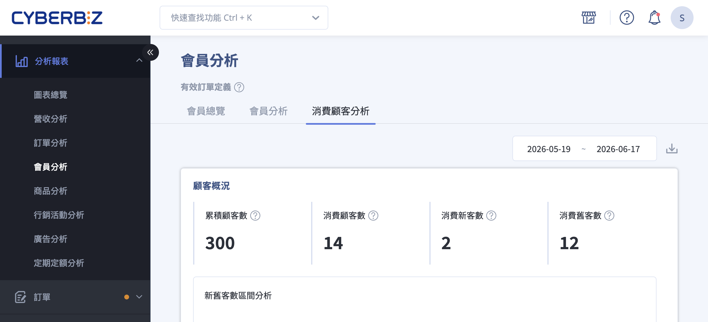{ .hero-page }

## 消費顧客介紹 { #intro-customer-analysis }

「消費顧客分析」是會員分析頁面中的一個分頁，將指定區間內有消費的顧客分為「新客」與「舊客」，並從顧客數、訂單與回購三個角度，呈現新舊客各自的貢獻。透過這份分析，您可以判斷目前業績是靠「獲取新客」還是「舊客回購」在支撐。

頁面由上而下分為三個區塊：

- **顧客概況**：累積顧客數、消費顧客數，以及消費新客 / 舊客數與佔比。
- **訂單概況**：新舊客各自帶來的訂單數與訂單金額。
- **回購概況**：回購顧客數與回購率，以及回購的新舊客組成。

## 使用前提與限制 { #prerequisites-customer-analysis }

### 方案開通條件 { #prerequisites-customer-analysis-plan }

「消費顧客分析」需要額外開通，且限定特定方案。

!!! plan "方案 / 開通條件"
    「消費顧客分析」分頁僅 **企業版** 與 **PLUS方案(專業PLUS版、進階PLUS版、高手PLUS版)** 可使用，並需開通此功能後才會出現。若您的方案符合但未看到此分頁，請聯絡客服或您的開店顧問協助開通。

---

### 新舊客的判定 { #prerequisites-customer-analysis-definition }

本分頁的新舊客以「第一次下單時間」判定，與「會員分析」以註冊時間判定的「新會員」不同：

- **消費新客數**：第一次下單發生在指定區間內的顧客。
- **消費舊客數**：過去已有下單紀錄，且在指定區間內又再次下單的顧客。
- **累積顧客數**：開店截至指定時間結束前，曾經下單的顧客數。

詳細比較請見[新會員與新客的兩種定義](references/member-analysis-definitions-reference.md#reference-member-new-definitions){ data-preview }。此外，所有數字僅計入[有效訂單](references/member-analysis-definitions-reference.md#reference-member-valid-order){ data-preview }，並為[隔日更新](references/member-analysis-definitions-reference.md#reference-member-update-time){ data-preview }。

## 頁面功能總覽 { #overview-customer-analysis }

| 區塊 | 可切換檢視 | 看什麼 |
| :-- | :-- | :-- |
| 顧客概況 | — | 累積顧客數、消費顧客數、消費新客數、消費舊客數，及新舊客數佔比 |
| 訂單概況 | 訂單數 / 訂單金額 | 總訂單數(額)、新客訂單數(額)、舊客訂單數(額)，及新舊客佔比 |
| 回購概況 | 回購顧客數 / 回購訂單數 / 回購訂單金額 | 回購顧客數與回購率、回購新客數、回購舊客數，及佔比 |

## 操作步驟 { #operate-customer-analysis }

### 設定查詢的時間區間 { #operate-customer-analysis-date-range }

與其他分頁不同，本分頁 **整頁共用同一個時間區間**，位於頁面右上角：

1. **點擊右上角日期欄位：** 展開日期選擇器。
2. **選擇預設區間或自訂：** 可選擇預設區間(預設為「這個月」)，或自行框選起訖日期。
3. **套用：** 選定後，整頁三個區塊會一併依新區間重新載入。

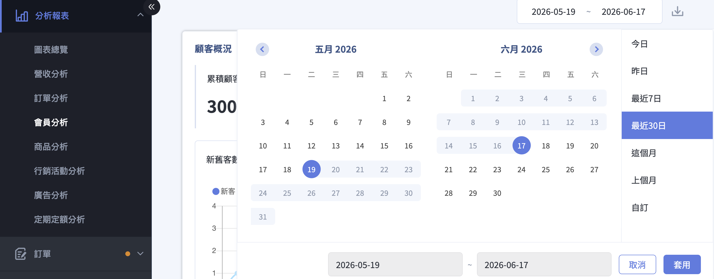{ title="調整日期區間" }

!!! note "註釋"
    若起訖日期未正確選取，系統會跳出提醒，請重新選擇完整的起訖日期。

---

### 查看顧客概況 <small>新客 vs 舊客</small> { #operate-customer-analysis-customer }

1. **看顧客數：** 「顧客概況」以數據卡呈現 **累積顧客數**[^2]、 **消費顧客數**、 **消費新客數** 與 **消費舊客數**，將滑鼠移到卡片的提示圖示上，會顯示各數字的定義。

    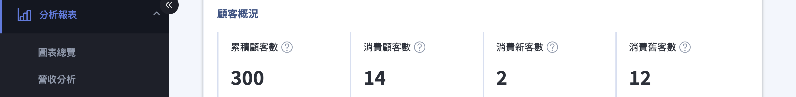{ title="顧客概況-數據卡" }

2. **看新舊客佔比：** 區塊內以 **新舊客數區間分析** 折線圖與 **新舊客數佔比** 圓餅圖，呈現新客與舊客的消長與比例，判斷業績主力來自新客或回頭客。

    === "折線圖"

        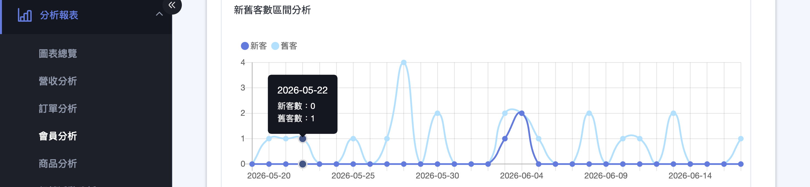{ title="新舊客數區間分析" }

        !!! note "註釋"

            一位顧客在區間內下單多次，只會被計入一次消費顧客數。因此折線圖中各月（或每日）的消費新客數與消費舊客數加總，不一定等於上方數據卡的累計數值。

    === "圓餅圖"

        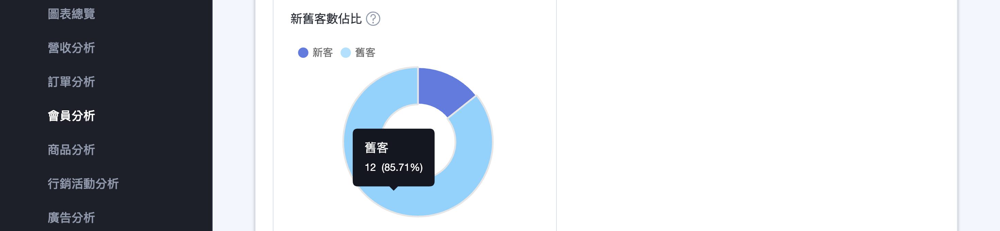{ title="新舊客數佔比" }

        ??? info "佔比算法"

            - **新客數佔比：** 消費新客數 ÷ 消費顧客數
            - **舊客數佔比：** 消費舊客數 ÷ 消費顧客數

---

### 查看訂單概況 { #operate-customer-analysis-order }

1. **切換檢視：** 「訂單概況」上方可切換 **「訂單數」** 與 **「訂單金額」** 兩種檢視。

    === "訂單數"

        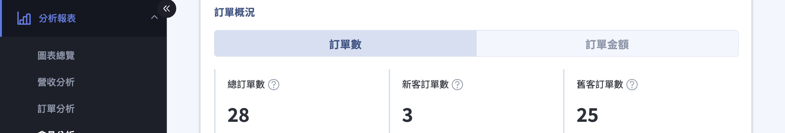{ title="訂單概況-訂單數" }

    === "訂單金額"

        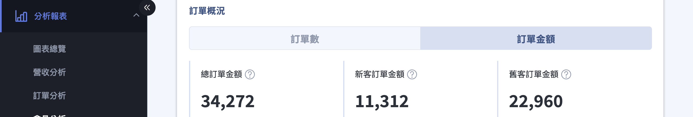{ title="訂單概況-訂單金額" }

2. **看新舊客貢獻：** 切換後，數據卡會分別顯示 **總訂單數(額)**[^3]、 **新客訂單數**、 **舊客訂單數**、 **新客訂單金額** 與 **舊客訂單金額**，搭配下方的區間分析與佔比圖，看出訂單與營收主要由哪一群顧客帶來。

    === "訂單數"

        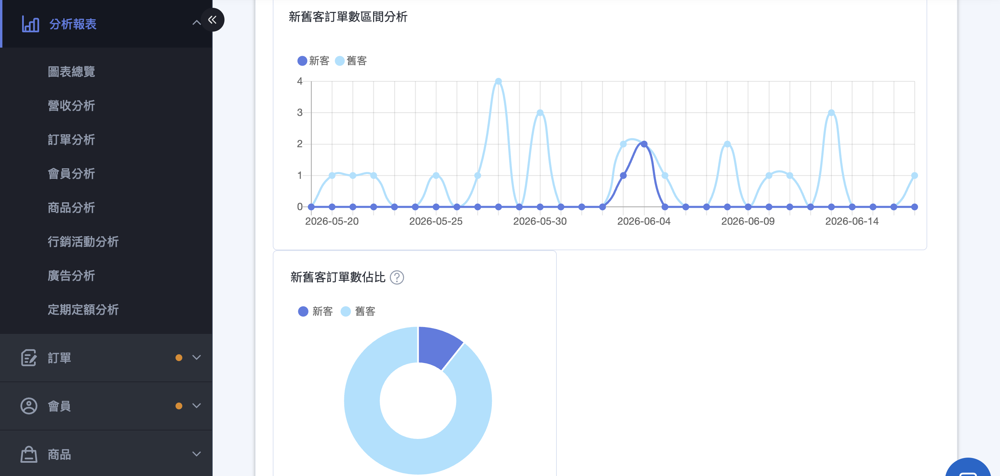{ title="訂單概況-訂單數檢視" }

        ??? info "佔比算法"

            - **新客訂單數佔比：** 新客訂單數 ÷ 總訂單數
            - **舊客訂單數佔比：** 舊客訂單數 ÷ 總訂單數

    === "訂單金額"

        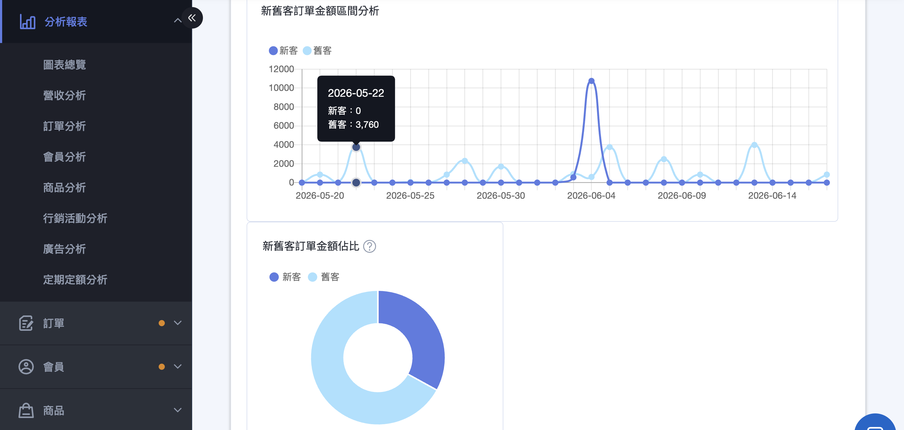{ title="訂單概況-訂單金額檢視" }

        ??? info "佔比與均值算法"

            - **新客訂單金額佔比：** 新客訂單金額 ÷ 總訂單金額
            - **舊客訂單金額佔比：** 舊客訂單金額 ÷ 總訂單金額
            - **新客平均訂單金額：** 新客訂單金額 ÷ 新客訂單數
            - **新客人均消費金額：** 新客訂單金額 ÷ 消費新客數
            - **舊客平均訂單金額：** 舊客訂單金額 ÷ 舊客訂單數
            - **舊客人均消費金額：** 舊客訂單金額 ÷ 消費舊客數

    !!! warning "注意"

        訂單概況中的新客訂單數／新客訂單金額，會包含新客首購訂單與新客回購訂單。

---

### 查看回購概況與回購率 { #operate-customer-analysis-repurchase }

1. **切換檢視：** 「回購概況」上方可切換 **「回購顧客數」**、 **「回購訂單數」** 與 **「回購訂單金額」**。

    === "回購顧客數"

        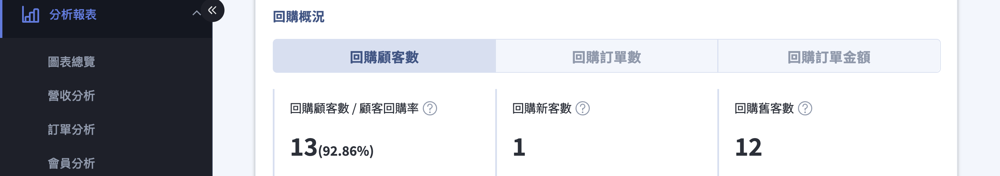{ title="回購概況-回購顧客數" }

    === "回購訂單數"

        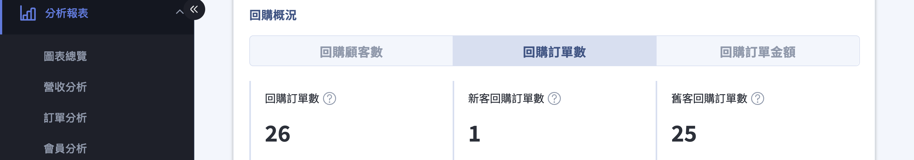{ title="回購概況-回購訂單數" }

    === "回購訂單金額"

        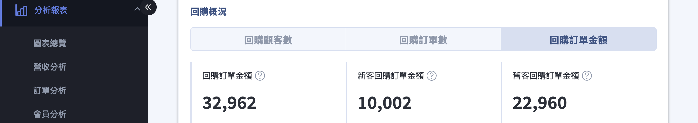{ title="回購概況-回購訂單金額" }

2. **看回購率：** 切換回購顧客數／回購訂單數／回購訂單金額，數據卡會分別顯示對應的回購指標與明細，搭配下方的區間分析與佔比圖，協助評估顧客黏著度及回購貢獻。

    === "回購顧客數"
        數據卡顯示 **回購率** 百分比[^1]、 **回購新客數**[^7] 與 **回購舊客數**[^6]。

        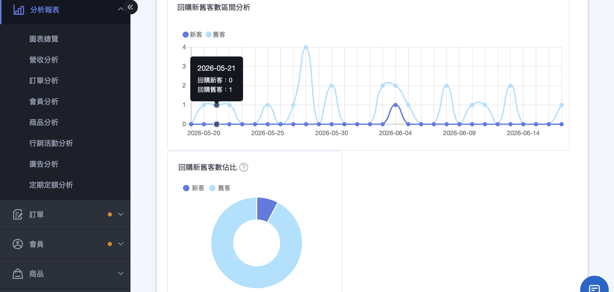{ title="回購概況-回購率" }

        ??? info "回購率算法"

            - **回購顧客數：** 過去已有購買紀錄，指定時間內又再次下單顧客數。
            - **顧客回購率：** 指定時間內下單的客戶中，屬於回購顧客的比率（＝回購顧客數 ÷ 消費顧客數）

    === "回購訂單數"
        數據卡顯示 **回購訂單數**[^4]、 **新客回購訂單數**[^5] 與 **舊客回購訂單數**[^8]。

        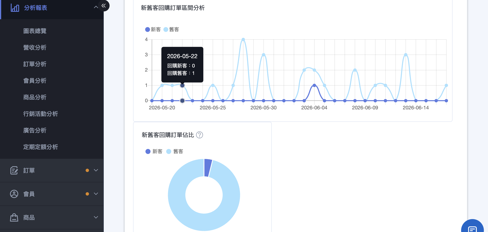{ title="回購概況-回購訂單數檢視" }

        ??? info "首購訂單數推算"

            新客首購訂單數 = 新客訂單數 – 新客回購訂單數

    === "回購訂單金額"
        數據卡顯示 **回購訂單金額**[^4]、 **新客回購訂單金額**[^5] 與 **舊客回購訂單金額**[^9]。

        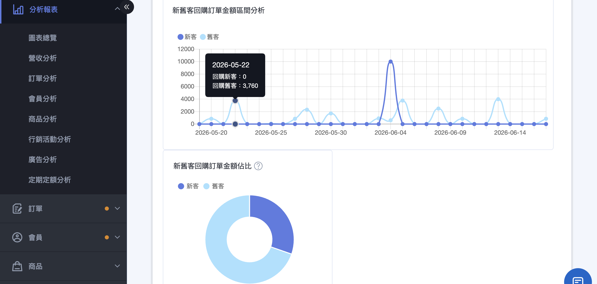{ title="回購概況-回購訂單金額檢視" }

        ??? info "首購訂單金額推算"

            新客首購訂單金額 = 新客訂單金額 – 新客回購訂單金額

[^1]: 回購率為回購顧客數佔該期消費顧客的比例；若回購率偏低，可搭配首購禮或定期購活動來提升。
[^2]: 開店截至指定時間結束前，曾經下單的顧客數。備註：下單指的是下訂有效訂單，即訂單狀態為非取消、非退貨訂單。
[^3]: 指定時間內的有效訂單數（額）。有效訂單：訂單狀態為非取消、非退貨訂單。
[^4]: 指定時間內，回購顧客所帶來的有效訂單數（額），不含首次下單的訂單。
[^5]: 指定時間內，回購的新客所帶來的有效訂單數（額），不含首次下單的訂單。
[^6]: 過去已有下單紀錄，且在指定時間內又再次下單的顧客數（＝消費舊客數）。
[^7]: 第一次下單發生在指定時間，且指定時間內又再次下單的顧客數。
[^8]: 指定時間內，回購的舊客所帶來的有效訂單數（＝舊客訂單數）。
[^9]: 指定時間內，回購的舊客所帶來的有效訂單金額（＝舊客訂單金額）。

---

### 下載本期資料 { #operate-customer-analysis-download }

完成區間設定後，點擊頁面右上角的 **下載圖示**，即可將本期的消費顧客分析資料匯出保存。

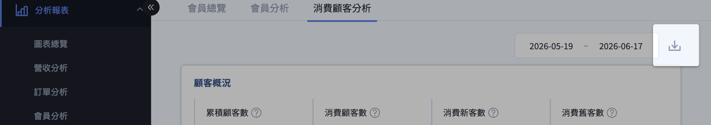{ title="下載本期資料" }

## 重要規範與限制 { #specs-customer-analysis }

- **新舊以第一次下單時間為準：** 與「會員分析」的「新會員」(以註冊時間判定)不同，兩頁數字不宜直接對照。
- **整頁共用時間區間：** 調整右上角的日期會同時影響三個區塊，與「會員分析」各圖獨立區間的設計不同。
- **僅計入有效訂單：** 已取消、已退貨的訂單不列入。
- **數據為隔日更新：** 當天的下單不會即時反映。

## 後續操作 { #next-steps-customer-analysis }

- :lucide-chart-line:{ .lg }  
  [__會員分析__](member-analysis.md)  
  掌握會員規模、成長趨勢與整體回購率。

- :lucide-users:{ .lg }  
  [__會員總覽__](member-overview.md)  
  查看性別、年齡、註冊來源與會員等級的輪廓分析。

## 常見問題 { #faq-customer-analysis }

??? quote "找不到「消費顧客分析」分頁"
    { #faq-customer-analysis-missing-tab }
    這個分頁需要符合方案並開通後才會出現。

    - 僅企業版與 PLUS方案(專業PLUS版、進階PLUS版、高手PLUS版)可使用。
    - 若方案符合卻未看到，請聯絡客服或您的開店顧問協助開通。

??? quote "這裡的新客數和「會員分析」的新會員對不起來"
    { #faq-customer-analysis-new-definition }
    兩者的新舊判定基準不同，屬正常現象。

    - 本頁「消費新客」以 **第一次下單時間** 為準。
    - 「會員分析」的「新會員」以 **註冊時間** 為準。
    - 詳細比較請見[新會員與新客的兩種定義](references/member-analysis-definitions-reference.md#reference-member-new-definitions){ data-preview }。

??? quote "三個區塊的數字感覺對不起來"
    { #faq-customer-analysis-shared-range }
    請先確認三個區塊看的是同一個時間區間。

    - 本分頁整頁共用右上角的日期區間，調整後三個區塊會一起更新。
    - 數字僅計入有效訂單，且為隔日更新。

## 參考資料 { #reference-customer-analysis }

- [會員分析共用定義](references/member-analysis-definitions-reference.md)
