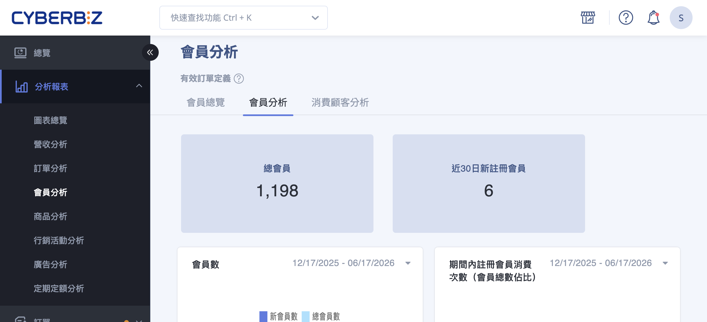
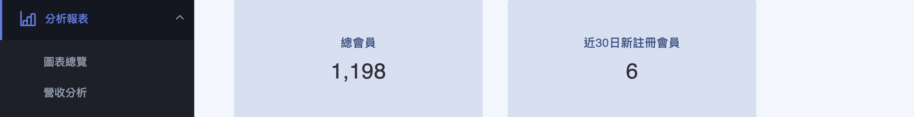
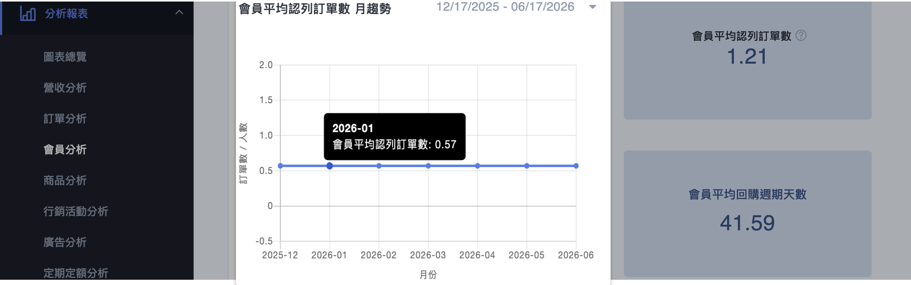
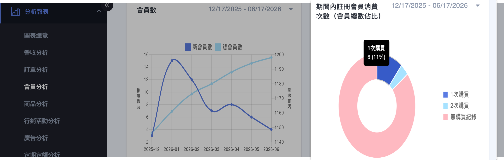
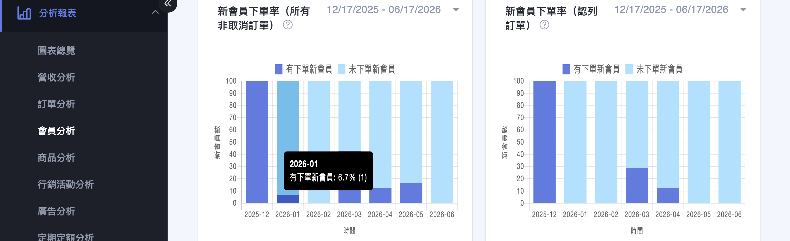
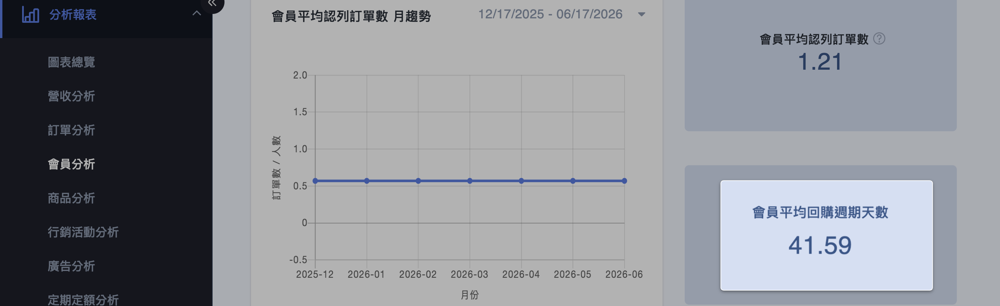
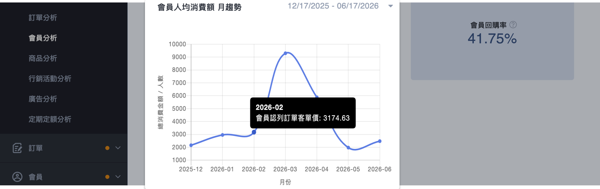
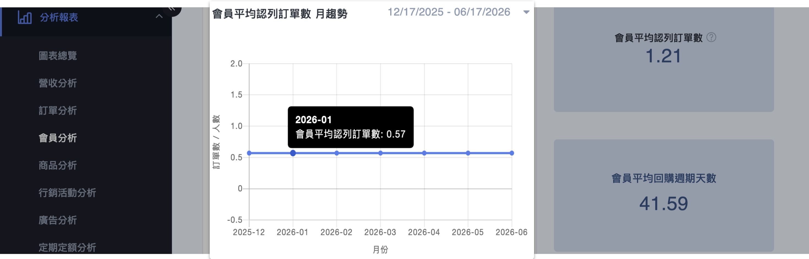
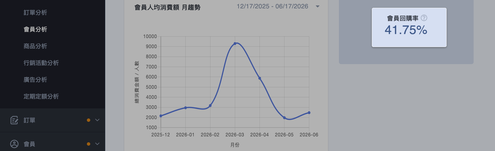
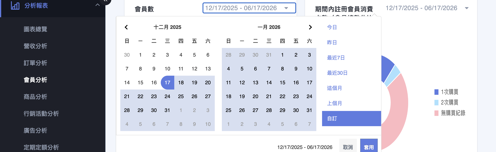

{ title="會員分析頁面" .hero-page }

## 會員分析介紹 { #intro-member-analysis }

「會員分析」位於後台「圖表分析」的會員分析頁面，它將全店會員與訂單資料整理成數據卡與圖表，協助您一眼看出會員總數、近期成長、首購後的留存，以及回購週期與人均貢獻。

頁面由上而下涵蓋三類重點：

- **規模與成長**：總會員數、近 30 日新註冊會員、會員數趨勢。
- **首購與留存**：註冊會員消費次數佔比、新會員下單率。
- **回購與貢獻**：會員平均回購週期、會員人均消費額、會員平均認列訂單數、會員回購率。

## 使用前提與限制 { #prerequisites-member-analysis }

### 數據基準 { #prerequisites-member-analysis-basis }

解讀數字前，請先了解共用的統計基準：

- **有效訂單**：所有數字僅計入有效訂單，已取消、已退貨的訂單不列入。詳見[有效訂單定義](references/member-analysis-definitions-reference.md#reference-member-valid-order){ data-preview }。
- **更新時間**：數據為隔日更新，當天的下單與註冊不會即時出現。詳見[數據更新時間](references/member-analysis-definitions-reference.md#reference-member-update-time){ data-preview }。
- **新舊判定**：本頁「新會員」以註冊時間為準，與「消費顧客分析」的新舊客定義不同。詳見[新會員與新客的兩種定義](references/member-analysis-definitions-reference.md#reference-member-new-definitions){ data-preview }。

## 頁面功能總覽 { #overview-member-analysis }

| 區塊 | 類型 | 看什麼 |
| :-- | :-- | :-- |
| [總會員數](#operate-member-analysis-scale) | 數字 | 開店至今累計的會員總數 |
| [近30日新註冊會員](#operate-member-analysis-scale) | 數字 | 最近 30 日新加入的會員數 |
| [會員數趨勢](#operate-member-analysis-growth) | 折線圖 | 每月新會員數隨時間的變化 |
| [期間內註冊會員消費次數(會員總數佔比)](#operate-member-analysis-frequency) | 圖表 | 區間內註冊會員中購買 1 次、2 次、3 次以上、無購買紀錄各佔多少 |
| [會員平均認列訂單數 月趨勢](#operate-member-analysis-avg-orders) | 折線圖 | 總認列訂單數 ÷ 總會員數 隨月份的變化 |
| [會員平均回購週期天數](#operate-member-analysis-repurchase-cycle) | 數字 | 會員兩次下單之間的平均間隔天數 |
| [會員人均消費額 月趨勢](#operate-member-analysis-avg-spend) | 折線圖 | 每月平均每位購買會員貢獻的金額 |
| [新會員下單率](#operate-member-analysis-order-rate) | 圖表 | 當月新註冊會員中，有下單與未下單的比例(分「所有非取消訂單」與「認列訂單」兩種) |
| [會員回購率](#operate-member-analysis-repurchase-rate) | 數字 | 下過 2 次以上訂單的客戶數 ÷ 曾下過訂單的客戶數 |

## 操作步驟 { #operate-member-analysis }

各區塊資料在進入頁面後會自動載入，以下依分析目的分組說明如何解讀，以及如何調整時間區間。

### 查看會員規模 { #operate-member-analysis-scale }

頁面上方的 **「總會員數」** 顯示開店至今累計的會員數； **「近30日新註冊會員」** 顯示最近 30 日新加入的人數，用來判斷近期招募成效。

{ title="會員規模" }

---

### 查看會員成長趨勢 { #operate-member-analysis-growth }

「會員數趨勢」以折線圖呈現每月新會員數的變化，將滑鼠移到資料點上即會顯示該月份的數字，可觀察會員成長是加速或趨緩。

{ title="會員成長趨勢" }

---

### 查看消費次數分布 { #operate-member-analysis-frequency }

「期間內註冊會員消費次數(會員總數佔比)」呈現指定區間內註冊會員中，購買 **1 次**、 **2 次**、 **3 次以上** 與 **無購買紀錄** 各自的佔比，佔比越往「3 次以上」集中，代表首購後越能留住會員。

將滑鼠移到圖塊上，即會顯示該項目的佔比；點擊項目名稱，可隱藏或顯示該項目資料。

{ title="消費次數分布" }

---

### 查看新會員下單率 { #operate-member-analysis-order-rate }

「新會員下單率」呈現當月新註冊會員中 **有下單** 與 **未下單** 的比例，並分為「所有非取消訂單」與「認列訂單」兩種口徑[^1]，協助您判斷新客招募進來後是否真的轉化為購買。

[^1]: 「所有非取消訂單」涵蓋範圍較寬；「認列訂單」進一步排除退貨，口徑較嚴格，兩者的新會員判定皆為「該月份內新註冊之會員」。

將滑鼠移到長條上，即會顯示該項目的比例；點擊項目名稱，可隱藏或顯示該項目資料。

{ title="新會員下單率" }

??? info "新會員下單率算法"
    - **新會員判定**：指定時間區間內，先以月份區分，該月份內新註冊之會員視為新會員。
    - **所有非取消訂單**：(有下單(非取消訂單)新會員數或未下單新會員數 ÷ 總新會員數) × 100%，四捨五入取整數。
    - **認列訂單**：(有下單(認列訂單)新會員數或未下單新會員數 ÷ 總新會員數) × 100%，四捨五入取整數。

---

### 查看回購週期 { #operate-member-analysis-repurchase-cycle }

「會員平均回購週期天數」估算會員兩次下單之間的平均間隔，可作為回購推播時機的參考(例如在接近平均週期前提醒會員回購)。

{ title="回購週期" }

??? info "會員平均回購週期天數算法"
    計算開店以來所有會員的平均回購週期天數，分兩步：

    1. **單一會員平均回購天數** = (最後一筆訂單時間 − 第一筆訂單時間) ÷ 該會員總訂單數
    2. **商店整體平均回購週期** = 所有會員回購天數的總和 ÷ 會員總數

---

### 查看人均消費 { #operate-member-analysis-avg-spend }

「會員人均消費額 月趨勢」呈現每月平均每位購買會員貢獻的金額，觀察客單貢獻是上升或下滑。將滑鼠移動到圖表上方可查看各月資料。

{ title="人均消費" }

??? info "會員人均消費額月趨勢算法"
    指定時間區間內，以月區分計算每月會員認列訂單客單價：

    **會員人均消費額** = 時間區間的總訂單金額 ÷ 時間區間內購買的總會員數

---

### 查看平均訂單數 { #operate-member-analysis-avg-orders }

「會員平均認列訂單數 月趨勢」為總認列訂單數除以總會員數，反映平均每位會員帶來的訂單量。

{ title="平均訂單數" }

??? info "會員平均認列訂單數算法"
    **會員平均認列訂單數** = 開店以來的總認列訂單數 ÷ 開店以來的總會員數

    > 總會員數取自「顧客 > 顧客列表」。

---

### 查看回購率 { #operate-member-analysis-repurchase-rate }

「會員回購率」為下過 2 次以上訂單的客戶數，除以曾下過訂單的客戶數，是衡量黏著度的核心指標。

{ title="回購率" }

---

### 調整圖表的時間區間 { #operate-member-analysis-date-range }

部分區塊(趨勢圖、消費次數佔比等)的 **右上角有獨立的日期區間欄位**，可單獨調整該區塊要呈現的時間範圍：

1. **點擊日期欄位：** 在欲調整的圖表右上角，點擊日期輸入框，展開日期選擇器。
2. **選擇預設區間或自訂：** 可直接選擇預設區間(最近 7 日、最近 30 日、這個月等)，或在月曆上自行框選起訖日期。
3. **套用：** 點擊 **「套用」**，該區塊即會依新的時間區間重新載入。

{ title="調整區間" }

!!! tip "技巧"
    每個區塊的日期區間是 **各自獨立** 的，調整其中一張不會連動其他圖表。若要做整體比較，記得逐一將各區塊調整為相同區間。

## 重要規範與限制 { #specs-member-analysis }

- **僅計入有效訂單：** 已取消、已退貨的訂單不列入，數字可能與訂單列表總金額不同。
- **數據為隔日更新：** 當天的下單與註冊不會即時反映，屬正常現象。
- **新舊以註冊時間為準：** 本頁「新會員」指該月份內新註冊的會員，與「消費顧客分析」以「第一次下單時間」判定的新舊客不同，兩頁數字不宜直接相加或互相對照。
- **數字格式：** 金額以整數呈現並加上千分位。

## 後續操作 { #next-steps-member-analysis }

- :lucide-users:{ .lg }  
  [__會員總覽__](member-overview.md){ title="會員總覽" }  
  進一步查看性別、年齡、註冊來源與會員等級的輪廓分析。

- :lucide-repeat:{ .lg }  
  [__消費顧客分析__](customer-analysis.md){ title="消費顧客分析" }  
  以「第一次下單時間」切分新舊客，深入看訂單貢獻與回購表現。

## 常見問題 { #faq-member-analysis }

??? quote "圖表數字和會員 / 訂單列表對不起來"
    { #faq-member-analysis-counted-orders }
    會員分析只計入「有效訂單」，且數據為隔日更新。

    - 已取消、已退貨的訂單金額不會計入。
    - 當天剛成立的訂單與剛註冊的會員，要等隔日更新後才會出現。
    - 詳細定義請見[有效訂單定義](references/member-analysis-definitions-reference.md#reference-member-valid-order){ data-preview }。

??? quote "「新會員」和「消費顧客分析」的新客數字不一樣"
    { #faq-member-analysis-new-definition }
    這是因為兩個分頁的新舊判定基準不同，並非數據錯誤。

    - 會員分析的「新會員」以 **註冊時間** 為準。
    - 消費顧客分析的「消費新客」以 **第一次下單時間** 為準。
    - 詳細比較請見[新會員與新客的兩種定義](references/member-analysis-definitions-reference.md#reference-member-new-definitions){ data-preview }。

## 參考資料 { #reference-member-analysis }

- [會員分析共用定義](references/member-analysis-definitions-reference.md)
