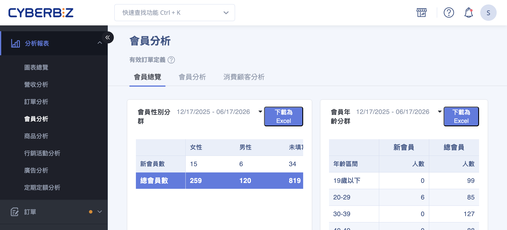
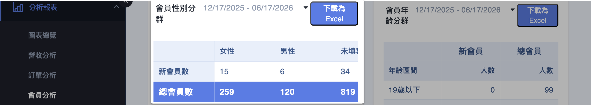
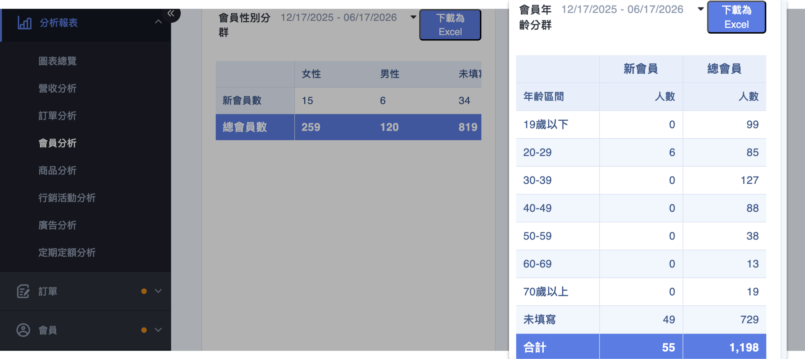
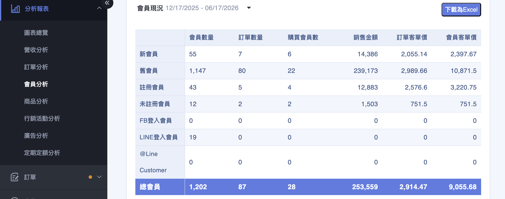
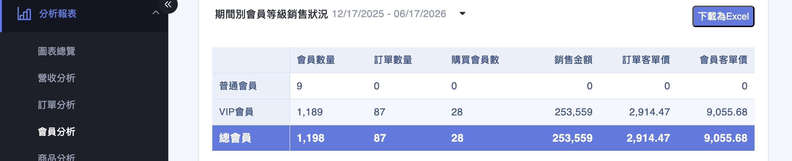
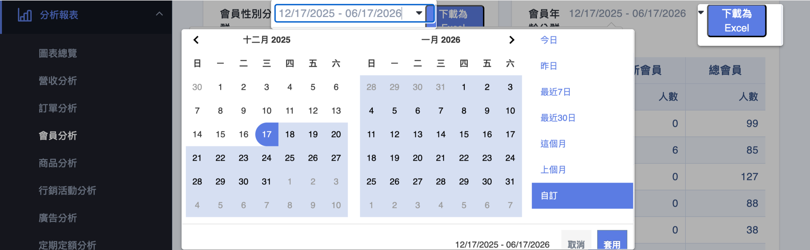

{ title="會員總覽頁" .hero-page }

## 會員總覽介紹 { #intro-member-overview }

「會員總覽」是會員分析頁面中的一個分頁，提供比「會員分析」更細緻的會員屬性資料。它以表格呈現不同性別、年齡、註冊來源與會員等級的會員人數與銷售狀況，並可將各表格下載為 Excel，方便精準行銷與受眾規劃。

頁面包含以下幾個區塊：

- **會員性別分群**：不同性別的會員人數。
- **會員年齡分群**：不同年齡區間的會員人數。
- **會員現況**：依註冊狀態與登入來源(FB、LINE 等)分類的會員數。
- **期間別會員等級銷售狀況**：VIP 會員與普通會員的銷售貢獻對比。
- **來自 LINE 購物銷售狀況**：來自 LINE 購物通路的銷售(需啟用 LINE 購物功能才會出現)。

## 使用前提與限制 { #prerequisites-member-overview }

### 方案開通條件 { #prerequisites-member-overview-plan }

「會員總覽」屬於進階的會員輪廓分析，僅在 **企業版** 顯示。

---

### 數據基準 { #prerequisites-member-overview-basis }

- **有效訂單**：銷售相關數字僅計入有效訂單，已取消、已退貨的訂單不列入。詳見[有效訂單定義](references/member-analysis-definitions-reference.md#reference-member-valid-order){ data-preview }。
- **更新時間**：數據為隔日更新，當天的下單與註冊不會即時出現。詳見[數據更新時間](references/member-analysis-definitions-reference.md#reference-member-update-time){ data-preview }。

## 頁面功能總覽 { #overview-member-overview }

| 區塊 | 類型 | 看什麼 |
| :-- | :-- | :-- |
| [會員性別分群](#operate-member-overview-gender) | 表格 | 男性、女性、未填寫的會員人數 |
| [會員年齡分群](#operate-member-overview-age) | 表格 | 各年齡區間的會員人數 |
| [會員現況](#operate-member-overview-status) | 表格 | 依註冊狀態與登入來源分類的會員數 |
| [期間別會員等級銷售狀況](#operate-member-overview-levels) | 表格 | VIP 會員與普通會員的銷售貢獻對比 |
| [來自LINE購物銷售狀況](#operate-member-overview-line) | 表格 | 來自 LINE 購物通路的銷售狀況 |

各分類的詳細意義，請參考[會員現況與註冊來源對照表](references/member-status-registration-sources-reference.md#reference-member-registration-sources){ title="會員現況與註冊來源對照表" data-preview }、[會員年齡分群對照表](references/member-age-groups-reference.md#reference-member-age-groups){ title="會員年齡分群對照表" data-preview } 與[會員等級銷售狀況對照表](references/member-level-sales-status-reference.md#reference-member-levels){ title="會員等級銷售狀況對照表" data-preview }。

## 操作步驟 { #operate-member-overview }

各表格在進入分頁後會自動載入，以下說明如何解讀、調整區間與下載。

### 查看會員性別分群 { #operate-member-overview-gender }

「會員性別分群」以表格列出 **男性**、 **女性** 與 **未填寫** 的會員人數，協助調整商品文案與廣告受眾。

{ title="會員性別分群" }

---

### 查看會員年齡分群 { #operate-member-overview-age }

「會員年齡分群」依年齡區間(19 歲以下至 70 歲以上，以及未填寫)列出人數。各區間的定義請見[會員年齡分群對照表](references/member-age-groups-reference.md#reference-member-age-groups){ data-preview }。

{ title="會員年齡分群" }

---

### 查看會員現況與註冊來源 { #operate-member-overview-status }

1. **看註冊狀態：** 「會員現況」區分 **新會員**、 **舊會員**、 **註冊會員** 與 **未註冊會員**，了解名單的組成。
2. **看登入來源：** 同一區塊也會列出 **FB登入會員**、 **LINE登入會員** 與 **已綁定LINE@會員** 等來源，比較不同來源的會員規模。各分類意義請見[會員現況與註冊來源對照表](references/member-status-registration-sources-reference.md#reference-member-registration-sources){ data-preview }。

{ title="會員現況與註冊來源" }

??? info "客單價計算方式"
    - **訂單客單價**：時間區間內（新會員、舊會員、註冊會員、未註冊會員、FB 登入會員、LINE 登入會員、已綁定 LINE@ 會員等）各分群會員總銷售金額 ÷ 各訂單總數（取小數點後 2 位、四捨五入）
    - **會員客單價**：時間區間內（新會員、舊會員、註冊會員、未註冊會員、FB 登入會員、LINE 登入會員、已綁定 LINE@ 會員等）各分群會員總銷售金額 ÷ 各購買會員數（取小數點後 2 位、四捨五入）

---

### 比較 VIP 與普通會員的銷售 { #operate-member-overview-levels }

1. **看等級貢獻：** 「期間別會員等級銷售狀況」將會員分為 **VIP會員** 與 **普通會員**，對比兩者在指定期間內的銷售狀況，評估會員分級制度的成效。VIP 與普通會員的分界依您設定的門檻而定，詳見[會員等級銷售狀況對照表](references/member-level-sales-status-reference.md#reference-member-levels){ data-preview }。

{ title="會員等級銷售狀況" }

??? note "VIP 判定規則"
    VIP 與普通會員的分類以 **當前的會員狀態** 為準（非下單時的狀態）。只要顧客目前是 VIP 會員，無論該筆訂單是否使用 VIP 優惠，都會計入 VIP 群組。

??? info "客單價計算方式"
    - **訂單客單價**：時間區間內（普通會員或 VIP 會員）各會員總銷售金額 ÷ 各訂單總數（取小數點後 2 位、四捨五入）
    - **會員客單價**：時間區間內（普通會員或 VIP 會員）各會員總銷售金額 ÷ 各購買會員數（取小數點後 2 位、四捨五入）

---

### 查看 LINE 購物 { #operate-member-overview-line }

「來自 LINE 購物銷售狀況」區塊列出來自 LINE 購物通路的銷售數據。此區塊需啟用 LINE 購物功能才會出現。

{ title="LINE 購物銷售狀況" }

---

### 調整區間與下載 Excel { #operate-member-overview-export }

1. **調整時間區間：** 各表格右上角有獨立的日期區間欄位，點擊後可選擇預設區間或自訂起訖日期，再點 **「套用」** 重新載入。
2. **下載報表：** 點擊表格的 **「下載為Excel」**，即可將該表格資料匯出為 Excel 檔，方便進一步分析或匯入廣告平台規劃受眾。

{ title="調整區間與下載" }

## 重要規範與限制 { #specs-member-overview }

- **僅計入有效訂單：** 銷售相關數字不含已取消、已退貨的訂單。
- **數據為隔日更新：** 當天的下單與註冊不會即時反映。
- **LINE 購物區塊為動態顯示：** 「來自Line購物銷售狀況」需啟用 LINE 購物功能才會出現。
- **年齡依生日即時換算：** 未填寫生日的會員會歸入「未填寫」。

## 後續操作 { #next-steps-member-overview }

- :lucide-chart-line:{ .lg }  
  [__會員分析__](member-analysis.md){ title="會員分析" }  
  回到預設分頁，掌握會員規模、成長與回購趨勢。

- :lucide-repeat:{ .lg }  
  [__消費顧客分析__](customer-analysis.md){ title="消費顧客分析" }  
  以新舊客切分，深入看訂單貢獻與回購表現。

## 常見問題 { #faq-member-overview }

??? quote "「未填寫」的會員人數很多"
    { #faq-member-overview-unfilled }
    這代表許多會員尚未填寫性別或生日資料。

    - 性別、年齡分群依會員填寫的資料統計，未填寫者會集中歸入「未填寫」。
    - 可在會員經營或活動中引導會員補齊資料，以提升分群精準度。

## 參考資料 { #reference-member-overview }

- [會員現況與註冊來源對照表](references/member-status-registration-sources-reference.md)
- [會員年齡分群對照表](references/member-age-groups-reference.md)
- [會員等級銷售狀況對照表](references/member-level-sales-status-reference.md)
- [會員分析共用定義](references/member-analysis-definitions-reference.md)
