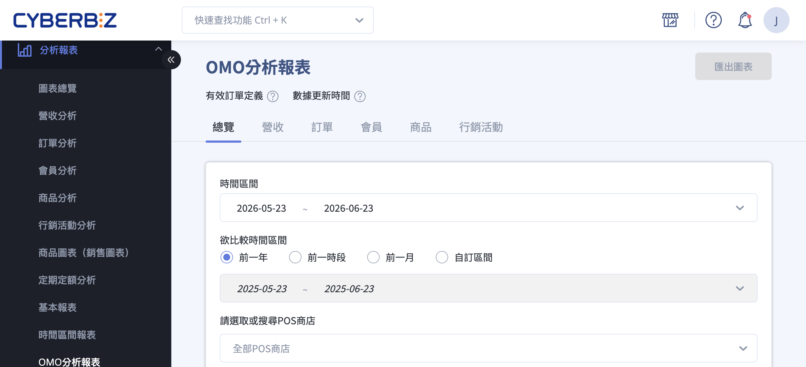{ .hero-page }

## OMO 分析報表說明 { #intro-omo }

「OMO分析報表」把您線上官網（EC）與線下實體門市（POS）的數據整合在同一個頁面，讓您不再需要分開兩套系統各看各的，就能直接比較兩個通路的營收、訂單、會員、商品與行銷表現，掌握全通路的整體經營狀況。

報表依分析主題分為六個頁籤：「總覽」、「營收」、「訂單」、「會員」、「商品」與「行銷活動」。每個頁籤都可以依時間區間、比較區間與 POS 商店進行篩選，並與過去的同一段期間做對比，協助您判斷成長趨勢與行銷成效。

## 使用前提與限制 { #prerequisites-omo }

### 開通條件 { #prerequisites-omo-plan }

!!! plan "方案 / 開通條件"
    「OMO分析報表」需要您的商店已開通並使用 **CYBERBIZ POS**，報表才會在後台選單出現並可進入，也才能呈現線下門市的數據。未開通 POS 的商店不會看到此報表。如需開通，請聯絡客服或您的開店顧問。

---

### 數據基準 { #prerequisites-omo-basis }

- **有效訂單**：報表所有數字僅計入有效訂單，已取消、已退貨的訂單不列入。詳見[有效訂單定義](references/omo-definitions-reference.md#reference-omo-valid-order){ title="OMO 分析報表共用定義" data-preview }。
- **更新時間**：數據為隔日批次更新，當天剛成立的訂單與剛註冊的會員不會即時出現。詳見[數據更新時間](references/omo-definitions-reference.md#reference-omo-update-time){ title="OMO 分析報表共用定義" data-preview }。

## 頁面功能總覽 { #overview-omo }

報表分為六個頁籤，先用下表快速掌握各頁籤的重點，再依需求往下看各頁籤的詳細內容。各項指標的計算方式與名詞意義，請參考[名詞定義對照表](references/omo-definitions-reference.md#reference-omo-glossary){ title="OMO 分析報表共用定義" data-preview }。

| 頁籤 | 看什麼 |
| :-- | :-- |
| [總覽](#overview-omo-summary) | 營收、訂單數、註冊會員數的 EC/POS 對比與增減，平均訂單金額，以及 EC/POS 商品銷量 TOP10 |
| [營收](#overview-omo-revenue) | EC/POS 營業額與趨勢圖，以及 EC/POS 營收熱點圖 |
| [訂單](#overview-omo-order) | EC/POS 訂單數與平均訂單金額趨勢，以及門市取貨/POS門市取貨的訂單數與金額 |
| [會員](#overview-omo-member) | EC/POS 註冊會員數、POS快速登入會員完成註冊率、會員平均消費金額比對，以及購買與回購狀況 |
| [商品](#overview-omo-product) | EC/POS 商品銷量與銷售金額 TOP10，以及同 SKU 商品的銷售列表 |
| [行銷活動](#overview-omo-marketing) | EC/POS 紅利使用數與趨勢圖 |

### 總覽 { #overview-omo-summary }

快速綜覽全通路核心指標，適合每天開店第一眼掌握整體狀況：

- **核心指標卡**：營收、訂單數、註冊會員數，分別呈現 EC 與 POS 的數值，並與比較區間對照增減。

    === "營收"
        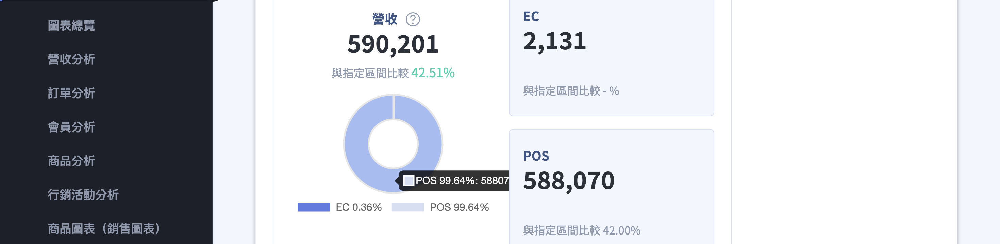

    === "訂單數"
        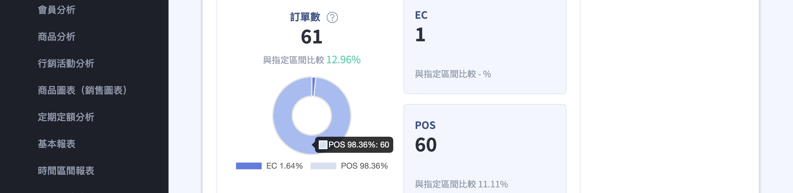

    === "註冊會員數"
        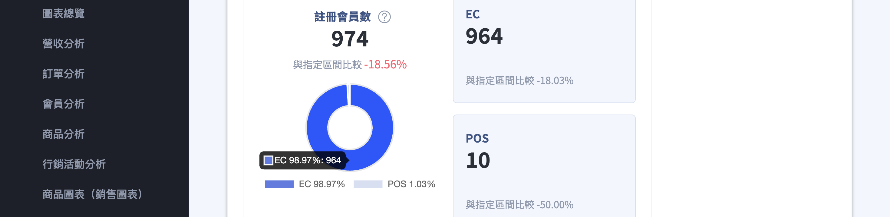

- **平均訂單金額**：以「總營業額 ÷ 總訂單數」呈現 EC 與 POS 的客單價。詳見[平均訂單金額](references/omo-definitions-reference.md#reference-omo-glossary){ title="OMO 分析報表共用定義" data-preview }。

    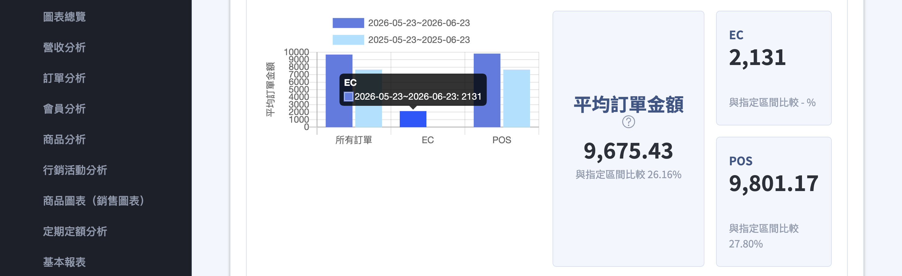

- **商品銷量 TOP10**：分別列出 EC 與 POS 銷量前 10 名的商品。

    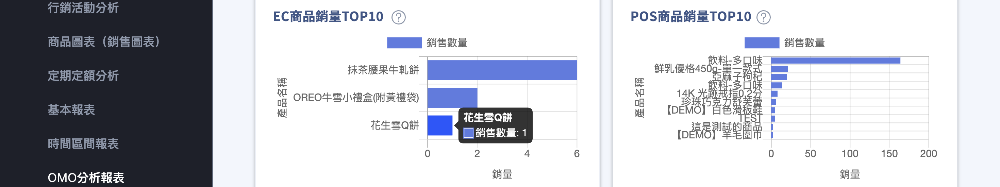

---

### 營收 { #overview-omo-revenue }

聚焦線上線下的營業額表現與時段分布：

- **EC/POS 營業額與趨勢圖**：看兩個通路的營業額隨時間的變化。

    === "營業額指標"
        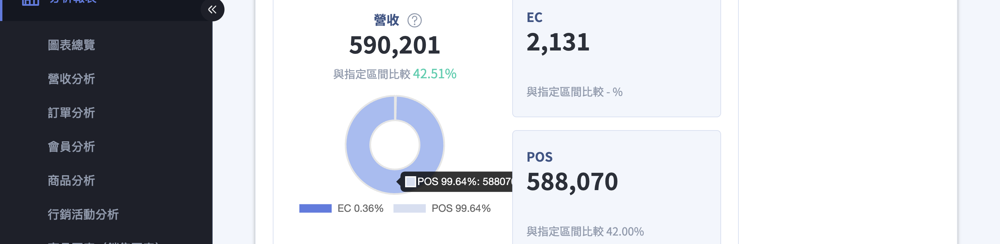

    === "營業額趨勢圖"
        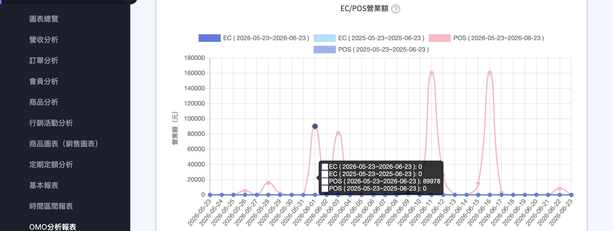

- **EC/POS 營收熱點圖**：以顏色深淺呈現各時段營收高低，顏色越深代表該時段營收越高，可作為安排行銷活動或直播時段的參考。詳見[營收熱點圖](references/omo-definitions-reference.md#reference-omo-glossary){ title="OMO 分析報表共用定義" data-preview }。

    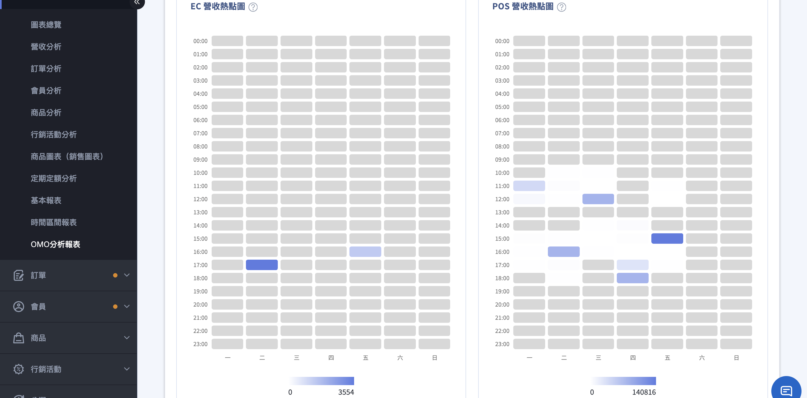

---

### 訂單 { #overview-omo-order }

分析訂單量、客單價與門市取貨的導購成效：

- **EC/POS 訂單數與平均訂單金額趨勢**：看兩個通路的單量與客單價變化。

    === "訂單數"
        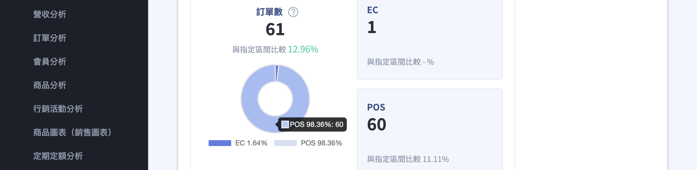{ title="訂單數指標卡" }
        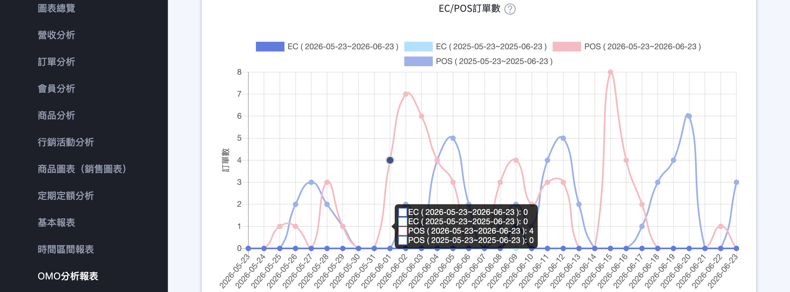{ title="訂單數趨勢圖" }

    === "平均訂單金額"

        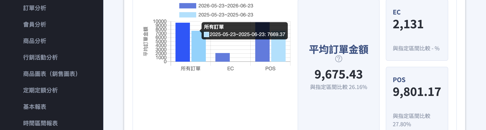{ title="平均訂單金額指標卡" }
        
        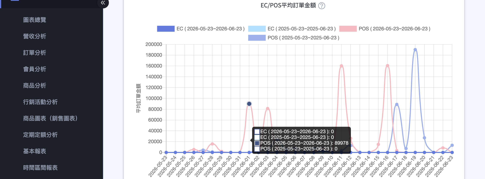{ title="平均訂單金額趨勢圖" }

- **門市取貨/POS門市取貨分析**：統計門市取貨與 POS 門市取貨的訂單數與訂單金額，掌握線上線下導購轉單成效。詳見[門市取貨／POS門市取貨](references/omo-definitions-reference.md#reference-omo-glossary){ title="OMO 分析報表共用定義" data-preview }。

    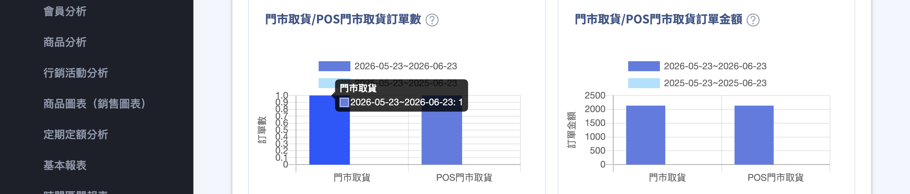{ title="門市取貨／POS門市取貨" }

---

### 會員 { #overview-omo-member }

了解會員從哪個通路來、註冊完成度與跨通路消費表現：

- **註冊會員數與完成註冊率**：EC 與 POS 的註冊會員數，以及 POS快速登入會員完成註冊率。詳見[POS快速登入會員完成註冊率](references/omo-definitions-reference.md#reference-omo-glossary){ title="OMO 分析報表共用定義" data-preview }。

    === "會員數"
        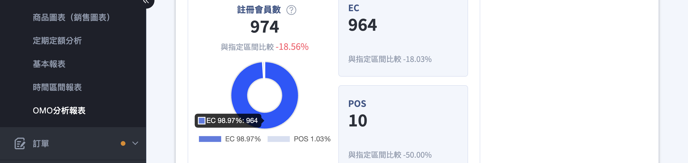{ title="會員數指標卡" }
        
        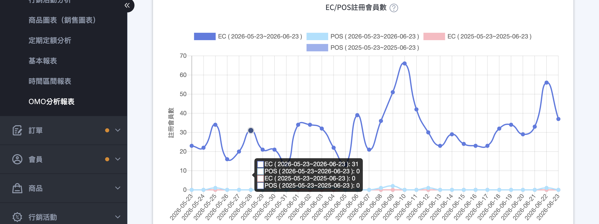{ title="會員數趨勢圖" }

    === "完成註冊率"
        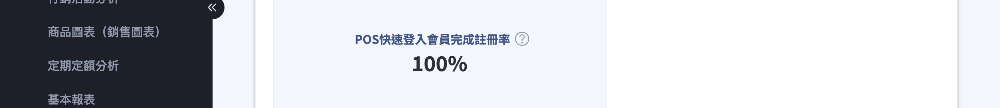{ title="完成註冊率" }

- **會員平均消費金額比對**：比較 EC 註冊與 POS 註冊會員在各通路的平均消費，判斷哪種來源的客群貢獻較高。

    === "全部會員"
        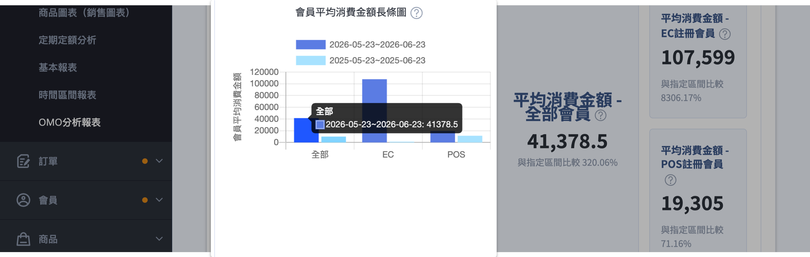{ title="各註冊來源會員平均消費金額比較" }
        
        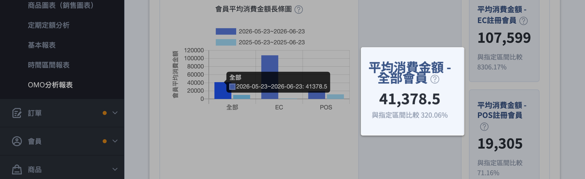{ title="全部會員平均消費金額" }

    === "EC平均消費金額"
        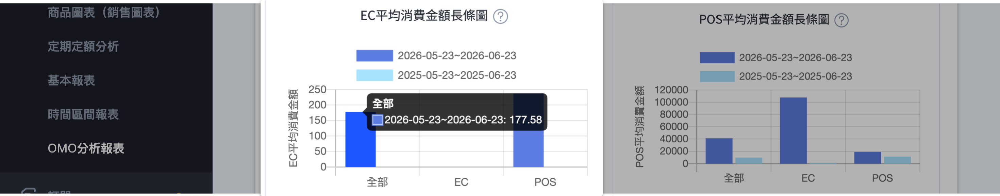{ title="EC各註冊來源會員平均消費金額比較" }
        
        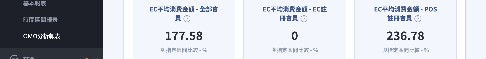{ title="EC平均消費金額" }

    === "POS平均消費金額"
        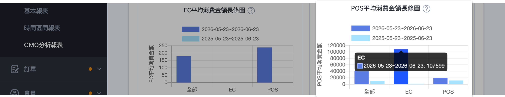{ title="POS各註冊來源會員平均消費金額比較" }
        
        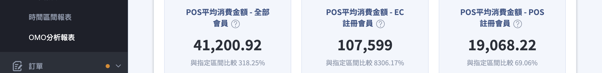{ title="POS平均消費金額" }

- **會員購買與回購狀況**：以會員首次註冊來源區分，看其在 EC、POS 的購買與回購表現，並提供整體回購率。詳見[回購率](references/omo-definitions-reference.md#reference-omo-glossary){ title="OMO 分析報表共用定義" data-preview }。

    === "購買狀況"
        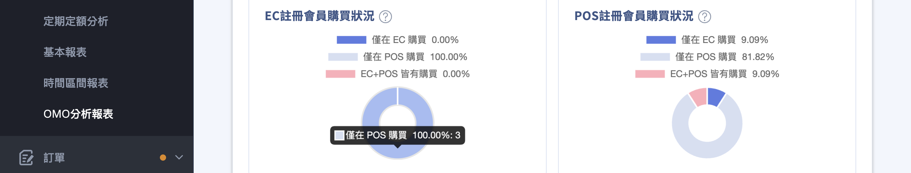{ title="購買狀況" }

    === "回購狀況"
        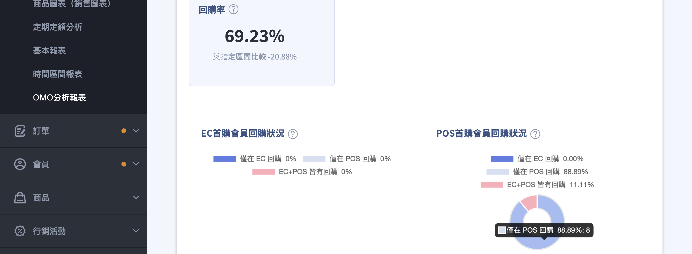{ title="回購狀況" }

---

### 商品 { #overview-omo-product }

掌握全通路的熱賣商品與同品項跨通路銷售：

- **商品銷量 TOP10**：EC 與 POS 各自的銷售數量前 10 名。

    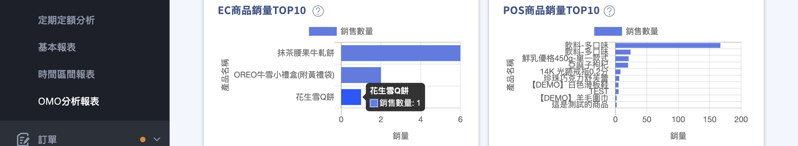{ title="商品銷量 TOP10" }

- **商品銷售金額 TOP10**：EC 與 POS 各自的銷售金額前 10 名。

    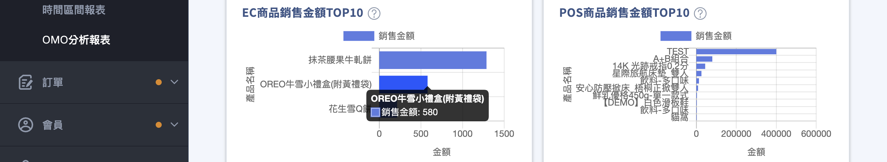{ title="商品銷售金額 TOP10" }

- **商品銷售列表**：以 SKU 比對同一商品在 EC 與 POS 的訂單數與銷售金額，依總銷售金額排序。

    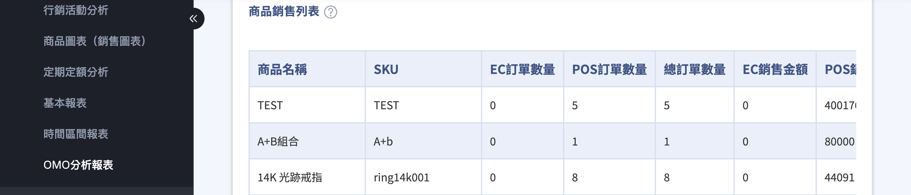{ title="商品銷售列表" }

!!! warning "SKU 一致性"
    商品需同 SKU 才會合併統計。「商品」頁籤的商品銷售列表依 SKU 比對 EC 與 POS 的銷售，若同一商品在兩通路的 SKU 設定不一致，將無法合併為同一列統計。

---

### 行銷活動 { #overview-omo-marketing }

監控紅利點數在線上線下的使用情形：

- **紅利使用數與趨勢圖**：指定時間內 EC 與 POS 的紅利點數折抵與使用狀況。

=== "使用數指標"
    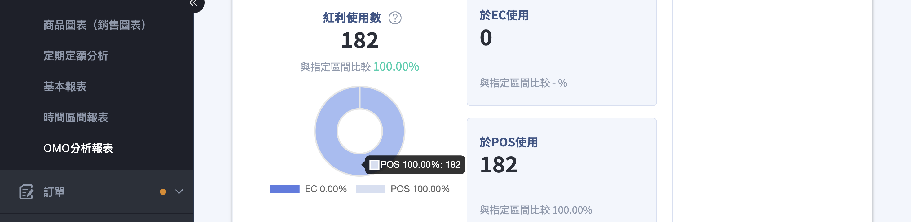{ title="紅利使用數指標" }

=== "趨勢圖"
    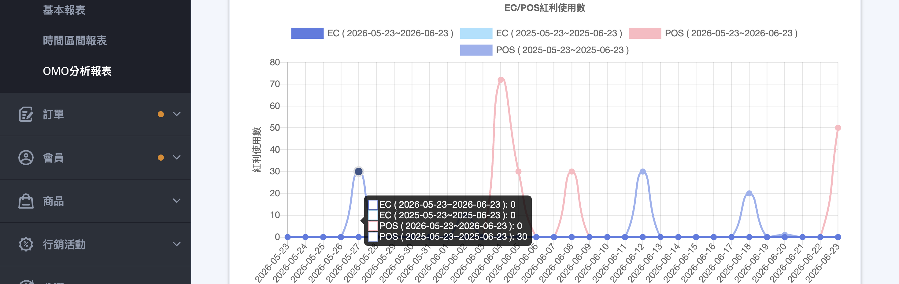{ title="紅利使用數趨勢圖" }

## 操作步驟 { #operate-omo }

進入報表後，先在頁面上方設定要分析的區間與門市，再切換頁籤查看不同主題的數據。

### 設定分析區間 { #operate-omo-period }

1. **進入報表：** 前往後台路徑：「分析報表」>「OMO分析報表」。
2. **選擇時間區間：** 在頁面上方的「時間區間」選擇要分析的起訖日期。

    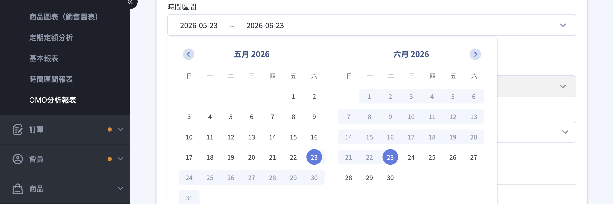{ title="選擇時間區間" }

3. **選擇比較區間：** 在「欲比較時間區間」選擇對比基準，可選「前一年」、「前一時段」、「前一月」或「自訂區間」[^1]。各選項意義見[比較區間選項對照表](references/omo-definitions-reference.md#reference-omo-compare){ title="OMO 分析報表共用定義" data-preview }。

    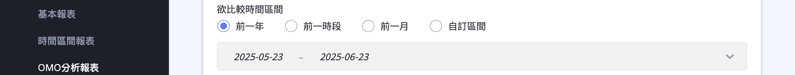{ title="選擇比較區間" }

4. **篩選 POS 商店：** 在「請選取或搜尋POS商店」欄位選擇要納入的門市，可同時選取多家；不選取則預設涵蓋「全部POS商店」。

    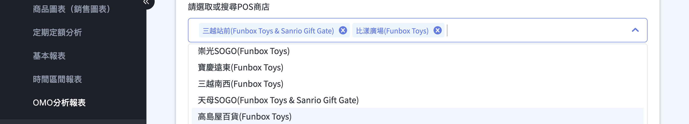{ title="篩選 POS 商店" }
5. **套用篩選：** 點擊 **「確認」**，所選的時間、比較區間與門市條件會一次套用到頁面內所有圖表。

[^1]: 報表預設的時間區間為「過去一個月至今日」，比較區間預設為「前一年」同期。

---

### 切換報表頁籤 { #operate-omo-tabs }

1. **切換頁籤：** 點擊頁面上方的「總覽」、「營收」、「訂單」、「會員」、「商品」或「行銷活動」，即可切換到對應的分析內容。
2. **沿用篩選條件：** 切換頁籤時，已設定的時間區間、比較區間與 POS 商店篩選會延續套用，不需重新設定。

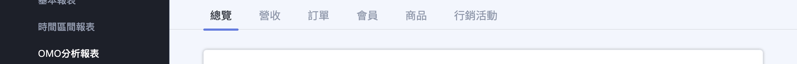{ title="切換報表頁籤" }

!!! tip "技巧"
    報表提供 **「匯出圖表」** 功能，可將圖表數據匯出，方便另存或進一步分析。

## 重要規範與限制 { #specs-omo }

- **僅計入有效訂單：** 報表所有數字不含已取消、已退貨的訂單，因此可能與訂單列表的總金額不一致。
- **數據為隔日更新：** 流量、轉換率數據於隔日下午五點半更新，其餘數據於隔日凌晨零點更新，取消與退貨訂單會定時更新排除。
- **需有 CYBERBIZ POS 才會顯示：** 未開通 POS 的商店看不到此報表，也無法呈現線下門市數據。
- **商品需同 SKU 才會合併統計：** 「商品」頁籤的商品銷售列表依 SKU 比對 EC 與 POS 的銷售，若同一商品在兩通路的 SKU 設定不一致，將無法合併為同一列統計。

## 後續操作 { #next-steps-omo }

- :lucide-dollar-sign:{ .lg }  
  [__營收__](revenue-analysis.md)  
  深入看官網的營收組成與成長趨勢。

- :lucide-users:{ .lg }  
  [__會員分析__](member-analysis.md)  
  掌握會員規模、成長與回購趨勢。

- :lucide-repeat:{ .lg }  
  [__消費顧客分析__](customer-analysis.md)  
  以新舊客切分，深入看訂單貢獻與回購表現。

- :lucide-file-text:{ .lg }  
  [__讓OMO分析報表成為您的規劃助理__](https://drive.google.com/file/d/1rZ8ZXbhTkOYl4mX250o-2cdfMoeQSmnJ/view)  
  PDF 指南，學習如何運用 OMO 數據規劃營運策略。

## 常見問題 { #faq-omo }

??? quote "後台選單找不到「OMO分析報表」"
    { #faq-omo-missing-menu }
    「OMO分析報表」需要先開通並使用 CYBERBIZ POS 才會顯示。

    - 未開通 POS 的商店不會在「分析報表」下看到此項目。
    - 如需開通，請聯絡客服或您的開店顧問。

??? quote "數據對不上 / 今天的訂單還沒出現"
    { #faq-omo-data-delay }
    報表為隔日批次更新，並非即時統計。

    - 流量、轉換率數據於隔日下午五點半更新，其餘數據於隔日凌晨零點更新。
    - 取消與退貨訂單會定時更新排除，因此數字可能與訂單列表的總金額不同。詳見[有效訂單定義](references/omo-definitions-reference.md#reference-omo-valid-order){ title="OMO 分析報表共用定義" }。

??? quote "同一商品在 EC 與 POS 沒有合併計算"
    { #faq-omo-sku-merge }
    「商品」頁籤依 SKU 比對兩個通路的銷售，需 SKU 一致才會合併。

    - 若同一商品在 EC 與 POS 的 SKU 設定不同，會被視為兩筆不同商品分開列出。
    - 建議將兩通路的同一商品設定相同 SKU，數據才能合併統計。

??? quote "「回購率」是怎麼計算的"
    { #faq-omo-repurchase }
    回購率指指定時間內回頭客占有消費客戶的百分比。

    - 計算方式為「該期間回頭客數 ÷ 該期間有消費客戶總數」。
    - 詳細名詞說明見[名詞定義對照表](references/omo-definitions-reference.md#reference-omo-glossary){ title="OMO 分析報表共用定義" }。

??? quote "「POS快速登入會員完成註冊率」代表什麼"
    { #faq-omo-fast-registration }
    指由 POS 快速註冊的會員，完成填寫資料、註冊流程的比率。

    - 若商店設定不需驗證帳號即可註冊、結帳，則直接視為完成註冊。
    - 詳見[名詞定義對照表](references/omo-definitions-reference.md#reference-omo-glossary){ title="OMO 分析報表共用定義" }。

## 參考資料 { #reference-omo }

- [OMO 分析報表共用定義](references/omo-definitions-reference.md)
