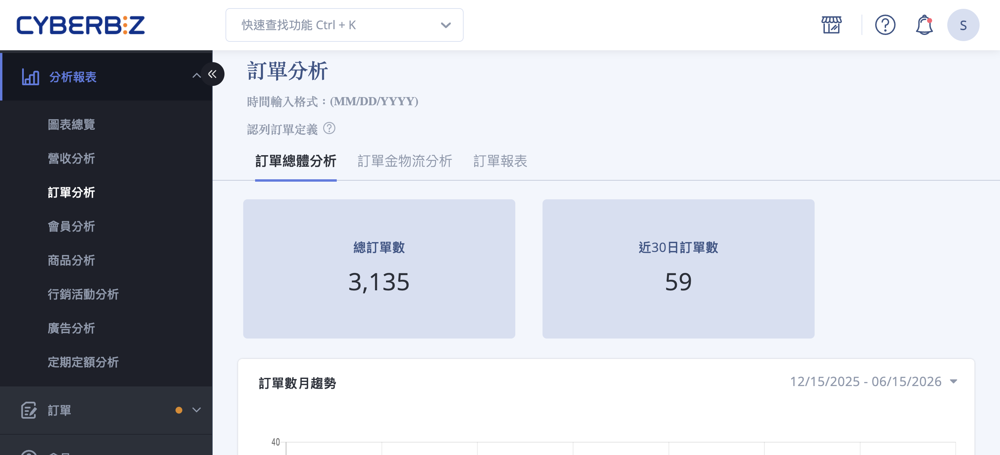{ title="訂單分析頁" .hero-page }

## 訂單分析說明 { #intro-order-analysis }

「訂單分析」是商店掌握經營成效的報表頁面，從宏觀的銷售趨勢到細部的取消率、退貨率、導購來源，協助您快速看懂訂單的整體健康度。

整個頁面分為三個分頁： **訂單總體分析**(整體銷售趨勢與健康度指標)、 **訂單金物流分析**(付款與出貨的偏好)、 **訂單報表**(提供可下載業績明細表)。

## 頁面功能總覽 { #overview-order-analysis }

| 分頁 | 商家可看到的內容 |
| :-- | :-- |
| 訂單總體分析 | 商店整體的訂單量、客單價、單筆訂單金額與商品數分布，以及取消率、退貨率等健康度指標。 |
| 訂單金物流分析 | 依付款方式、出貨方式、第三方導購拆解的訂單數趨勢、占比、平均客單價與退貨率。 |
| 訂單報表 | 日期區間對比、各時段業績、每日業績三張可下載成 Excel 的表格。 |

### 訂單總體分析的圖表 { #overview-order-analysis-overall }

| 圖表 | 看什麼 | 說明 |
| :-- | :-- | :-- |
| 總訂單數 | 全店累計的認列訂單筆數。 | [前往](#總訂單數) |
| 近 30 日訂單數 | 近 30 日訂單數，含變動值。 | [前往](#近-30-日訂單數) |
| 訂單數月趨勢 | 各月訂單數量（依訂單成立時間）。 | [前往](#訂單數月趨勢) |
| 每日平均訂單數量（月趨勢） | 各月每日平均訂單數，含近 30 日與變動值。 | [前往](#每日平均訂單數量月趨勢) |
| 單筆訂單金額月趨勢 | 各月依金額級距分組的訂單筆數。 | [前往](#單筆訂單金額月趨勢) |
| 單筆訂單金額月趨勢 比例 | 所選月份各金額級距占比。 | [前往](#單筆訂單金額月趨勢-比例) |
| 單筆訂單金額（占比） | 區間內各金額級距占比。 | [前往](#單筆訂單金額占比) |
| 單筆訂單商品數（占比） | 各商品數量級距占比（含加價購與滿額贈）。 | [前往](#單筆訂單商品數占比) |
| 每日平均訂單金額（月趨勢） | 各月每日平均訂單金額，含近 30 日與變動值。 | [前往](#每日平均訂單金額月趨勢) |
| 訂單取消率月趨勢 | 各月取消率，含近 30 日與變動值。 | [前往](#訂單取消率月趨勢) |
| 訂單退貨率月趨勢 | 各月退貨率，含近 30 日與變動值。 | [前往](#訂單退貨率月趨勢) |

各指標的詳細定義，請見 [訂單總體分析指標對照](references/order-analysis-overview-metrics-reference.md#reference-order-analysis-overview-metrics){ data-preview }。

---

### 訂單金物流分析的圖表 { #overview-order-analysis-finance-logistics }

=== "付款方式"
    | 圖表 | 看什麼 | 說明 |
    | :-- | :-- | :-- |
    | 訂單數（月趨勢） | 各月各付款方式的訂單數。 | [前往](#read-order-analysis-read-payment) |
    | 占比（月趨勢） | 各月各付款方式的訂單占比。 | [前往](#read-order-analysis-read-payment) |
    | 占比（區間） | 區間內各付款方式的訂單占比。 | [前往](#read-order-analysis-read-payment) |
    | 平均訂單金額（月趨勢） | 各月各付款方式的平均訂單金額。 | [前往](#read-order-analysis-read-payment) |
    | 平均訂單金額（區間） | 區間各付款方式的平均訂單金額。 | [前往](#read-order-analysis-read-payment) |
    | 退貨率（月趨勢） | 各月各付款方式的退貨率。 | [前往](#read-order-analysis-read-payment) |
    | 退貨率（區間） | 區間各付款方式的退貨率。 | [前往](#read-order-analysis-read-payment) |

=== "出貨方式"
    | 圖表 | 看什麼 | 說明 |
    | :-- | :-- | :-- |
    | 訂單數（月趨勢） | 各月各出貨方式的訂單數。 | [前往](#read-order-analysis-read-shipping) |
    | 占比（月趨勢） | 各月各出貨方式的認列訂單占比。 | [前往](#read-order-analysis-read-shipping) |
    | 占比（區間） | 區間各出貨方式的認列訂單占比。 | [前往](#read-order-analysis-read-shipping) |
    | 平均客單價（月趨勢） | 各月各出貨方式的平均訂單金額。 | [前往](#read-order-analysis-read-shipping) |
    | 平均客單價（區間） | 區間各出貨方式的平均訂單金額。 | [前往](#read-order-analysis-read-shipping) |
    | 退貨率（月趨勢） | 各月各出貨方式的退貨率。 | [前往](#read-order-analysis-read-shipping) |
    | 退貨率（區間） | 區間各出貨方式的退貨率。 | [前往](#read-order-analysis-read-shipping) |

=== "第三方導購"
    | 圖表 | 看什麼 | 說明 |
    | :-- | :-- | :-- |
    | 訂單數（月趨勢） | 各月各來源的訂單數。 | [前往](#read-order-analysis-read-third-party) |
    | 占比（區間） | 區間各來源的認列訂單占比。 | [前往](#read-order-analysis-read-third-party) |
    | 平均客單價（月趨勢） | 各月各來源的平均訂單金額。 | [前往](#read-order-analysis-read-third-party) |
    | 平均客單價（區間） | 區間各來源的平均訂單金額。 | [前往](#read-order-analysis-read-third-party) |
    | 退貨率（月趨勢） | 各月各來源的退貨率。 | [前往](#read-order-analysis-read-third-party) |
    | 退貨率（區間） | 區間各來源的退貨率。 | [前往](#read-order-analysis-read-third-party) |

各圖表的詳細定義，請見 [訂單金物流分析圖表對照](references/order-analysis-finance-logistics-reference.md#reference-order-analysis-finance-logistics){ title="訂單金物流分析圖表對照" data-preview }。

!!! note "母數差異"
    付款方式的占比以 **總訂單數** 為母數；出貨方式、第三方導購的占比與平均客單價以 [認列訂單](#prerequisites-order-analysis-recognized-order){ title="認列訂單定義" } 為母數。各維度退貨率分母一律為「非取消訂單」。

<!---->
<!-- ### 訂單總體分析的圖表 { #overview-order-analysis-overall } -->
<!---->
<!-- | 區塊 | 圖表類型 | 看什麼 | -->
<!-- | :-- | :-- | :-- | -->
<!-- | 總訂單數 | 數字卡 | 全店累計的認列訂單筆數。 | -->
<!-- | 近 30 日訂單數 | 數字卡（含變動值） | 最近 30 日的訂單數，並比較過去 30 日與長期平均的變動值。 | -->
<!-- | 訂單金額分布 | 圖表 | 認列訂單依訂單金額級距的分布。 | -->
<!-- | 商品數分布 | 圖表 | 認列訂單依商品數量級距的分布。 | -->
<!-- | 取消率趨勢 | 趨勢圖 | 取消率隨時間的變化。 | -->
<!-- | 退貨率趨勢 | 趨勢圖 | 退貨率隨時間的變化（以排除取消後的認列訂單為母數）。 | -->
<!---->
<!---->
<!-- 各指標的詳細定義，請見 [訂單總體分析指標對照][reference-order-analysis-overview-metrics]{ data-preview }。 -->
<!---->
<!-- --- -->
<!---->
<!-- ### 訂單金物流分析的圖表 { #overview-order-analysis-finance-logistics } -->
<!---->
<!-- | 維度 | 圖表類型 | 看什麼 | -->
<!-- | :-- | :-- | :-- | -->
<!-- | 付款方式 | 占比 / 明細 | 各付款方式的訂單數、占比、平均客單價與退貨率。 | -->
<!-- | 出貨方式 | 占比 / 明細 | 各出貨方式的訂單數、占比、平均客單價與退貨率。 | -->
<!-- | 第三方導購 | 占比 / 明細 | 各導購來源的訂單數、占比、平均客單價與退貨率（需已串接導購平台才顯示）。 | -->
<!---->
<!---->
<!-- 各圖表的詳細定義，請見 [訂單金物流分析圖表對照][reference-order-analysis-finance-logistics]{ data-preview }。 -->

---

### 訂單報表的表格 { #overview-order-analysis-report }

| 表格 | 看什麼 |
| :-- | :-- |
| 日期區間對比 | 兩個日期區間的業績對比。 |
| 時間別業績狀況 | 各時段的業績表現。 |
| 每日業績狀況 | 每日的業績表現。 |

各表的欄位意義請見 [訂單報表欄位對照](references/order-analysis-report-fields-reference.md){ title="訂單報表欄位對照" }。

## 使用前提與限制 { #prerequisites-order-analysis }

### 認列訂單定義 { #prerequisites-order-analysis-recognized-order }

訂單分析的數據並非把所有訂單都算進去，而是只計算「認列訂單」。認列訂單需同時符合兩個條件：

- [x] **訂單狀態**：為「非取消訂單」。
- [x] **退貨狀態**：為「不需退貨或拒絕退貨」。

也就是說，已取消的訂單，以及退貨成立的訂單，都不會被算進銷售數據。

---

### 方案差異 { #prerequisites-order-analysis-plan }

「訂單金物流分析」與「訂單報表」兩個分頁，只適用 **企業版**。若您只看得到「訂單總體分析」一個分頁，代表您目前的方案不含另外兩個分頁。

??? plan "哪些方案只看得到「訂單總體分析」？"
    以下四種方案 **只會顯示「訂單總體分析」**，不會出現「訂單金物流分析」與「訂單報表」分頁：

    * 高手版
    * 高手PLUS版
    * 專業PLUS版
    * 進階PLUS版

---

### 第三方導購圖表的顯示條件 { #prerequisites-order-analysis-third-party }

「訂單金物流分析」中的 **第三方導購** 圖表，需要商店已串接導購平台才會出現。只要符合以下任一條件即會顯示：

* 已設定「美安夥伴商店」
* 已串接「LINE購物」

三者皆未啟用時，整組第三方導購圖表不會顯示。

---

## 操作步驟 { #operate-order-analysis }

### 進入訂單分析 { #operate-order-analysis-enter }

1. 於後台左側選單點選 **「分析報表」**。
2. 點選 **「訂單分析」**，即進入訂單分析頁面，預設停在「訂單總體分析」分頁。

---

### 切換分析分頁 { #operate-order-analysis-switch-tab }

頁面上方有分頁標籤，點選即可切換不同的分析角度：

1. 點選 **「訂單總體分析」**，查看整體銷售趨勢與健康度指標。
2. 點選 **「訂單金物流分析」**，查看付款方式、出貨方式與第三方導購的表現。
3. 點選 **「訂單報表」**，查看並下載業績明細表。

{ title="切換分析分頁" }

!!! info "提示"
    若您只看得到「訂單總體分析」一個分頁，屬於方案差異，請見 [方案差異](#prerequisites-order-analysis-plan){ title="方案差異" }。

---

### 調整圖表與報表的日期區間 { #operate-order-analysis-date-range }

每張圖表與報表都有各自獨立的日期選擇器，可單獨調整想觀察的期間：

1. 點選圖表(或報表)上的 **日期欄位**。
2. 選擇預設區間(最近 7 日、最近 30 日、這個月、上個月)或選「自訂」自行框選起訖日期。
3. 點選 **「套用」**，該圖表即依新的區間重新整理。

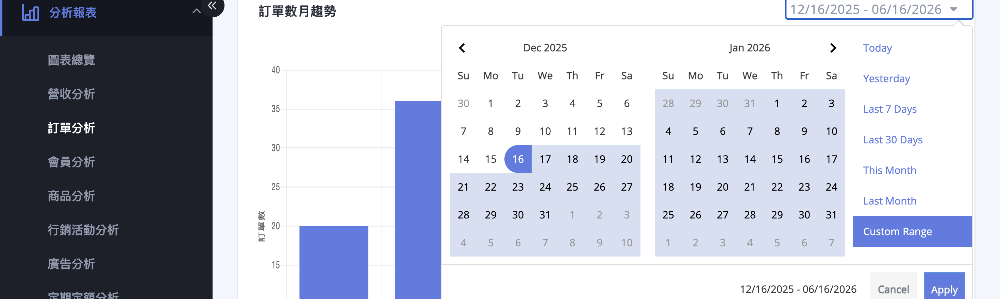{ title="調整日期區間" }

!!! note "註釋"
    日期格式為 MM/DD/YYYY。每張圖表是獨立調整的，調整其中一張不會影響其他圖表。

---

### 下載訂單報表為 Excel { #operate-order-analysis-download }

「訂單報表」分頁的三張表格都可以下載成 Excel 進一步分析：

1. 切換到 **「訂單報表」** 分頁。
2. 找到要下載的表格(日期區間對比、時間別業績狀況、每日業績狀況)。
3. 點選該表格右上角的 **「下載為Excel」** 按鈕，檔案即會下載。

=== "日期區間對比"

    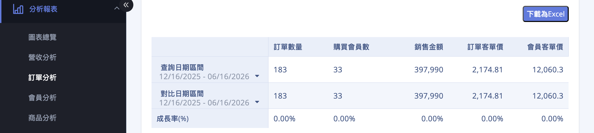{ title="日期區間對比" }

    欄位說明請見 [訂單報表欄位對照](references/order-analysis-report-fields-reference.md#reference-order-analysis-report-compare){ data-preview }。

=== "時間別業績狀況"

    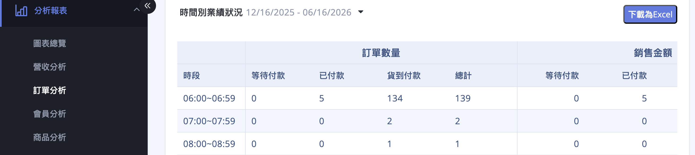{ title="時間別業績狀況" }

    欄位說明請見 [訂單報表欄位對照](references/order-analysis-report-fields-reference.md#reference-order-analysis-report-by-time){ data-preview }。

=== "每日業績狀況"

    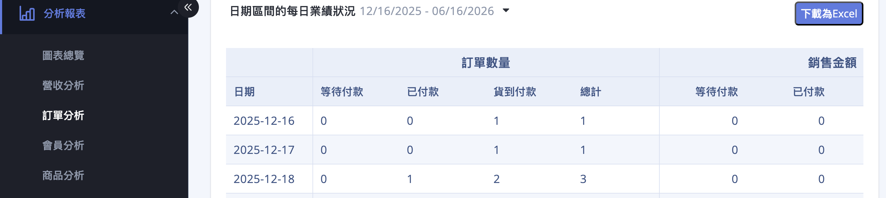{ title="每日業績狀況" }

    欄位說明請見 [訂單報表欄位對照](references/order-analysis-report-fields-reference.md#reference-order-analysis-report-daily){ data-preview }。

!!! tip "技巧"
    圖表類的區塊(訂單總體分析、訂單金物流分析)本身不提供下載；若需匯出資料，請使用「訂單報表」分頁的三張表格。

---

## 看懂訂單總體分析 { #read-order-analysis-overall }

「訂單總體分析」以數據卡與多張趨勢、占比圖呈現全店訂單的整體健康度。各圖表的完整定義與計算公式請見 [訂單總體分析指標對照](references/order-analysis-overview-metrics-reference.md#reference-order-analysis-overview-metrics){ data-preview }。

### 訂單數量 { #read-order-analysis-read-volume }

=== "總訂單數"

    網站開店以來累計的認列訂單總數。

    { title="總訂單數" }

=== "近 30 日訂單數"

    當下日期往前推 30 天的訂單數；卡片上的 **變動值**[^1] 比較過去 30 日與開站以來長期平均，正值代表成長。

    { title="近 30 日訂單數" }

=== "訂單數月趨勢"

    時間區間內每月的訂單數量（依訂單成立時間）。預設顯示當日往前推算 6 個月。

    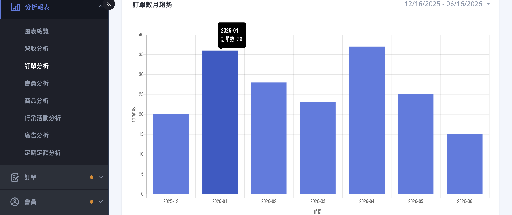{ title="訂單數月趨勢" }

=== "每日平均訂單數量（月趨勢）"

    各月的每日平均訂單數（當月總訂單數 ÷ 當月天數），另含 **近 30 日日均訂單數**[^6] 與 **變動值**[^2]。

    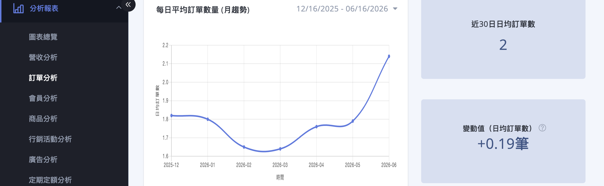{ title="每日平均訂單數量（月趨勢）" }

---

### 訂單金額與商品數 { #read-order-analysis-read-amount }

=== "單筆訂單金額月趨勢"

    各月依訂單金額級距分組的訂單筆數。例：2020 年 2 月，金額 0~1000 元的訂單有 3 筆。

    將滑鼠移到資料點上，即會顯示該金額級距的訂單筆數；點擊項目名稱，可隱藏或顯示該項目資料。

    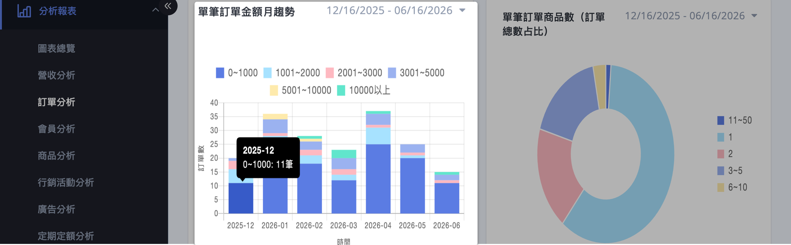{ title="單筆訂單金額月趨勢" }

=== "單筆訂單金額月趨勢 比例"

    所選月份各金額級距的訂單占比。例：2020 年 5 月，金額 3001~5000 元佔當月 32.1%。

    將滑鼠移到長條上，即會顯示該金額級距的占比；點擊項目名稱，可隱藏或顯示該項目資料。

    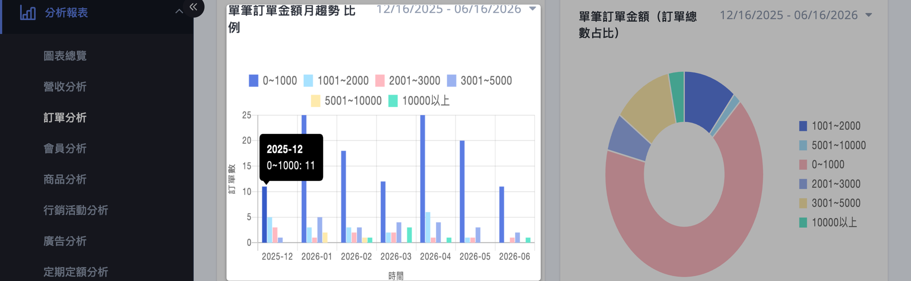{ title="單筆訂單金額月趨勢 比例" }

=== "單筆訂單金額（占比）"

    時間區間內各金額級距占總訂單數的比例（不分月）。

    將滑鼠移到圖塊上，即會顯示該金額級距的占比；點擊項目名稱，可隱藏或顯示該項目資料。

    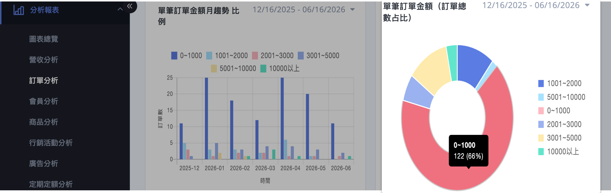{ title="單筆訂單金額（占比）" }

=== "單筆訂單商品數（占比）"

    各商品數量級距的訂單占比。商品數量 **含加價購及滿額贈**。

    將滑鼠移到圖塊上，即會顯示該商品數級距的占比；點擊項目名稱，可隱藏或顯示該項目資料。

    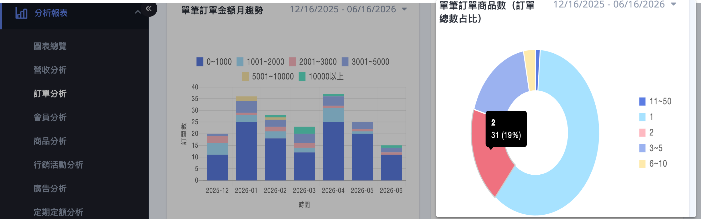{ title="單筆訂單商品數（占比）" }

=== "每日平均訂單金額（月趨勢）"

    各月的每日平均訂單金額，另含 **近 30 日平均訂單金額**[^7] 與 **變動值**[^3]。

    將滑鼠移到資料點上，即會顯示該月的平均訂單金額。

    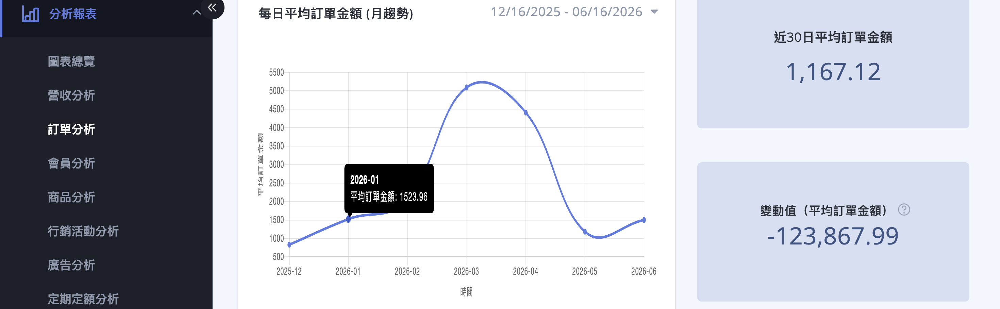{ title="每日平均訂單金額（月趨勢）" }

---

### 訂單健康度 { #read-order-analysis-read-health }

=== "訂單取消率月趨勢"

    各月的訂單取消率（當月已取消訂單 ÷ 當月所有訂單），另含 **近 30 日取消率**[^8] 與 **變動值**[^4]。

    將滑鼠移到資料點上，即會顯示該月的取消率。

    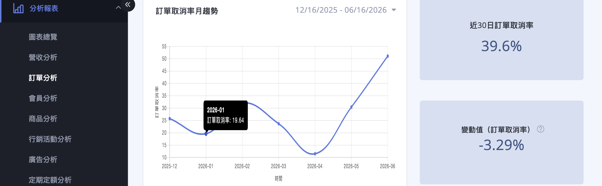{ title="訂單取消率月趨勢" }

=== "訂單退貨率月趨勢"

    各月的訂單退貨率（當月已退貨訂單 ÷ 非「已取消」訂單；已取消無法出貨故排除），另含 **近 30 日退貨率**[^9] 與 **變動值**[^5]。

    將滑鼠移到資料點上，即會顯示該月的退貨率。

    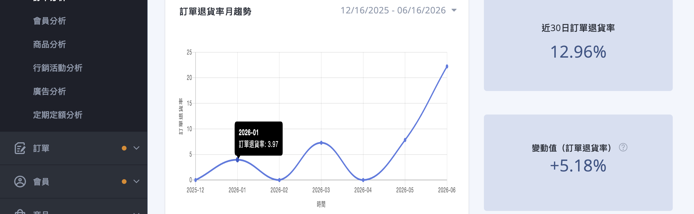{ title="訂單退貨率月趨勢" }

[^1]: 近 30 日數值 − 開站以來長期平均數值
[^2]: 過去 30 天平均訂單數 − 開站以來訂單平均數
[^3]: 過去 30 天平均訂單金額 − 開站以來訂單平均金額
[^4]: (近 30 日取消 ÷ 近 30 日總訂單) × 100 − (開站以來取消 ÷ 開站以來總訂單) × 100
[^5]: (近 30 日退貨 ÷ 非取消訂單) × 100 − (開站以來退貨 ÷ 開站以來非取消) × 100
[^6]: 近 30 日訂單數 ÷ 30
[^7]: 近 30 日訂單金額 ÷ 30
[^8]: (近 30 日取消 ÷ 近 30 日總訂單) × 100
[^9]: (近 30 日退貨 ÷ 非取消訂單) × 100

---

## 看懂訂單金物流分析 { #read-order-analysis-finance-logistics }

[:lucide-tag:{ title="適用方案" }](../../../resources/conventions#適用方案) | 企業

「訂單金物流分析」把訂單依 **付款方式、出貨方式、第三方導購** 三個維度拆解，從訂單數、占比、平均客單價、退貨率等角度觀察。各圖表的完整計算公式請見 [訂單金物流分析圖表對照](references/order-analysis-finance-logistics-reference.md#reference-order-analysis-finance-logistics){ title="訂單金物流分析圖表對照" }。

### 付款方式 { #read-order-analysis-read-payment }

=== "訂單數（月趨勢）"

    各月各付款方式的訂單數。

    將滑鼠移到資料點上，即會顯示該月的訂單數；點擊項目名稱，可隱藏或顯示該項目資料。

    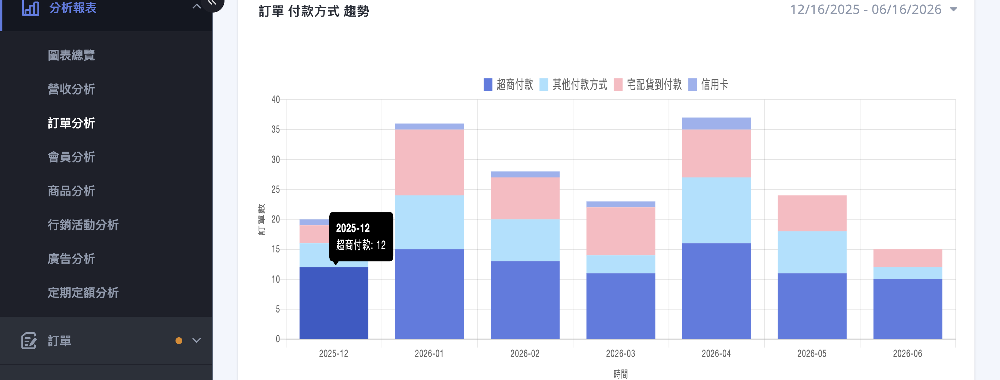{ title="付款方式訂單數月趨勢" }

=== "占比（月趨勢）"

    各月各付款方式的訂單占比。例：2020 年 4 月，信用卡 468 筆，佔當月 47.3%。

    將滑鼠移到資料點上，即會顯示該月的占比；點擊項目名稱，可隱藏或顯示該項目資料。

    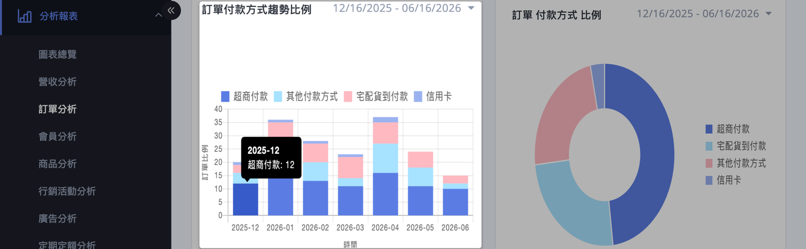{ title="付款方式占比月趨勢" }

=== "占比（區間）"

    時間區間內各付款方式的訂單占比。例：信用卡 3427 筆，佔 47%。

    將滑鼠移到圖塊上，即會顯示該付款方式的占比；點擊項目名稱，可隱藏或顯示該項目資料。

    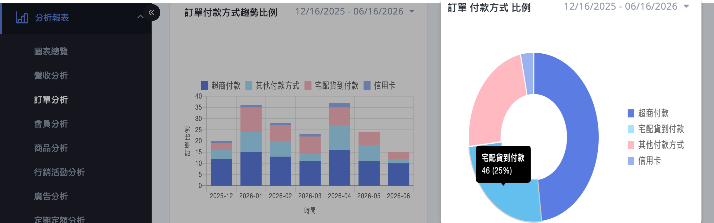{ title="付款方式占比" }

=== "平均訂單金額（月趨勢）"

    各月各付款方式的平均訂單金額（該付款方式訂單總金額 ÷ 該付款方式訂單數）。

    將滑鼠移到資料點上，即會顯示該月的平均訂單金額；點擊項目名稱，可隱藏或顯示該項目資料。

    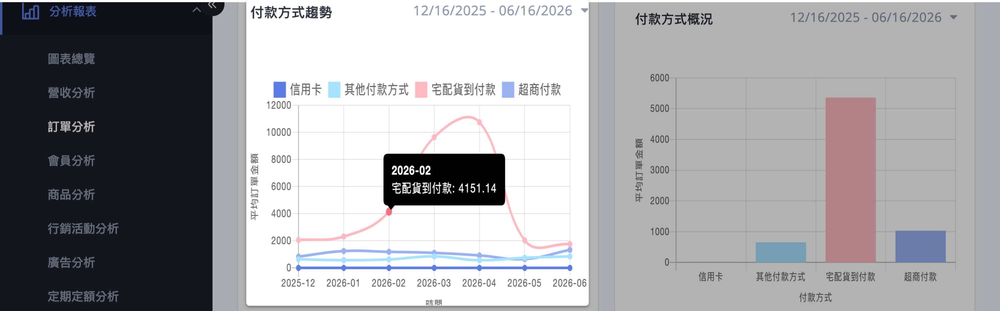{ title="付款方式平均金額月趨勢" }

=== "平均訂單金額（區間）"

    時間區間內各付款方式的平均訂單金額。

    將滑鼠移到長條上，即會顯示該付款方式的平均訂單金額。

    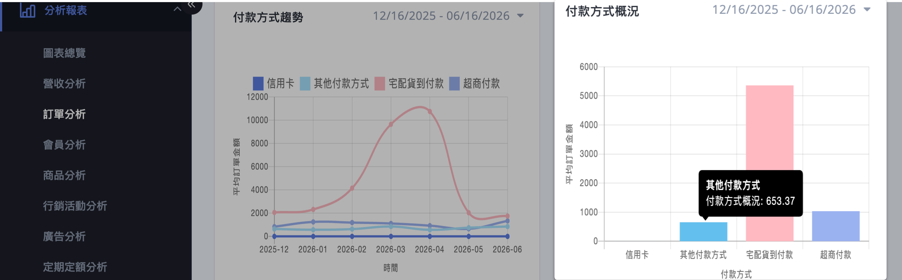{ title="付款方式平均金額" }

=== "退貨率（月趨勢）"

    各月各付款方式的退貨率（該付款方式已退貨訂單 ÷ 該付款方式非取消訂單）。

    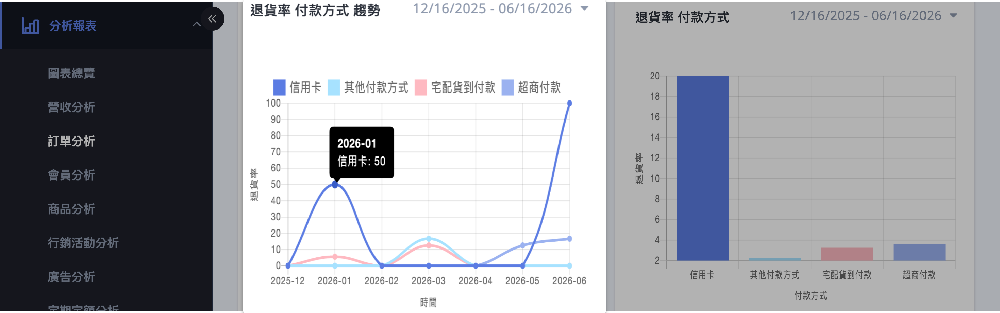{ title="付款方式退貨率月趨勢" }

=== "退貨率（區間）"

    時間區間內各付款方式的退貨率。

    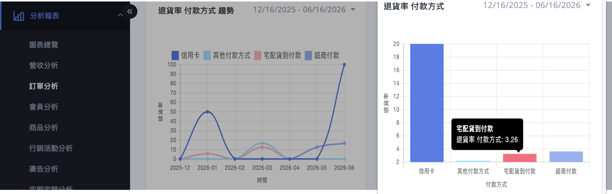{ title="付款方式退貨率" }

### 出貨方式 { #read-order-analysis-read-shipping }

=== "訂單數（月趨勢）"

    各月各出貨方式的訂單數。例：2020 年 5 月，黑貓 751 筆。

    將滑鼠移到資料點上，即會顯示該月的訂單數；點擊項目名稱，可隱藏或顯示該項目資料。

    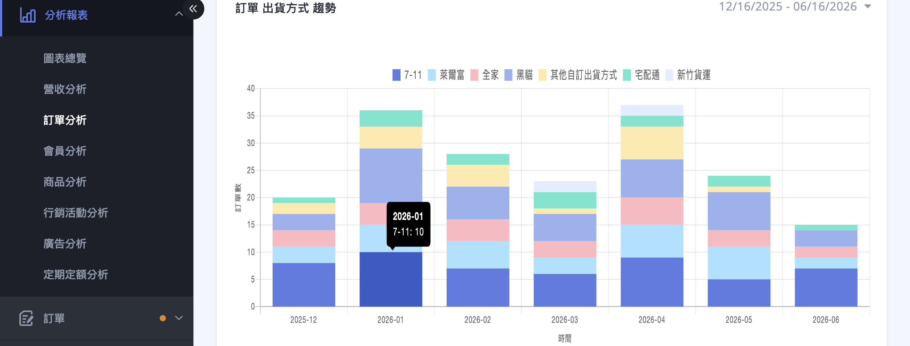{ title="出貨方式訂單數月趨勢" }

=== "占比（月趨勢）"

    各月各出貨方式的認列訂單占當月所有認列訂單的比率。例：2020 年 5 月，黑貓佔 62.6%。

    將滑鼠移到資料點上，即會顯示該月的占比；點擊項目名稱，可隱藏或顯示該項目資料。

    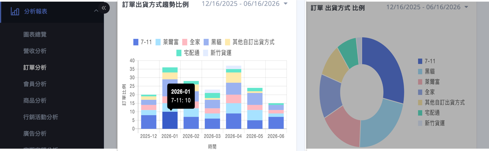{ title="出貨方式占比月趨勢" }

=== "占比（區間）"

    時間區間內各出貨方式的認列訂單比率。例：黑貓 4845 筆，佔 62%。

    將滑鼠移到圖塊上，即會顯示該出貨方式的占比；點擊項目名稱，可隱藏或顯示該項目資料。

    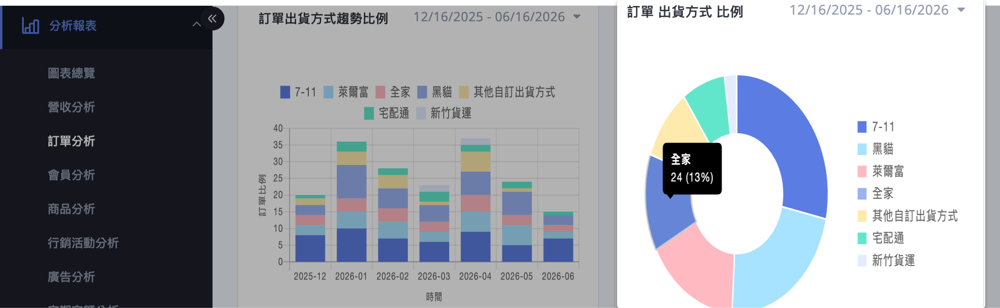{ title="出貨方式占比" }

=== "平均客單價（月趨勢）"

    各月各出貨方式的平均訂單金額（以該出貨方式的認列訂單計）。例：黑貓 3575.96 元。

    將滑鼠移到資料點上，即會顯示該月的平均訂單金額；點擊項目名稱，可隱藏或顯示該項目資料。

    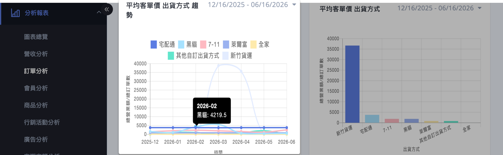{ title="出貨方式平均客單價月趨勢" }

=== "平均客單價（區間）"

    時間區間內各出貨方式的平均訂單金額。例：黑貓 3799.98 元。

    將滑鼠移到長條上，即會顯示該出貨方式的平均訂單金額。

    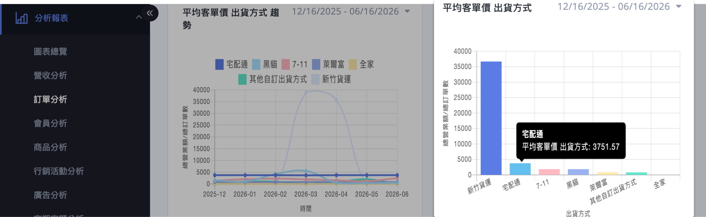{ title="出貨方式平均客單價" }

=== "退貨率（月趨勢）"

    各月各出貨方式的退貨率（該出貨方式已退貨訂單 ÷ 該出貨方式非取消訂單）。

    將滑鼠移到資料點上，即會顯示該月的退貨率；點擊項目名稱，可隱藏或顯示該項目資料。

    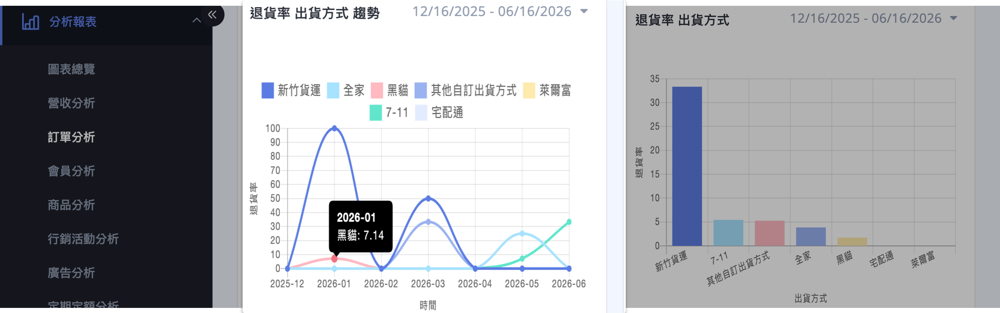{ title="出貨方式退貨率月趨勢" }

=== "退貨率（區間）"

    時間區間內各出貨方式的退貨率。

    將滑鼠移到長條上，即會顯示該出貨方式的退貨率。

    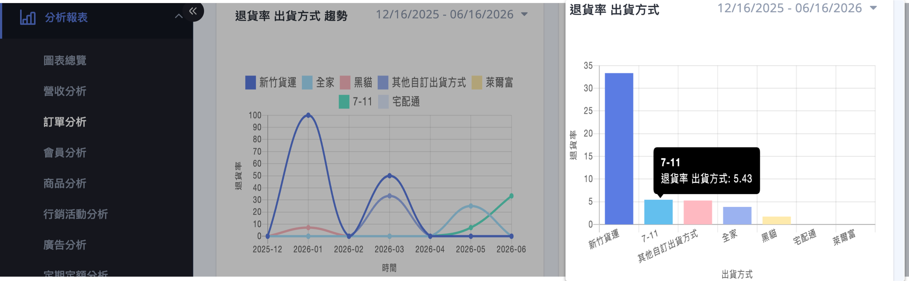{ title="出貨方式退貨率" }

---

### 第三方導購 { #read-order-analysis-read-third-party }

!!! plan "顯示條件"
    此組圖表需已串接導購平台才會出現，並依實際串接的平台呈現各來源，詳見 [第三方導購圖表的顯示條件](#prerequisites-order-analysis-third-party){ title="第三方導購圖表的顯示條件" data-preview }。

=== "訂單數（月趨勢）"

    各月各訂單來源的訂單數。例：2020 年 4 月，LINE 購物 90 筆。

    將滑鼠移到資料點上，即會顯示該月的訂單數；點擊項目名稱，可隱藏或顯示該項目資料。

    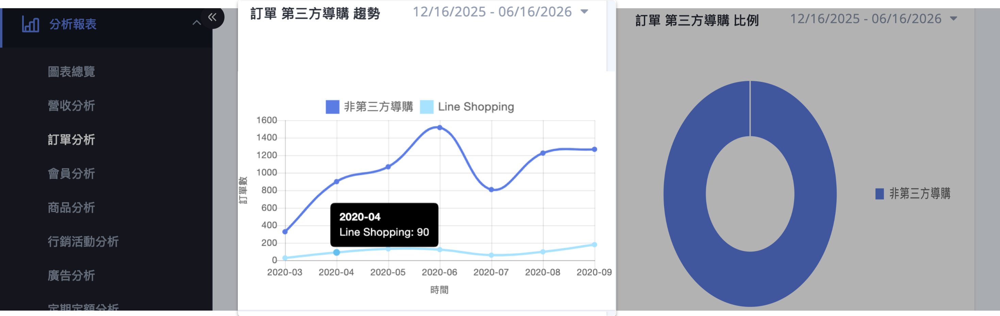{ title="第三方導購訂單數月趨勢" }

=== "占比（區間）"

    時間區間內各來源的認列訂單占所有認列訂單的比例。

    將滑鼠移到圖塊上，即會顯示該來源的占比；點擊項目名稱，可隱藏或顯示該項目資料。

    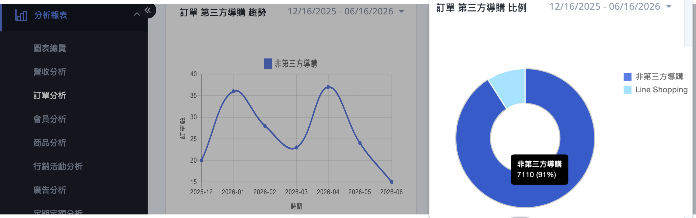{ title="第三方導購占比" }

=== "平均客單價（月趨勢）"

    各月各來源的平均訂單金額（該來源認列訂單總金額 ÷ 該來源認列訂單數）。例：2020 年 5 月，LINE 購物 3312.93 元。

    將滑鼠移到資料點上，即會顯示該月的平均訂單金額；點擊項目名稱，可隱藏或顯示該項目資料。

    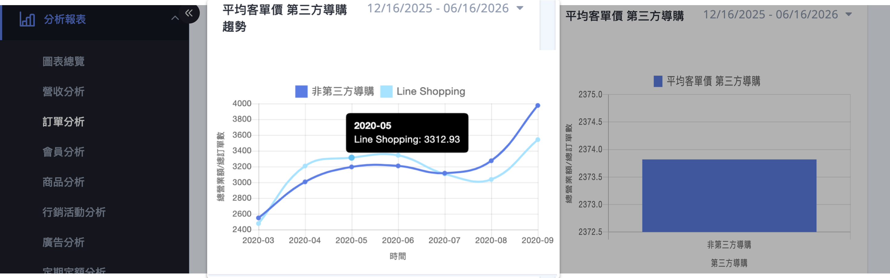{ title="第三方導購平均客單價月趨勢" }

=== "平均客單價（區間）"

    時間區間內各來源的平均訂單金額。例：LINE 購物 3222.52 元。

    將滑鼠移到長條上，即會顯示該來源的平均訂單金額。

    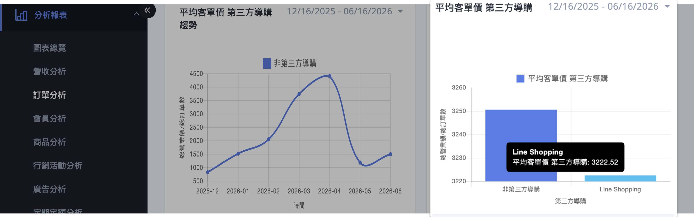{ title="第三方導購平均客單價" }

=== "退貨率（月趨勢）"

    各月各來源的退貨率（該來源已退貨訂單 ÷ 該來源非取消訂單）。

    將滑鼠移到資料點上，即會顯示該月的退貨率；點擊項目名稱，可隱藏或顯示該項目資料。

    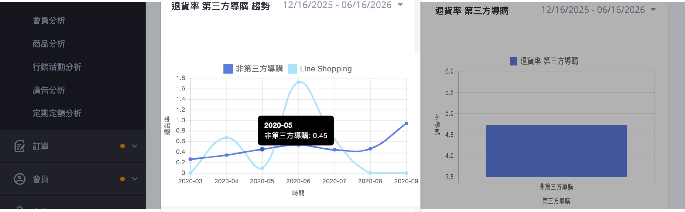{ title="第三方導購退貨率月趨勢" }

=== "退貨率（區間）"

    時間區間內各來源的退貨率。

    將滑鼠移到長條上，即會顯示該來源的退貨率。

    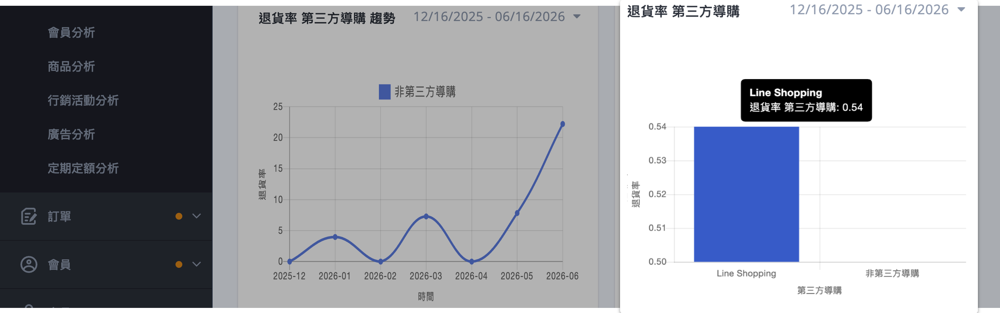{ title="第三方導購退貨率" }

---

## 重要規範與限制 { #specs-order-analysis }

* **只計算認列訂單**：所有數據都以 [認列訂單](#prerequisites-order-analysis-recognized-order){ title="認列訂單定義" data-preview } 為基礎，已取消與退貨成立的訂單不列入。
* **數據為定時更新、非即時**：報表數據為定時批次計算，並非即時；系統會定時把已取消、已退貨的訂單排除後重新統計，因此與即時的「所有訂單」列表可能略有落差。
* **退貨率以排除取消後計算**：計算退貨率時，會先排除已取消的訂單，再以認列訂單為母數統計。
* **圖表各自獨立**：每張圖表的日期區間是分開設定的，看數據時請留意各圖表目前套用的期間是否一致。

---

## 常見問題 { #faq-order-analysis }

??? quote "為什麼訂單分析的數字和「所有訂單」列表對不起來？"
    { #faq-order-analysis-data-mismatch }
    有兩個主要原因：

    * 訂單分析只計算 [認列訂單](#prerequisites-order-analysis-recognized-order){ title="認列訂單定義" data-preview }，已取消與退貨成立的訂單不會被算進去。
    * 報表數據是定時批次更新的，並非即時，因此會比「所有訂單」列表略有延遲。

<!-- ??? quote "為什麼我看不到「訂單金物流分析」或「訂單報表」分頁？" -->
<!--     { #faq-order-analysis-missing-tabs } -->
<!--     這是方案差異。高手版、高手PLUS版、專業PLUS版、進階PLUS版這四種方案只會顯示「訂單總體分析」。 -->

??? quote "卡片上的「變動值」是什麼意思？"
    { #faq-order-analysis-variation }
    「變動值」比較的是 **過去 30 日** 與 **長期平均** 兩個數值。正值代表近期表現高於長期平均(成長)，負值代表低於長期平均(下滑)，用來快速判斷近期的成長性。

??? quote "為什麼看不到「第三方導購」的圖表？"
    { #faq-order-analysis-no-third-party }
    第三方導購圖表需要商店已串接導購平台才會出現。請確認是否已設定「美安夥伴商店」、「LINE購物」其中之一，詳見 [第三方導購圖表的顯示條件](#prerequisites-order-analysis-third-party){ title="第三方導購圖表的顯示條件" }。

??? quote "訂單分析的資料可以匯出嗎？"
    { #faq-order-analysis-export }
    可以，但僅限「訂單報表」分頁的三張表格，點選表格右上角的「下載為Excel」即可。圖表類的區塊(訂單總體分析、訂單金物流分析)本身不提供下載。

---

## 參考資料 { #reference-order-analysis }

* [訂單總體分析指標對照](references/order-analysis-overview-metrics-reference.md)
* [訂單金物流分析圖表對照](references/order-analysis-finance-logistics-reference.md)
* [訂單報表欄位對照](references/order-analysis-report-fields-reference.md)
