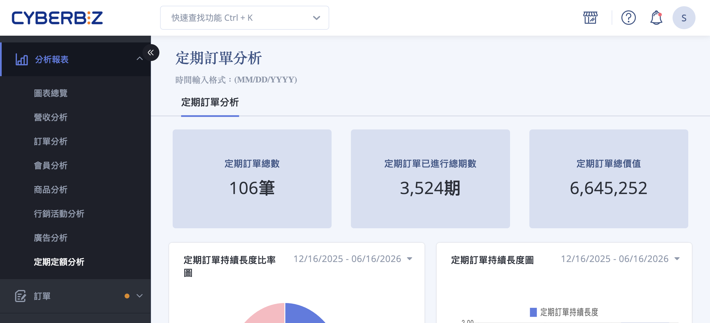
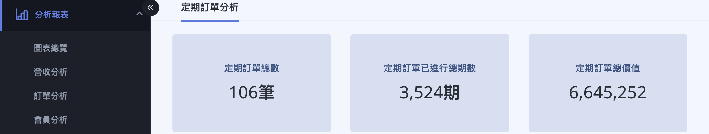
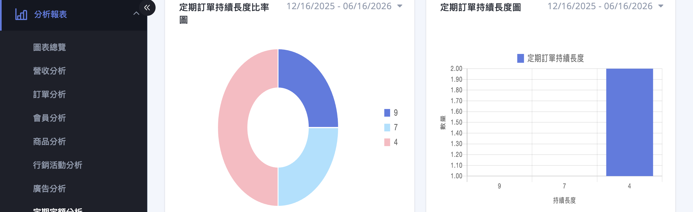
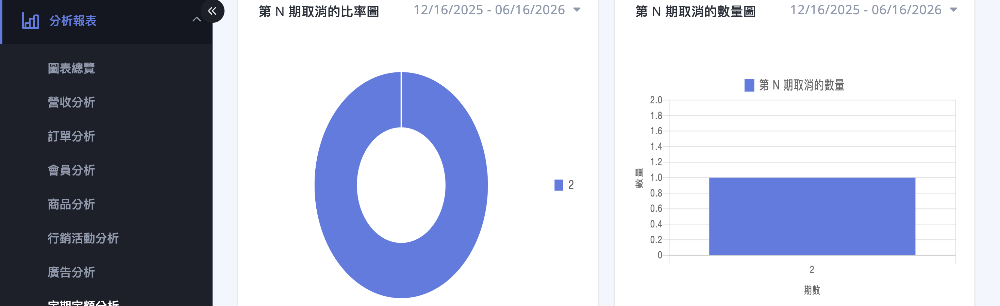
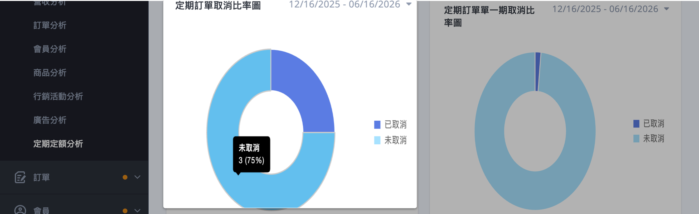
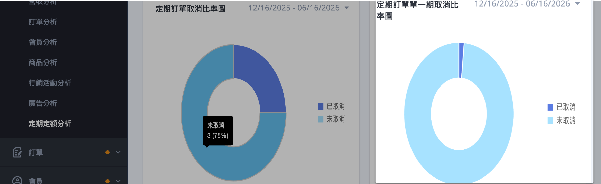
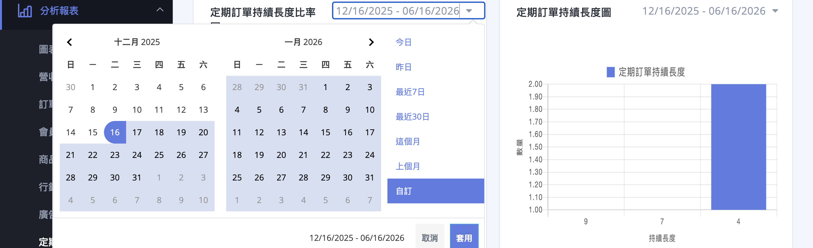

{ title="定期定額分析頁面" }

## 定期定額分析說明 { #intro-periodic-orders }

「定期定額分析」位於後台「分析報表」下，將店內所有定期定額訂單的資料整理成數據卡與圖表，協助您一眼看出目前累積了多少定期訂單、帶來多少價值，以及顧客通常會持續訂購幾期、在第幾期取消。

進入頁面後，畫面標題會顯示為 **「定期訂單分析」** ，這與左側選單的「定期定額分析」指的是同一個頁面。

頁面由上而下分為兩個部分：

- **關鍵數據卡：** 呈現定期訂單總數、已進行總期數與總價值，為全期間累計數字。
- **趨勢與占比圖表：** 從「持續長度（訂購了幾期）」與「取消狀況」兩個角度，以圓餅圖與長條圖呈現定期訂單的分布。

!!! info "提示"
    這裡的「定期訂單」指的是顧客建立的一張定期定額訂閱（會依週期自動產生每一期的配送與扣款），而「期數」指的是這張訂閱實際產生的每一次配送。看圖表時可先分清楚這兩個層級。

## 使用前提與限制 { #prerequisites-periodic-orders }

定期定額分析位於後台「分析報表」之下，需要您的方案已啟用 **「定期定額」** 功能，才會有定期訂單資料可供分析。

!!! plan "方案 / 開通條件"
    定期定額分析屬於 **企業版** 方案的功能，PLUS版 可通過選配開通。

## 頁面功能總覽 { #overview-periodic-orders }

| 區塊 | 類型 | 看什麼 | 受日期影響 |
| :-- | :-- | :-- | :-- |
| 定期訂單總數 | 數字卡 | 店內累計建立的定期訂單筆數 | 否（全期間累計） |
| 定期訂單已進行總期數 | 數字卡 | 所有定期訂單實際配送的期數加總 | 否（全期間累計） |
| 定期訂單總價值 | 數字卡 | 定期訂單已實際成立訂單的銷售金額總和 | 否（全期間累計） |
| 定期訂單持續長度比率圖 | 圓餅圖 | 不同「持續期數」的定期訂單占比 | 是 |
| 定期訂單持續長度圖 | 長條圖 | 不同「持續期數」的定期訂單數量 | 是 |
| 第 N 期取消的比率圖 | 圓餅圖 | 已取消的定期訂單，集中在第幾期取消的占比 | 是 |
| 第 N 期取消的數量圖 | 長條圖 | 已取消的定期訂單，各期的取消數量 | 是 |
| 定期訂單取消比率圖 | 圓餅圖 | 全部定期訂單中「已取消 / 未取消」的占比 | 是 |
| 定期訂單單一期取消比率圖 | 圓餅圖 | 以單期配送為單位的「已取消 / 未取消」占比 | 是 |

各指標的詳細定義，請參考[定期定額分析指標定義對照表](references/periodic-order-analysis-metrics-reference.md#reference-periodic-orders-charts){ title="定期定額分析指標定義對照表" data-preview }。

## 操作步驟 { #operate-periodic-orders }

### 進入定期定額分析 { #operate-periodic-orders-enter }

1. **進入分析報表：** 於後台左側選單點選 **「分析報表」** 。
2. **開啟頁面：** 在展開的項目中點選 **「定期定額分析」** ，即進入頁面。
3. **等待資料載入：** 數據卡與各圖表會分批自動載入，載入中會顯示轉圈圖示，無需額外操作。

---

### 查看關鍵數據卡 { #operate-periodic-orders-read-cards }

進入頁面後，最上方會自動載入三張關鍵數據卡，呈現全期間累計的數字：

1. **定期訂單總數：** 店內累計建立的定期訂單筆數，以「筆」為單位。
2. **定期訂單已進行總期數：** 所有定期訂單實際配送過的期數加總，以「期」為單位。
3. **定期訂單總價值：** 定期訂單中已實際成立訂單的銷售金額總和。

{ title="關鍵數據卡" }

!!! note "註釋"
    這三張數據卡為 **全期間累計**，不受下方圖表日期區間的影響，調整圖表日期時數字卡不會跟著變動。

---

### 看懂持續長度圖表 { #operate-periodic-orders-read-duration }

「定期訂單持續長度比率圖」（圓餅圖）與「定期訂單持續長度圖」（長條圖）呈現的是同一份資料的兩種視角：顧客的定期訂單通常持續了幾期。

1. **檢視分布：** 圖中以「持續長度（期數）」分組，看出大多數定期訂單集中在持續幾期。
2. **比率圖看占比：** 圓餅圖呈現各持續期數的定期訂單占整體的百分比。
3. **長條圖看數量：** 長條圖的橫軸為「持續長度」、縱軸為「數量」，呈現各持續期數各有多少張定期訂單。
4. **查看明細：** 將滑鼠移到圖塊或長條上，即會顯示該組的數量與占比；點擊項目名稱，可隱藏或顯示該項目資料。

{ title="持續長度圖表" }

!!! tip "技巧"
    若多數定期訂單只持續了 1 至 2 期，代表顧客續訂意願偏低，可進一步檢視「第 N 期取消」相關圖表，找出顧客流失的關鍵期數。

---

### 看懂取消狀況圖表 { #operate-periodic-orders-read-cancel }

頁面下半部的四張圖表，從不同角度呈現定期訂單的取消狀況：

1. **第 N 期取消的比率圖 / 數量圖：** 只統計 **已取消** 的定期訂單，看它們集中在第幾期被取消。比率圖看各期占比，數量圖的橫軸為「期數」、縱軸為「數量」。

    { title="第 N 期取消的比率圖 / 數量圖" }

2. **定期訂單取消比率圖：** 以整張定期訂單為單位，呈現「已取消」與「未取消」的占比。

    { title="定期訂單取消比率圖" }

3. **定期訂單單一期取消比率圖：** 以單期配送為單位，呈現「已取消」與「未取消」的占比[^1]。

    { title="定期訂單單一期取消比率圖" }

4. **查看明細：** 將滑鼠移到圖塊上，即會顯示該項目的數量與占比；點擊項目名稱，可隱藏或顯示該項目資料。

[^1]: 「定期訂單取消比率」看的是整張訂閱是否被取消；「單一期取消比率」看的是每一次配送是否被取消，兩者統計層級不同，數字通常不會一樣。

---

### 調整圖表的時間區間 { #operate-periodic-orders-date-range }

每一張圖表的 **右上角都有獨立的日期區間欄位**，可單獨調整該圖表要呈現的時間範圍：

1. **點擊日期欄位：** 在欲調整的圖表右上角，點擊日期輸入框，展開日期選擇器。
2. **選擇預設區間或自訂：** 可直接選擇預設區間（今日、昨日、最近 7 日、最近 30 日、這個月、上個月），或在月曆上自行框選起訖日期。
3. **套用：** 點擊 **「套用」** ，該圖表即會依新的時間區間重新載入。

{ title="調整日期區間" }

!!! tip "技巧"
    每張圖表的日期區間是 **各自獨立** 的，調整其中一張不會影響其他圖表。頁面初次載入時，各圖表預設顯示最近約 6 個月的資料。若要做整體比較，記得逐一將各圖表調整為相同區間。

## 重要規範與限制 { #specs-periodic-orders }

- **數據卡為全期間累計：** 上方三張數字卡不受圖表日期區間影響，呈現的是店內至今的累計數字。
- **圖表才吃日期區間：** 六張圖表皆依各自的日期區間，以定期訂單的建立時間統計。
- **取消比率分兩個層級：** 「定期訂單取消比率」以整張訂閱為單位，「單一期取消比率」以每次配送為單位，兩者數字通常不同。

## 後續操作 { #next-steps-periodic-orders }

<!-- - :lucide-repeat:{ .lg }  
  [__定期定額訂單__](../orders/index.md)  
  逐筆檢視、管理每一張定期訂單與其各期配送。 -->

- :lucide-bar-chart-3:{ .lg }  
  [__營收分析__](../business-intelligence/revenue-analysis.md){ title="營收分析" }  
  從全店角度檢視整體營收、獲利與營收高峰時段。

## 常見問題 { #faq-periodic-orders }

??? quote "改了圖表的日期，上方的數字卡卻沒有變"
    { #faq-periodic-orders-cards-static }
    這是正常的，上方三張數據卡呈現的是全期間累計數字。

    - 數據卡（定期訂單總數、總期數、總價值）不受圖表日期區間影響。
    - 只有下方六張圖表會依各自的日期區間更新。

??? quote "「持續長度」是什麼意思"
    { #faq-periodic-orders-duration }
    「持續長度」指一張定期訂單實際已經進行了幾期配送。

    - 例如持續長度為 3，代表這張定期訂單已配送（或扣款）過 3 期。
    - 持續長度越長，通常代表顧客的續訂黏著度越高。

??? quote "「定期訂單取消比率」和「單一期取消比率」差在哪"
    { #faq-periodic-orders-cancel-level }
    兩者的統計層級不同。

    - **定期訂單取消比率：** 以整張定期訂單（訂閱）為單位，看有多少比例的訂閱被取消。
    - **單一期取消比率：** 以每一次配送為單位，看有多少比例的單期配送被取消。
    - 因為層級不同，兩個數字通常不會一樣。

<!-- ??? quote "想看每一張定期訂單的明細" -->
<!--     { #faq-periodic-orders-detail } -->
<!--     本頁為彙整圖表，不提供逐筆明細，也沒有匯出功能。 -->
<!---->
<!--     - 若要查看或管理單張定期訂單與各期配送，請改至定期定額訂單列表。 -->

## 參考資料 { #reference-periodic-orders }

- [定期定額分析指標定義對照表](references/periodic-order-analysis-metrics-reference.md)
