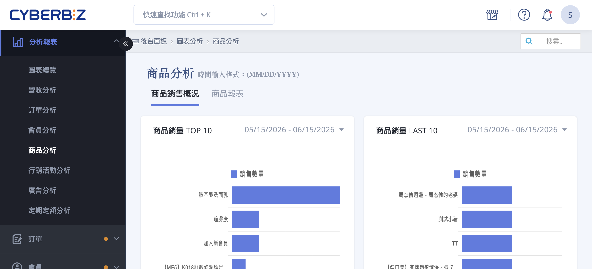
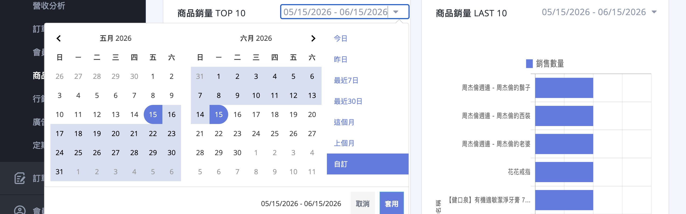
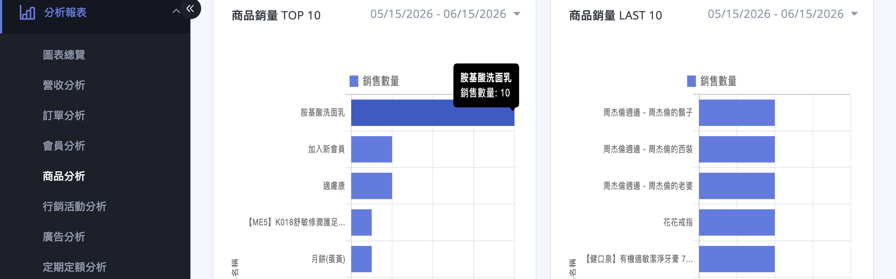
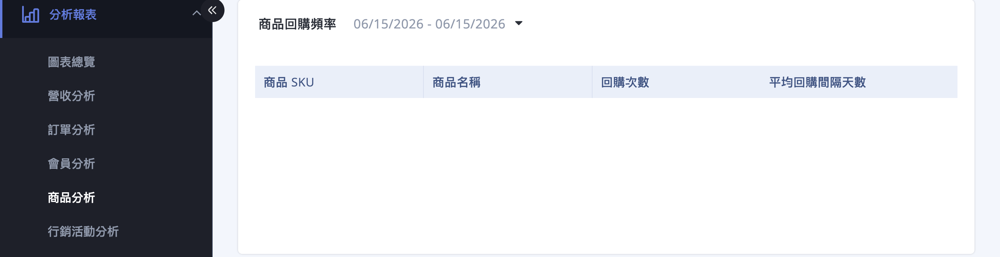
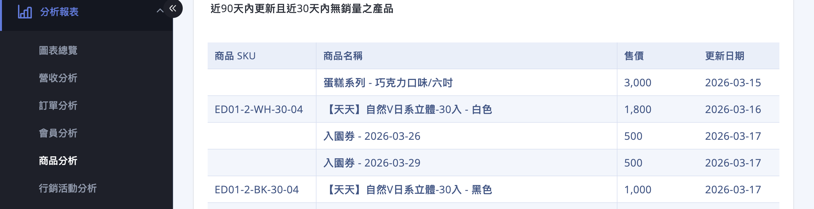
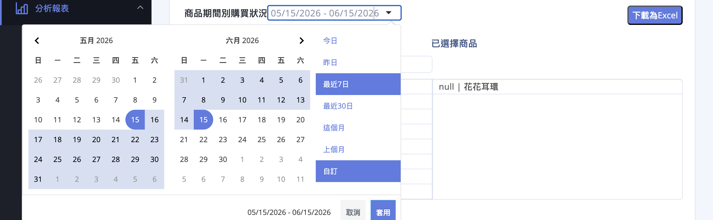
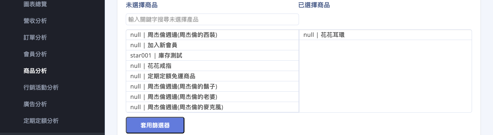
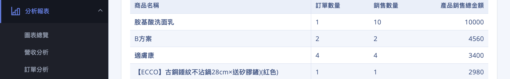
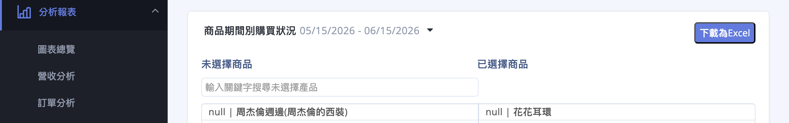

{ title="商品分析-hero" .hero-page }

## 商品分析說明 { #intro-product-analysis }

「商品分析」協助您快速掌握店內商品的銷售表現，找出熱賣的明星商品、需要促銷的滯銷品，並觀察顧客對特定商品的回購行為。

這個頁面位於後台「圖表分析」>「商品分析」，依不同的查詢期間，將商品表現整理成圖表與表格，讓您在做進貨、行銷與定價決策時有數據可參考。整頁分為「商品銷售概況」與「商品報表」兩個分頁。

!!! info "提示"
    本頁數據僅計算 **有效訂單** (非取消、且不需退貨或拒絕退貨的訂單)，因此數字可能與「所有訂單」列表的筆數不同。詳細認列範圍請見 [重要規範與限制](#specs-product-analysis)。

## 頁面功能總覽 { #overview-product-analysis }

| 分頁 | 區塊 | 呈現方式 | 用途 |
| :-- | :-- | :-- | :-- |
| 商品銷售概況 | [商品銷量 TOP 10](#operate-product-analysis-sales-rank) | 長條圖 | 找出指定期間賣最好的 10 項商品 |
| 商品銷售概況 | [商品銷量 LAST 10](#operate-product-analysis-sales-rank) | 長條圖 | 找出指定期間賣最差的 10 項商品 |
| 商品銷售概況 | [商品回購頻率](#operate-product-analysis-repurchase) | 表格 | 查看被重複購買的商品及其平均回購間隔 |
| 商品銷售概況 | [近90天內更新且近30天內無銷量之產品](#operate-product-analysis-no-sales) | 表格 | 揪出最近有更新、卻賣不動的商品 |
| 商品報表 | [商品期間別購買狀況](#operate-product-analysis-period-report) | 表格(可匯出 Excel) | 逐項查看商品的訂單數、銷售數量與銷售金額 |

!!! note "註釋"
    各區塊都有 **獨立的查詢期間**，互不影響；唯獨「近90天內更新且近30天內無銷量之產品」是系統自動以今日為基準計算，不提供自訂日期。

## 使用前提與限制 { #prerequisites-product-analysis }

<!-- - [x] **方案需包含「圖表分析」功能**：此頁屬於營運數據分析功能。若您的方案未開通，進入頁面時會顯示「您目前方案不支援，請聯絡客服或開店顧問詢問」，此時請洽客服或開店顧問。 -->
- [x] **需有實際訂單資料**：各圖表與表格依有效訂單計算，新開店或查詢期間內沒有訂單時，對應區塊會顯示空白。

!!! plan "方案差異"
    高手版方案不會顯示「 **商品報表** 」分頁(即「商品期間別購買狀況」)。若您在頁面上只看到「商品銷售概況」、沒有「商品報表」分頁，代表目前方案未提供此區塊。

## 操作步驟 { #operate-product-analysis }

### 切換分頁與選擇查詢期間 { #operate-product-analysis-switch-and-date }

1. **進入頁面：** 前往後台「圖表分析」>「商品分析」。頁面預設停在「 **商品銷售概況** 」分頁。
2. **切換分頁：** 點選頁面上方的「 **商品銷售概況** 」或「 **商品報表** 」即可切換。「商品報表」分頁在首次點擊時才會載入資料，請稍候。
3. **選擇查詢期間：** 每個圖表或表格的右上角都有自己的日期欄位，點擊後可選擇預設區間或自訂起訖日。系統預設顯示 **最近一個月** 的資料。

{ title="切換分頁與選擇查詢期間" }

??? info "可選的預設區間"
    | 預設選項 | 涵蓋範圍 |
    | :-- | :-- |
    | 今日 | 當天 |
    | 昨日 | 前一天 |
    | 最近7日 | 含今日往前 7 天 |
    | 最近30日 | 含今日往前 30 天 |
    | 這個月 | 當月 1 號至月底 |
    | 上個月 | 上個月整月 |
    | 自訂 | 自行指定起訖日期 |

!!! tip "技巧"
    日期格式為 `MM/DD/YYYY`(月/日/年)。調整任一區塊的日期，只會更新該區塊，其他區塊維持原本的查詢期間。

---

### 找出熱賣與滯銷商品 <small>TOP 10 / LAST 10</small> { #operate-product-analysis-sales-rank }

1. **查看熱賣商品：** 在「商品銷售概況」分頁的「 **商品銷量 TOP 10** 」長條圖，由上而下即為該期間銷售數量最高的 10 項商品。
2. **查看滯銷商品：** 右側的「 **商品銷量 LAST 10** 」則為同期間銷售數量最低的 10 項商品。
3. **調整期間比較：** 分別點擊兩張圖的日期欄位，可針對不同期間觀察排行變化。
4. **看單項數字：** 將滑鼠移到任一長條上，會顯示該商品完整名稱與銷售數量。

{ title="商品銷量 TOP 10 與 LAST 10" }

各欄位定義請參考 [商品銷量欄位說明](./references/product-analysis-metrics-reference.md#reference-product-analysis-sales-rank){ data-preview }。

---

### 了解商品回購頻率與回購間隔 { #operate-product-analysis-repurchase }

1. **找到區塊：** 在「商品銷售概況」分頁往下捲動，找到「 **商品回購頻率** 」表格。
2. **設定期間：** 點擊表格標題旁的日期欄位選擇查詢區間。
3. **解讀數據：** 表格列出每項商品的「 **回購次數** 」與「 **平均回購間隔天數** 」，協助您判斷哪些商品具有高黏著度、適合規劃定期回購或補貨提醒。

{ title="商品回購頻率" }

!!! note "註釋"
    商品必須在查詢期間內被 **回購滿 10 次以上** 才會出現在此表；不足 10 次的商品不會列出。欄位定義請見 [商品回購頻率欄位說明](./references/product-analysis-metrics-reference.md#reference-product-analysis-repurchase){ data-preview }。

---

### 揪出該檢視的滯銷新品 <small>無銷量清單</small> { #operate-product-analysis-no-sales }

1. **找到區塊：** 在「商品銷售概況」分頁的「 **近90天內更新且近30天內無銷量之產品** 」表格。
2. **檢視清單：** 此表自動列出 **近 90 天內有更新資料、但近 30 天內沒有任何銷售** 的商品，方便您檢查是否為文案、定價或曝光問題。
3. **翻頁瀏覽：** 商品較多時，使用表格下方的翻頁按鈕逐頁查看。

{ title="近90天內更新且近30天內無銷量之產品" }

!!! info "提示"
    此區塊以「今日」為基準自動計算， **沒有日期欄位**，因此不需(也無法)自訂查詢期間。欄位定義請見 [無銷量商品欄位說明](./references/product-analysis-metrics-reference.md#reference-product-analysis-no-sales){ data-preview }。

---

### 用「商品報表」查期間別購買狀況並匯出 { #operate-product-analysis-period-report }

1. **切換分頁：** 點選上方「 **商品報表** 」分頁，等待「 **商品期間別購買狀況** 」表格載入。

2. **選擇期間：** 點擊表格標題旁的日期欄位，選擇要統計的查詢區間。

    { title="選擇查詢期間" }

3. **篩選特定商品(選用)：** 透過「未選擇商品 / 已選擇商品」清單挑出想單獨查看的品項，再點擊「 **套用篩選器** 」只顯示這些商品[^period-filter]。

    { title="篩選特定商品" }

4. **解讀數據：** 表格逐列顯示每項商品的「訂單數量」、「銷售數量」與「產品銷售總金額」，最後一列為全部商品的「 **合計** 」。

    { title="商品期間別購買狀況數據" }

5. **匯出 Excel：** 點擊表格右上角的「 **下載為Excel** 」，系統會以目前的查詢期間產生 Excel 檔並下載。

    { title="匯出 Excel" }

各欄位定義請見 [商品期間別購買狀況欄位說明](./references/product-analysis-metrics-reference.md#reference-product-analysis-period){ data-preview }。

[^period-filter]: 篩選清單支援關鍵字搜尋；未選擇任何商品時，表格顯示全部商品。

## 重要規範與限制 { #specs-product-analysis }

- **認列訂單範圍：** 所有數字僅計算 **有效訂單**，即「非取消訂單」且「不需退貨或拒絕退貨」的訂單；取消與退貨訂單不列入計算。
- **不含加購品：** 「商品銷量 TOP 10 / LAST 10」的銷售數量會排除加購類商品，因此純銷售排行不會被加購品干擾。
- **回購頻率門檻：** 「商品回購頻率」僅列出查詢期間內回購達 10 次以上的商品；回購是指同一位顧客重複購買同一商品，第 2 次起的每次購買各算一次回購。
- **無銷量清單為動態計算：** 「近90天內更新且近30天內無銷量之產品」永遠以查詢當下的「今日」為基準，無法回溯指定日期。
- **資料更新時間：** 資料更新的時間為每日的 8:00、12:00、16:00、20:00、24:00。
- **資料以營運數據為準：** 本頁數據可能與即時訂單列表略有時間差，建議用於趨勢判讀，精確對帳請以訂單與財務報表為主。

## 後續操作 { #next-steps-product-analysis }

- :lucide-trending-up:{ .lg }  
  [__營收分析__](./revenue-analysis.md){ title="營收分析" }  
  搭配營收與毛利數據，掌握整體營運表現。

- :lucide-shopping-cart:{ .lg }  
  [__訂單分析__](./order-analysis.md){ title="訂單分析" }  
  從訂單量、客單價與取消率了解銷售結構。

- :lucide-package:{ .lg }  
  [__新增與編輯商品__](../products/create-and-manage/create-update-products.md){ title="新增與更新商品" }  
  針對滯銷或熱賣商品，調整上架、定價與文案。

## 常見問題 { #faq-product-analysis }

??? quote "商品回購頻率表是空的，看不到任何商品"
    { #faq-product-analysis-repurchase-empty }
    這是正常現象。商品必須在查詢期間內被 **回購滿 10 次以上** 才會列入此表。若您的店內回購量還在累積，或查詢期間較短，表格可能暫時沒有資料。可以試著：

    - 將查詢期間拉長(例如選「最近30日」或自訂更長區間)
    - 等回購數據累積一段時間後再查看

??? quote "商品銷量是用「金額」還是「數量」排名？"
    { #faq-product-analysis-rank-basis }
    「商品銷量 TOP 10 / LAST 10」是以 **銷售數量**(件數)排名，不是銷售金額。若想看以金額為主的逐項數據，請改用「商品報表」分頁的「商品期間別購買狀況」，當中含「產品銷售總金額」欄位。

??? quote "加購品或贈品會被算進銷量嗎？"
    { #faq-product-analysis-addon-excluded }
    不會。「商品銷量 TOP 10 / LAST 10」會排除加購類商品，讓排行反映真正的主力商品銷售狀況。

??? quote "報表數字和訂單列表對不起來"
    { #faq-product-analysis-number-mismatch }
    本頁只計算 **有效訂單**(非取消、且不需退貨或拒絕退貨)，而訂單列表會包含取消與退貨訂單，因此筆數與金額可能不同。這是預期行為，屬於統計口徑差異。

??? quote "找不到「商品報表」分頁"
    { #faq-product-analysis-no-product-report-tab }
    部分方案不提供「商品報表」分頁。若您的頁面上只有「商品銷售概況」，代表目前方案未包含此區塊，請洽開店顧問了解升級方式。

??? quote "整個頁面顯示「您目前方案不支援」"
    { #faq-product-analysis-unauthorized }
    代表您的方案尚未開通「圖表分析」相關功能。請聯絡客服或開店顧問協助確認與開通。

## 參考資料 { #reference-product-analysis }

- [商品分析欄位對照表](./references/product-analysis-metrics-reference.md) 
