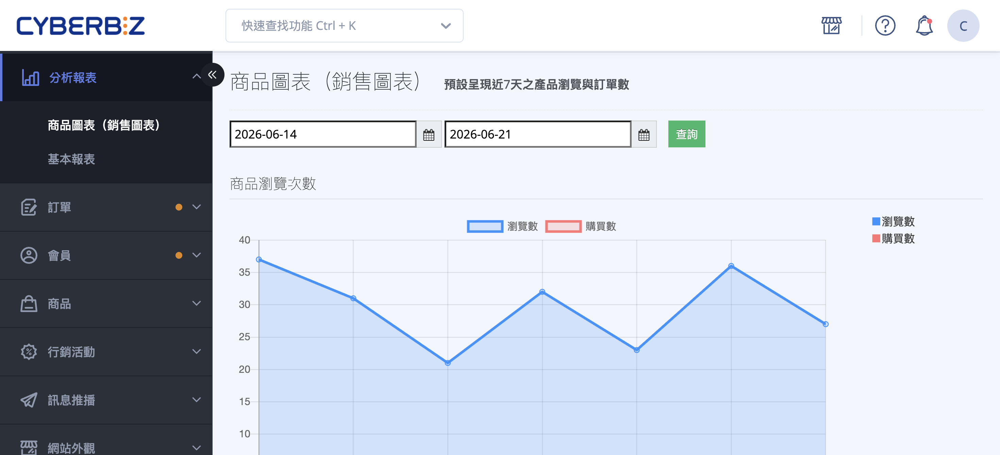
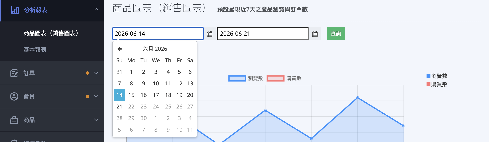
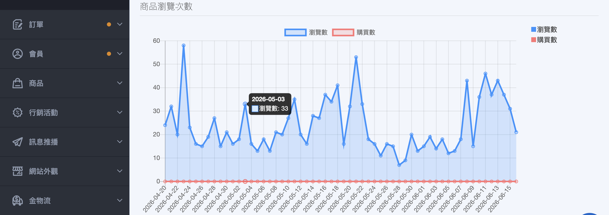
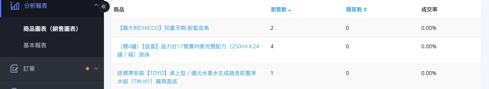

{ title="商品圖表頁面" .hero-page }

## 商品圖表說明 { #intro-product-chart }

這個頁面位於後台「**分析報表**」之下。透過每日的「瀏覽數」「購買數」與「成交率」三項指標，您可以找出哪些商品很多人看卻沒人下單（適合優化文案、圖片或定價），哪些商品轉單順暢，作為後續行銷與選品的依據。

!!! info "提示"
    本頁數據每日凌晨 2 點更新前一日結果，當日的即時數據要等到隔天才會出現。三項指標的詳細定義請見 [商品圖表指標對照表](references/product-chart-metrics-reference.md#reference-product-chart-metrics){ data-preview }。

## 使用前提與限制 { #prerequisites-product-chart }

- [x] **方案需包含「商品圖表」功能**：「商品圖表」是基礎的營運報表。若您在後台找不到此頁面，通常代表您的方案已提供功能更完整的「商品分析」，建議優先使用該頁面。

??? plan "方案差異：商品圖表 vs 商品分析"
    * 「商品圖表」提供單一商品每日的瀏覽與購買趨勢，適合一般日常觀察。
    * 部分進階方案(如企業版)改提供功能更完整的「商品分析」，包含轉換漏斗、回購行為、平均回購間隔天數與滯銷品監控等更深入的指標。若您的後台有「商品分析」，建議優先使用。

## 操作步驟 { #operate-product-chart }

### 查詢與檢視商品成效 { #operate-product-chart-query }

1. **進入頁面：** 前往後台「分析報表」>「商品圖表」。
2. **設定查詢期間：** 在頁面上方的兩個日期欄位中，左側選擇起始日、右側選擇結束日[^range]。

    { title="設定查詢期間" }

3. **執行查詢：** 點擊 **「查詢」**。
4. **查看趨勢折線圖：** 圖表會以折線呈現期間內每日的「瀏覽數」與「購買數」走勢。將滑鼠移到折線上的資料點，即可看到該日期的詳細數值；點擊項目名稱，可隱藏或顯示該項目資料。

    { title="趨勢折線圖" }

5. **查看商品明細表：** 圖表下方的表格逐一列出各商品的「瀏覽數」「購買數」與「成交率」。點選「瀏覽數」或「購買數」欄位標題可切換排序，並可調整每頁顯示 10、25 或 50 筆。

    { title="商品明細表" }

!!! tip "技巧"
    若想找出「有人看、卻沒人買」的商品，可先依「瀏覽數」由高到低排序，再對照右側偏低的「成交率」，這些就是最值得優先優化商品頁的對象。

[^range]: 頁面預設載入最近 7 天的數據；由於系統僅保留近約 2 個月的每日數據，可查詢的最早日期約為 2 個月前。

## 重要規範與限制 { #specs-product-chart }

### 三項指標的定義 { #specs-product-chart-metrics }

報表中的「瀏覽數」「購買數」「成交率」皆為原始統計數據，完整定義與計算方式請見 [商品圖表指標對照表](references/product-chart-metrics-reference.md#reference-product-chart-metrics){ data-preview }。其中兩點特別提醒：

- **瀏覽數為原始數據：** 不會排除重複事件，同一人重新整理頁面也會重複計入。
- **購買數只看當日成立：** 僅記錄當天產生的訂單筆數，不會因後續取消、退貨或付款狀態改變而回頭調整。

---

### 數據更新與保留 { #specs-product-chart-data }

- **更新時間：** 每日凌晨 2 點自動更新前一日的數據，因此今天的瀏覽與購買要到明天才看得到。
- **保留期間：** 系統僅保留近約 2 個月的每日數據，較早的紀錄會自動清除，無法再查詢。

## 後續操作 { #next-steps-product-chart }

- :lucide-bar-chart-3:{ .lg }  
  [__商品分析__](product-analysis.md){ title="商品分析" }  
  進階方案專屬，提供轉換漏斗、回購行為與滯銷品監控等更深入的指標。

- :lucide-trophy:{ .lg }  
  [__匯出商品銷售排行報表__](basic-chart.md#operate-basic-chart-export-rank){ title="基本報表" }  
  於「基本報表」設定日期區間後匯出 Excel，列出該期間銷售總額最高的商品。

## 常見問題 { #faq-product-chart }

??? quote "為什麼今天的瀏覽與購買數字還沒出現？"
    { #faq-product-chart-update-time }
    商品圖表的數據是每日凌晨 2 點統一更新「前一日」的結果，並非即時統計。

    今天發生的瀏覽與訂單，要等到隔天更新後才會出現在報表中，這屬於正常情況。

??? quote "為什麼有些商品瀏覽數很高，購買數卻是 0？"
    { #faq-product-chart-low-conversion }
    這代表該商品頁很吸引人點閱，但實際下單的人很少，也就是「成交率」偏低。

    可以從這幾個方向檢視商品頁：

    - 商品文案是否清楚說明賣點。
    - 商品圖片是否足夠吸引人。
    - 定價或運費是否讓顧客卻步。

??? quote "查不到很久以前的數據 / 日期選不到較早的日子？"
    { #faq-product-chart-data-retention }
    系統僅保留近約 2 個月的每日數據，超過這個範圍的紀錄會自動清除。

    若需要長期的歷史分析，建議定期查看並自行留存所需數據。

??? quote "顧客退貨或取消訂單後，購買數會跟著減少嗎？"
    { #faq-product-chart-purchase-count }
    不會。購買數記錄的是「當日成立的訂單筆數」，屬於原始數據，不會因為後續的取消、退貨或付款狀態變動而回頭調整。

## 參考資料 { #reference-product-chart }

- [商品圖表指標對照表](references/product-chart-metrics-reference.md#reference-product-chart-metrics)

