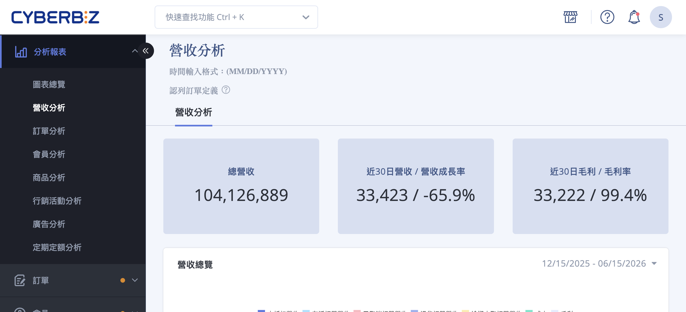{ title="營收分析頁面" .hero-page }

## 營收分析說明 { #intro-revenue }

「營收分析」位於後台「圖表分析」下，將全店訂單資料整理成數據卡與圖表，協助您一眼看出整體營收、近期成長、獲利能力，以及不同付款方式、出貨方式、會員類型與時段的營收分布。

頁面由上而下分為三個部分：

- **關鍵數據卡**：呈現總營收、近 30 日營收與成長率、近 30 日毛利與毛利率。
- **營收總覽圖**：以折線圖呈現各類營收與成本隨時間的變化。
- **多維度占比與時段圖表**：從訂單狀態、付款方式、會員類型、出貨方式、以及小時 / 星期 / 日等角度，觀察營收的組成與高峰。

## 使用前提與限制 { #prerequisites-revenue }

### 方案開通條件 { #prerequisites-revenue-plan }

營收分析屬於進階數據分析功能，需要您的方案有支援才能使用。

!!! plan "方案 / 開通條件"
    若您的方案未包含此功能，進入頁面時會看到「您目前方案不支援，請聯絡客服或開店顧問詢問」的提示。此時請洽客服或您的開店顧問，確認方案是否可升級或加購數據分析功能。

---

### 認列訂單定義 { #prerequisites-revenue-counted-orders }

營收分析的所有數字皆以「認列訂單」為計算基礎。認列訂單的條件為：

- [x] **訂單狀態**：訂單狀態為非取消訂單。
- [x] **退貨狀態**：退貨狀態為不需退貨或拒絕退貨。

也就是說，已取消與已退貨的訂單金額 **不會** 計入營收。這也是頁面數字可能與訂單列表總金額不同的主要原因。

!!! note "註釋"
    在「營收總覽」圖中，已取消訂單營收、退貨訂單營收、逾期未取訂單營收會以 **獨立的線** 呈現，方便您單獨檢視這些未計入營收的金額，但它們不會被加進總營收。

### 資料更新時間 {#data-update-schedule}

系統固定於每日以下時段執行資料更新作業：

- **00:00**、**08:00**、**12:00**、**16:00**、**20:00**

> 由於數據處理需一定作業時間，實際呈現之數據可能與現況有些微時差。

## 頁面功能總覽 { #overview-revenue }

| 區塊 | 圖表類型 | 看什麼 |
| :-- | :-- | :-- |
| [關鍵數據卡 ×3](#operate-revenue-read-cards) | 數字卡 | 總營收、近 30 日營收 / 成長率、近 30 日毛利 / 毛利率 |
| [營收總覽](#operate-revenue-read-overview) | 折線圖 | 未折扣營收、存活訂單營收、已取消 / 退貨 / 逾期未取訂單營收、成本、毛利隨時間的變化 |
| [訂單存活狀態](#operate-revenue-read-order-status)（營收占比） | 圓餅圖 | 不同訂單狀態各占多少營收 |
| [付款方式](#operate-revenue-read-payment)（營收占比） | 圓餅圖 | 各付款方式帶來的營收占比 |
| [舊會員 vs 新會員](#operate-revenue-read-member)（營收占比） | 長條圖 | 比較新舊會員的營收貢獻 |
| [出貨方式](#operate-revenue-read-shipping)（營收占比） | 圓餅圖 | 各出貨方式的營收占比 |
| [各時平均營收](#operate-revenue-read-hourly) | 折線圖 | 一天中各小時的平均營收與本日營收，找出營收高峰時段 |
| [週間各日平均營收](#operate-revenue-read-weekday) | 長條圖 | 期間內星期一到日的平均營收與本週營收 |
| [各日平均營收](#operate-revenue-read-daily) | 長條圖 | 期間內每日平均營收與本月各日營收 |

各指標的詳細定義，請參考[營收指標定義對照表](references/revenue-analysis-metrics-reference.md#reference-revenue-metrics){ title="營收分析指標定義對照表" data-preview }。

## 操作步驟 { #operate-revenue }

### 查看關鍵營收數字 { #operate-revenue-read-cards }

進入頁面後，最上方會自動載入三張關鍵數據卡，無需額外操作：

1. **總營收：** 顯示全店累計的認列訂單營業額總和。
2. **近30日營收 / 營收成長率：** 顯示最近 30 日的營收，以及相較前一段相同天數的成長百分比。
3. **近30日毛利 / 毛利率：** 顯示最近 30 日的毛利金額與毛利率[^1]。

[^1]: 毛利與毛利率需先在商品設定中填入成本價才能正確計算；若商品未設定成本，毛利會偏高。
[^2]: 平均營收計算方式：指定日期區間內，每日相同時段的訂單總金額 ÷ 總天數。
[^3]: 平均營收計算方式：指定日期區間內，週間各日所有訂單的總額 ÷ 總週數。
[^4]: 平均營收計算方式：指定日期區間內，所有月份中各日的所有訂單總額 ÷ 總月份數。

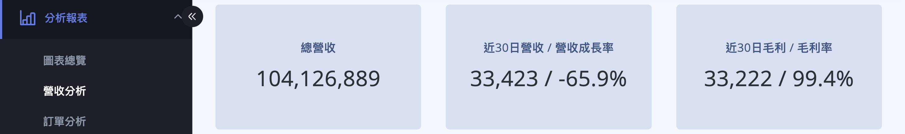{ title="關鍵數據卡" }

---

### 看懂營收總覽折線圖 { #operate-revenue-read-overview }

「營收總覽」以多條折線呈現不同類型的營收與成本：

1. **檢視各條線：** 圖表內每一條線代表一種營收或成本（例如存活訂單營收、退貨訂單營收、成本、毛利等）。
2. **查看項目說明：** 將滑鼠移到圖例（圖表上方的項目名稱）上，系統會顯示該項目的定義說明。
3. **比對趨勢：** 透過同一張圖中多條線的相對高低，觀察營收、成本與毛利之間隨時間的變化關係。

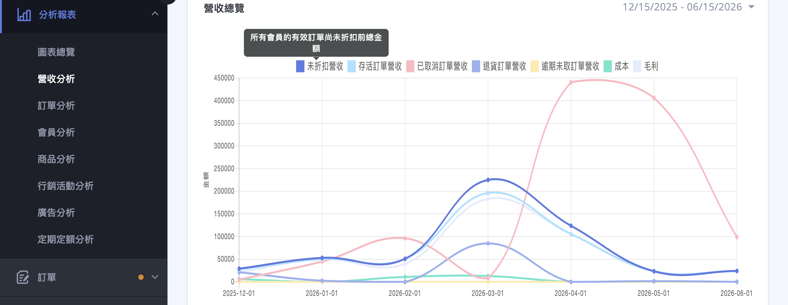{ title="營收總覽折線圖" }

各條線的完整定義請見[營收指標定義對照表](references/revenue-analysis-metrics-reference.md#reference-revenue-metrics){ title="營收分析指標定義對照表" data-preview }。

---

### 調整圖表的時間區間 { #operate-revenue-date-range }

每一張圖表的 **右上角都有獨立的日期區間欄位**，可單獨調整該圖表要呈現的時間範圍：

1. **點擊日期欄位：** 在欲調整的圖表右上角，點擊日期輸入框，展開日期選擇器。
2. **選擇預設區間或自訂：** 可直接選擇預設區間（今日、昨日、最近 7 日、最近 30 日、這個月、上個月），或在月曆上自行框選起訖日期。
3. **套用：** 點擊 **「套用」**，該圖表即會依新的時間區間重新載入。

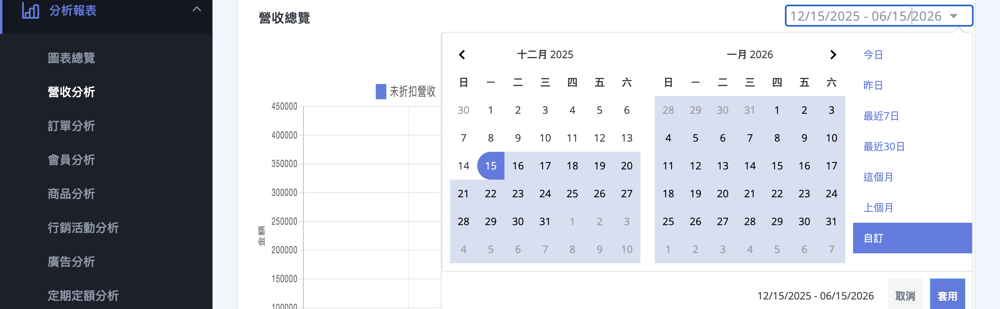{ title="調整日期區間" }

!!! tip "技巧"
    每張圖表的日期區間是 **各自獨立** 的，調整其中一張不會影響其他圖表。頁面初次載入時，各圖表預設顯示最近約半年的資料。若要做整體比較，記得逐一將各圖表調整為相同區間。

---

### 訂單存活狀態 <small>營收占比</small> { #operate-revenue-read-order-status }

圓餅圖，呈現各訂單狀態各占多少營收。圖中項目包含：

- **存活訂單營收：** 有效成立訂單的營收。
- **已取消訂單營收：** 已取消訂單的金額。
- **退貨訂單營收：** 已退貨訂單的金額。

將滑鼠移到圖塊上，即會顯示該項目的營收金額與占比百分比。

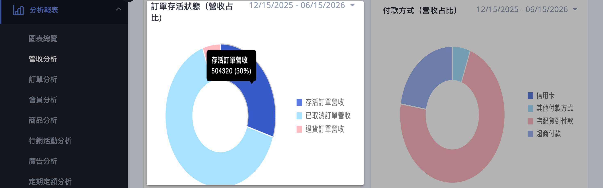{ title="訂單存活狀態營收占比" }

---

### 付款方式 <small>營收占比</small> { #operate-revenue-read-payment }

圓餅圖，呈現各付款方式帶來的營收比重。圖中項目會依您店內實際啟用的付款方式動態顯示（例如信用卡、超商付款、貨到付款等），未使用到的方式不會出現。

將滑鼠移到圖塊上，即會顯示該付款方式的營收金額與占比百分比。

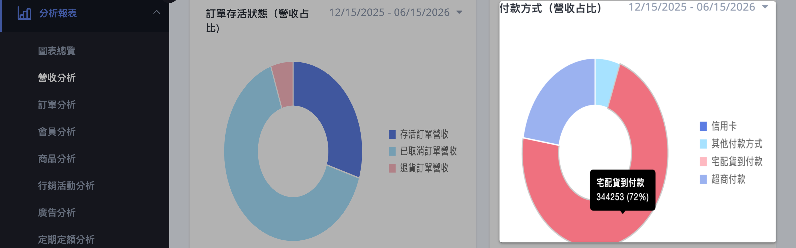{ title="付款方式營收占比" }

---

### 出貨方式 <small>營收占比</small> { #operate-revenue-read-shipping }

圓餅圖，呈現各出貨方式帶來的營收比重。圖中項目會依您店內實際啟用的出貨方式動態顯示（例如宅配、自訂出貨方式等），未使用到的方式不會出現。

將滑鼠移到圖塊上，即會顯示該出貨方式的營收金額與占比百分比。

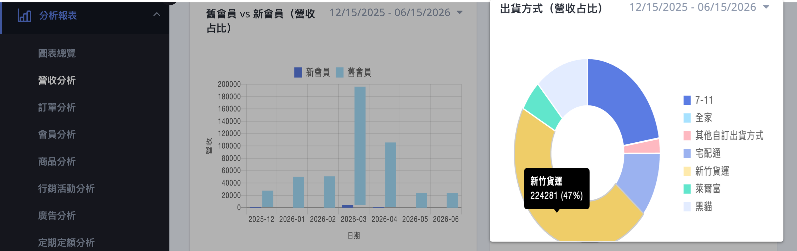{ title="出貨方式營收占比" }

---

### 舊會員 vs 新會員 <small>營收占比</small> { #operate-revenue-read-member }

長條圖，以比例方式比較新會員與舊會員的營收貢獻占比，協助您了解營收主要來自新客還是回頭客。

將滑鼠移到長條上，即會顯示各會員類型的營收金額。

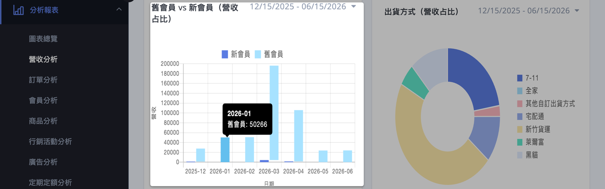{ title="新舊會員營收占比" }

---

### 各時平均營收 { #operate-revenue-read-hourly }

折線圖，呈現一天 24 小時的營收分布，協助找出營收高峰時段。圖中同時畫出兩條資料：

- **期間各時平均營收：** 所選期間內，每個小時的平均營收[^2]。
- **本日各時營收：** 今天目前各小時的營收。

將滑鼠移到資料點上，即會顯示該時段的營收金額。

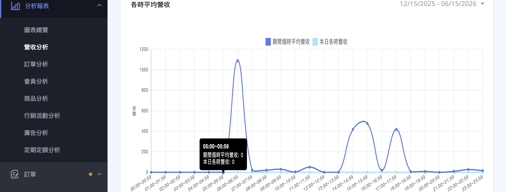{ title="各時平均營收" }

---

### 週間各日平均營收 { #operate-revenue-read-weekday }

長條圖，呈現星期一到星期日的營收分布。圖中同時呈現兩組資料：

- **週間各日平均營收：** 所選期間內，星期一到日各自的平均營收[^3]。
- **本週各日營收：** 本週目前各日的營收。

將滑鼠移到長條上，即會顯示該日的營收金額。

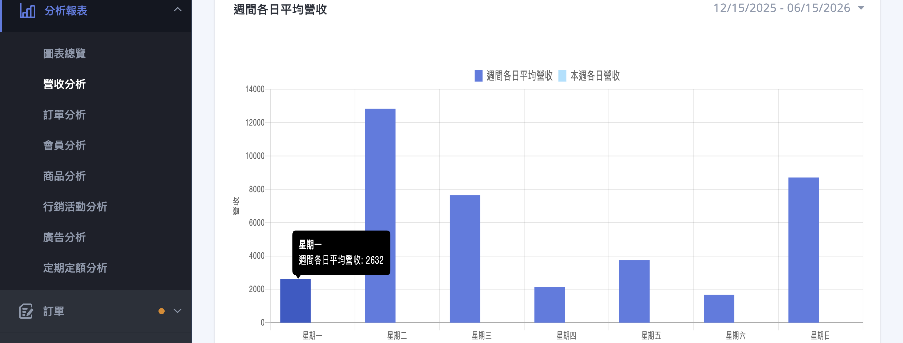{ title="週間各日平均營收" }

---

### 各日平均營收 { #operate-revenue-read-daily }

長條圖，呈現一個月內各日的營收分布。圖中同時呈現兩組資料：

- **期間各日平均營收：** 所選期間內，每日的平均營收[^4]。
- **本月各日營收：** 本月目前各日的營收。

將滑鼠移到長條上，即會顯示該日的營收金額。

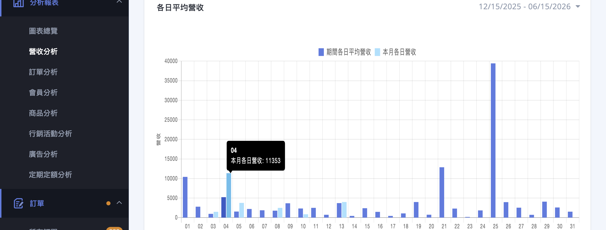{ title="各日平均營收" }

## 重要規範與限制 { #specs-revenue }

- **資料以認列訂單為準：** 已取消、已退貨的訂單不計入營收，因此數字可能與訂單列表的總金額不同。
- **占比圖的選項為動態顯示：** 付款方式、出貨方式等占比圖的項目，會依您店內實際使用到的方式動態呈現，未使用到的方式不會出現。
- **毛利依賴商品成本：** 毛利與成本相關數字，需先在商品設定中填入成本價才會準確。
- **數字格式：** 營收與金額以整數呈現並加上千分位；成長率為正值時以 `+` 開頭顯示。

## 常見問題 { #faq-revenue }

??? quote "進入頁面顯示「您目前方案不支援」"
    { #faq-revenue-plan }
    這表示您目前的方案尚未包含營收分析功能。

    - 請聯絡客服或您的開店顧問，確認方案是否可升級或加購數據分析功能。

??? quote "圖表數字和訂單列表的金額對不起來"
    { #faq-revenue-counted-orders }
    營收分析只計入「認列訂單」，也就是非取消、且非退貨（不需退貨或拒絕退貨）的訂單。

    - 已取消、已退貨的訂單金額不會計入營收。
    - 詳細定義請見[認列訂單定義](#prerequisites-revenue-counted-orders){ title="認列訂單定義" }。

??? quote "毛利顯示為 0 或偏低"
    { #faq-revenue-gross-profit }
    毛利是以「成立訂單營收扣除商品總成本」計算，因此需要商品有設定成本價。

    - 若商品未在商品設定中填入成本價，系統會以成本 0 計算，使毛利偏高或與實際不符。
    - 建議先為商品補上成本價，再回到本頁查看毛利。

??? quote "調整了一張圖的日期，其他圖表沒有跟著變"
    { #faq-revenue-date-range }
    這是正常的，每張圖表的日期區間都是各自獨立的。

    - 若要讓多張圖表呈現同一時間範圍，請逐一將每張圖表的日期欄位調整為相同區間。

## 參考資料 { #reference-revenue }

- [營收分析指標定義對照表](references/revenue-analysis-metrics-reference.md)
