# 電子票券設定指南
建立、販售、核銷與管理電子票券商品的完整操作手冊，涵蓋後台設定、顧客購買流程及門市操作。
{ .subtitle }

[:lucide-tag:{ title="適用方案" }](../../../resources/conventions#適用方案) | 所有 PLUS 版 / 企業版
{ .doc-badge }

!!! info "版本差異說明"
    - 「電子票券」在 PLUS 方案中屬於選配模組（11 選 2），商家需確認已選配該模組方可使用。企業版則直接內建此功能。

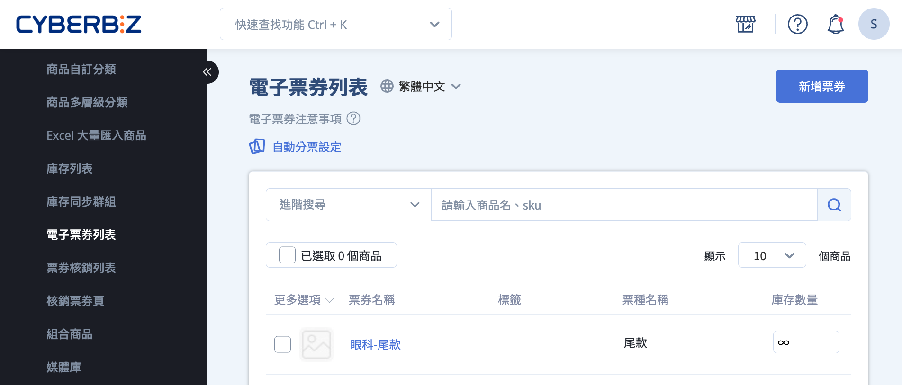{ .hero-page }

## 電子票券使用限制與規則

- 可加入 [限購群組](../marketing/purchase-restrictions/)，限制每位消費者可購買張數  
- 僅支援 [電子票券任選折扣](setup-e-ticket-promotions.md) 與 [分潤](../profit-sharing/index.md)，不可與其他優惠併用  
- 付款方式僅支援 **信用卡一次付清**

!!! info "票券發行人"
	票券發行人為順立智慧股份有限公司，票券面額為實際售價（含優惠），已存入發行人於永豐銀行開立之「信託專戶」，專款專用，保障履約安全。

## 新增電子票券

建立電子票券商品。

1. 登入 CYBERBIZ 管理後台，前往 **商品 > 電子票券列表 > 新增票券**。
2. 依序填寫資訊：基本設定、票券圖片、款式管理。 

	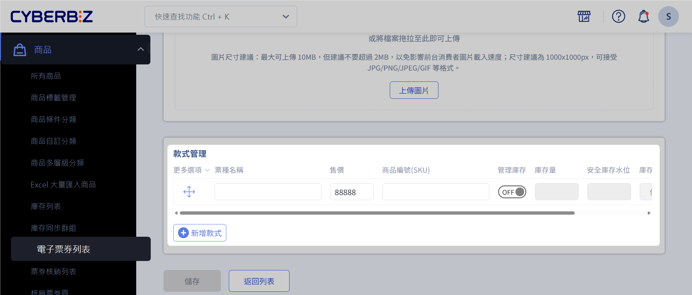

3. 點擊 **儲存**，套用變更。系統會自動建立一組名為 **票種名稱** 的款式規格。

    !!! info "電子票券商品無法像一般商品編輯顏色或尺寸。"

    ??? example "票種範例"
      - 活動票券：如 *早鳥票*、*團體票* 等。
      - 商品兌換券：如 *灌籃高手兌換組*、*七龍珠兌換組* 等。

4. 新增的電子票券將顯示於 **電子票券列表**。

## 購買電子票券 <small>顧客端流程</small>

1. 顧客於前台選擇電子票券。  

	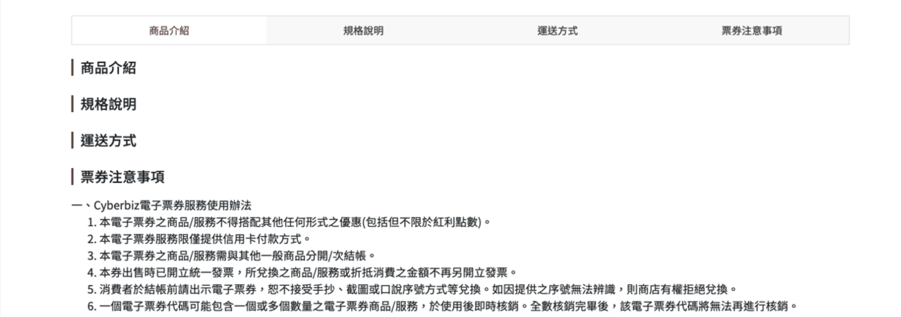

    !!! info "商品頁面會顯示票券注意事項，提醒顧客使用辦法。"

2. 若購物車同時含一般商品，系統會要求拆分結帳。
3. 勾選 **同意電子票券條款**。勾選後才能完成結帳，購物車內的 **配送時段** 可忽略。

	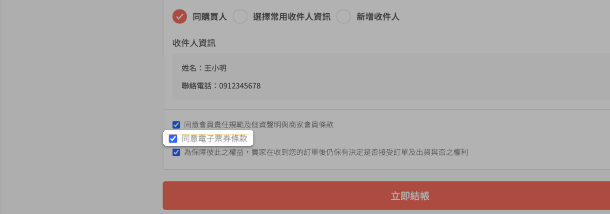

4. 完成結帳。

## 查看已購買的電子票券

顧客付款完成後，可透過以下方式查看 QR Code（核銷碼）：

- **會員帳戶**：我的帳戶 > 電子票券訂單查詢  
- **Email**：系統寄送電子票券確認信

=== "電子票券訂單查詢"

	1. 前往 **我的帳戶 > 電子票券訂單查詢**。  
	2. 點擊 **顯示票券 QR code**。
	
		

		
		- 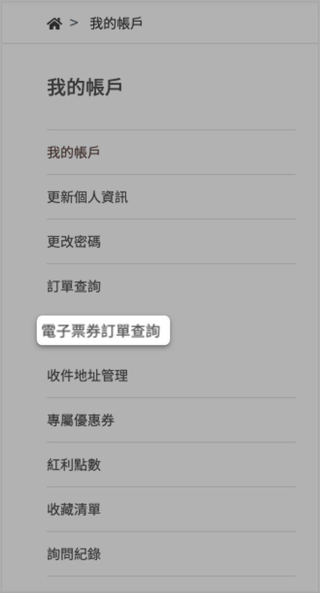
		- 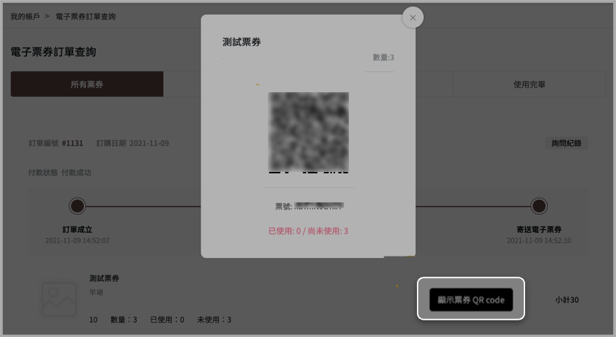
		
		

=== "電子票券確認信"

	!!! note "需設定會員電子郵件"
		請確認顧客註冊設定中的「電子郵件」為必填，確保 QR Code 能成功寄送。若會員未提供 Email，系統將無法寄送。
	
	1. 登入 CYBERBIZ 後台，前往 **管理中心 > 顧客註冊設定**。  
	2. 勾選 **電子郵件：必填**。
	
		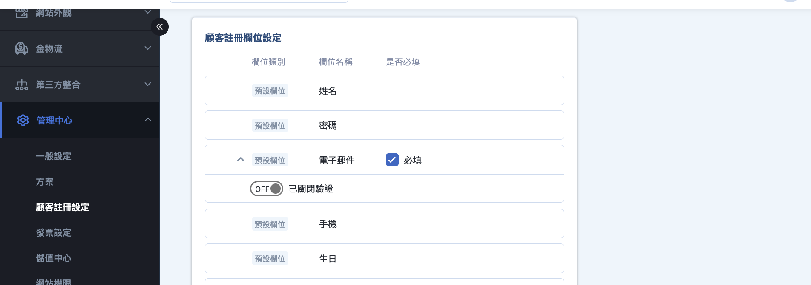
	
		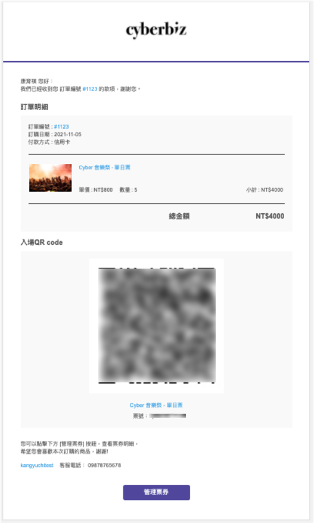

## 核銷電子票券 <small>門市端操作</small>

提供多種核銷電子票券的方式，包括電腦輸入、手機掃碼、後台查詢。

!!! info "電子票券分票的核銷請看如何[核銷分票後的核銷碼](#核銷分票後的核銷碼)。"

=== "電腦輸入 QR Code"

	1. 登入 CYBERBIZ 管理後台，前往 **商品 > 核銷票券頁**。  
	2. 將核銷碼輸入或用掃碼槍掃描。  
	3. 輸入核銷數量，點擊 **確認核銷**。  
	4. 確認彈窗資訊，點擊 **確認核銷**。  
	
	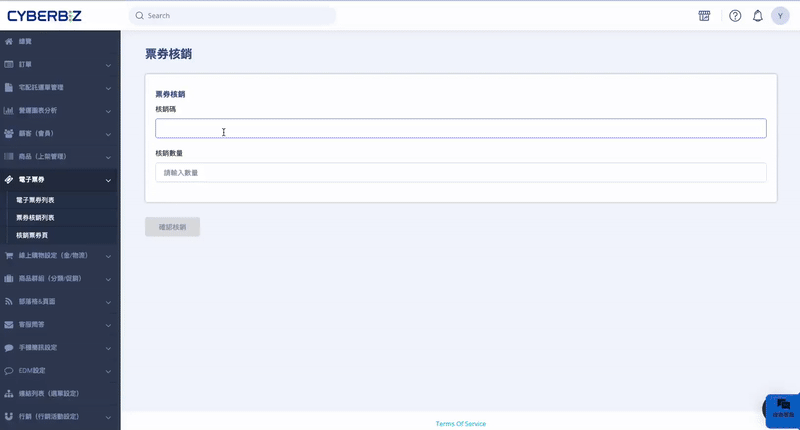

=== "手機掃 QR Code"  

	1. 開啟相機掃描 QR Code。  
	2. 透過瀏覽器開啟網頁，登入後跳轉至 **核銷票券頁**。  
	3. 輸入核銷數量，點擊 **確認核銷**。  
	4. 確認彈窗資訊，點擊 **確認核銷**。  
	
	

=== "後台「票券核銷列表」"
	若消費者忘記攜帶 QR Code 或因突發狀況無法出示，可透過姓名或電話查詢核銷碼。
	
	1. 在 CYBERBIZ 管理後台，前往 **商品 > 票券核銷列表**。
	2. 在「選擇欲搜尋類別」中，可使用以下欄位篩選票券：
	    - 票券名稱  
	    - 核銷碼  
	    - 訂單收件人姓名  
	    - 訂單收件人電話  
	    - 訂單編號  
	    
	3. 篩選出票券後，點擊 **前往核銷**，進入 **核銷票券頁**，核銷碼將自動帶入。
	4. 輸入核銷數量，點擊 **確認核銷**。  
	5. 確認彈窗資訊，點擊 **確認核銷**。 
	
	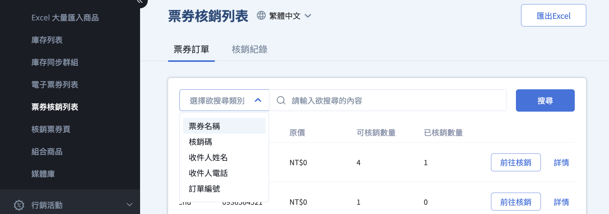
	
	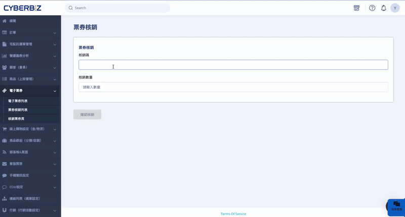

=== "後台「核銷票券頁」手動核銷"

	1. 登入 CYBERBIZ 管理後台，前往 **商品 > 核銷票券頁**。
	2. 在核銷欄位中輸入 **票券核銷碼**，點選 **查看票券**。
	3. 確認票券資訊無誤後，輸入本次要核銷的 **核銷數量**。
	4. 點擊 **確認核銷**，完成票券核銷。
	
!!! note "補充說明"  
    - 若尚未取得核銷碼，可前往 **商品 > 票券核銷列表** 查詢對應的票券核銷碼。  
    - 核銷完成後，系統將即時更新票券的已核銷數量與狀態。
	
    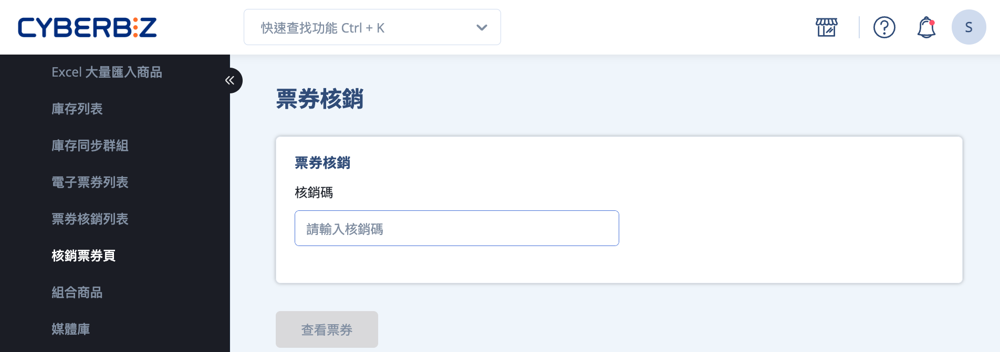

## 建立電子票券門市店員帳號

!!! warning "權限限制"
    門市店員僅能操作 **票券核銷列表** 與 **核銷票券頁**，無法修改票券設定或其他權限。

1. 登入 CYBERBIZ 管理後台，前往 **管理中心 > 網站權限 > 管理者列表**。
2. 點擊 **新增門市管理者**。
3. 在 **門市** 類型中選擇 **電子票券門市**。電子票券門市店員的權限為系統預設，無法自行修改[^permission-notice]。

4. 輸入門市店員的使用者資訊。**門市店員** 與 **電子票券門市店員** 為不同角色，請分別建立帳號[^separate-accounts]。
5. 點擊 **新增** 完成設定。

[^permission-notice]: 嘗試變更權限並儲存時，系統將顯示提示：「門市用戶的權限無法修改」。
[^separate-accounts]: 需使用不同帳號與密碼。

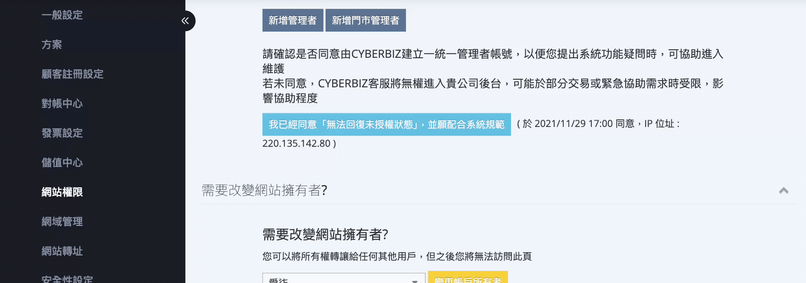

!!! info "更多電子票券門市權限相關設定，請看[設定電子票券門市權限](setup-e-ticket-store-permissions.md){ title="設定電子票券門市權限" }。"

## 電子票券退款

### 退款須知

#### 退票核心規則

- **單次作業原則**：每筆訂單僅支援執行 **一次** 退貨退款操作。
- **已核銷禁退**：已完成核銷的票券，無法進行退款。
- **不可指定退票數量**：必須將票券代碼中 **未核銷的票券全數退款**，系統不支援指定部分數量進行退票。
- **費用比例返還**：手續費將依照金額比例自動退回。

#### 票券結構與退款情境對照

根據票券代碼內含的票券數量，其退款判定邏輯如下：

| 票券結構 | 核銷狀態 | 是否可退款 | 說明與限制 |
| :--- | :--- | :--- | :--- |
| **單一代碼含單張票券** | 未核銷 | ✅ **可退款** | 依標準流程執行全額退款 |
| | 已核銷 | ✕ **不可退** | 票券一經兌換即無法退款 |
| **單一代碼含多張票券** | 全數未核銷 | ✅ **可退款** | 該代碼內的所有票券一次性全額退款 |
| | 部分已核銷 | ✅ **部分退** | **剩餘未核銷的票券將全數退款** |
| | 全數已核銷 | ✕ **不可退** | 所有額度皆已兌換，無法操作退款 |

!!! example "多張票券退款範例"
    假設一個電子票券代碼內含 **10 張** 票券：

    - 若目前已兌換 **3 張**，尚餘 **7 張** 未兌換。
    - 商家執行退票時，系統會將剩餘的 **7 張票券全部退還**。
    - **限制**：商家無法自行指定「只退 2 個」，必須將剩餘餘額全數處理。

### 退票流程

#### 1. 顧客提出退票申請

- 當顧客欲申請退票時，請引導其前往 **電子票券訂單查詢** 頁面。
- 顧客需透過訂單中的 **詢問紀錄** 功能，向商家提交退票需求。
    
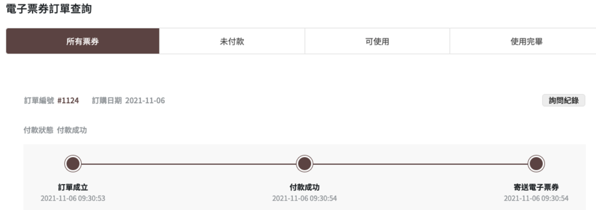

---

#### 2. 商家接收並確認退票通知

- 商家可於後台 **訂單列表** 頁面收到顧客的退票訊息。
- 請確認訂單編號、顧客資訊與退票請求內容是否正確。

---

#### 3. 確認退款情境與票券狀態

在進行退款前，請先確認以下項目：

- 訂單內的 **票券種類數量**
- 各票券的 **核銷狀態**
    
不同訂單情境將影響後續退票流程，請依下列類型進行處理：[單一種類票券](#訂單內僅含一種票券)、[多種票券種類](#訂單內含多種票券)。

- 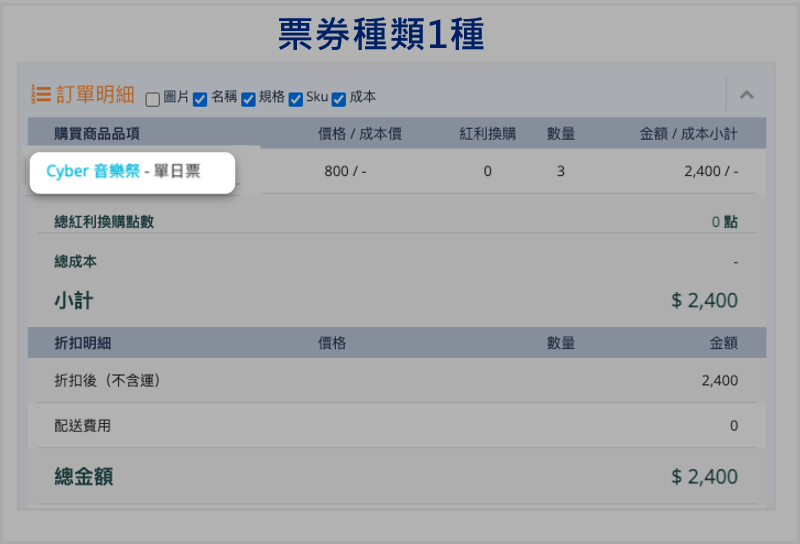{ title="單一種類票券" }
- 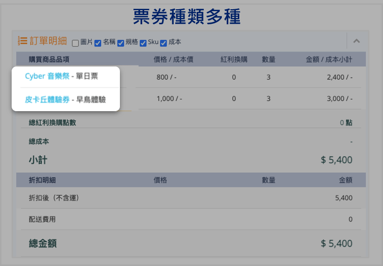{ title="多種票券種類" }

### 訂單內僅含一種票券

- 尚未核銷 > 可直接取消訂單  
- 已核銷 > 執行部分退款流程

=== "票券尚未核銷"
    若此票券尚未核銷，可直接走取消訂單流程。
    
    1. 在訂單列表中，找到並點擊欲取消的訂單，進入訂單明細頁面。
    2. 點擊 **取消訂單**，確認相關資訊無誤，點擊 **取消此訂單**。

        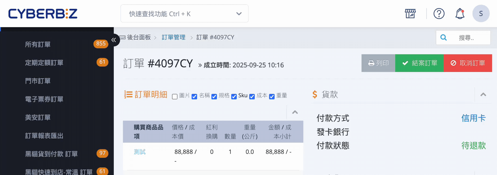

    3. 確認完成畫面
    
        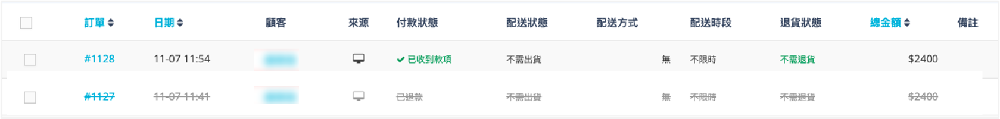

=== "票券已核銷"
    若此票券已核銷過，須走部分退款流程。（顧客當日付款，隔日才能操作部分退款）
    
    1. 在 CYBERBIZ 管理後台，前往 **訂單 > 電子票券訂單**，在訂單列表中勾選該訂單，點擊 **更多操作**，選擇 **退貨中**。
    2. 勾選該訂單，點擊 **更多操作**，選擇 **退貨審查**。
    3. 點擊訂單名稱進入訂單編輯頁面，在部分退款選取票券商品，點擊 **確認退款**。
    4. 再次確認退款資訊，點擊 **確認退款**。

    
	
### 訂單內含多種票券

- 全部未核銷 > 取消訂單  
- 部分已核銷 > 部分退款流程

=== "票券皆尚未核銷"
    若訂單內的票券皆尚未核銷，且消費者想要全部退款，則可以走[取消訂單流程](#票券尚未核銷)。

=== "部分票券已核銷"
    若訂單內已有核銷過的票券，或者消費者想要退某幾種特定票券，則須走部分退款流程。
    
    1. 在 CYBERBIZ 後台，前往 **訂單 > 所有訂單**，在訂單列表中勾選該訂單，點擊 **退貨中**。
    2. 勾選此訂單，點擊 **退貨審查**。	
    3. 進入訂單頁，在部分退款選取欲退票的票券商品，點擊 **確認退款**。
    
        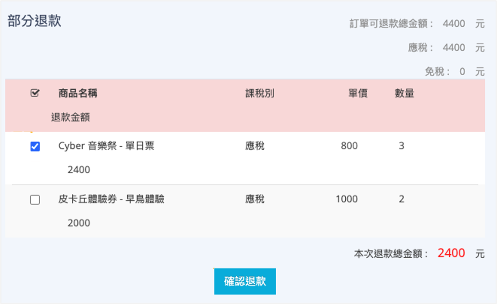
    
        !!! tip "若消費者只想退「Cyber 音樂祭 - 單日票」，則只需勾選該項目即可。"

    4. 點擊 **確認**，完成退款。
        !!! example "範例說明"
          「Cyber 音樂祭 - 單日票」剩餘3張全數退款，QR Code 作廢。「皮卡丘體驗券 - 早鳥體驗」沒有退款，則可繼續照常使用。

## 電子票券分票 <small>顧客端</small>

!!! note "使用須知"

	-   分票操作不可回復（一個 QR Code 可以拆分為多個，但多個 QR Code 無法合併成一個）。
	-   分票後，原核銷碼即無法再使用。
	-   電子票券為不記名制，只要持有核銷碼，任何人皆可使用，請自行妥善保管。
	-   若需[退款](#電子票券退款)，僅能由原購票人申請。請顧客勿隨意分票給他人，避免造成後續紛爭。

將同一張可多次核銷的票券拆分為多張獨立 QR Code（分票），供他人使用。

1. 登入前台會員，點選 **我的帳戶 > 電子票券訂單查詢**，按下 **分票** 按鈕。

	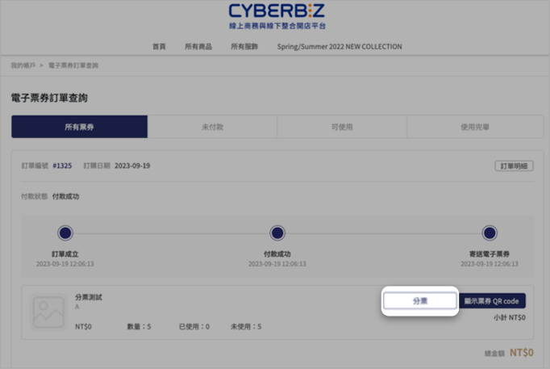

2. 確認提示資訊，點擊 **確認分票**。
3. 分票後，QR Code 會被拆分成多個（可左右滑動查看其他 QR Code）。

    !!! note "分票前的核銷碼為 10 碼，分票後的核銷碼為 25 碼。"
   
    ??? example "分票 QR Code 圖示"
        { .screenshot }
        
### 查看分票後的票券

1. 登入 CYBERBIZ 管理後台，前往 **商品 > 票券核銷列表**。
2. 點擊 **查看** 後，會跳出彈窗顯示該票券所有核銷碼與其核銷狀態。

!!! note "已分票的票券，核銷碼欄位會顯示 **查看** 按鈕。"

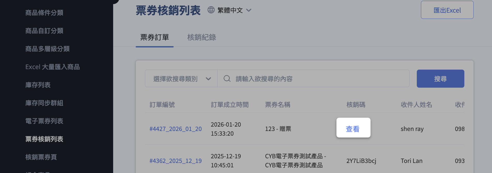

---

### 核銷分票後的核銷碼

分票後，票券核銷列表頁將不會有該票券的 **前往核銷** 按鈕，請至 **核銷票券頁** 輸入核銷碼，進行核銷。

1. 登入 CYBERBIZ 管理後台，前往 **商品 > 核銷票券頁**。
2. 輸入核銷碼進行核銷。（票後的核銷碼為 25 碼，核銷數量將預設為 1 且不可編輯）。
3. 點擊「查看票券」後，點擊 **確認核銷**。

{ .screenshot }

## 電子票券對帳

電子票券的代收款項撥款時機、手續費退回規則，以及對帳單的查看位置。

### 對帳規則

- 代收款項撥款時機，電子票券的代收款項會在 **核銷時** 撥款。

!!! example "範例說明"
    某訂單在 10/5 成立且收到款項，訂單內含一種票券，數量 5 張，每張 200 元，訂單總金額為 1000 元。消費者在 10/22 核銷兩張票券，面額 400 元。則 10 月下半帳期會撥款兩張已核銷的票券，共 400 元。

- 票券若退款，票券手續費會 **按比例** 退回。

!!! example "範例說明"
    某訂單內含一種票券，數量 5 張，已核銷 2 張，剩下 3 張要退款，則會退回剩下 3 張的手續費。

### 對帳單位置

電子票券對帳單提供位置可參考附圖。

{ .screenshot }

## 票券分潤與自動結案設定

!!! note "使用須知"

	-   即使票券尚未核銷，訂單仍會自動結案並計算分潤。
	-   訂單已結案後再進行退貨/取消訂單處理，不影響已成立的分潤。
	-   票券可搭配推薦人分潤，訂單結案時即計算分潤。

設定電子票券訂單自動結案並計算分潤。

1. 登入 CYBERBIZ 管理後台，前往 **金物流 > 結帳頁&金物流設定 > 訂單相關設定 > 訂單自動結案設定**。
2. 啟用 **開啟票券訂單自動結案** 功能，開啟（ON）或關閉（OFF）。
3. 設定票券訂單 **當顧客付款後 N 天訂單自動結案**，讓票券訂單可以自動計算分潤。

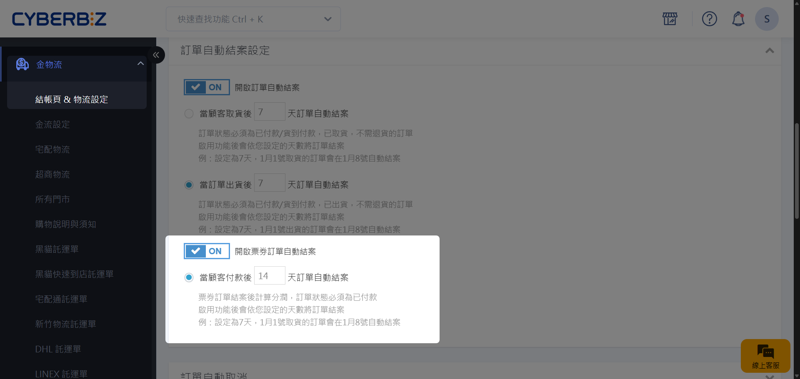

## 後續步驟

- :lucide-ticket-percent:{ .lg }   
  [__電子票券優惠__](setup-e-ticket-promotions.md){ title="設定電子票券優惠" }     
  匯入編輯過的商品 Excel 檔案，同步更新多筆商品的商品描述與配送相關設定。

- :lucide-key:{ .lg }     
  [__電子票券門市權限設定__](setup-e-ticket-store-permissions.md){ title="設定電子票券門市權限" }  
  設定商品的配送物流條件，限制特定物流方式於結帳流程中的顯示與使用。

