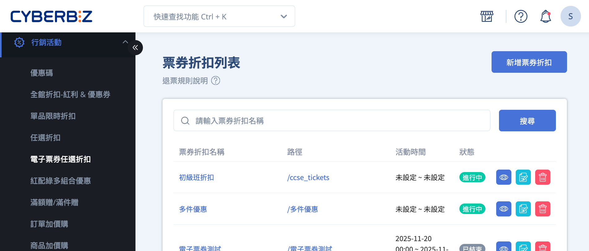
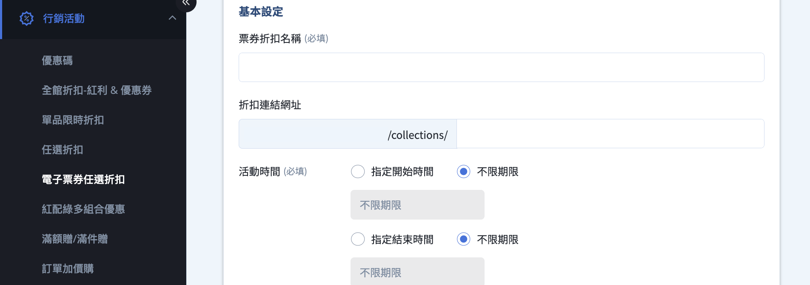
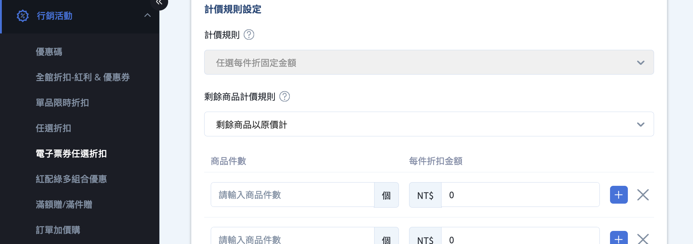
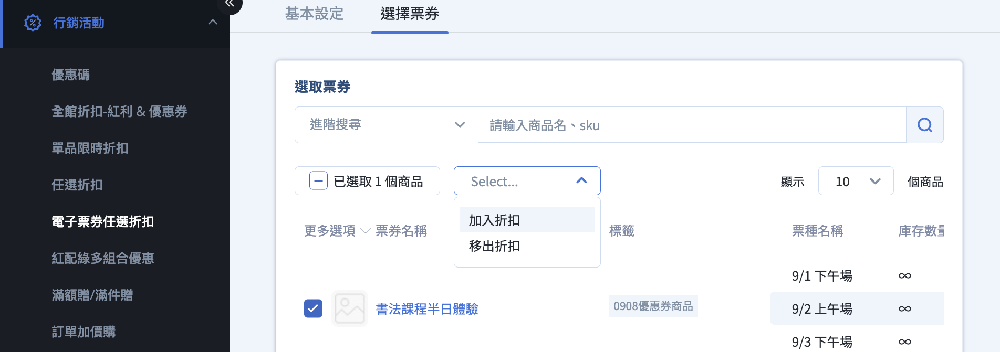

# 設定電子票券優惠

建立電子票券的任選折扣優惠活動，設定折扣層級與計價規則，並瞭解退票與撥款的計算方式。 
{ .subtitle }

[:lucide-tag:{ title="適用方案" }](../../resources/conventions#適用方案) | PLUS / 企業

{ .hero-page }

## 電子票券優惠說明

### 功能限制與適用範圍

- 電子票券任選折扣 **僅支援「任選每件折固定金額」** 的優惠形式  
  > 例如：任選 3 張電子票券，每張折 50 元
- 一個電子票券商品 **僅能加入一個任選折扣群組**
- 電子票券的任選折扣群組名稱 **不可與一般商品的任選折扣群組名稱重複**
- 不可與以下行銷活動併用：
	- 全館折扣
	- 優惠券
	- 加價購
	- 紅利折抵

### 優惠期間與使用期限說明

若電子票券具有下列情境，建議於商品介紹中清楚說明使用期限與兌換規則：

- 季節性活動或逾期需補價差
- 庫存或名額限制
- 兌換品項設有金額上限

!!! tip "建議文字範本"
    (OOO元為該票券折扣後的價錢)  
    :lucide-triangle-alert: 此票券使用/優惠期間至XXXX年XX月XX日止。  
    逾使用/優惠期間後，本券僅能兌換售價為OOO元（含）以下之品項，若點購超過OOO元品項，於兌換時需要另外補足差額後方能使用。  
    商品數量依現場實際供應為主。

!!! quote "範例說明"
	此票券使用/優惠期間至2022年10月31日止。  
	逾使用/優惠期間後，本券僅能兌換售價為120元（含）以下之品項，若點購超過120元品項，於兌換時需要另外補足差額後方能使用。商品數量依現場實際供應為主。

	**使用情境：**

	- 消費者A 在2022/6/8兌換該票券，可兌換刨冰乙份
	- 消費者 B 在2022/12/14兌換該票券，商家冬天已無販賣刨冰，消費者可補差價20元，兌換原價140元的燒仙草乙份

## 退票與金額計算規則

### 退票基本原則

- 退票以 **單一電子票券代碼** 為單位。
- 已 **核銷** 的電子票券 **不可退票**。
- 若訂單內含已核銷票券：
	- 核銷票券以 **原價** 計入已使用金額
	- 可能導致實際退款金額低於消費者預期

### 退款計算公式

退款金額的計算方式如下：

`退款金額 = 訂單實付金額 −（已核銷張數 × 票券計算單價）`

計算規則：

- 已核銷票券一律以 **原價** 計算
- 若計算結果小於 0，退款金額以 **0 元** 計算

### 退款計算範例

> 以下範例說明 **剩餘商品（超出優惠件數的票券）** 在不同計價方式下的退款差異。

=== "範例一：剩餘商品以優惠價計算"

	**情境**  
	
	- 票券原價：100 元  
	- 優惠設定：任選 3 件，每件折 30 元  
	- 購買數量：5 張  
	- 訂單總金額：350 元
	
	| 已核銷張數 | 退款張數 | 退款金額 | 計算方式 |
	|----------|--------|--------|---------|
	| 1 | 4 | 250 元 | `350 - (1 × 100)` |
	| 4 | 1 | 0 元 | `350 - (4 × 100) = -50`，退款金額最低為 0 |

=== "範例二：剩餘商品以原價計"

	**情境**  
	
	- 票券原價：100 元  
	- 優惠設定：任選 3 件，每件折 30 元  
	- 購買數量：5 張  
	- 訂單總金額：410 元
	
	| 已核銷張數 | 退款張數 | 退款金額 | 計算方式 |
	|----------|--------|--------|---------|
	| 1 | 4 | 310 元 | `410 - (1 × 100)` |
	| 4 | 1 | 10 元 | `410 - (4 × 100)` |

## 撥款規則與差價計算

### 撥款原則

- 電子票券採 **核銷後撥款**
- 每張票券於核銷時，系統將以 **實際折扣後價格** 計算撥款金額
- 若發生退票，系統將於對應帳期補撥 **折扣差價**

### 差價計算公式

系統計算差價撥款的公式如下：

`差價撥款 = 訂單總金額 − 已撥款金額 − 退款金額`

- **訂單總金額**：消費者支付的總金額（含折扣）
- **已撥款金額**：系統已撥給商家的金額
- **退款金額**：已退給消費者的金額

### 撥款計算範例

**情境**

- 票券原價：100 元  
- 優惠設定：任選 3 件，每件折 30 元  
- 購買數量：5 張  
- 其中 2 張為 **剩餘商品（超出優惠件數）**，以優惠價計算  
- 訂單總金額：350 元

| 已核銷張數 | 已撥款金額 | 退款金額 | 差價撥款 | 說明 |
|----------|----------|--------|--------|------|
| 1 | 70 | 250 | 30 | `350 - 70 - 250 = 30` |
| 4 | 280 | 0 | 70 | `350 - 280 - 0 = 70` |

## 操作流程

### 建立電子票券任選折扣群組

1. 登入 CYBERBIZ 管理後台，前往 **行銷活動 > 電子票券任選折扣**
2. 點擊 **新增票券折扣**
3. 填寫基本設定：
	- **票券折扣名稱**（不可與一般商品折扣群組重複）
	- **折扣活動網址**
	- **活動時間**
4. [設定計價與折扣規則](#設定計價與折扣規則)
5. 填寫折扣描述，點擊 **儲存**

### 設定計價與折扣規則

- **計價規則**：僅支援 **任選每件折固定金額**
- **剩餘商品計價方式**：
	- 以原價計：超出優惠件數的票券不折扣
	- 以優惠計：所有票券皆套用折扣
- **商品件數與每件折扣金額**：設定任選 Ｎ 件，每件折 M 元 
	- 點擊 :lucide-plus: 可設定多層級折扣，如任選 2 件 每件折 10元 + 任選 3 件每件折 15 元

> **說明**：**剩餘商品** 指未納入任選優惠條件計算的票券（即超出優惠件數的票券）。

### 將電子票券加入折扣群組

1. 在 **票券折扣列表** 中，點擊已建立的折扣名稱，進入編輯頁面。
2. 切換至 **選擇票券** 頁籤。
3. 勾選欲加入的電子票券，點擊操作選單，選折 **加入折扣**

	!!! warning "單一電子票券商品僅能加入一個折扣群組，重複加入將無法儲存。"
		
4. 確認票券顯示於下方 **已選取的票券** 清單，即完成設定
5. 點擊 **移除折扣** 可將票券移除折扣。

## 常見問題

??? quote "一張電子票券可以加入多個任選折扣群組嗎？"
	不可以。  每一個電子票券商品 **僅能加入一個任選折扣群組**。若嘗試將同一票券加入多個群組，系統將無法儲存設定。

??? quote "電子票券任選折扣可以和優惠券或紅利折抵一起使用嗎？"
	不可以。  電子票券任選折扣 **不可與以下行銷活動併用**：
	
	- 全館折扣
	- 優惠券
	- 加價購
	- 紅利折抵

??? quote "什麼是「剩餘商品」？"
	**剩餘商品** 指的是 **超出任選優惠件數的電子票券**。 例如設定「任選 3 件，每件折 30 元」，消費者購買 5 張，其中第 4、5 張即為剩餘商品。

??? quote "剩餘商品一定會以原價計算嗎？"
	不一定，取決於折扣群組的設定。在設定折扣規則時，可選擇以下其中一種計價方式：
	
	- **以原價計算**：僅符合優惠件數的票券享有折扣  
	- **以優惠價計算**：所有票券（包含剩餘商品）皆套用折扣

??? quote "為什麼退票時，已核銷的票券會以原價計算？"
	為確保 **退票與撥款計算的一致性**，所有已核銷的電子票券在退款計算時，皆以 **原價** 計入已使用金額。因此，若訂單內已有部分票券完成核銷，實際退款金額可能會低於消費者預期。

??? quote "如果退款金額計算結果小於 0，會怎麼處理？"
	若依計算公式得出的退款金額小於 0，系統將以 **0 元** 作為退款金額，不會出現負數退款。

??? quote "電子票券是什麼時候撥款給商家？"
	電子票券採用 **核銷後撥款** 機制：
	
	- 每張票券在核銷時，系統會以 **實際折扣後價格** 撥款  
	- 若後續發生退票，系統會於對應帳期 **補撥折扣差價**

??? quote "撥款中的「差價撥款」是什麼？"
	**差價撥款** 指的是在退票發生後，系統重新計算 **訂單總金額** 與 **已撥款金額** 間的差額，並於帳期中補撥給商家。  
	
	計算方式如下：`差價撥款 = 訂單總金額 − 已撥款金額 − 退款金額`