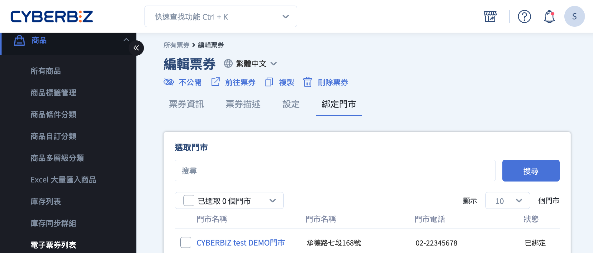
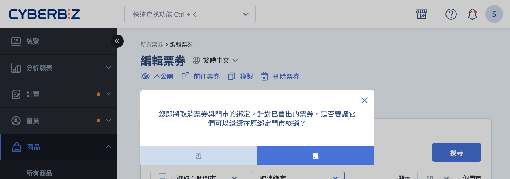
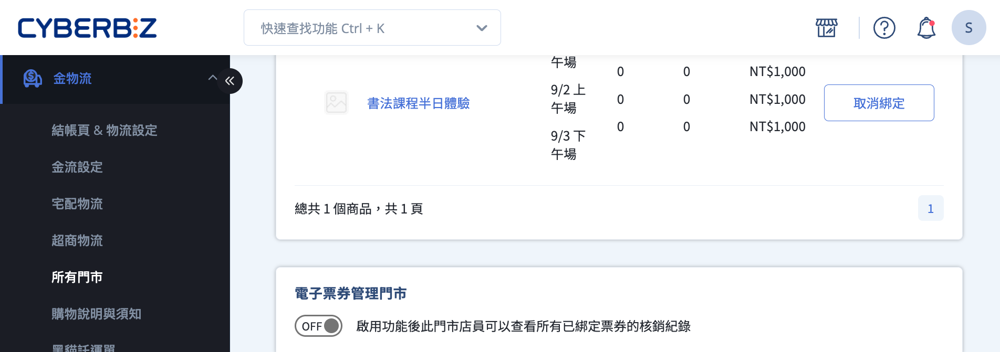
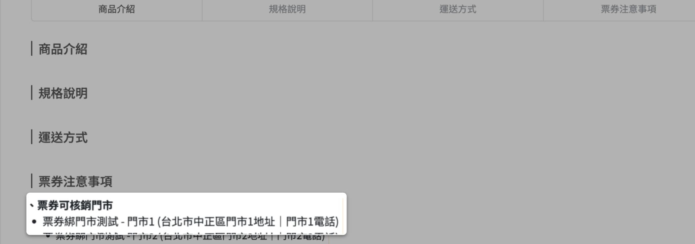
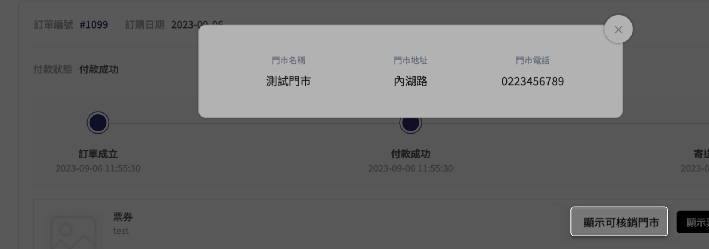

# 設定電子票券門市權限

設定電子票券在不同門市與合作品牌下的核銷權限、綁定規則及門市店員帳號管理。
{ .subtitle }

[:lucide-tag:{ title="適用方案" }](../../resources/conventions#適用方案) | PLUS / 企業
{ .doc-badge }

{ .hero-page }


## 電子票券門市權限說明

電子票券門市管理功能主要支援商家與「合作品牌」的虛實整合方案，讓顧客在線上購買票券後，可前往特定實體門市核銷。以下為門市權限與管理規則：

### 合作品牌與店員權限

**合作品牌定義**：  
商家若與其他品牌合作，可在系統後台建立合作品牌的門市帳號，並限制其使用者權限，使其僅能操作與自己品牌相關的票券商品。
    
**門市店員權限**：  
被指派為門市店員的帳號具有以下權限：
    
- 查看 **已綁定至該門市** 之票券訂單。    
- 執行該門市綁定票券的核銷作業。
- 查看該門市自身的核銷紀錄。


### 門市權限差異

門市權限分為「一般門市」與「管理門市」，差異僅在於 **核銷紀錄的檢視範圍**，不影響實際可核銷的票券範圍。

- **一般門市**：  
僅能查看該門市內的核銷紀錄。其他門市核銷紀錄不可見。
- **管理門市**：  
通常用於合作品牌的總公司或區域管理單位，可查看該合作品牌下所有子門市的核銷紀錄。

|**功能項目**|**一般門市**|**管理門市**|
|---|---|---|
|**查看票券訂單**|僅限已綁定的票券|僅限已綁定的票券|
|**核銷票券**|僅限已綁定的票券|僅限已綁定的票券|
|**查看核銷紀錄**|**僅限該門市** 之核銷紀錄|**所有已綁定票券** 於各門市之核銷紀錄|

> 瞭解更多，請參閱 [多門市權限差異範例](#範例一多門市權限差異)

## 電子票券與門市綁定說明

### 什麼是綁定

綁定是指將電子票券商品與特定門市建立關聯，以決定哪些門市可以核銷該票券。

### 綁定規則

電子票券與門市可進行多對多綁定：

- 一個電子票券商品可以綁定多個門市
- 一個門市可以綁定多個票券商品。

### 綁定異動

當電子票券與門市的綁定關係發生異動時，系統會依「是否允許已售出票券可以繼續在原綁定門市核銷」的設定，決定後續可用性。

- **新增綁定**：新綁定門市可核銷已售出票券。  
- **取消綁定**：系統會詢問是否讓已售出票券仍可核銷：
	- **是** → 舊有持券者仍可核銷，新售出票券不適用。  
	- **否** → 所有持券者無法在該門市核銷。

> 瞭解更多，請參閱 [門市暫停營業的綁定異動範例](#範例二門市暫停營業的綁定異動)

## 綁定電子票券與門市

您可以在以下兩個後台位置進行票券與門市的綁定。

- [**票券商品端**](#從票券商品編輯頁)：後台 > 商品 > 電子票券列表 > 選擇票券 > 「綁定門市」。  
- [**門市端**](#從門市編輯頁)：後台 > 金物流 > 所有門市 > 編輯 > 「綁定票券」。

### 從票券商品編輯頁

1. 登入 CYBERBIZ 管理後台，前往 **商品 > 電子票券列表**
2. 點選欲編輯票券
3. 切換至 **綁定門市** 頁籤，勾選門市
4. 點擊操作選單，選擇 **加入綁定** 或點擊相應按鈕。


### 從門市編輯頁

1. 登入 CYBERBIZ 管理後台，前往 **金物流 > 所有門市**。
2. 選擇欲編輯的門市，點擊 **編輯** 按鈕。
3. 切換至 **綁定票券** 頁籤，勾選票券。
4. 點擊操作選單，選擇 **加入綁定** 或點擊相應按鈕。


## 取消票券綁定

取消綁定時，系統會詢問是否讓已售出的票券仍可在原門市核銷。

#### 操作步驟

1. 登入 CYBERBIZ 管理後台，前往 **商品 > 電子票券列表**，選擇欲取消綁定的票券。
2. 點擊欲取消綁定的票券名稱，進入編輯頁面。
3. 切換至 **綁定門市** 頁籤。
4. 取消勾選要解除綁定的門市，點擊操作選單，選擇 **取消綁定**。
5. 系統跳出確認視窗，選擇是否允許已售出票券仍可在原門市核銷：
    
    - **選擇「是」**：已售出票券仍可核銷，新售出票券不適用。(建議選項，可降低客訴)  
    - **選擇「否」**：所有已售出票券無法在該門市核銷。



## 設定管理門市

1. 登入 CYBERBIZ 管理後台，前往 **金物流 > 所有門市**。
2. 選擇欲編輯的門市，點擊 **編輯** 按鈕。
3. 切換至 **綁定票券** 頁籤，啟用 **電子票券管理門市** 功能。



## 建立電子票券門市店員帳號

!!! info "門市店員僅能操作 **票券核銷列表** 與 **核銷票券頁**，無法修改票券設定或其他權限。"

1. 登入 CYBERBIZ 管理後台，前往 **管理中心 > 網站權限 > 管理者列表**。
2. 點擊 **新增門市管理者**。
3. 在 **門市** 類型中選擇 **電子票券門市**。
> 電子票券門市店員的權限為系統預設，無法自行修改。嘗試變更系統將顯示提示：「門市用戶的權限無法修改」。
4. 輸入門市店員的使用者資訊。
> **門市店員** 與 **電子票券門市店員** 為不同角色，需分別建立帳號（需使用不同帳號與密碼）。
5. 點擊 **新增** 完成設定。


## 前台顯示與核銷

顧客可在前台查看票券商品的核銷門市資訊。

- **票券商品頁**：顯示可核銷門市列表



- **會員電子票券訂單查詢**：會員登入後，可在 **我的帳戶 > 電子票券訂單查詢** 中查看可核銷門市。




## 範例說明

### 範例一：多門市權限差異

本範例說明在同一合作品牌下，不同門市角色在核銷紀錄檢視上的權限差異。

**情境說明**

- 商家 A 與品牌 X、Y、Z 合作推出 SPA 電子票券。
- 消費者於商家 A 官網購買電子票券後，可至品牌 X、Y、Z 之實體門市核銷。
- 品牌 X 設有 3 間實體門市（X-1、X-2、X-3）及 1 間總公司門市，並將總公司設定為 **管理門市**。
- 「全身芳香按摩 60 分鐘」電子票券已綁定品牌 X 的 4 間門市。

**權限差異說明**

- **管理門市（總公司）**：  
    可查看該票券於所有已綁定門市的核銷紀錄。
- **一般門市（X-1、X-2、X-3）**：  
    僅能查看各自門市的核銷紀錄，無法查看其他門市的核銷狀況。

??? note "示意圖：多門市核銷紀錄權限"
	```mermaid
	graph TD
	    A[管理門市（總公司）] -->|可查看全部核銷紀錄| B[門市 X-1]
	    A -->|可查看全部核銷紀錄| C[門市 X-2]
	    A -->|可查看全部核銷紀錄| D[門市 X-3]
	```

### 範例二：門市暫停營業的綁定異動

本範例說明當門市暫停營業時，商家調整門市綁定設定可能造成的實際影響。

**情境說明**

- 「全身芳香按摩 60 分鐘」電子票券綁定門市 X-1、X-2、X-3，並已售出 100 張。
- 因門市 X-1 暫停營業，商家需調整該票券與門市 X-1 的綁定狀態。

**處理方式與影響**

商家在取消綁定時，可選擇以下其中一種處理方式：

- **方案 A：不允許已售出票券繼續在原綁定門市核銷**
    
    - X-1 門市立即停止所有核銷行為。    
    - 已持有票券的消費者需改至其他門市使用，可能增加客訴風險。
        
- **方案 B：允許已售出票券繼續在原綁定門市核銷**（建議做法）
    
    - 已售出票券仍可於 X-1 門市核銷。
    - 新售出票券不再適用於 X-1 門市，可有效降低爭議與客服負擔。

## 常見問題

??? quote "門市店員的權限可以修改嗎？"
    「電子票券門市店員」的權限為固定，無法修改。若嘗試修改權限，儲存後會跳出警示訊息「門市用戶的權限無法修改」。

??? quote "一個電子票券可以綁定多少個門市？"  
	一個電子票券商品可以綁定 **多個門市**。只要完成綁定設定，該票券即可在所有已綁定的門市進行核銷。

??? quote "一個門市可以綁定多個電子票券嗎？"  
	可以。一個門市可同時綁定 **多個電子票券商品**，並執行這些票券的核銷作業。

??? quote "一般門市與管理門市的差異是什麼？"  
	差異在於 **核銷紀錄的檢視範圍**：  

	- 一般門市僅能查看 **自身門市** 的核銷紀錄。  
	- 管理門市可查看 **所有已綁定門市** 的核銷紀錄。

??? quote "管理門市可以核銷所有門市的票券嗎？"
	不可以。管理門市僅擁有 **核銷紀錄的檢視權限擴大**，實際可核銷的票券仍限於 **該門市本身已綁定的票券**。

??? quote "新增門市綁定後，已售出的電子票券可以使用嗎？"  
	可以。當電子票券新增綁定門市後，**先前已售出的票券** 也可直接在新綁定的門市進行核銷。

??? quote "取消門市綁定後，已售出的電子票券還能核銷嗎？"  
	視商家設定而定。取消綁定時，系統會詢問是否允許已售出票券繼續在原門市核銷：  

	- 選擇「是」：已售出票券仍可核銷，新售出票券不適用。  
	- 選擇「否」：所有票券皆無法在該門市核銷。

??? quote "門市店員與電子票券門市店員可以使用同一個帳號嗎？"  
	不可以。「門市店員」與「電子票券門市店員」屬於 **不同使用者角色**，必須分別建立帳號，無法共用。