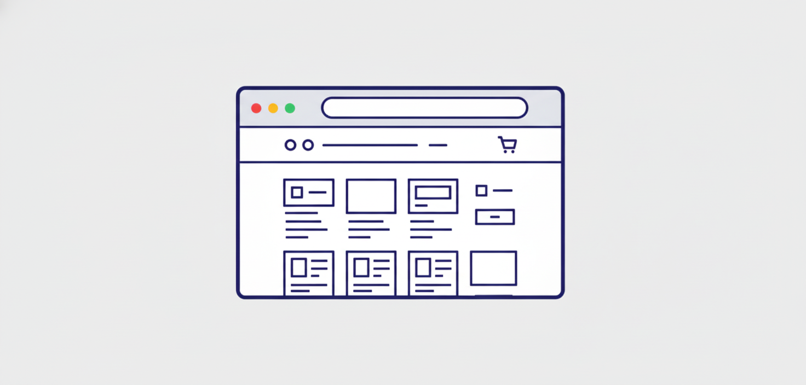

---
title:
hide:
  - toc
  - path
  - feedback
---

# 品牌官網

 
   
<big>__開始使用__</big>    
開始建立您的線上商店。  
完成商店設定、上架商品、啟用金流與物流，一步步帶您啟動營運。  
 
[新手上路 :lucide-circle-arrow-right:](get-started.md)

 

---

- :lucide-message-circle-question-mark:{ .lg .middle } [__常見問題__](#常見問題) 快速解答常見疑問
- :lucide-trending-up:{ .lg .middle } __熱門文章__ for interactivity
- :fontawesome-brands-css3: __CSS__ for text running out of boxes

=== "商店設定"

	

	
	-   :lucide-store: __Set up in 5 minutes__
	
	    ---
	
	    Install [`zensical`](#) with [`pip`](#) and get up
	    and running in minutes
	
	    [:octicons-arrow-right-24: Getting started](#)
	
	-   :lucide-truck-electric: __搬家到 CYBERBIZ__
	
	    ---
	
	    Focus on your content and generate a responsive and searchable static site
	
	    [:octicons-arrow-right-24: Reference](#)
	
	-   :lucide-palette: __網站外觀__
	
	    ---
	
	    Change the colors, fonts, language, icons, logo and more with a few lines
	
	    [:octicons-arrow-right-24: Customization](#)
	
	-   :material-scale-balance: __Open Source, MIT__
	
	    ---
	
	    Zensical is licensed under MIT and available on [GitHub]
	
	    [:octicons-arrow-right-24: License](#)
	
	

=== "商品管理"

	

	-   :lucide-rocket: __開始使用__

		---

		[商品庫存快速上手](products/quickstart.md)

	-   :lucide-package: __商品管理__
	
	    ---
	
	    Install [`zensical`](#) with [`pip`](#) and get up
	    and running in minutes
	
	    [:octicons-arrow-right-24: Getting started](#)
	
	-   :fontawesome-brands-markdown: __It's just Markdown__
	
	    ---
	
	    Focus on your content and generate a responsive and searchable static site
	
	    [:octicons-arrow-right-24: Reference](#)
	
	-   :lucide-ticket: __電子票券__
	
	    ---
	
	    Change the colors, fonts, language, icons, logo and more with a few lines
	
	    [:octicons-arrow-right-24: Customization](#)
	
	-   :material-scale-balance: __Open Source, MIT__
	
	    ---
	
	    Zensical is licensed under MIT and available on [GitHub]
	
	    [:octicons-arrow-right-24: License](#)
	
	

=== "訂單物流"

	

	
	-   :lucide-workflow: __訂單流程__
	
	    ---
	
	    Install [`zensical`](#) with [`pip`](#) and get up
	    and running in minutes
	
	    [:octicons-arrow-right-24: Getting started](#)
	
	-   :lucide-truck: __物流設定__
	
	    ---
	
	    Focus on your content and generate a responsive and searchable static site
	
	    [:octicons-arrow-right-24: Reference](#)
	
	-   :material-format-font: __Made to measure__
	
	    ---
	
	    Change the colors, fonts, language, icons, logo and more with a few lines
	
	    [:octicons-arrow-right-24: Customization](#)
	
	-   :material-scale-balance: __Open Source, MIT__
	
	    ---
	
	    Zensical is licensed under MIT and available on [GitHub]
	
	    [:octicons-arrow-right-24: License](#)
	
	

=== "支付金流"

	

	
	-   :lucide-credit-card: __付款方式__
	
	    ---
	
	    Install [`zensical`](#) with [`pip`](#) and get up
	    and running in minutes
	
	    [:octicons-arrow-right-24: Getting started](#)
	
	-   :lucide-file-check: __款項對帳__
	
	    ---
	
	    Focus on your content and generate a responsive and searchable static site
	
	    [:octicons-arrow-right-24: Reference](#)
	
	-   :lucide-receipt: __電子發票__
	
	    ---
	
	    Change the colors, fonts, language, icons, logo and more with a few lines
	
	    [:octicons-arrow-right-24: Customization](#)
	
	-   :material-scale-balance: __Open Source, MIT__
	
	    ---
	
	    Zensical is licensed under MIT and available on [GitHub]
	
	    [:octicons-arrow-right-24: License](#)
	
	

=== "會員管理"

	

	
	-   :material-clock-fast: __Set up in 5 minutes__
	
	    ---
	
	    Install [`zensical`](#) with [`pip`](#) and get up
	    and running in minutes
	
	    [:octicons-arrow-right-24: Getting started](#)
	
	-   :fontawesome-brands-markdown: __It's just Markdown__
	
	    ---
	
	    Focus on your content and generate a responsive and searchable static site
	
	    [:octicons-arrow-right-24: Reference](#)
	
	-   :material-format-font: __Made to measure__
	
	    ---
	
	    Change the colors, fonts, language, icons, logo and more with a few lines
	
	    [:octicons-arrow-right-24: Customization](#)
	
	-   :material-scale-balance: __Open Source, MIT__
	
	    ---
	
	    Zensical is licensed under MIT and available on [GitHub]
	
	    [:octicons-arrow-right-24: License](#)
	
	

=== "行銷推廣"

	

	
	-   :lucide-megaphone: __行銷工具__
	
	    ---
	
	    Install [`zensical`](#) with [`pip`](#) and get up
	    and running in minutes
	
	    [:octicons-arrow-right-24: Getting started](#)
	
	-   :lucide-trending-up: __成長拓展__
	
	    ---
	
	    Change the colors, fonts, language, icons, logo and more with a few lines
	
	    [:octicons-arrow-right-24: Customization](#)
	
	-   :material-scale-balance: __Open Source, MIT__
	
	    ---
	
	    Zensical is licensed under MIT and available on [GitHub]
	
	    [:octicons-arrow-right-24: License](#)
	
	

=== "報表分析"

	

	
	-   :material-clock-fast:{ .lg .middle } __Set up in 5 minutes__
	
	    ---
	
	    Install [`zensical`](#) with [`pip`](#) and get up
	    and running in minutes
	
	    [:octicons-arrow-right-24: Getting started](#)
	
	-   :fontawesome-brands-markdown:{ .lg .middle } __It's just Markdown__
	
	    ---
	
	    Focus on your content and generate a responsive and searchable static site
	
	    [:octicons-arrow-right-24: Reference](#)
	
	-   :material-format-font:{ .lg .middle } __Made to measure__
	
	    ---
	
	    Change the colors, fonts, language, icons, logo and more with a few lines
	
	    [:octicons-arrow-right-24: Customization](#)
	
	-   :material-scale-balance:{ .lg .middle } __Open Source, MIT__
	
	    ---
	
	    Zensical is licensed under MIT and available on [GitHub]
	
	    [:octicons-arrow-right-24: License](#)
	
	

=== "整合串接"

	

	
	-   :lucide-layout-grid: __APP MARKET__
	
	    ---
	
	    Install [`zensical`](#) with [`pip`](#) and get up
	    and running in minutes
	
	    [:octicons-arrow-right-24: Getting started](#)
	
	-   :lucide-webhook: __第三方服務__
	
	    ---
	
	    Focus on your content and generate a responsive and searchable static site
	
	    [:octicons-arrow-right-24: Reference](#)
	
	-   :lucide-plug: __API__
	
	    ---
	
	    Change the colors, fonts, language, icons, logo and more with a few lines
	
	    [:octicons-arrow-right-24: Customization](#)
	
	-   :material-scale-balance: __Open Source, MIT__
	
	    ---
	
	    Zensical is licensed under MIT and available on [GitHub]
	
	    [:octicons-arrow-right-24: License](#)
	
	

## 常見問題