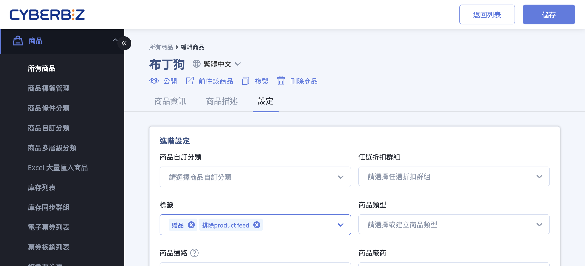
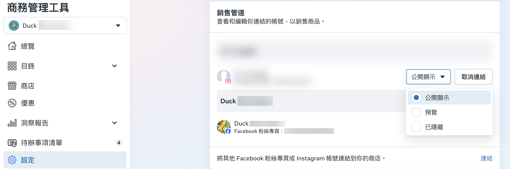
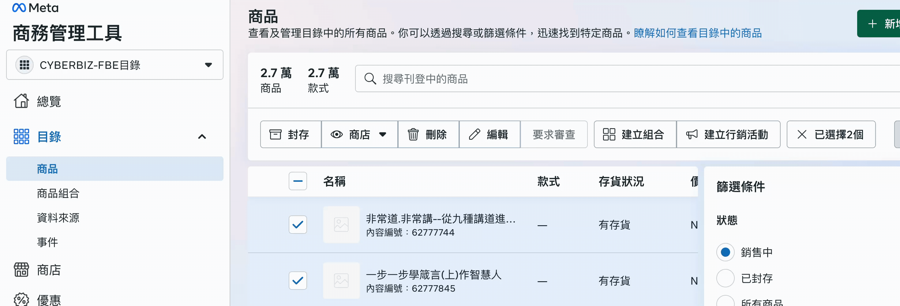

透過商品標籤設定或商務管理工具，排除特定商品不同步至 Facebook 與 Instagram 商店。
{ .subtitle }

{ .hero-page }

## FB 與 IG 商店商品排除說明

在啟用 Facebook (FB) 與 Instagram (IG) 商店串接後，系統會透過產品動態網址持續更新目錄資訊，若您有不欲顯示的商品，可以依照以下說明進行設定與調整。

!!! info "系統更新時間"
    官網商品資訊通常於每日 **凌晨 2 點或 2 點半** 自動同步至 Facebook 商店，當日更新的內容需等候同步完成才會呈現。

## 前置作業

- [x] 完成 [Facebook 跟 Instagram 商店串接](設定 Facebook 跟 Instagram 商店.md){ data-preview }。

## 透過官網後台標籤排除（自動化）

若您有特定商品（如贈品或測試品）不希望同步至第三方平台，最直接的方法是利用標籤過濾：

- :lucide-package-x:{ .lg }   
  [__設定商品排除標籤__](../../../products/categorization/管理商品標籤.md#排除上傳至第三方平台標籤){ data-preview }     
  在商品標籤輸入「排除 product feed」或「贈品」，系統自動過濾不同步的商品。

## 於商務管理工具中調整（手動調整）

若串接已完成，您也可以直接在 Meta 商務管理工具的管理介面調整能見度：

#### 隱藏整個商店

1. 進入「[商務管理工具 :lucide-external-link:](https://business.facebook.com/commerce)」並選擇商務帳號。
2. 點擊「設定」> 「一般」，在 **銷售管道** 中找到相關商店。
3. 在下拉式功能表中選擇能見度設定。

!!! note "更多流程及相關說明，請參閱 Meta 官方文件：[管理商店在 Facebook 和 Instagram 上的能見度 :lucide-external-link:](https://www.facebook.com/business/help/23907275388927202)。"

#### 隱藏單一或部分商品

=== "從商品目錄設定"

    1. 進入「[商務管理工具 :lucide-external-link:](https://business.facebook.com/commerce)」並選擇商務帳號。
    2. 點擊 **目錄** > **商品**。
    3. 勾選欲隱藏或顯示的商品（最多 100 項）旁的核取方塊。
    4. 點擊 **商店** 下拉式功能表：
        - 若要顯示商品，請選擇 **在商店中顯示** 並確認。
        - 若要隱藏商品，請選擇 **在商店中隱藏** 並確認。
    5. 選擇要隱藏商品的商店並確認。

    

=== "從商店庫存設定"

    1. 進入「[商務管理工具 :lucide-external-link:](https://business.facebook.com/commerce)」並選擇您的商店。
    2. 點擊左側選單的 「商店」，並在欲編輯的銷售管道（如：Facebook）旁點擊 「編輯商店」。
    3. 點擊 **設定** > **庫存**。
    4. 點擊 **查看商店中的商品**：
        - 若要隱藏商品，請點擊 **隱藏** :lucide-eye-off:。
        - 若要顯示商品，請點擊 **顯示** :lucide-eye:。

    

!!! note "更多流程及相關說明，請參閱 Meta 官方文件：[管理商店商品 :lucide-external-link:](https://www.facebook.com/business/help/836266307249612)。"

## 常見問題

??? quote "如何排除特定商品不同步至商店？"

    若有「贈品」或「測試品」不希望上傳至商店，請在官網後台的商品標籤欄位輸入 **「排除 product feed」** 或 **「贈品」**（排除 與 product 之間請勿添加空格），系統將自動過濾該商品。

??? quote "商品同步的時間是什麼時候？"

    官網商品資訊固定於 **每天凌晨 2 點或 2 點半** 自動同步至 Facebook 商店，當日更新的內容需等候同步完成才會呈現。

??? quote "使用標籤排除與在商務管理工具中隱藏有何不同？"

    使用商品標籤排除是自動化設定，商品不會上傳至目錄；使用商務管理工具隱藏是手動設定，商品仍會上傳但在商店中不顯示。

