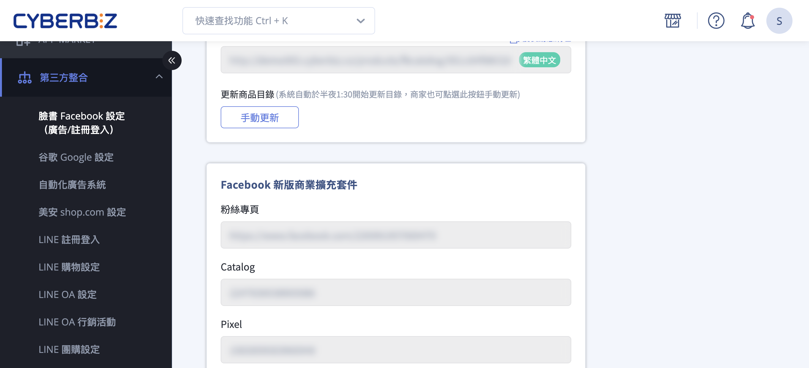
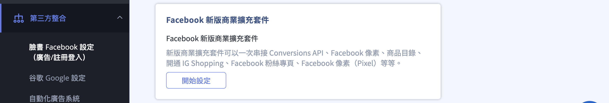
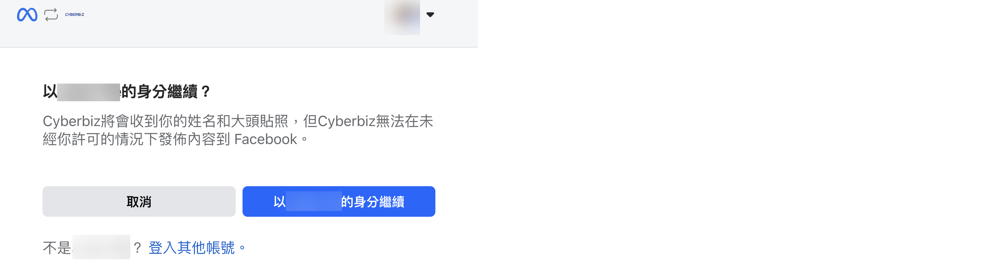
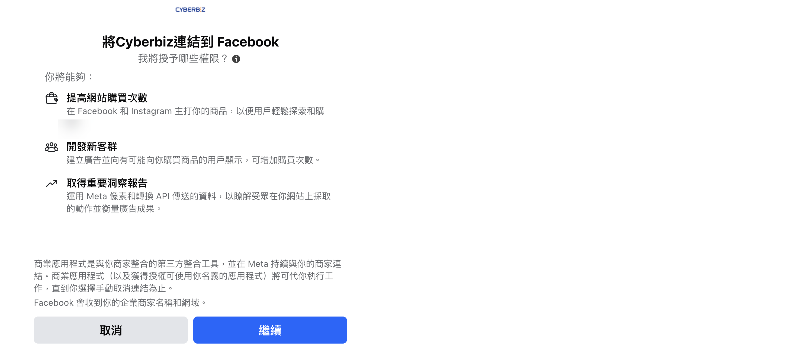
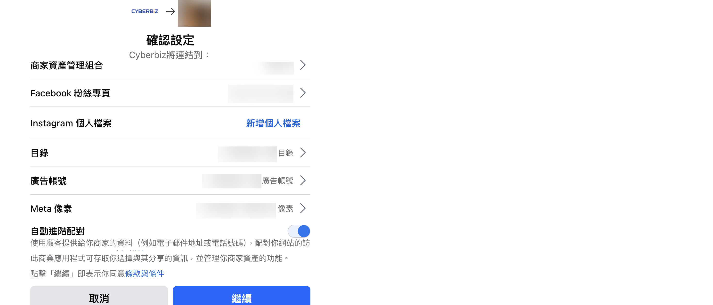
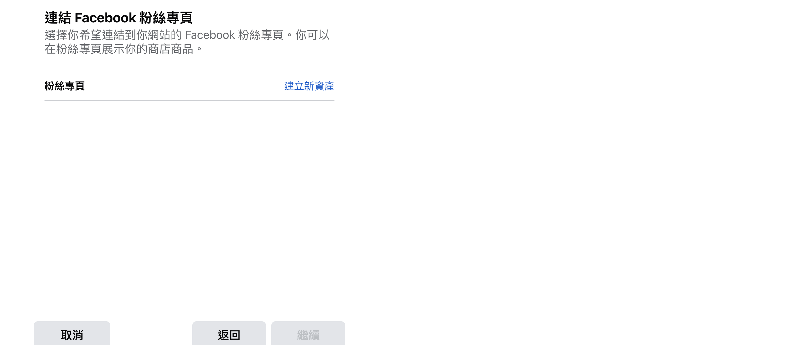
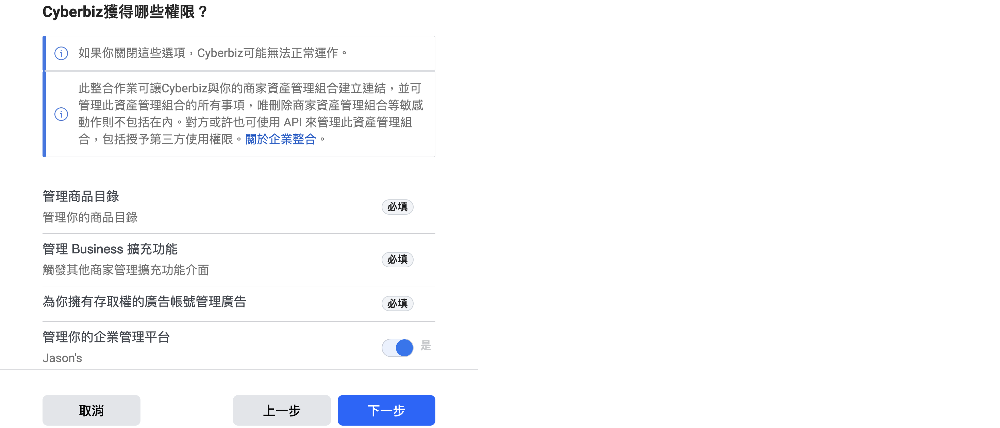
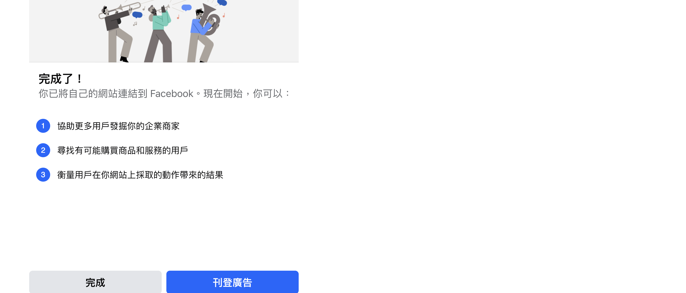
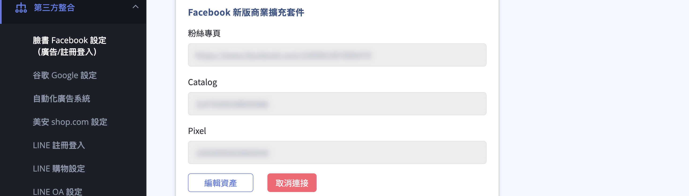

透過 Facebook 商業擴充套件將像素、粉絲專頁、目錄及廣告帳號等資產連結至 CYBERBIZ 後台。
{ .subtitle }

{ .hero-page }

## Facebook Business Extension 說明

「**Facebook 商業擴充套件**」可一次串接 **Conversions API**、**Facebook 像素（Pixel）**、**商品目錄**、**Instagram Shopping** 及 **Facebook 粉絲專頁** 等資產，讓商家能快速將這些資產連結至官網後台，並在一站式管理廣告追蹤、受眾建立與商品推廣。

## 設定路徑

1. 登入 CYBERBIZ 管理後台，點選「**第三方整合**」>「**臉書 Facebook 設定（廣告/註冊登入）**」。
2. 在頁面下方找到「Facebook 新版商業擴充套件」區塊，點擊「**開始設定**」啟動流程。



## 操作步驟教學

!!! tip "權限檢查"

    - 在開始設定前，建議先確認您目前的[企業管理平台狀態](#企業管理平台與廣告帳號){ data-preview }。
    - 若在設定過程中遇到權限問題，請確認您的帳號是否為該資產的擁有者或具備足夠管理權限。

1.  **登入 Facebook 帳號：** 瀏覽器若未登入，系統會要求您登入。請確保該帳號擁有商家資產管理組合的[相關資產設定權限](#核心資產權限邏輯){ data-preview }。

    

    !!! warning "確認瀏覽器是否阻擋彈窗"
        若頁面未正常跳轉，請確認瀏覽器是否已解除 「彈出視窗攔截」。設定教學：[Chrome 允許特定網站彈出視窗 :lucide-external-link:](https://support.google.com/chrome/answer/95472)

2.  **同意授權：** 點選授權以允許 CYBERBIZ 協助將電商官網資料與 Facebook 資料進行連結，這不會影響您原本的日常操作。

    

3.  **連結企業資產：** 點擊資產項目選擇要串接的粉絲專頁、目錄、廣告帳號及像素 (Pixel)。
    *   **重要提醒：** 您選取的資產擁有權必須[屬於該商家資產管理組合](#核心資產權限邏輯){ data-preview }，否則無法正確選取。
    *   您也可以在此步驟直接建立新的資產。
    *   建議開啟「[自動進階配對](#進階配對-advanced-matching-設定){ data-preview }」，以發揮廣告的最佳成效。（需已建立粉絲專頁）

    === "連結資產"
        
    === "建立新資產"
        

4.  **確認獲得權限：** 此步驟若出現 UI 顯示必填等提示為系統呈現問題，直接點選「下一步」即可。

    

5.  **完成連結：** 等候連結完成後點選「完成」，系統會自動導回 CYBERBIZ 後台設定頁。

    

## 設定後的檢查與維護

*   **確認連結狀態：** 回到後台頁面後，可再次確認粉專、像素、目錄的連結結果。
*   **編輯或取消：** 若需重新設定或清空設定，可點選「編輯資產」或「取消連結」。**請注意：** 執行此操作必須登入 **最初設定時使用的同一個 Facebook 帳號**。



## 權限說明

### 企業管理平台與廣告帳號

在進行串接前，請先確認您目前的使用狀況，選擇對應的處理方式：

| 現況 | 建議處理方式 |
|------|-------------|
| **已擁有企業管理平台** | 直接以此企業管理平台連結至 CYBERBIZ 後台，需注意欲連結的「廣告帳號」等資產 **必須由該企業管理平台所擁有**。 |
| **無企業管理平台，但曾擁有廣告帳號** | 建議先透過該廣告帳號建立企業管理平台後再進行連結。<br>*原因：* 過往廣告帳號建立的像素留有受眾資料，這些資料會直接影響未來的廣告投放成效。 |
| **兩者皆無** | 可直接透過「CYBERBIZ 商業擴充套件」一併建立，系統會同時創建企業管理平台、粉絲專頁、Instagram、商品目錄、廣告帳號及像素。 |

??? note "企業管理平台串接流程"
    ```mermaid
    graph LR
        Q1{是否已擁有<br/>企業管理平台？}
        Connect[以商業擴充套件<br/>連結企業管理平台]
        Create[創建企業管理平台]
        
        Q2{是否已擁有<br/>廣告帳號？}
        CreateViaAd[由廣告帳號創建]
        CreateViaCyber[由 CYBERBIZ<br/>商業擴充套件創建]

        Q1 -- 是 --> Connect
        Q1 -- 否 --> Create
        
        Create --> Q2
        
        Q2 -- 是 --> CreateViaAd
        Q2 -- 否 --> CreateViaCyber

    ```

進一步瞭解 [如何在 Meta Business Suite 建立商家資產管理組合 :lucide-external-link:](https://www.facebook.com/business/help/1710077379203657)。

---

### 核心資產權限邏輯

Facebook 的資產管理採用 **階層關係**：

*   **所有權限制：** 企業管理平台管理品牌的所有資產。若「粉絲專頁」或「像素」**非此企業管理平台所擁有**，則設定流程中將無法選取。
*   **檢查要點：** 務必確認您登入的 Facebook 帳號具備該平台及其資產的管理權限。

進一步瞭解 [商家資產管理組合和商家資產權限 :lucide-external-link:](https://www.facebook.com/business/help/442345745885606)。

---

### 進階配對 (Advanced Matching) 設定

這是提升廣告成效的重要權限設定，建議在串接時確認：

*   **自動進階配對（建議開啟）：** 無須編寫程式碼，可直接在「事件管理工具」中開啟，協助更精準地追蹤受眾。
*   **手動進階配對：** 需由開發人員修改像素基底程式碼，透過參數傳送網站訪客的資料。

進一步瞭解 [網站進階配對 :lucide-external-link:](https://www.facebook.com/business/help/611774685654668?id=1205376682832142)。
<!--
*   **轉換 API (CAPI)：** 設定完成後，系統會開始自動傳送伺服器端 (Server to Server) 的像素事件，您可至 [Meta 事件管理工具 :lucide-external-link:](https://eventsmanager.facebook.com/)查看連結方式是否出現「伺服器」。
-->

## 後續操作

<div class="grid cards" markdown>

- :lucide-shield:{ .lg }   
  [__網域驗證與事件設定__](設定 Facebook 網域驗證與事件追蹤.md){ data-preview }       
  完成 FBE 資產連結後，需進行網域驗證才能設定事件追蹤，確保廣告轉換數據準確。

</div>

## 常見問題

??? quote "需要什麼權限才能設定 FBE？"

    您需要具備該 Facebook 商家資產管理組合的管理權限，成為資產的擁有者或具備足夠的設定權限。若無權限，將無法正確選取要連結的資產。

??? quote "如何編輯或移除已連結的資產？"

    回到 CYBERBIZ 後台點選「編輯資產」即可重新選擇要連結的粉絲專頁、目錄、廣告帳號及像素。若需移除所有連結，可點選「取消連結」。請注意，執行這些操作時必須登入最初設定時使用的同一個 Facebook 帳號。

??? quote "為什麼找不到要連結的像素 (Pixel)？"

    可能是因為目前使用的企業管理平台並非由過往的個人廣告帳號升級而來，或者該像素的所有權不屬於您。建議重新建立像素並以自身像素為主。

??? quote "為什麼收不到代理商的權限邀約？"

    可能是因為粉絲專頁的權限仍留在「過往的代理商」身上，需先從代理商處收回權限後才能重新設定。

