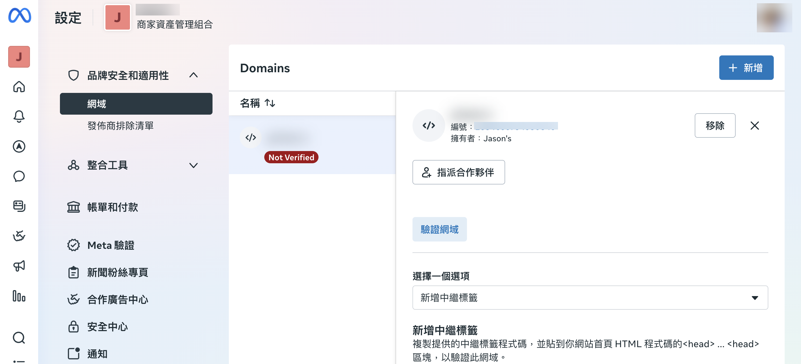
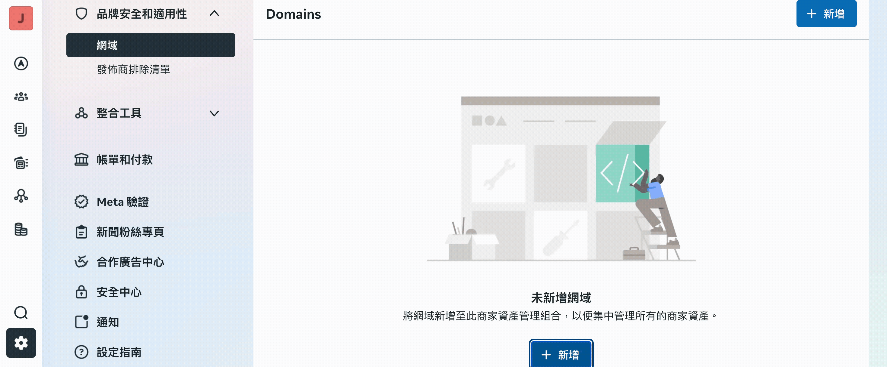
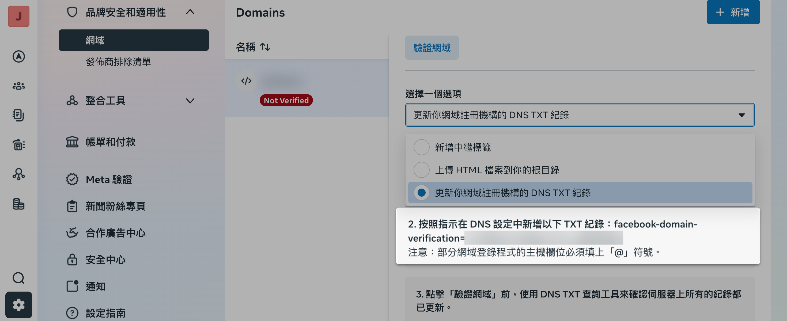
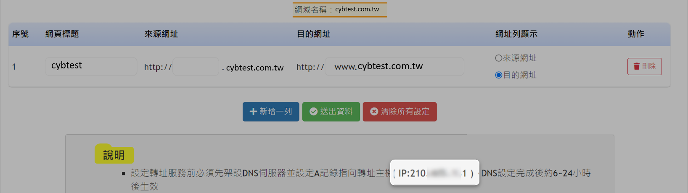
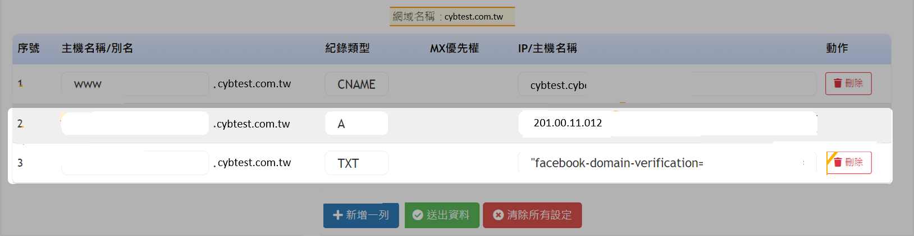
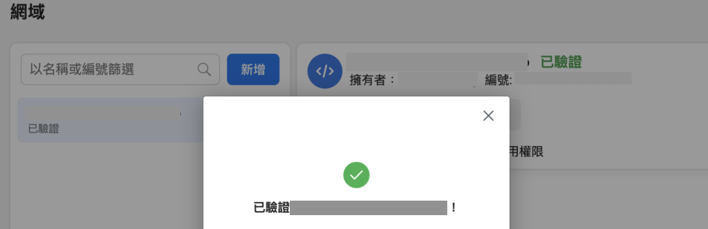
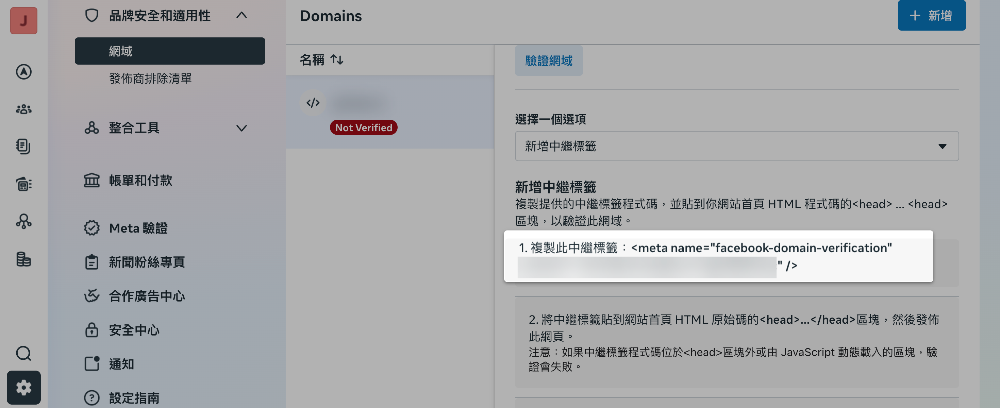
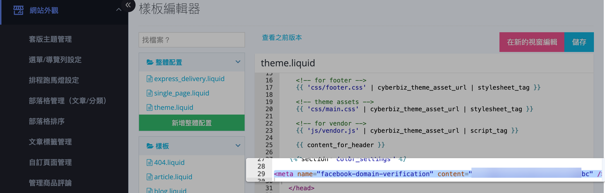

在企業管理平台中完成網域驗證。
{ .subtitle }

{ .doc-badge }

{ .hero-page }

## Facebook 網域驗證說明

**Facebook 網域驗證** 的主要目的是讓使用者在企業管理平台中認領網域所有權，進而控制連結編輯權限、優化廣告投放效果，並避免網站被他人盜用。

## 前置作業

- [x] 需先 [啟用 Facebook 商業擴充功能與相關資產連結](設定 FBE 帳號授權與資產連結.md){ data-preview }。

## 網域驗證方式選擇

網域驗證主要分為 [**DNS 驗證**](#dns-驗證-建議使用) 與 [**中繼標籤驗證**](#中繼標籤驗證-meta-tag) 兩種方式。

!!! info "建議優先使用 DNS 系統進行驗證；操作後台程式碼的中繼標籤驗證，若有失誤，系統商不負後台程式修改責任。更多驗證方式資訊與說明，請參考 [官方說明 :lucide-external-link:](https://www.facebook.com/business/help/321167023127050)。"

## DNS 驗證 (建議使用)

1.  **進入企業管理平台**：登入[企業管理平台 :lucide-external-link:](https://business.facebook.com/latest/settings)，點選「設定」>「品牌安全與適用性」>「網域」，新增您的主網域名稱。

    

2.  **複製 TXT 紀錄**：選擇「DNS 驗證」並複製系統產生的 TXT 紀錄代碼。

    

3.  **前往網域廠商設定**：

    === ":simple-gandi: GANDI"

        1. 需先完成 [CNAME 與轉址設定](../../../website-management/網域管理.md#gandi)
        2. 登入 [Gandi 後台 :lucide-external-link:](https://admin.gandi.net/)，於「區域檔紀錄」新增一筆 TXT 紀錄，名稱輸入 `@`，內容貼上複製的 TXT 代碼。

    === ":simple-godaddy: GoDaddy"

        **GoDaddy**：完成 CNAME 與轉址後，進入 DNS 管理新增 TXT 紀錄，主機輸入 `@`，TTL 設為 1 小時。

    === "HiNet"
        
        1. 完成 [CNAME 與轉址](../../../website-management/網域管理.md#hinet-中華電信)。
        2. 登入 [HiNet 網站 :lucide-external-link:](https://domain.hinet.net/#/)，前往「我的網域」>「轉址服務」> 「設定轉址」，複製 Ａ 紀錄 IP。

            

        3. 新增 A 紀錄與 TXT 紀錄：
            *   **A 紀錄**：【主機名稱/別名】空白、【紀錄類型】`A`、【IP/主機名稱】輸入步驟 2 複製的 IP 位置。
            *   **TXT 紀錄**：【主機名稱/別名】空白、【紀錄類型】`TXT`、【IP/主機名稱】貼上企業管理平台複製的 TXT 代碼（**代碼前後請加上 `""` 符號，且代碼請維持小寫**）。

            
    === "亞太"
        **亞太**：進入亞太 DNS 後台，依序填寫 CNAME、轉址、TXT 等表格資訊。

4.  **完成驗證**：設定完成後通常需等待 **2~3 日**，回到企業管理平台確認狀態變更為「已驗證」。

    

## 中繼標籤驗證 (Meta-tag)

1.  **取得代碼**：在企業管理平台的「網域」頁面點選「中繼標籤驗證」，複製整段代碼。

    

2.  **埋現代碼至 CYBERBIZ 後台**：
    *   路徑：**「網站外觀」** > **「套版主題管理」** > **「程式碼編輯器」** > 點擊 **`theme.liquid`**。
    *   將複製的 Meta-tag 代碼貼在檔案內容中的 **`</head>`** 標籤前面並儲存。

    

!!! warning "注意轉址限制"
    Facebook 僅會驗證轉址過的網址（例如：`yourname.com` 轉址到 `www.yourname.com`），子網域則需確認已 CNAME 至 `yourname.cyberbiz.co`。

## 後續操作

- :lucide-store:{ .lg }   
  [__Facebook 與 Instagram 商店設定__](商業擴充設定-Facebook 跟 Instagram 商店設定.md){ data-preview }       
  完成網域驗證後，可進一步設定 Facebook 與 Instagram 商店，建立社群銷售管道並同步商品。

## 常見問題

??? quote "為什麼需要完成網域驗證才能進行事件設定？"

    完成網域驗證後，才能進行 **彙總事件成效衡量** 的權限設定。商家必須擁有自己的網域，才能完整設定 **8 個事件**。

??? quote "代碼已貼上但驗證失敗怎麼辦？"

    若代碼已貼上但驗證失敗，您可以透過以下方式排查：
    
    1.  在瀏覽器輸入您的網域，把 `www` 拿掉，看是否還可以正常連至您在 Cyberbiz 建立的網站。
    2.  若無法正常連線，意味著根網域尚未設定轉址，請至您的 DNS 服務商後台設定轉址。
    
    由於 Facebook 只會認定沒有 `www` 的網域，若發生驗證失敗的情況，請參考[網域管理](../../../website-management/網域管理.md)教學文件，至您的 DNS 服務商後台設定轉址。

<!--
??? quote "變更事件對廣告有什麼影響？"

    變更事件對廣告的影響如下：

    - 新增不影響刊登中廣告的事件：內容變更會 **立即生效**
    - 刪除刊登中廣告的事件：受影響的廣告將 **停止刊登** 且無法重新刊登
    - 修改刊登中廣告的事件（如重新排列優先順序或更改消費金額最佳化）：受影響的廣告會自動 **暫停刊登 3 天**

??? quote "iOS 14.5 隱私權更新對事件追蹤有何影響？"

    由於 iOS 14.5 隱私權更新，正確的像素應透過**商業擴充套件**串聯，並配合 **CAPI (轉換 API)**，以補足數據不足的問題。
-->
