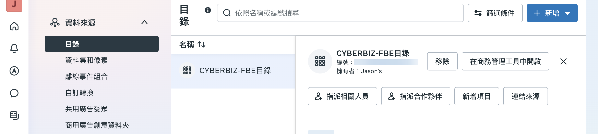

{ .subtitle }

{ .doc-badge }

{ .hero-page }

## Facebook 與 Instagram 商店設定說明

**FB、IG 商店設定** 的主要目的是建立社群商店，讓品牌能透過 Facebook 與 Instagram 觸及更多流量，並將潛在顧客導流至官網消費。

## 前置作業

在開始串接 Facebook 與 Instagram 商店前，請先完成以下設定：

1. **[帳號授權與資產連結](設定 FBE 帳號授權與資產連結.md){ data-preview }** - 將像素、粉絲專頁、目錄及廣告帳號等資產連結至 CYBERBIZ 後台
2. **[網域驗證](設定 FBE 網域驗證.md){ data-preview }** - 完成網域驗證以設定 8 個彙總事件，確保廣告轉換數據準確

完成上述兩項設定後，串接商店時系統會自動帶入相關資料（如已連結的目錄），您只需依畫面引導完成商店設定即可。

!!! note "若想進一步了解商店設定的完整流程，可參考 [Meta 官方教學 :lucide-external-link:](https://www.facebook.com/business/help/268860861184453)。"

## 串接 Facebook 商店

請先登入您的 Facebook 帳號，並確保擁有企業管理平台的相關管理權限。

1.  **進入商務管理工具**：進入「企業管理平台設定」，點選 **「資料來源」** > **「目錄」**，選擇對應目錄後點擊 **「在商務管理工具中開啟」**。

    

2.  **啟動商店流程**：在商務管理工具左側選單點選 **「商店」**，並按下 **「前往商店」**。

    

3.  **設定商店資訊**：依序設定商店的 **「銷售管道」**、**「商品」** 及 **「結帳方式」**（通常導向網站結帳）。
4.  **物流與合規設定**：選擇 **「出貨國家」**與聯繫郵件，閱讀並同意服務條款後，按下 **「完成設定」**。
5.  **編輯與發佈**：完成後即可在畫面中看到串接狀態，若需調整版面可點選「編輯商店」。

## 串接 IG 商店

Instagram 商店需搭配商業帳號使用，且必須先與 Facebook 粉絲專頁及目錄建立連結。

1.  **新增 IG 帳號**：進入「企業管理平台設定」，點選**「帳號」**>**「Instagram」**>**「新增」**並登入您的 IG 帳號。
2.  **確認帳號類型**：確保您的 IG 帳號已切換為**「商業（商家）」**類型。
3.  **資產連結**：進入「商務管理工具」，點選**「設定」**>**「商家資產」**>**「連結」**，選取剛才新增的 IG 帳號。
4.  **填寫網域**：填寫您的官網商店網域以完成驗證連結。
5.  **查看管道**：設定完成後，在銷售管道中即可看到已連結的 IG 帳號。

## 商品同步與顯示管理

系統完成串接後，會自動透過產品動態饋給（Product Feed）同步商品。

*   **自動更新時間**：官網商品資訊固定於**每天凌晨 2:00 或 2:30** 自動同步至 Facebook 商店。
*   **排除特定商品**：若有「贈品」或「測試品」不希望上傳至商店，請在官網後台的商品標籤欄位輸入**「贈品」**或**「排除product feed」**，系統將自動過濾該商品。
*   **隱藏商店或商品**：
    *   **隱藏整個商店**：在商務管理工具的商店編輯頁面，點選「設定」>「能見度」即可切換開關。
    *   **隱藏單一商品**：在商務管理工具的「庫存」中，點擊商品旁的**「眼睛圖示」**即可手動關閉特定商品的顯示。

## 重要提醒

*   **網域驗證**：在設定商店前，必須先完成**網域驗證**，否則將無法完整設定 8 個彙總事件，影響廣告投放精準度。
*   **圖片規範**：建議開啟色票功能並依照顏色順序放置圖片，以確保商店圖片能隨款式正確變換。
*   **異常排除**：若 IG 連結出現 404 或語言編譯錯誤，建議針對分享連結採取**「網址縮短」**，避免 `?` 與 `=` 符號產生亂碼。

您是否需要我為您詳細說明，如何設定 **FB 即時客服 (Messenger)**，讓顧客能直接在官網與您的粉絲專頁進行溝通？

## 後續操作

- :lucide-shield:{ .lg }   
  [__網域驗證與事件設定__](設定 FBE 網域驗證.md){ data-preview }       
  完成商店設定前，需先完成網域驗證，才能設定事件追蹤，確保廣告轉換數據準確。

## 常見問題

??? quote ""

