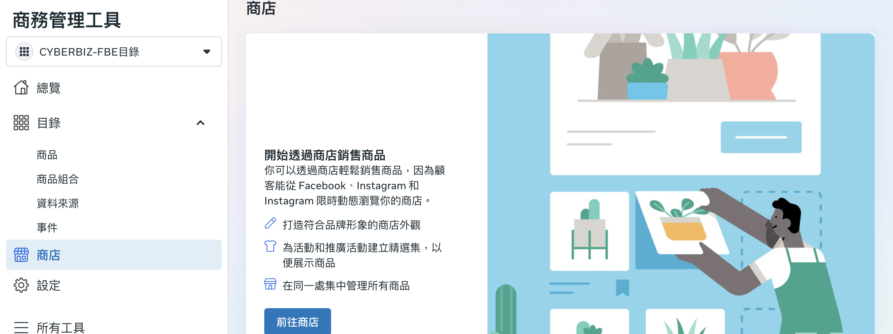
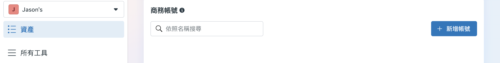
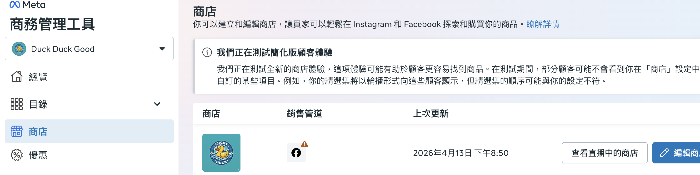
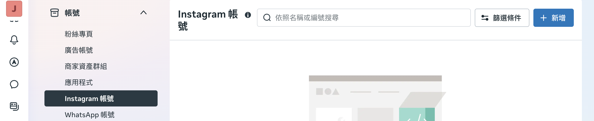
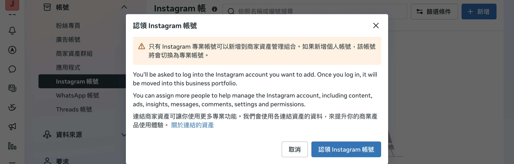
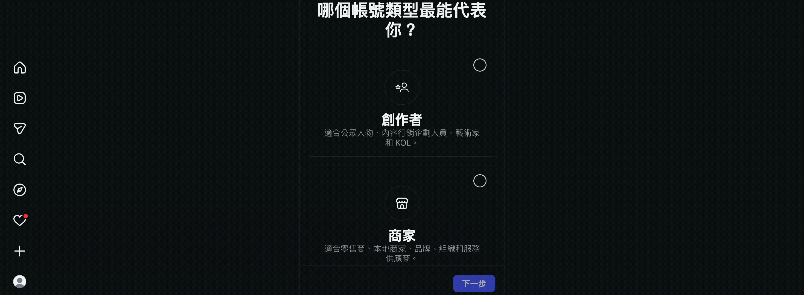
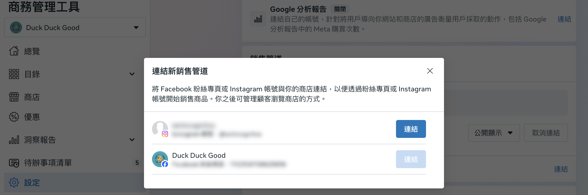
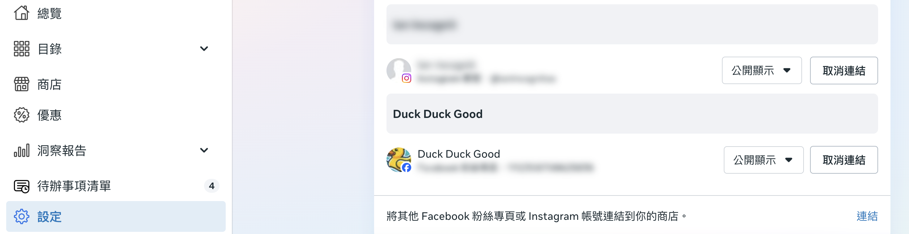

設定 Facebook 與 Instagram 商店，建立社群銷售管道並同步商品。
{ .subtitle }

## Facebook 與 Instagram 商店設定說明

**FB、IG 商店設定** 的主要目的是建立社群商店，讓品牌能透過 Facebook 與 Instagram 觸及更多流量，並將潛在顧客導流至官網消費。

!!! note "相關說明請參閱 Meta 官方教學：[在 Facebook 和 Instagram 上設定商店 :lucide-external-link:](https://www.facebook.com/business/help/268860861184453)。"

## 前置作業

在開始串接 Facebook 與 Instagram 商店前，請先依序完成以下設定：

- [x] **[帳號授權與資產連結](設定 FBE 帳號授權與資產連結.md){ data-preview }** - 將像素、粉絲專頁、目錄及廣告帳號等資產連結至 CYBERBIZ 後台
- [x] **[網域驗證](設定 FBE 網域驗證.md){ data-preview }** - 完成網域驗證以設定 8 個彙總事件，確保廣告轉換數據準確

完成上述兩項設定後，串接商店時系統會自動帶入相關資料（如已連結的目錄），您只需依畫面引導完成商店設定即可。

## 串接 Facebook 商店

請先登入您的 Facebook 帳號，並確保擁有企業管理平台的相關管理權限。

1.  **進入商務管理工具**：進入「[企業管理平台設定](https://business.facebook.com/)」，點選 **「設定」** > **「資料來源」** > **「目錄」**，選擇對應目錄後點擊 **「在商務管理工具中開啟」**。

    

2.  **啟動商店流程**：在商務管理工具左側選單點選 **「商店」**，並按下 **「前往商店」**。

    

3.  **建立商務帳號**：若尚未建立商務帳號，請點擊 **新增帳號** 以進入後續流程。

    

4. **建立商店**：依照畫面提示完成建立商店步驟。

    - **選擇市場**：選擇商店主要銷往的 **「國家/地區」**（如台灣），點擊 **「立即開始」**。
    - **選擇銷售管道**：系統會自動帶入已連結的 Facebook 粉絲專頁，選擇要使用的 **銷售管道**（Facebook 粉絲專頁）。
    - **選擇目錄**：選擇用於商店的 **產品目錄**（系統會自動帶入前述設定已建立的目錄，如 CYBERBIZ-FBE目錄）。
    - **確認與完成**：檢視商店設定資料，確認無誤後勾選同意賣家協議，按下 **「完成設定」**。

    

8. **檢視商店**：點選「商店」即可看到串接的畫面，點擊 **編輯商店** 可對商店進行編輯修改。

    

## 串接 IG 商店

Instagram 商店需搭配商業帳號使用，且必須先與 Facebook 粉絲專頁及目錄建立連結。

1.  **新增 IG 帳號**：進入「[企業管理平台設定](https://business.facebook.com/)」，點選 **「設定」** > **「帳號」** > **「Instagram」** > **「新增」** 並登入您的 IG 帳號。

    

2.  **確認帳號類型**：確保您的 IG 帳號已切換為 **「商業（商家）」** 類型。

    

3. **建立專業 IG 帳號**：帳號類型選擇 **商家**，按照需求選擇類別，點擊 **確認** 建立專業帳號。

    

4.  **資產連結**：進入「商務管理工具」，前往 **設定 > 一般 > 銷售管道**，於「將其他 Facebook 粉絲專頁或 Instagram 帳號連結到你的商店」處點擊 **連結** 並選取 IG 帳號。

    

5.  **填寫網域**：若您事前已完成[網域驗證](設定 FBE 網域驗證.md){ data-preview }，系統通常會自動帶入已驗證的網域。若未自動帶入，請輸入您的官網網域（如 `yourstore.com`）以完成驗證連結。
6.  **查看管道**：設定完成後，在銷售管道中即可看到已連結的 IG 帳號。

    

!!! note "後續 IG 商店設定及使用，請參閱 Meta 官方教學：[Instagram 購物功能 :lucide-external-link:](https://www.facebook.com/business/help/582645198813984)。"

## 商品同步與顯示管理

系統完成串接後，會自動透過產品動態饋給（Product Feed）同步商品。

!!! info "自動更新時間"
    官網商品資訊固定於 **每天凌晨 2:00 或 2:30** 自動同步至 Facebook 商店。

- :lucide-package-x:{ .lg }   
  [__排除商店商品__](../../../products/categorization/管理商品標籤.md#排除上傳至第三方平台標籤){ data-preview }       
  若有特定商品（如贈品或測試品）不希望同步至 Facebook 與 Instagram 商店，可透過設定商品標籤進行過濾。

- :lucide-eye-off:{ .lg }   
  [__隱藏商店或商品__](排除商品不同步至 Facebook 與 Instagram 商店.md#於商務管理工具中調整手動調整){ data-preview }       
  可在商務管理工具中隱藏整個商店或隱藏單一商品。

## 後續操作

- :lucide-swatch-book:{ .lg }   
  [__商品色票設定__](../../../products/creation/設定商品色票與款式圖片-拖拉版型.md){ data-preview }       
  建議開啟色票功能並依照顏色順序放置圖片，以確保 Facebook 商店商品圖片能隨款式正確變換。

## 常見問題

??? quote "為什麼 IG 商店連結出現 404 或語言編譯錯誤？"

    若您的官網正常，但透過 IG 商店跳轉時出現 404 錯誤或重新導向失敗，通常與 URL 編碼轉換（Character Encoding） 有關。

    - **異常原因**：當連結包含特定參數（如分潤連結中的 ? 或 =）時，Instagram 內建瀏覽器有時會將其錯誤編譯為十六進位碼（如 %3F、%3D），導致目標網址失效。
    - **解決方案**：

        - 使用縮網址：將原始長連結轉換為縮網址（如 bit.ly 或 reurl），避開網址中的特殊符號，確保傳輸過程不產生亂碼。
        - 回報平台：此現象為社群平台端之編譯邏輯限制，建議商家同步向 Instagram 官方進行意見回饋。

??? quote "商品同步到 FB 與 IG 商店的時間是什麼時候？"

    官網商品資訊固定於 **每天凌晨 2:00 或 2:30** 自動同步至 Facebook 商店，當日更新的內容需等候同步完成才會呈現。

??? quote "如何排除特定商品不同步至商店？"

    若有「贈品」或「測試品」不希望上傳至商店，請在官網後台的商品標籤欄位輸入 **「贈品」** 或 **「排除product feed」**（排除 與 product 之間請勿添加空格），系統將自動過濾該商品。詳細操作，請參考 [如何排除商品上傳至第三方平台](../../../products/categorization/管理商品標籤.md#排除上傳至第三方平台標籤){ data-preview }。
