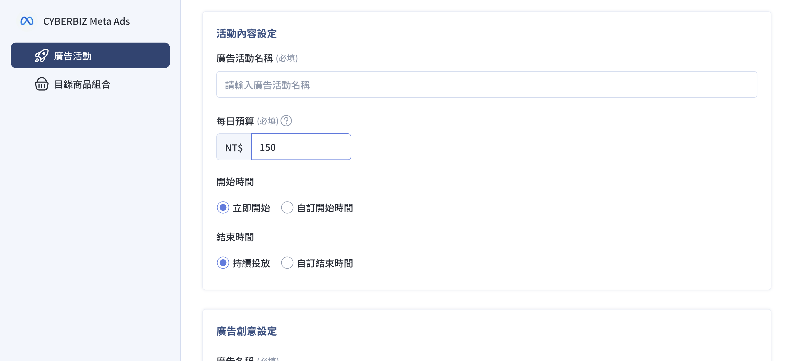

{ .subtitle }

{ .doc-badge }

{ .hero-page }

## Meta 廣告每日預算說明

在 CYBERBIZ 系統中投放 Meta 廣告時，設定合理的單日預算對於廣告成效與 AI 學習至關重要。根據您的廣告投放經驗，可以參考以下建議來設定預算：

## 已經有投放過廣告的商家（已知平均 CPA）

如果您已有廣告經驗並了解您的**平均獲客成本 (CPA)**，建議依據 Meta 最佳化所需數據來推算：

*   **預算邏輯**：Meta 建議單週應累積至少 **50 次轉換**，才能讓 AI 有足夠數據進行最佳化。
*   **計算公式**：**每日預算 = 平均 CPA × 50 ÷ 7**。
    *   *範例*：若平均 CPA 為 310 元，則建議每日預算約為 2,214 元 ($310 × 50 ÷ 7$)。
*   **調整策略**：建議初期從較低預算開始並逐步調升。為避免廣告重新進入「學習階段」，**每日調整幅度建議不超過 25%**。
*   **監控優化**：定期檢查表現，將預算集中在高效能廣告，並停用表現不佳者。

## 還沒有投放過廣告的商家（新手）

若您是第一次投放，沒有過往 CPA 數據參考，可採以下步驟：

1.  **初始預算設定**：依照您的**每月總預算**來回推每日預算。
    *   **計算公式**：**每日預算 = 月度預算 ÷ 30**。
    *   *範例*：若月預算規劃為 15,000 ~ 30,000 元，則每日預算建議設為 **500 ~ 1,000 元**。
2.  **逐步增長**：同樣採循序漸進方式，**每日調整幅度建議控制在 20% 以內**，以維持系統穩定。
3.  **專注高效受眾**：優先分配資金給成效好的廣告，並利用**再行銷策略**針對已展現興趣的用戶投放，通常較能降低成本。
4.  **創意測試**：不斷測試不同的廣告素材（創意），以提高互動率並降低 CPA。

## CYBERBIZ 系統基本規範與建議

在 CYBERBIZ 後台設定「高效速成行銷活動 (ASC)」或一般廣告活動時，需注意以下預算門檻：

*   **流量廣告**：主要目的為導流，每日預算建議 **大於 NT$150**。
*   **銷售量廣告**：主要目的為提升轉換，每日預算建議 **大於 NT$50**。
*   **加速 AI 學習**：建議在學習階段初期（前 1-2 週）設定較高預算，目標是**累積 30-50 次轉換**，讓系統快速收斂並找到 CPA 最低、ROAS 最高的受眾。
*   **簡易推算技巧**：若完全無數據，可用**「客單價的 30%」**作為預估 CPA，再來回推每日預算。

**💡 提醒事項：**
在設定廣告前，請務必確認已完成 **Step 1 的廣告帳號建立與儲值**，且儲值金額需大於新台幣 15,000 元方可開始投放。

您是否需要我進一步說明，如何透過 **Meta 廣告成效分析** 工具來判斷現有預算的分配是否具備效益？

## 後續操作

- :lucide-import:{ .lg }
  [____]()
  。

- :lucide-ban:{ .lg }
  [____]()
  。

## 常見問題

??? quote ""

