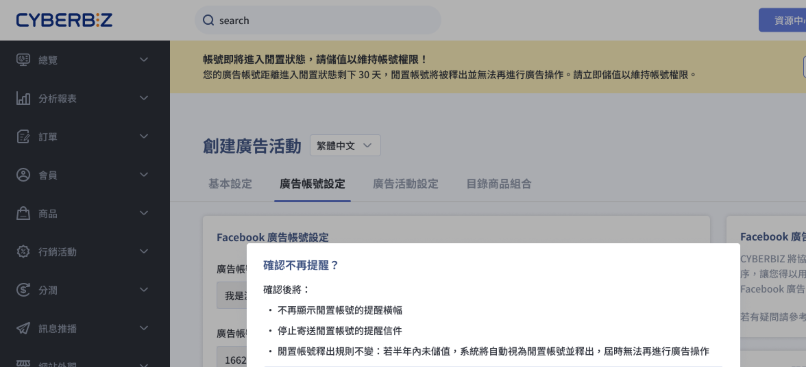
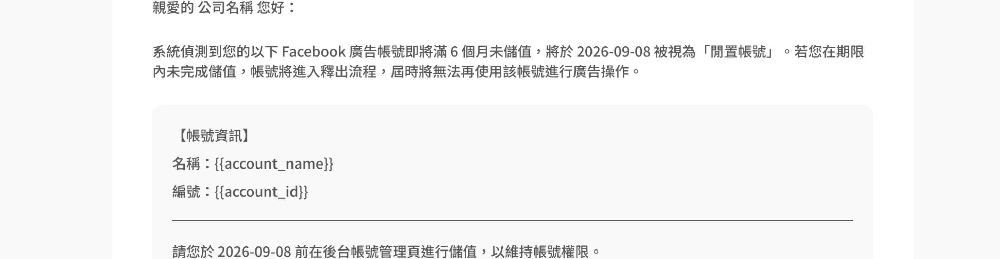
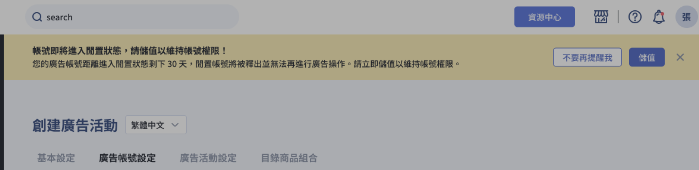
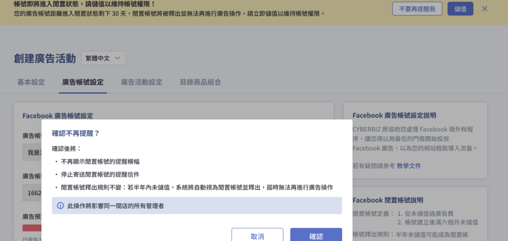

CYBERBIZ Meta 廣告帳號閒置回收機制的觸發條件、激活方式，以及帳號釋出後的影響與重新申請流程。
{ .subtitle }

{ .hero-page }

## Meta 廣告帳號閒置說明

在 CYBERBIZ 系統中，若商家建立 Meta 廣告帳號後長期未進行儲值與使用，該帳號將進入「閒置帳號」處理流程。

## 閒置帳號定義

廣告帳號必須 **同時符合** 以下兩個條件，才會被系統判定為閒置帳號：

- [x] **從未儲值過廣告費**：廣告總預算紀錄為 0 或僅為系統初始值。
- [x] **帳號建立滿六個月未儲值**：帳戶自建立之日起，已超過半年時間未有實際儲值紀錄。

閒置帳號代表該帳戶長時間未被使用，系統將啟動釋出機制以回收資源。

## 帳號釋出規則與提醒

!!! path "後台路徑"
    商家可至後台路徑：**「第三方整合」** > **「臉書 Facebook 設定（廣告/註冊登入）」** > **「廣告帳號設定」** 查看狀態。

### 到期通知

在帳號即將滿半年的前 **30、15、7、1 天**，CYBERBIZ 會主動發送電子郵件並於後台顯示提醒橫幅。

=== ":lucide-mail: 電郵"

    

=== ":lucide-panel-top: 後台"

    

---

### 激活方式

商家收到提醒後，若欲維持帳號權限，請務必於期限內[進行儲值](建立 Meta 廣告帳號並儲值.md#儲值廣告金){ data-preview }。儲值完成後帳號即恢復活躍，相關警告會自動解除。

---

### 不再提醒操作

商家若選擇「不再提醒我」，系統將停止寄送提醒信並隱藏後台橫幅，但 **這不會改變釋出規則**；若半年期限屆滿仍未儲值，系統依然會自動釋出帳號。

## 帳號釋出後的影響與重新申請

一旦帳號進入釋出流程並完成回收：

*   **失去權限**：原商家將 **永久失去該廣告帳號的操作權限**。
*   **重新申請**：若未來仍有廣告投放需求，商家必須 **重新執行申請流程** 來建立一個全新的廣告帳號，相關操作請參閱「[建立 Meta 廣告帳號並儲值](建立 Meta 廣告帳號並儲值.md){ data-preview }」教學。

!!! tip "重要提醒"
    為了確保廣告帳號的穩定性，建議商家在建立帳號後盡早完成 **最低門檻（NT$ 15,000）** 的儲值，以避免因過期導致資產權限遺失。

## 後續操作

- :lucide-wallet:{ .lg }   
  [__建立廣告帳號並儲值__](建立 Meta 廣告帳號並儲值.md){ data-preview }       
  了解完整的廣告帳號建立流程與最低 NT$15,000 儲值門檻，避免帳號進入閒置回收流程。

- :lucide-rocket:{ .lg }   
  [__投放廣告活動__](設定 Meta 廣告活動.md){ data-preview }       
  帳號恢復活躍後，即可開始建立廣告活動，維持帳號使用狀態。       

## 常見問題

??? quote "如何避免廣告帳號被釋出？"

    請確保廣告帳號建立後，**於六個月內完成首次[儲值](建立 Meta 廣告帳號並儲值.md#儲值廣告金){ data-preview }**。建議商家在建立帳號後盡早完成最低門檻 NT$ 15,000 的儲值，避免因閒置過久導致帳號被系統釋出。

??? quote "帳號被釋出後可以復原嗎？"

    無法復原。一旦帳號進入釋出流程並完成回收，原商家將 **永久失去該廣告帳號的操作權限**。若未來仍有廣告投放需求，必須[重新執行申請流程建立全新帳號](建立 Meta 廣告帳號並儲值.md){ data-preview }。

??? quote "選擇「不再提醒我」後，帳號就不會被釋出嗎？"

    不會。「不再提醒我」僅會停止寄送提醒信並隱藏後台橫幅，**不會改變釋出規則**。若半年期限屆滿仍未儲值，系統依然會自動釋出帳號。

