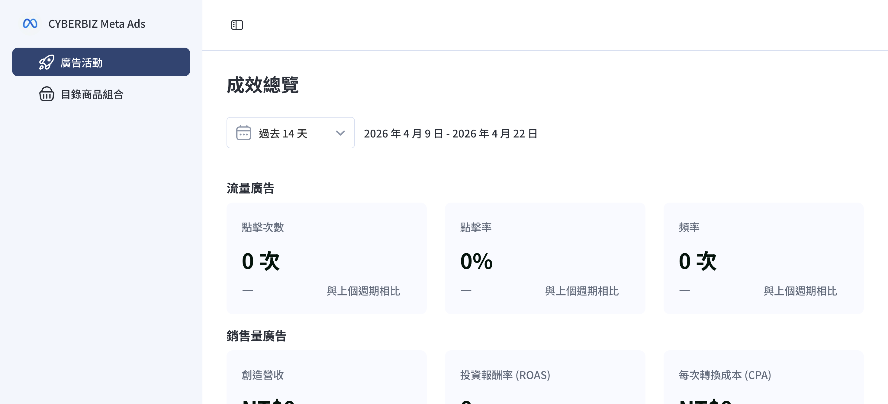
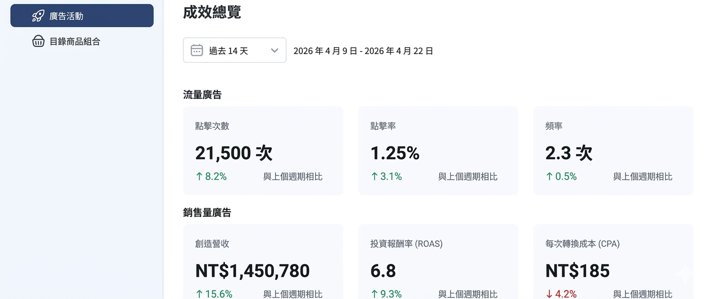
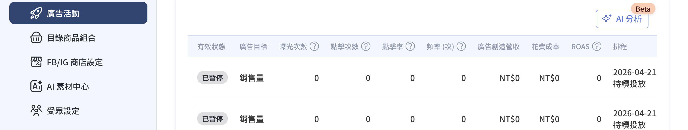
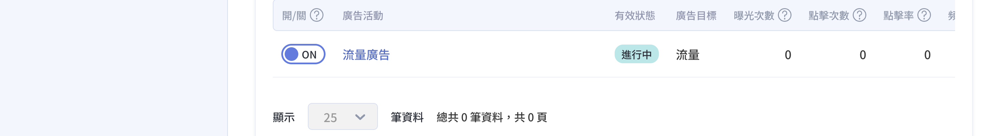
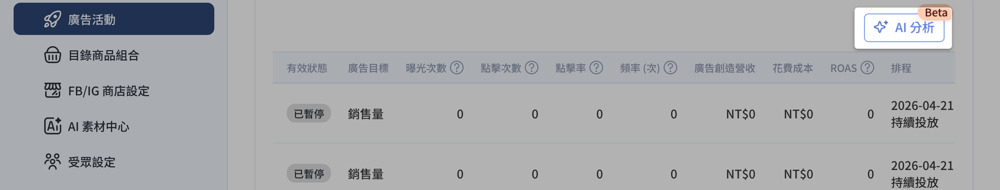
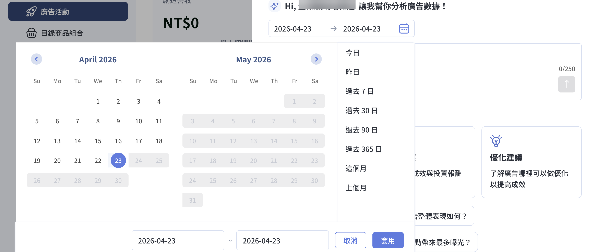
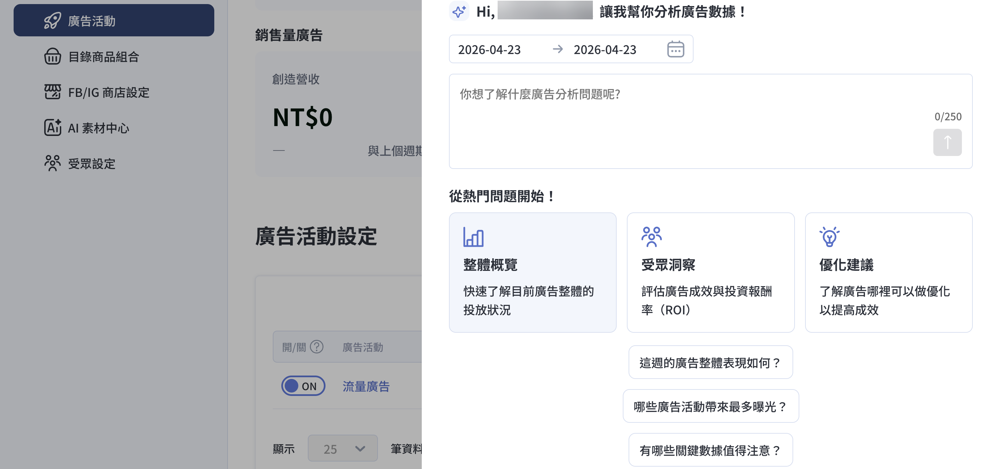

透過 Meta Ads App 掌握廣告成效數據，分析指標，並使用 AI Insights 獲取數據洞察與優化建議。
{ .subtitle }

{ .hero-page }

## Meta 廣告成效分析說明

「**Meta 廣告成效分析**」是專為 CYBERBIZ 商家設計的分析工具，旨在協助商家精準掌握 Meta 廣告（如 Facebook、Instagram）的投放成效，評估哪些商品值得加碼推廣，並判斷廣告策略是否具備效益。

## 前提條件

在開始分析成效前，請確保您已完成以下準備工作，以確保數據能正確回傳與顯示：

- [x] **完成廣告投放設定**：本功能需在廣告活動正式啟動後方可產生數據。若您尚未建立廣告，請先參閱 [**設定 Meta 廣告活動**](設定 Meta 廣告活動.md){ data-preview }。
- [x] **確保資產正確連結**：確認已透過 [**Facebook 商業擴充套件 (FBE)**](../mbe/設定 FBE 帳號授權與資產連結.md){ data-preview } 完成授權，並正確埋設 Meta Pixel 與轉換 API (CAPI)。
- [x] **確認帳戶餘額**：廣告帳戶需有足夠餘額或有效的支付方式，否則成效數據將顯示為「異常」或停止更新。

## 掌握整體成效（總覽指標）

在「成效總覽」頁面，您可以透過 **流量廣告** 與 **銷售量廣告** 兩大維度，快速評估 Meta 廣告的投放品質。

!!! info "選擇分析區間"  

    欲查看特定時段的數據，請先點擊頁面左上方的 **「時間篩選下拉選單 :lucide-calendar-days:」** 選擇範圍（如：過去 7 天、過去 14 天等）。系統將依此區間自動比對「上一週期」的變化，並將百分比顯示於指標下方：

    - **正值 (↑)**： 代表指標較上期成長。
    - **負值 (↓)**： 代表指標較上期衰退。
    - **顯示為 「—」**： 代表上期無數據可對照（例如：廣告在該時段尚未投放）。

=== "流量廣告"

    此區塊反映廣告內容是否成功吸引受眾，以及進入官網前的行為表現。

    | 指標名稱 | 定義與計算方式 | 數據洞察與優化建議 |
    | :--- | :--- | :--- |
    | **點擊次數 (Clicks)** | 用戶點擊廣告連結的總次數。 | **數值高：** 素材與受眾精準度高。 **數值低：** 素材吸引力不足，或受眾設定過窄。 |
    | **點擊率 (CTR)** | (點擊數 ÷ 曝光數) x 100% | **平均參考值：** 電商約 0.9% – 1.5%。 **CTR 低：** 需調整廣告圖片、標題或更換受眾。 |
    | **頻率** | 每位用戶看到廣告的平均次數。 | **1–3 次：** 屬正常範圍，有助於建立印象。 **> 5 次：** 受眾疲乏，建議擴大受眾或更新素材。 |

=== "銷售量廣告"

    此區塊指標直接關乎訂單收益，協助您判斷廣告是否「賺錢」。

    | 指標名稱 | 核心定義與計算方式 | 數據洞察與優化建議 |
    | :--- | :--- | :--- |
    | **創造營收 (Revenue)** | 廣告歸因帶動的累計購買金額。 | **數據來源：** 透過 Meta Pixel 及轉換 API (CAPI) 統計之購買紀錄。 **歸因邏輯：** 點擊後 7 天、瀏覽後 1 天。 **注意：** 受 iOS 14 隱私限制影響，可能與實收訂單有出入。 |
    | **投資報酬率 (ROAS)** | 廣告營收 ÷ 廣告花費 | **意義：** 每投入 1 元廣告費能帶回的營收倍數。 **判斷：**  - ROAS > 1：營收高於廣告支出。 - ROAS < 1：虧損警訊，建議優化素材或受眾。  * 每個品牌毛利率不同，請根據您的成本結構設定專屬的「損益平衡 ROAS」。 |
    | **轉換成本 (CPA)** | 廣告總花費 ÷ 購買次數 | **盈虧關鍵：** 獲取單筆訂單的平均廣告成本。 **優化：** 建議對比商品平均毛利。若 `CPA > 毛利`，代表該廣告活動處於虧損狀態。 |

## 廣告活動列表欄位說明

在指標總覽下方的廣告活動列表中，您可以查看個別廣告活動的詳細運作狀況。

### 狀態與基礎資訊

| 欄位名稱 | 說明 | 技術細節 / 注意事項 |
| :--- | :--- | :--- |
| **開 / 關 (Status)** | 控制廣告活動的手動投放意圖。 | **切換後立即生效：** 變更將同步至 Meta 後台。 |
| **廣告活動名稱** | 顯示活動名稱，點擊可進入編輯頁。 | |
| **有效狀態** | Meta 回傳的真實投放狀態。 | 綜合考量審核、餘額與開關因素，詳見 [有效狀態解析](#有效狀態解析){ data-preview }。 |
| **排程** | 顯示廣告組合的投放時段。 | **顯示格式：** `YYYY-MM-DD`。 若未設結束時間，則顯示「持續投放」。 |

---

### 成效數據欄位

成效數據（曝光、點擊、營收、花費、ROAS）是以商店設定的幣別顯示。

| 指標欄位 | 核心定義 | 技術備註 |
| :--- | :--- | :--- |
| **曝光次數** | 廣告在 FB / IG 版位上被顯示的累計總次數。 | — |
| **點擊次數** | 用戶實際點擊廣告連結的累計次數。 | 例如：點擊粉專名稱、按讚、留言、分享，或展開相片 / 影片等。 |
| **點擊率 (CTR)** | (點擊次數 ÷ 曝光次數) × 100% | **參考值：** 電商平均約 `0.9%–1.5%`。 **優化：** CTR 低代表素材吸引力不足；CTR 高但轉換低則需檢查落地頁。 |
| **頻率** | 每位用戶平均看到廣告的次數，為估計值。 曝光次數 ÷ 觸及人數 | **受眾疲乏指標：**  - **1–3 次**：屬正常範圍。 - **> 5 次**：疲乏風險高，點擊率通常會下滑，建議更換素材。 |
| **廣告創造營收** | 該廣告歸因帶動的購買金額。 | 採 Meta 歸因邏輯（點擊 7 天/瀏覽 1 天）。 |
| **花費成本** | 該廣告活動累計支出的廣告費用。 | — |
| **ROAS** | 廣告創造營收 ÷ 花費成本 |  |

---

### 更新機制與分頁

!!! warning "數據更新提示"
    非即時數據： 成效數據約 每 24 小時更新一次 並快取於系統。

為確保讀取效能，每頁固定顯示 25 筆 廣告活動，您可以點擊列表下方切換分頁。

- 調整顯示筆數：點擊列表下方的 「顯示筆數下拉選單」，可切換單頁顯示 25、50 或 100 筆 廣告。
- 翻頁操作：點擊右下角 頁碼 或 箭頭符號，即可查看不同分頁的活動紀錄。

## AI Insights 廣告洞察功能

商家可啟用「AI Insights」與系統對話，自動生成數據洞察與優化建議：

1.  **進入 Meta Ads App**：登入 CYBERBIZ 管理後台，前往 **第三方整合 > 臉書 Facebook 設定 > 廣告活動設定**。

    - 尚未串接：點擊「立即串接」（參考：[安裝 Meta Ads App](../../../app-market/安裝%20Meta%20Ads%20App.md){ data-preview }）。
    - 已完成串接：點擊「立即前往」。

2.  **開啟 AI 分析視窗**：切換至 **廣告活動** 分頁，點擊活動列表頁面的右上角的「**AI分析**」按鈕，進入 AI Insights 頁面。

    

2.  **選擇時間區段：** 選擇想要分析的日期範圍，點擊 **套用** 後系統會自動向 Meta 抓取該時段的廣告數據。

    

    !!! info "配合 Meta 政策，AI Insights 分析時間範圍最長支援至過去 **35 個月** 的數據。"

3.  **獲取洞察：** AI 會根據模型推論結果提供建議。若不確定如何詢問，可選用系統提供的 **「熱門問題範本」**（例如：目前的 ROAS 表現如何？哪些廣告最成功？）。

    

## 後續操作

- :lucide-rocket:{ .lg }   
  [__建立廣告活動__](設定%20Meta%20廣告活動.md){ data-preview }       
  完成成效分析後，可依數據洞察建立新的 Meta 廣告活動。

- :lucide-pacakge-x:{ .lg }   
  [__排除商品同步__](../mbe/排除商品不同步至%20Facebook%20與%20Instagram%20商店.md){ data-preview }       
  如有特定商品不希望同步至 Meta，可設定排除標籤。

??? quote "什麼是良好的 ROAS 值？"

    ROAS沒有所謂的「良好」標準，取決於您的商品毛利率。一般判斷：

    - **ROAS > 1**：營收高於廣告支出，原則上不回本。
    - **ROAS > 2**：被視為基本的盈利門檻。

    - 每個品牌毛利率不同，建議根據您的成本結構設定專屬的「損益平衡 ROAS」。

??? quote "廣告狀態顯示「異常」怎麼辦？"

    常見原因包括：

    - **廣告帳戶餘額不足**：請至 **第三方整合 > 臉書 Facebook 設定 > 廣告帳號設定** 確認餘額或 [進行儲值](建立%20Meta%20廣告帳號並儲值.md#儲值廣告金){ data-preview } 確認餘額。
    - **像素設定異常**：請確認正確串接 Pixel。
    - **素材審核未通過**：需檢查廣告素材是否符合 Meta 政策。

    請參考 [有效狀態解析](#有效狀態解析){ data-preview } 了解更多狀態說明。

??? quote "為什麼廣告數據與實際訂單有差異？"

    可能原因包括：

    - **iOS 隱私限制**：受蘋果 iOS 14.5+ 隱私政策影響，Facebook 取得數據可能不完整。參考 [官方說明](https://www.facebook.com/business/help/1329822420714248?id=428636648170202&helpref=faq_content){ target="_blank" }。
    - **歸因時效差異**：數據採用「點擊後 7 天、瀏覽後 1 天」的歸因邏輯，與商店實際訂單可能存在時間差。
    - **像素設定問題**：請確認使用正確的[像素 (Pixel) 設定](建立%20Meta%20廣告帳號並儲值.md#像素-pixel-設定){ data-preview }，並透過 CYBERBIZ 商業擴充套件串接。**不建議使用 GTM 埋設像素**，將導致事件重複、像素不正確等問題。

    如需重新串接，請參考 [設定 FBE 帳號授權與資產連結](../mbe/設定 FBE 帳號授權與資產連結.md){ data-preview }。

## 參考資料

### 有效狀態解析 { .unlisted }

| 狀態 | 代表意義 | 顯示顏色 |
| :--- | :--- | :--- |
| **進行中** | 廣告正常投放中，正在獲取流量。 | **藍色** |
| **審核中** | Meta 正在檢查素材，通常數小時內完成。 | **黃色** |
| **異常** | 投放中斷。常見原因為 **廣告帳戶餘額不足**。 | **紅色** |
| **已暫停** | 商家手動關閉，或因帳戶問題觸發自動暫停。 | **灰色** |
| **已封存/刪除** | 該廣告已從系統或 Meta 後台移除。 | **灰色** |

