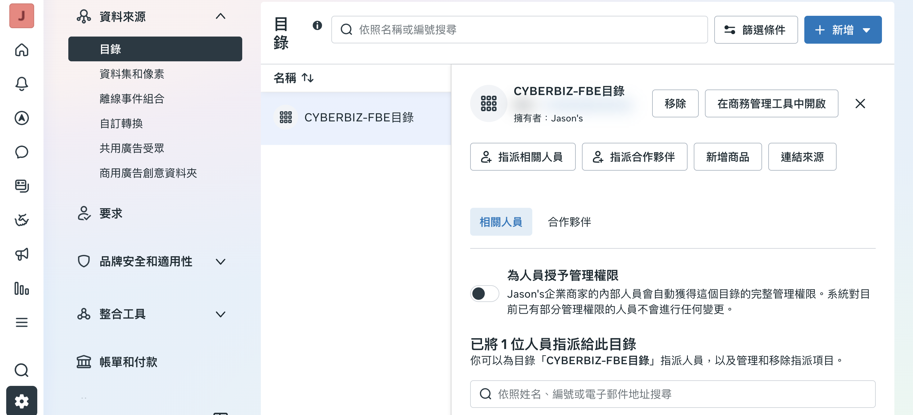
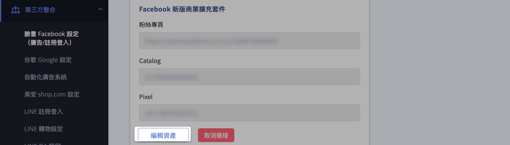
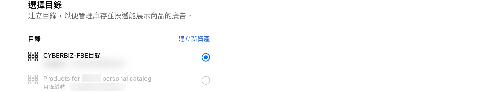
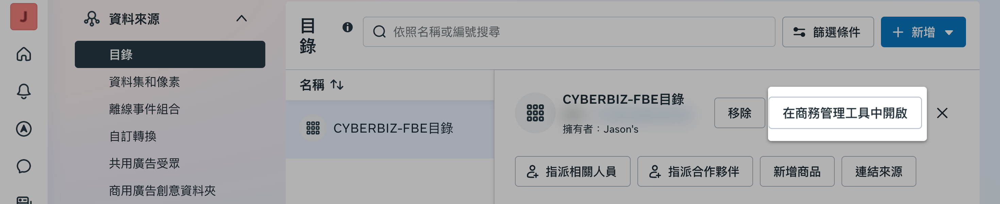
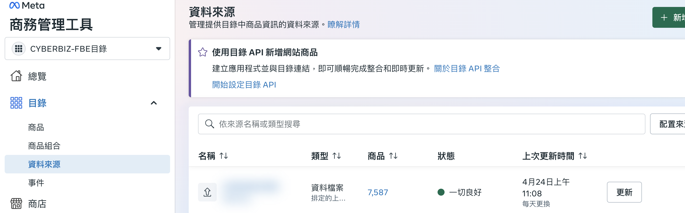

將 CYBERBIZ 商品影片同步至 Meta 目錄，放置目錄型廣告時商品影片與商品圖將輪播展示，提升廣告吸睛程度。
{ .subtitle }

[:lucide-tag:{ title="適用方案" }](../../../resources/conventions#適用方案) | 專業 PLUS / 進階 PLUS / 高手 PLUS / 企業
{ .doc-badge }

{ .hero-page }

## 同步商品影片至 Meta 目錄說明

此功能使商家能夠將 CYBERBIZ 平台上的產品數據（包含資訊、庫存、價格，以及最重要的 **商品影片**）自動同步到 Meta 的產品目錄中。設定完成後，後續在建立 Meta 廣告時若選擇「[**目錄型廣告**](設定 Meta 廣告活動.md#廣告呈現效果){ data-preview }」，廣告投放時商品影片與商品圖即會輪播展示。

## 設定前提與功能限制

在進行同步前，請務必確認滿足以下條件與規格：

- [x] **商品影片上傳：** 商家必須已於 CYBERBIZ 後台完成[商品影片上傳](../../../products/creation/設定商品影片.md){ data-preview }。
- [x] **擴充套件串接：** 商家必須具備並已串接「[Facebook 新版商業擴充套件](../mbe/設定 FBE 帳號授權與資產連結.md){ data-preview }」功能。
- [x] **版型限制**：商品影片功能目前僅支援 **拖拉版型**，非此版型之商店將無法上傳並同步影片。

## 同步設定步驟

1.  **進入功能：** 登入 CYBERBIZ 管理後台，前往「第三方整合」>「臉書 Facebook 設定（廣告/註冊登入）」，點擊「**編輯資產**」開啟設定視窗。

    

2.  **進行資產連結：** 此步驟與 [FBE 帳號授權與資產連結](../mbe/設定 FBE 帳號授權與資產連結.md#操作步驟教學){ data-preview } 的「連結企業資產」流程相同（包含登入 Facebook 帳號、同意授權、選擇資產）。

3.  **選擇目錄資產：** 選擇「**目錄**」作為欲同步的資產類型，並從清單中挑選欲同步的商品目錄後點擊 **確認**。

    

    !!! tip "建議點選「**建立新資產**」建立一個全新的目錄。若使用舊目錄，容易因舊有商品資料衝突導致影片資料無法順利更新。"

4.  **完成流程：** 依序完成彈窗中的其他設定並點擊「完成」，系統會自動導回 CYBERBIZ 後台頁面。

## 於 Meta 端確認同步狀態

1.  前往 [Meta 企業管理平台 :lucide-external-link:](https://business.facebook.com/latest/settings) 後台，進入「資料來源」>「目錄」，選擇剛才綁定的目錄。
2.  點擊「**在商務管理工具中開啟**」。

    

3.  在「目錄」>「資料來源」中，可查看目錄是否已自動同步並更新官網上的商品資料。

    

!!! warning "注意事項"
    - 若有多份資料來源導致新增失敗，請先刪除舊的資料來源再重新更新。
    - 在 **尚未投放廣告前**，商務管理工具可能看不到影片資料。您可以嘗試建立廣告，在審核階段暫停，Meta 隨即會幫您載入影片資料。

## 後續操作

- :lucide-rocket:{ .lg }   
  [__投放 Meta 目錄型廣告__](設定 Meta 廣告活動.md){ data-preview }       
  同步完成後，可進一步設定 CPV 廣告 (Catalog Product Video)，以商品影片生動展示產品亮點。

## 常見問題

??? quote "如何確認商品影片已成功同步到 Meta 目錄？"

    請依序執行以下步驟確認同步狀態：

    1. 前往 [Meta 企業管理平台 :lucide-external-link:](https://business.facebook.com/latest/settings) 後台，進入「資料來源」>「目錄」
    2. 選擇您綁定的目錄，點擊「在商務管理工具中開啟」
    3. 在「目錄」>「資料來源」中查看是否已自動同步並更新官網上的商品資料

??? quote "商品影片有哪些格式和規格限制？"

    影片需符合以下限制：

    - 解析度：不得超過 **1280 x 1280**（建議最佳比例為 **9:16**）
    - 格式：僅支援 **mp4**
    - 長度：不超過 **60 秒**
    - 大小：不得超過 **30 MB**
    - 音訊：系統**不支援輸出聲音**

??? quote "為什麼在 Meta 商務管理工具中看不到影片資料？"

    可能原因如下：

    - 在 **尚未投放廣告前**，商務管理工具可能看不到影片資料
    - 若有多份資料來源導致新增失敗，請先刪除舊的資料來源再重新更新
    - 建議嘗試建立廣告，在審核階段暫停，Meta 隨即會幫您載入影片資料

